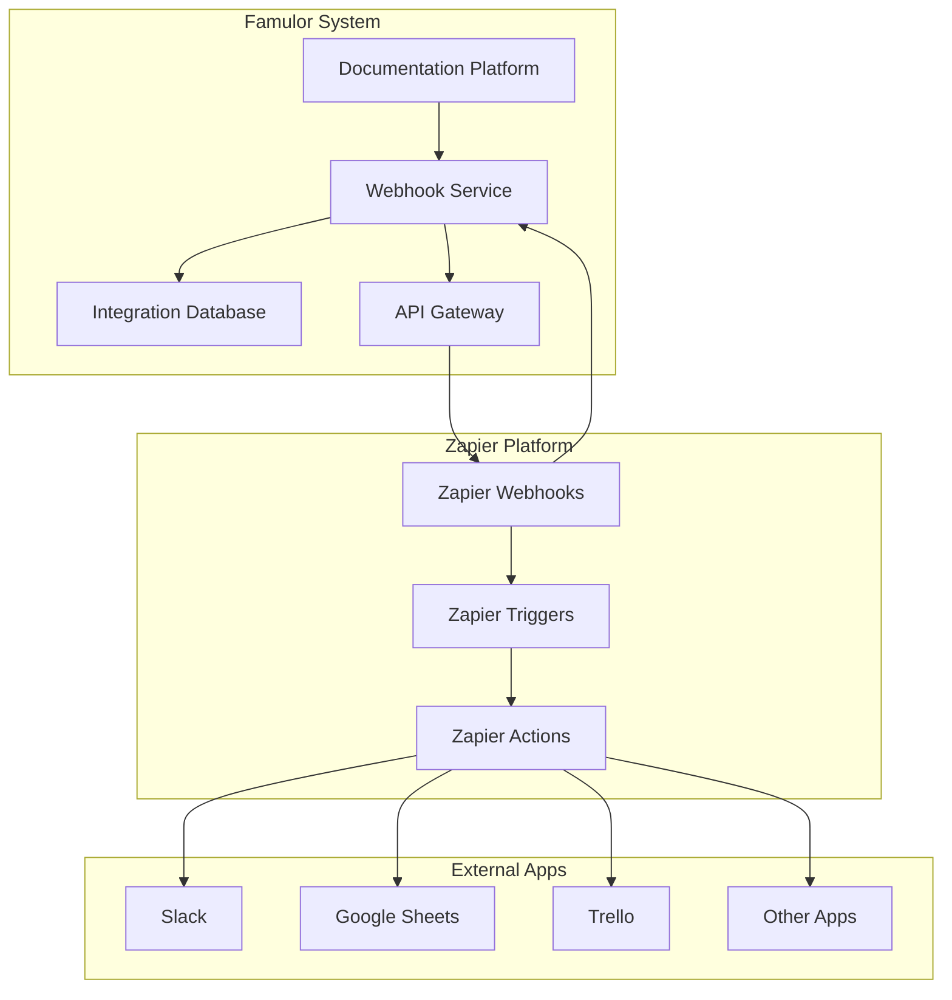
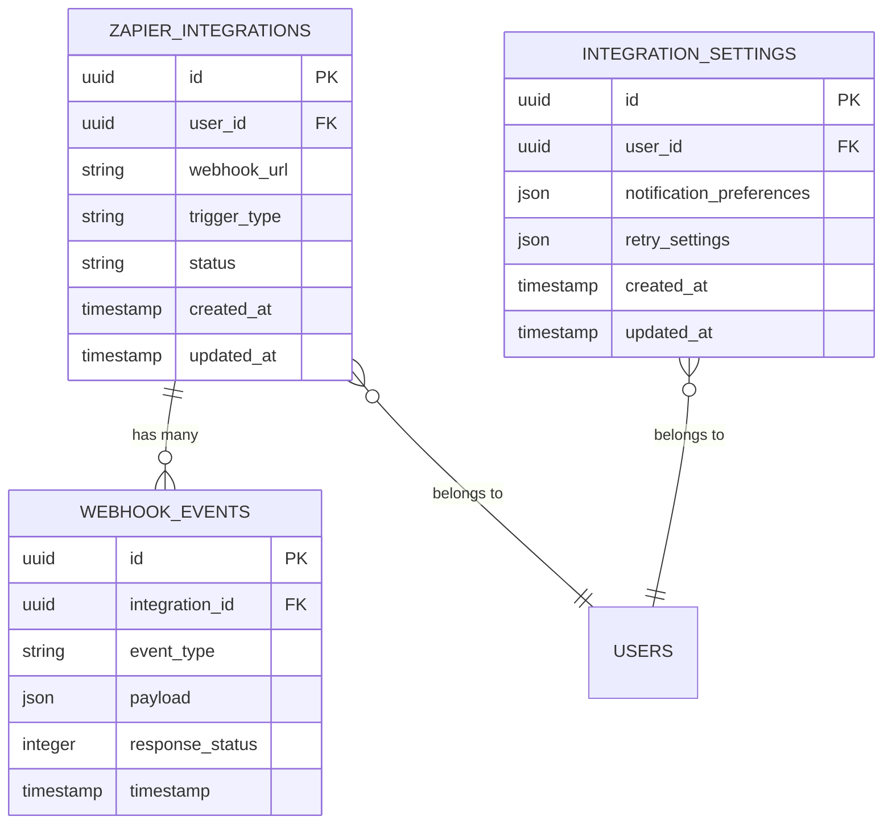
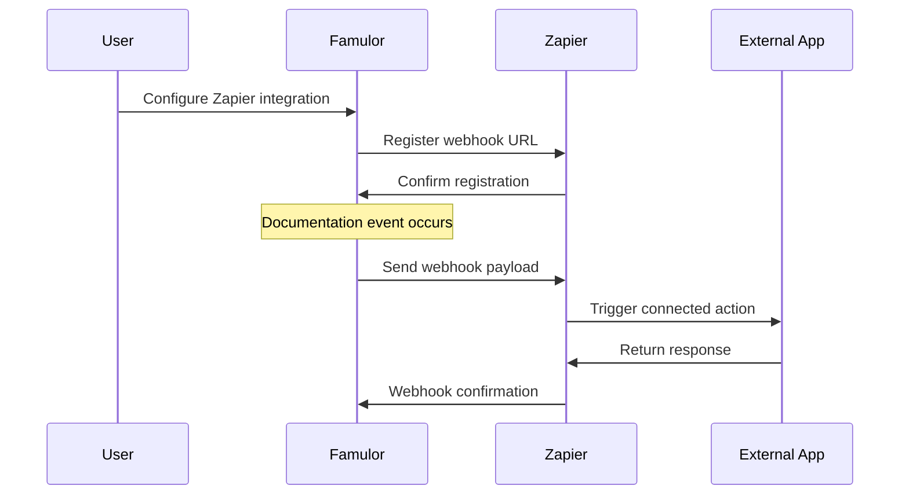
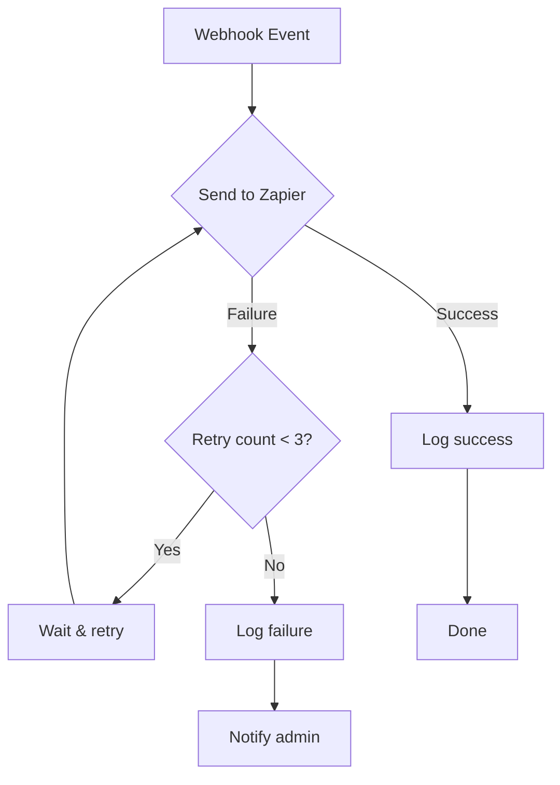

# Zapier Integration

**Alternative to Famulor Automation**: If you prefer not to use the native Famulor Automation Platform, Zapier offers a user-friendly alternative to automate your workflows.

Seamlessly connect Famulor with over **5,000 external applications** through our comprehensive Zapier integration. Automate workflows between your AI telephony platform and the tools you use daily – from CRM systems to project management tools.

## When Should You Choose Zapier?

<CardGroup cols={2}>
  <Card title="✅ Use Zapier if" icon="check-circle" color="green">
    - You already use Zapier for other integrations  
    - You need simple, linear workflows  
    - You want access to 5,000+ apps  
    - You prefer a proven, stable solution  
    - You value external community support  
  </Card>
  <Card title="⚡ Use Famulor Automation if" icon="wand-magic-sparkles" color="blue">
    - You want to create complex, branched workflows  
    - You require advanced data processing  
    - You want to implement custom logic and conditions  
    - You want full control over your automations  
    - You want to benefit from free, unlimited workflows  
  </Card>
</CardGroup>

<Card title="Set up Zapier Integration" icon="link" href="https://zapier.com/developer/public-invite/230037/92504c8a528059feedf28b7998c7a212/">
  Connect Famulor with Zapier and start automating
</Card>

## Zapier vs. Famulor Automation Platform

Both solutions have their specific strengths. Here is a detailed comparison:

| Feature | Zapier | Famulor Automation |
|---------|--------|--------------------|
| **Setup Complexity** | ✅ Very easy, drag & drop | ✅ Very easy, drag & drop |
| **Available Apps** | ✅ 5,000+ apps | ⚠️ Limited selection |
| **Workflow Complexity** | ⚠️ Linear, simple logic | ✅ Branched, complex logic |
| **Cost** | ⚠️ Paid starting at €20/month | ✅ Included for free |
| **Data Processing** | ⚠️ Limited transformations | ✅ Advanced data manipulation |
| **Custom Code** | ⚠️ Only with code steps | ✅ JavaScript/Python support |
| **Error Handling** | ✅ Automatic retries | ✅ Custom error handling |
| **Support** | ✅ Community + premium | ✅ Direct Famulor support |

### Practical Use Cases for Zapier

**✅ Ideal for Zapier:**
- **Lead forwarding**: Send call data directly to your existing CRM  
- **Team notifications**: Slack/Teams messages on important calls  
- **Documentation**: Automatically save call transcripts in Google Docs  
- **Calendar integration**: Create appointments based on caller outcomes  
- **Email marketing**: Add contacts to Mailchimp/ConvertKit  

**⚡ Better with Famulor Automation:**
- **Complex decision logic**: Different actions based on call content  
- **Data cleansing**: Normalize phone numbers, remove duplicates  
- **Multi-step processes**: Sequential actions with delays  
- **Conditional workflows**: If-then logic with multiple conditions  
- **Custom integrations**: APIs without native Zapier support  

## Quick Start: Get Going with Zapier in 5 Minutes

If you decided against the Famulor Automation Platform, you can start with Zapier in just a few minutes:

<Steps>
  <Step title="Connect your Zapier account">
    Click [here](https://zapier.com/developer/public-invite/230037/92504c8a528059feedf28b7998c7a212/) and connect your Famulor account
  </Step>
  <Step title="Create your first Zap">
    Choose "Call Completed" as the trigger and your preferred app as the action
  </Step>
  <Step title="Test and activate">
    Perform a test call and activate your Zap
  </Step>
</Steps>

<Note>
**Tip**: Start with a simple workflow like "Slack notification on completed call" to get familiar with the integration.
</Note>

## Architecture Overview

The Zapier integration follows a webhook-based architecture that enables real-time communication between Famulor and external applications via the Zapier platform.



## Integration Database

The Integration Database serves as the central storage system for managing integration configurations, webhook endpoints, and event tracking for the Zapier integration.

### Database Schema

| Table | Purpose | Key Fields |
|-------|---------|------------|
| `zapier_integrations` | Store active Zapier connections | `id`, `user_id`, `webhook_url`, `trigger_type`, `status`, `created_at` |
| `webhook_events` | Log all webhook events | `id`, `integration_id`, `event_type`, `payload`, `response_status`, `timestamp` |
| `integration_settings` | Store user settings | `id`, `user_id`, `notification_preferences`, `retry_settings` |

### Data Models



## Available Triggers

The integration supports the following trigger events that can initiate Zapier workflows:

### Documentation Events

| Trigger | Description | Payload Fields |
|---------|-------------|----------------|
| `document_created` | New documentation page created | `title`, `content`, `author`, `url`, `timestamp` |
| `document_updated` | Documentation page updated | `title`, `content`, `author`, `url`, `changes`, `timestamp` |
| `document_published` | Documentation page published | `title`, `url`, `author`, `publish_date` |
| `comment_added` | New comment added to documentation | `comment_text`, `author`, `document_url`, `timestamp` |
| `translation_completed` | Translation finished | `language`, `document_title`, `translator`, `completion_date` |

### Call-Based Triggers

| Trigger | Description | Payload Fields |
|---------|-------------|----------------|
| `call_completed` | AI call finished | `duration`, `transcript`, `caller_id`, `assistant_id`, `timestamp` |
| `call_started` | AI call started | `caller_id`, `assistant_id`, `phone_number`, `timestamp` |
| `voicemail_received` | Voicemail received | `caller_id`, `duration`, `audio_url`, `timestamp` |

## Available Actions

The integration also supports actions that can be triggered by external applications:

### Content Management Actions

| Action | Description | Required Fields |
|--------|-------------|-----------------|
| `create_document` | Create a new documentation page | `title`, `content`, `author` |
| `update_document` | Modify existing documentation | `document_id`, `content`, `author` |
| `add_comment` | Add comment to documentation | `document_id`, `comment_text`, `author` |
| `trigger_translation` | Start translation workflow | `document_id`, `target_language` |

### AI Assistant Actions

| Action | Description | Required Fields |
|--------|-------------|-----------------|
| `create_assistant` | Create new AI assistant | `name`, `prompt`, `voice_id` |
| `update_assistant` | Modify assistant configuration | `assistant_id`, `prompt`, `settings` |
| `make_call` | Initiate outbound call | `phone_number`, `assistant_id`, `context` |

## Webhook Configuration



## Authentication & Security

The Zapier integration implements the following security measures:

- **API Key Authentication**: Each integration uses a unique API key  
- **Webhook Signature Verification**: All webhook payloads are signed and verified  
- **Rate Limiting**: Configurable rate limits prevent abuse  
- **Payload Encryption**: Sensitive data is encrypted during transmission  

## Error Handling & Retry Logic



## Popular Use Cases

### CRM Integration  
Automatically add contacts to your CRM system when a call ends:  
- **Trigger:** `call_completed`  
- **Action:** Create new contact in Salesforce/HubSpot  
- **Data:** Phone number, call notes, call duration  

### Team Notifications  
Notify your team about important documentation changes:  
- **Trigger:** `document_published`  
- **Action:** Send Slack message  
- **Data:** Document title, author, page link  

### Lead Qualification  
Automatically forward qualified leads to your sales team:  
- **Trigger:** `call_completed` with positive sentiment  
- **Action:** Create task in Asana/Trello  
- **Data:** Contact info, call summary, priority  

### Content Synchronization  
Automatically sync documentation updates across systems:  
- **Trigger:** `document_updated`  
- **Action:** Update row in Google Sheets  
- **Data:** Change date, editor, change type  

## Monitoring & Analytics

Key metrics for the Zapier integration:

- **Webhook success rate**: Percentage of successfully delivered webhooks  
- **Average response time**: Time between event and webhook delivery  
- **Failed webhook attempts**: Number of undeliverable events  
- **Most popular trigger/action combinations**: Most used workflows  
- **User adoption**: Number of active integrations  

## Setup and Configuration

### Step 1: Establish Zapier Connection
1. Visit the [Zapier Integration page](https://zapier.com/developer/public-invite/230037/92504c8a528059feedf28b7998c7a212/)  
2. Click "Try It" to test the integration  
3. Authenticate with your Famulor account  

### Step 2: Create Your First Zap
1. Select Famulor as the trigger app  
2. Choose your desired event (e.g., "Call Completed")  
3. Connect your Famulor account  
4. Test the trigger with sample data  

### Step 3: Configure Action
1. Select the target app (e.g., Slack, Google Sheets)  
2. Configure the desired action  
3. Map data fields between apps  
4. Test the complete Zap  

### Step 4: Activate Your Zap
1. Review all settings  
2. Activate the Zap  
3. Monitor initial runs  

## Troubleshooting

### Common Issues

#### Webhook Not Received
- **Cause:** Incorrect webhook URL or disabled integration  
- **Solution:** Verify webhook URL in Famulor dashboard and reconfigure  

#### Authentication Error
- **Cause:** Expired API key or invalid permissions  
- **Solution:** Renew API key in Zapier and check permissions  

#### Rate Limit Reached
- **Cause:** Too many webhook events in a short time  
- **Solution:** Review rate limits and reduce event frequency if needed  

#### Payload Validation Error
- **Cause:** Unexpected data structure in webhook payload  
- **Solution:** Check payload format in documentation and adjust mapping  

## Advanced Configuration

### Custom Headers  
Add custom HTTP headers to webhook requests:  
```json
{
  "headers": {
    "X-Custom-Source": "famulor",
    "X-Event-Version": "v1.0"
  }
}
```

### Retry Settings  
Configure retry behavior for failed webhooks:  
```json
{
  "retry_settings": {
    "max_attempts": 3,
    "backoff_strategy": "exponential",
    "initial_delay": 1000
  }
}
```

### Event Filters  
Filter events based on specific criteria:  
```json
{
  "filters": {
    "call_duration": "> 60",
    "assistant_type": "sales",
    "caller_location": "DE"
  }
}
```

## Best Practices

### Performance Optimization
- Use specific event filters to avoid unnecessary webhook calls  
- Implement batch processing for high-frequency events  
- Use asynchronous processing in the target application  

### Security
- Always verify webhook signatures  
- Use HTTPS for all webhook endpoints  
- Implement rate limiting in your webhook handlers  

### Monitoring
- Log all webhook events for debugging purposes  
- Monitor success rates and response times  
- Set up alerts for critical errors  

### Data Quality
- Validate payload data before processing  
- Implement fallback strategies for missing data  
- Perform regular data quality checks  

## Why Zapier Is an Excellent Alternative

### 🚀 Instant Productivity  
With Zapier, you're productive in minutes, just like with the Famulor Automation Platform. Both use intuitive drag & drop interfaces. The advantage of Zapier is that you may already be using it for other tools.

### 🌐 Huge Ecosystem  
Zapier supports over 5,000 apps – far more than any specialized automation platform. From niche tools to enterprise software, it's all covered.

### 💼 Proven Stability  
Zapier has been running for over 10 years and processes millions of workflows daily. This stability is especially important for business-critical automations.

### 📚 Extensive Documentation  
The Zapier community is vast. For almost every use case, you can find tutorials, templates, and solutions.

### 🛠️ Easy Maintenance  
Zapier workflows are visual and self-explanatory. Even non-technical colleagues can understand and adjust workflows.

<Warning>
**Important note:** Although Zapier is an excellent alternative, always review your costs. With many workflows, Zapier can become more expensive than the free Famulor Automation Platform.
</Warning>

## Support and Resources

<CardGroup cols={2}>
  <Card title="Try Zapier Integration" icon="flask" href="https://zapier.com/developer/public-invite/230037/92504c8a528059feedf28b7998c7a212/">
    Try our Zapier integration directly
  </Card>
  <Card title="Famulor Automation Platform" icon="wand-magic-sparkles" href="/en/automation-platform/introduction">
    Compare with our native automation platform
  </Card>
  <Card title="API Documentation" icon="code" href="/en/api-reference/webhooks/post-call">
    Detailed webhook API reference
  </Card>
  <Card title="Contact Support" icon="life-ring" href="mailto:support@famulor.io">
    Need help? Our support team is happy to assist
  </Card>
</CardGroup>

---

**Summary**: Zapier is an excellent alternative to the Famulor Automation Platform, especially if you are already familiar with Zapier or need simple, reliable workflows. For more complex automations and cost-optimized solutions, we recommend taking a look at our native Automation Platform.

<Tip>
Related pages: [Introduction](/en/automation-platform/introduction) and [Building Flows](/en/automation-platform/building-flows), and [Debugging Runs](/en/automation-platform/debugging-runs).
</Tip>
