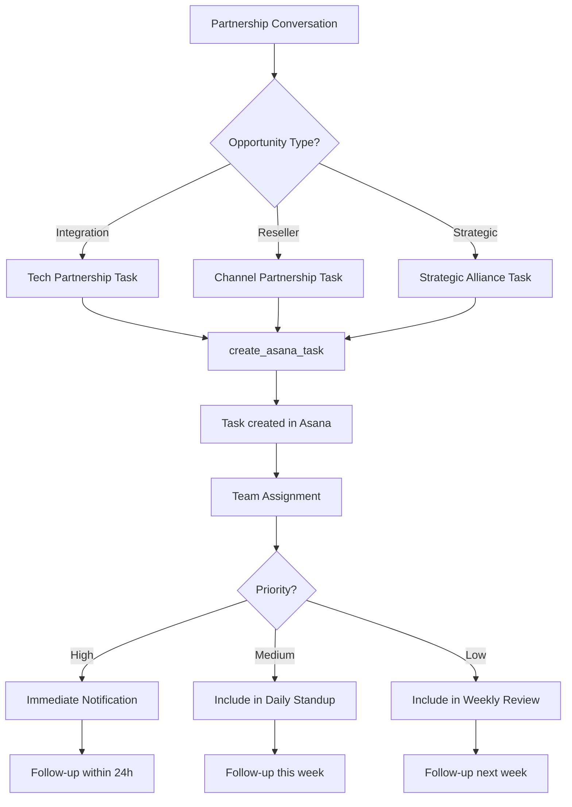
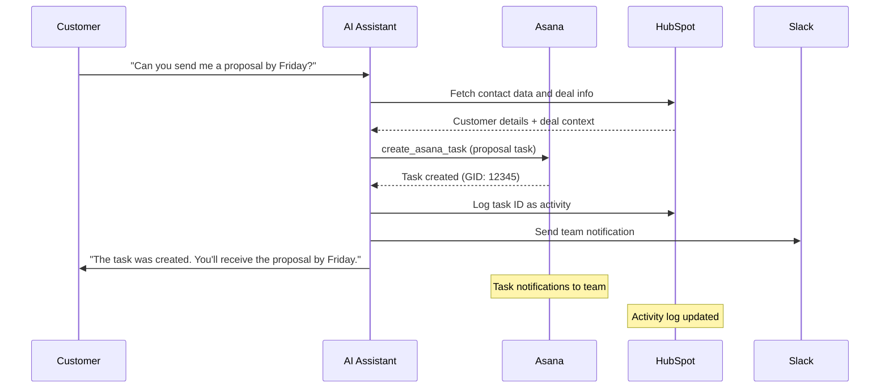

# Asana Integration Template

Integrate Asana task management into your Mid-call Actions and allow your AI assistant to automatically create tasks, assign them, and coordinate projects during customer conversations – perfect for agile teams and project management.

## Overview & Features

<CardGroup cols={2}>
  <Card title="Automated Task Management" icon="tasks">
    - Instant task creation from conversation content  
    - Intelligent project assignment based on context  
    - Automatic assignee determination and due date setting  
    - Integration with Asana workflows and custom fields  
  </Card>
  <Card title="Team Coordination & Follow-up" icon="users">
    - Cross-functional task assignments  
    - Automatic dependencies and subtasks  
    - Integration with Asana timeline and portfolio management  
    - Real-time team notifications about new tasks  
  </Card>
</CardGroup>

## Asana API & Workspace Setup

### 1. Set Up Asana API Access

<Steps>
  <Step title="Asana Account & Workspace">
    - Ensure you have admin rights in your Asana workspace  
    - Navigate to "Admin Console" → "Apps" → "Service accounts"  
    - Or use Personal Access Tokens for easier setup  
  </Step>
  
  <Step title="Create Personal Access Token">
    ```yaml
    Token Generation:
      1. Click on your profile picture → "My Settings"
      2. "Apps" → "Manage Developer Apps"
      3. "Create New Personal Access Token"
      4. Name: "Famulor Mid-Call Integration"
      5. Copy the token (starts with "1/...")
    ```
  </Step>
  
  <Step title="Create Service Account (Enterprise)">
    ```yaml
    Service Account (for Teams/Business):
      1. "Admin Console" → "Service accounts" 
      2. "Add service account"
      3. Name: "Famulor Mid-Call Service"
      4. Permissions: "Editor" or "Member"
      5. Generate and securely store the token
    ```
  </Step>
  
  <Step title="Identify Projects and Teams">
    ```yaml
    Project Setup:
      - Collect project IDs for various areas
      - Sales Project: "1234567890123456"
      - Support Project: "2345678901234567"
      - Business Development: "3456789012345678"
      
    Team GIDs for assignments:
      - Sales Team: "987654321098765"
      - Support Team: "876543210987654" 
      - DevOps Team: "765432109876543"
    ```
  </Step>
</Steps>

## Configure Mid-call Action

### Configuration in the Famulor Interface

<Tabs>
  <Tab title="Tool Details">
    | Field | Value |
    |-------|-------|
    | **Name*** | `Asana Task erstellen` |
    | **Description** | "Automatically creates new tasks in Asana based on conversation content and action items" |
    | **Function Name*** | `create_asana_task` |
    | **Function Description*** | "Creates a new task in an Asana project. Use this when action items, follow-ups, or project tasks are identified during the conversation." |
    | **HTTP Method** | `POST` |
    | **Timeout (ms)** | `5000` |
    | **Endpoint*** | `https://app.asana.com/api/1.0/tasks` |
  </Tab>
  
  <Tab title="Header Configuration">
    ```json
    {
      "Authorization": "Bearer {{ASANA_TOKEN}}",
      "Content-Type": "application/json",
      "User-Agent": "Famulor-MidCall-Asana/1.0"
    }
    ```
  </Tab>
  
  <Tab title="Request Body Template">
    ```json
    {
      "data": {
        "name": "{task_name}",
        "notes": "{task_description}",
        "projects": ["{project_id}"],
        "assignee": "{assignee_email}",
        "due_on": "{due_date}",
        "start_on": "{start_date}",
        "tags": ["{tag_1}", "{tag_2}"],
        "custom_fields": {
          "{priority_field_id}": "{priority}",
          "{client_field_id}": "{client_name}",
          "{source_field_id}": "mid-call-action"
        }
      }
    }
    ```
  </Tab>
</Tabs>

### Parameter Schema

```json
{
  "type": "object",
  "properties": {
    "task_name": {
      "type": "string",
      "description": "Name of the task (precise and actionable)",
      "examples": ["Follow-up call with Example AG", "Prepare demo for Max Mustermann", "Handle support ticket #12345"]
    },
    "task_description": {
      "type": "string",
      "description": "Detailed task description including context from the conversation"
    },
    "project_id": {
      "type": "string",
      "description": "Asana project ID (GID) for task assignment"
    },
    "assignee_email": {
      "type": "string",
      "format": "email",
      "description": "Email address of the Asana user who should take ownership of the task"
    },
    "due_date": {
      "type": "string",
      "format": "date",
      "description": "Due date in the format YYYY-MM-DD"
    },
    "start_date": {
      "type": "string",
      "format": "date",
      "description": "Start date of the task (optional)"
    },
    "priority": {
      "type": "string",
      "enum": ["Low", "Normal", "High", "Critical"],
      "description": "Priority level based on conversation context",
      "default": "Normal"
    },
    "client_name": {
      "type": "string",
      "description": "Customer name for task categorization (optional)"
    },
    "tags": {
      "type": "array",
      "items": {"type": "string"},
      "description": "Asana tags for categorization",
      "examples": [["mid-call", "follow-up"], ["sales", "hot-lead"], ["support", "urgent"]]
    },
    "estimated_hours": {
      "type": "number",
      "description": "Estimated work hours (optional)",
      "minimum": 0.5,
      "maximum": 40
    }
  },
  "required": ["task_name", "project_id"]
}
```

## Practical Use Cases

### Scenario 1: Sales Follow-up Task

<Steps>
  <Step title="Lead Conversation with Action Items">
    ```yaml
    During the sales call:
      Customer: "Please send me a detailed proposal by Friday."
      
    AI Assistant: "Of course! I am creating a task for our sales team..."
    
    → create_asana_task is triggered
    ```
  </Step>
  
  <Step title="Intelligent Task Generation">
    ```yaml
    Task Details:
      task_name: "Create Proposal: Example AG - CRM Integration"
      task_description: "Customer Max Mustermann from Example AG requires a detailed proposal for CRM integration.
                        
                        Conversation context:
                        - Budget: ~50k€
                        - Timeline: Q1 2024
                        - Pain Points: Current solution too slow
                        - Decision Maker: Max (CEO)
                        
                        Action Items:
                        - Compile technical specifications
                        - Calculate pricing for 50-user setup  
                        - Attach case study of similar customers
                        - Suggest date for proposal presentation"
      
      project_id: "sales-pipeline-project-id"
      assignee_email: "sales@company.com"
      due_date: "2024-01-19"
      priority: "High"
      tags: ["mid-call", "hot-lead", "proposal-needed"]
    ```
  </Step>
</Steps>

### Scenario 2: Support Ticket Task Management

<AccordionGroup>
  <Accordion title="Critical Issue Reporting">
    **Support escalation via Asana**:
    ```yaml
    Problem context:
      Customer: "Our system has been down for 2 hours!"
      
    Automatic Task Creation:
      task_name: "CRITICAL: System outage at Example AG"
      project_id: "support-critical-project-id"
      assignee_email: "devops@company.com" 
      due_date: "2024-01-15" (today)
      priority: "Critical"
      
    Task Description:
      "🚨 CRITICAL SYSTEM OUTAGE
      
      Customer: Example AG (Max Mustermann)
      Problem: Complete outage since 2:00 PM
      Business impact: Production stoppage, revenue loss
      
      Immediate actions required:
      1. Check system status
      2. Contact customer within 30 minutes
      3. Provide workaround
      4. Start root cause analysis
      
      SLA: 1-hour resolution target"
    ```
  </Accordion>
  
  <Accordion title="Feature Request Tracking">
    **Coordinate product development**:
    ```yaml
    Feature request flow:
      Customer: "Could you add an integration to XY system?"
      
    Task Creation:
      task_name: "Feature Request: XY System Integration"
      project_id: "product-development-backlog"
      assignee_email: "product-manager@company.com"
      
    Custom fields:
      customer_impact: "High" (multiple customers affected)
      estimated_effort: "Medium"
      revenue_potential: "€25k+ ARR"
      competitive_advantage: "Yes"
    ```
  </Accordion>
</AccordionGroup>

### Scenario 3: Partnership & Business Development



## Response Handling

### Successful Task Creation

```json
{
  "data": {
    "gid": "1234567890123456",
    "name": "Follow-up call with Example AG",
    "notes": "Customer Max Mustermann requires a detailed proposal...",
    "assignee": {
      "gid": "9876543210987654",
      "name": "Sales Manager"
    },
    "projects": [
      {
        "gid": "1111222233334444",
        "name": "Sales Pipeline Q1"
      }
    ],
    "due_on": "2024-01-19",
    "created_at": "2024-01-15T10:30:00.000Z",
    "permalink_url": "https://app.asana.com/0/1111222233334444/1234567890123456"
  }
}
```

### Natural Language Integration

<AccordionGroup>
  <Accordion title="Agent Messages Before API Call">
    **Template**: `"Creating the task '{{task_name}}' in Asana..."`
    
    **Contextual examples**:
    ```yaml
    Follow-up Task:
      "I am creating a follow-up task for our sales team..."
    
    Support Task:
      "I am creating a support ticket in Asana for the tech team..."
    
    Project Task:
      "I am creating a project task for further processing..."
    ```
  </Accordion>
  
  <Accordion title="Success Confirmations">
    **Standard template**: `"Task was successfully created in Asana."`
    
    **Extended confirmations**:
    ```yaml
    With assignee:
      "Task was created and assigned to {assignee_name}."
    
    With deadline:
      "The task was created with a due date of {due_date}."
    
    With team context:
      "The {team_name} team has been notified about the new task."
    
    With link:
      "Task created. You can track progress here: [Link to Task]"
    ```
  </Accordion>
</AccordionGroup>

## Advanced Asana Features

### Custom Fields & Automation

<AccordionGroup>
  <Accordion title="Custom Field Integration">
    ```yaml
    Industry-specific custom fields:
      
    Sales Tasks:
      - Lead Score: dropdown (Cold/Warm/Hot)
      - Deal Size: number field
      - Competition: multi-select
      - Close Probability: percentage
      
    Support Tasks:
      - Severity: dropdown (Low/Medium/High/Critical)
      - Customer Tier: dropdown (Basic/Pro/Enterprise)
      - Resolution Time: number (hours)
      - Escalation Level: dropdown
      
    Project Tasks:
      - Client Name: text field
      - Project Phase: dropdown
      - Budget Allocated: number
      - Stakeholders: people field
    ```
  </Accordion>
  
  <Accordion title="Asana Automation Rules">
    ```yaml
    Trigger-based automation:
      
    When Priority = "Critical":
      → Notify assignee immediately
      → Set due date to "today"
      → Add manager as follower
      
    When Tag = "mid-call":
      → Special "Live Call" status color
      → Automatic follow-up after 24h
      → Add to team dashboard
      
    When Client = "Enterprise":
      → Add account manager as follower
      → Increase priority level
      → Executive dashboard visibility
    ```
  </Accordion>
</AccordionGroup>

### Multi-Project Workflows

<Tabs>
  <Tab title="Cross-Functional Tasks">
    ```yaml
    Complex customer request workflow:
      
    Lead from enterprise conversation:
      1. Sales task: "Create proposal"
         Project: Sales Pipeline
         Assignee: Account Manager
         
      2. Tech task: "Technical deep dive"
         Project: Solution Engineering  
         Assignee: Solutions Architect
         
      3. Legal task: "Contract review"
         Project: Legal & Compliance
         Assignee: Legal Team
         
    Dependencies:
      Tech task → Sales task (blocking)
      Sales task → Legal task (predecessor)
    ```
  </Tab>
  
  <Tab title="Portfolio Management">
    ```yaml
    Portfolio-level tracking:
      
    Customer Success Portfolio:
      - Onboarding tasks
      - Health check tasks
      - Renewal preparation tasks
      
    Product Development Portfolio:
      - Feature request tasks
      - Bug report tasks
      - Enhancement tasks
      
    Go-to-Market Portfolio:
      - Campaign launch tasks
      - Content creation tasks  
      - Partnership activation tasks
    ```
  </Tab>
</Tabs>

## Error Handling & Troubleshooting

### Common API Errors

<AccordionGroup>
  <Accordion title="Invalid Project (400)">
    ```yaml
    Cause: Project ID does not exist or no access
    
    Asana response:
      "errors": [{
        "message": "project: Not a recognized ID",
        "phrase": "project"
      }]
    
    Fallback:
      "The task could not be assigned to the specified project. 
       It will be created in your default Inbox."
    
    Resolution:
      - Validate project ID
      - Fallback to user Inbox
      - Notify admin about configuration error
    ```
  </Accordion>
  
  <Accordion title="User Not Found (404)">
    ```yaml
    Cause: Assignee email not found in Asana workspace
    
    Graceful handling:
      "Task was created, but the assignee could not be automatically assigned. 
       Please assign the task manually."
    
    Automatic correction:
      - Create task without assignee
      - Assign default team lead as assignee
      - Notify workspace admin
    ```
  </Accordion>
  
  <Accordion title="Rate Limiting (429)">
    ```yaml
    Asana rate limits:
      - Standard: 1500 requests/minute
      - Premium: 1500 requests/minute (same)
      - Enterprise: custom limits possible
    
    Retry strategy:
      - Exponential backoff: 1s, 2s, 4s
      - Maximum 3 retries
      - Queue system for burst loads
    
    User communication:
      "The task is being created. Under heavy load this may take a moment..."
    ```
  </Accordion>
</AccordionGroup>

## Integration with Other Tools

### CRM Synchronization



## Performance & Analytics

### Project Management KPIs

| Metric | Description | Target Value |
|--------|-------------|--------------|
| **Task Creation Success Rate** | % of tasks created successfully | >99% |
| **Assignment Accuracy** | % of correctly assigned tasks | >95% |
| **Task Completion Rate** | % of on-time completed mid-call tasks | >80% |
| **Follow-up Conversion** | % of tasks leading to business results | >60% |

### Productivity Impact Tracking

<Steps>
  <Step title="Measure Team Efficiency">
    ```yaml
    Before/After comparison:
      Without mid-call tasks:
        - Follow-up rate: 45%
        - Average response time: 48h
        - Forgotten action items: 25%
      
      With mid-call tasks:
        - Follow-up rate: 85%
        - Average response time: 6h
        - Forgotten action items: 5%
    ```
  </Step>
  
  <Step title="Business Impact Attribution">
    ```yaml
    Revenue tracking:
      Mid-call task → Follow-up action → Meeting → Deal
      
    Conversion funnel:
      - Tasks created: 100%
      - Tasks completed on time: 80%
      - Follow-up meetings scheduled: 60%
      - Deals closed: 15%
    ```
  </Step>
</Steps>

## Best Practices

### Task Design Patterns

<CardGroup cols={2}>
  <Card title="Actionable Task Names" icon="bullseye">
    **Good examples**:
    - "Prepare demo: CRM features for Example AG"
    - "Follow-up call: Budget confirmation by Friday"
    - "Send proposal: 50k€ enterprise deal"
    
    **Avoid**:
    - "Call customer"
    - "Do follow-up"
    - "Proposal"
  </Card>
  <Card title="Context-Rich Descriptions" icon="info">
    **Template structure**:
    ```
    Context: [What happened?]
    Goal: [What should be achieved?]
    Details: [Specific information]
    Deadline: [Why this deadline?]
    Success Criteria: [When is it successful?]
    ```
  </Card>
</CardGroup>

---

<Warning>
**Workspace Access**: Ensure that all automatically created tasks can be seen and managed by the assigned team members. Regularly review project permissions.
</Warning>

<Info>
**Productivity Tip**: Use Asana templates for recurring task types (sales follow-ups, support escalations, etc.) to maximize consistency and efficiency.
</Info>