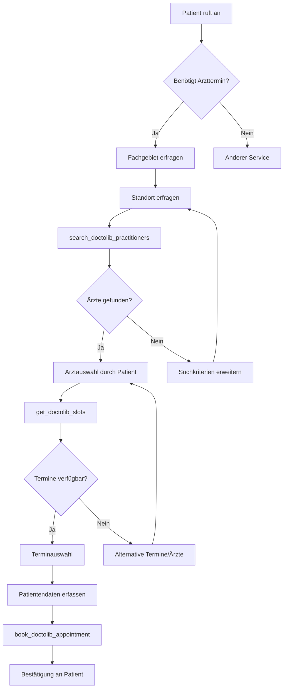

# Doctolib Integration Template

Integrieren Sie Deutschlands führende Arzttermin-Plattform Doctolib direkt in Ihre Mid-call Actions. Ermöglichen Sie Ihren Kunden, Ärzte zu finden, verfügbare Termine zu prüfen und sogar Termine zu buchen - alles während des Telefongesprächs.

## Überblick & Funktionen

<CardGroup cols={2}>
  <Card title="Arztsuche-Automation" icon="magnifying-glass">
    - Suche nach Fachärzten basierend auf Standort und Spezialität
    - Filterung nach Versicherungstyp (Kasse/Privat)
    - Verfügbarkeit innerhalb definierter Zeiträume
    - Radius-basierte Suche für optimale Erreichbarkeit
  </Card>
  <Card title="Terminmanagement" icon="calendar">
    - Echtzeit-Verfügbarkeit von Arztterminen
    - Automatische Terminbuchung während des Gesprächs
    - Support für Videosprechstunden
    - Vollständige Patientendaten-Integration
  </Card>
</CardGroup>

## Doctolib API-Zugang einrichten

### 1. Doctolib Developer Account

<Steps>
  <Step title="Developer-Registrierung">
    - Besuchen Sie das [Doctolib Developer Portal](https://developers.doctolib.com)
    - Registrieren Sie sich als Healthcare-Integration-Partner
    - Reichen Sie Ihre Geschäftslizenz und Datenschutz-Dokumentation ein
  </Step>
  
  <Step title="API-Credentials erhalten">
    ```yaml
    Nach Approval erhalten Sie:
      - Client ID
      - Client Secret  
      - API-Umgebung (Sandbox/Production)
      - Rate-Limits und Usage-Guidelines
    ```
  </Step>
  
  <Step title="OAuth 2.0 Setup">
    ```yaml
    OAuth-Konfiguration:
      Authorization URL: https://api.doctolib.de/oauth/authorize
      Token URL: https://api.doctolib.de/oauth/token
      Scopes: 
        - "read:practitioners"
        - "read:appointments" 
        - "write:appointments"
    ```
  </Step>
</Steps>

## Tool 1: Arztsuche-Tool

### Konfiguration im Famulor Interface

<Tabs>
  <Tab title="Werkzeugdetails">
    | Feld | Wert |
    |------|------|
    | **Name*** | `Doctolib Arztsuche` |
    | **Beschreibung** | "Sucht verfügbare Ärzte und Fachärzte basierend auf Standort und Spezialität" |
    | **Funktionsname*** | `search_doctolib_practitioners` |
    | **Funktionsbeschreibung*** | "Sucht Ärzte basierend auf Fachgebiet und Standort. Verwenden Sie diese Funktion, wenn der Patient nach einem Arzt in seiner Nähe sucht." |
    | **HTTP-Methode** | `GET` |
    | **Timeout (ms)** | `5000` |
    | **Endpoint*** | `https://api.doctolib.de/practitioners/search` |
  </Tab>
  
  <Tab title="Header-Konfiguration">
    ```json
    {
      "Authorization": "Bearer {{DOCTOLIB_API_KEY}}",
      "Content-Type": "application/json",
      "User-Agent": "Famulor-MidCall-Actions/1.0"
    }
    ```
  </Tab>
  
  <Tab title="Query-Parameter">
    ```json
    {
      "speciality": "{speciality}",
      "location": "{location}",
      "insurance_type": "{insurance_type}",
      "available_in_days": "{availability_days}",
      "radius_km": "{radius}"
    }
    ```
  </Tab>
</Tabs>

### Parameter-Schema

```json
{
  "type": "object",
  "properties": {
    "speciality": {
      "type": "string",
      "description": "Fachgebiet (z.B. 'Allgemeinmedizin', 'Zahnarzt', 'Orthopädie', 'Dermatologie')",
      "examples": ["Allgemeinmedizin", "Zahnarzt", "Orthopädie", "Dermatologie", "Gynäkologie"]
    },
    "location": {
      "type": "string", 
      "description": "PLZ oder Stadt für die Arztsuche"
    },
    "insurance_type": {
      "type": "string",
      "enum": ["public", "private", "both"],
      "description": "Versicherungstyp: 'public' (Kassenpatienten), 'private' (Privatpatienten), 'both' (beide)"
    },
    "availability_days": {
      "type": "integer",
      "description": "Verfügbarkeit innerhalb der nächsten X Tage",
      "minimum": 1,
      "maximum": 90,
      "default": 14
    },
    "radius": {
      "type": "integer",
      "description": "Suchradius in Kilometern",
      "minimum": 1,
      "maximum": 100,
      "default": 25
    }
  },
  "required": ["speciality", "location"]
}
```

### Response-Mapping

```json
{
  "practitioners": "data.practitioners",
  "total": "data.total_count",
  "searchRadius": "data.search_radius_km"
}
```

### Natürliche Sprachintegration

<AccordionGroup>
  <Accordion title="Agent-Nachricht vor API-Aufruf">
    **Template**: `"Ich suche {{speciality}} in {{location}} für Sie..."`
    
    **Beispiele**:
    - "Ich suche Zahnärzte in München für Sie..."
    - "Ich schaue nach Allgemeinmedizinern in 10115 Berlin..."
    - "Ich finde Orthopäden in Hamburg, die Kassenpatienten behandeln..."
  </Accordion>
  
  <Accordion title="Custom-Prompt für Zusammenfassung">
    ```
    Ich habe {{total}} Ärzte gefunden. Dr. {{practitioners[0].name}} praktiziert in {{practitioners[0].address}} und hat den nächsten verfügbaren Termin am {{practitioners[0].next_availability}}. {{#if practitioners[1]}}Weitere Optionen: Dr. {{practitioners[1].name}} in {{practitioners[1].address}}.{{/if}}
    ```
  </Accordion>
</AccordionGroup>

## Tool 2: Terminslots-Abfrage

### Konfiguration im Famulor Interface

<Tabs>
  <Tab title="Werkzeugdetails">
    | Feld | Wert |
    |------|------|
    | **Name*** | `Doctolib Terminslots` |
    | **Beschreibung** | "Zeigt verfügbare Termine bei einem spezifischen Arzt an" |
    | **Funktionsname*** | `get_doctolib_slots` |
    | **Funktionsbeschreibung*** | "Ruft verfügbare Terminslots ab. Verwenden Sie diese Funktion, nachdem ein Arzt ausgewählt wurde, um konkrete Terminoptionen zu zeigen." |
    | **HTTP-Methode** | `GET` |
    | **Timeout (ms)** | `5000` |
    | **Endpoint*** | `https://api.doctolib.de/practitioners/{practitioner_id}/availabilities` |
  </Tab>
  
  <Tab title="Query-Parameter">
    ```json
    {
      "start_date": "{start_date}",
      "end_date": "{end_date}",
      "visit_motive_id": "{motive_id}",
      "telehealth": "{telehealth}"
    }
    ```
  </Tab>
</Tabs>

### Parameter-Schema für Terminabfrage

```json
{
  "type": "object",
  "properties": {
    "practitioner_id": {
      "type": "string",
      "description": "Eindeutige Doctolib-ID des Arztes (aus vorheriger Suche)"
    },
    "start_date": {
      "type": "string",
      "format": "date",
      "description": "Startdatum für Terminsuche (YYYY-MM-DD)"
    },
    "end_date": {
      "type": "string",
      "format": "date", 
      "description": "Enddatum für Terminsuche (YYYY-MM-DD)"
    },
    "motive_id": {
      "type": "string",
      "description": "ID des Behandlungsgrundes (optional, für spezifische Termintypen)"
    },
    "telehealth": {
      "type": "boolean",
      "description": "Nur Videosprechstunden anzeigen? (true/false)",
      "default": false
    }
  },
  "required": ["practitioner_id", "start_date"]
}
```

### Response-Verarbeitung

```json
{
  "slots": "data.availabilities",
  "nextSlot": "data.availabilities[0]",
  "practitioner": "data.practitioner_info"
}
```

## Tool 3: Terminbuchung

### Konfiguration für Buchungs-Tool

<Tabs>
  <Tab title="Werkzeugdetails">
    | Feld | Wert |
    |------|------|
    | **Name*** | `Doctolib Termin buchen` |
    | **Beschreibung** | "Bucht einen Arzttermin über Doctolib" |
    | **Funktionsname*** | `book_doctolib_appointment` |
    | **Funktionsbeschreibung*** | "Bucht einen konkreten Termin bei einem Arzt. Verwenden Sie diese Funktion erst, nachdem alle Patientendaten vollständig erfasst wurden." |
    | **HTTP-Methode** | `POST` |
    | **Timeout (ms)** | `10000` |
    | **Endpoint*** | `https://api.doctolib.de/appointments` |
  </Tab>
  
  <Tab title="Request Body Template">
    ```json
    {
      "practitioner_id": "{practitioner_id}",
      "start_time": "{start_time}",
      "visit_motive_id": "{motive_id}",
      "patient": {
        "first_name": "{first_name}",
        "last_name": "{last_name}",
        "birthdate": "{birthdate}",
        "phone": "{phone}",
        "email": "{email}"
      },
      "insurance_info": {
        "insurance_type": "{insurance_type}",
        "insurance_number": "{insurance_number}"
      },
      "comments": "{comments}"
    }
    ```
  </Tab>
</Tabs>

### Vollständiges Parameter-Schema für Buchung

```json
{
  "type": "object",
  "properties": {
    "practitioner_id": {
      "type": "string",
      "description": "Arzt-ID von der vorherigen Suche"
    },
    "start_time": {
      "type": "string",
      "format": "date-time",
      "description": "Gewählte Terminzeit (ISO 8601 Format)"
    },
    "motive_id": {
      "type": "string",
      "description": "Behandlungsgrund-ID"
    },
    "first_name": {
      "type": "string",
      "description": "Vorname des Patienten"
    },
    "last_name": {
      "type": "string", 
      "description": "Nachname des Patienten"
    },
    "birthdate": {
      "type": "string",
      "format": "date",
      "description": "Geburtsdatum des Patienten (YYYY-MM-DD)"
    },
    "phone": {
      "type": "string",
      "description": "Telefonnummer des Patienten"
    },
    "email": {
      "type": "string",
      "format": "email",
      "description": "E-Mail-Adresse des Patienten"
    },
    "insurance_type": {
      "type": "string",
      "enum": ["public", "private"],
      "description": "Versicherungstyp: 'public' (gesetzlich) oder 'private' (privat)"
    },
    "insurance_number": {
      "type": "string",
      "description": "Versichertennummer (bei gesetzlicher Versicherung)"
    },
    "comments": {
      "type": "string",
      "description": "Zusätzliche Anmerkungen oder Beschwerden"
    }
  },
  "required": ["practitioner_id", "start_time", "first_name", "last_name", "phone"]
}
```

## Kompletter Workflow-Ablauf

### Schritt-für-Schritt-Integration



### Praktisches Gesprächsbeispiel

<AccordionGroup>
  <Accordion title="Szenario: Zahnarzttermin-Buchung">
    **Patient**: "Ich brauche einen Zahnarzttermin in München."
    
    **KI-Assistent**: "Gerne helfe ich Ihnen dabei. Sind Sie gesetzlich oder privat versichert?"
    
    **Patient**: "Gesetzlich versichert."
    
    **KI**: "Perfekt. Ich suche Zahnärzte in München für Sie..."
    
    *→ Tool: `search_doctolib_practitioners`*
    ```json
    {
      "speciality": "Zahnarzt",
      "location": "München", 
      "insurance_type": "public",
      "availability_days": 14,
      "radius": 25
    }
    ```
    
    **KI**: "Ich habe 8 Zahnärzte gefunden. Dr. Schmidt in der Maximilianstraße hat bereits übermorgen einen Termin frei. Dr. Müller in Schwabing hätte auch nächste Woche Zeit. Welche Praxis wäre für Sie günstiger gelegen?"
    
    **Patient**: "Dr. Schmidt klingt gut."
    
    **KI**: "Ich prüfe die verfügbaren Termine bei Dr. Schmidt..."
    
    *→ Tool: `get_doctolib_slots`*
    ```json
    {
      "practitioner_id": "dr_schmidt_12345",
      "start_date": "2024-01-17",
      "end_date": "2024-01-31"
    }
    ```
    
    **KI**: "Dr. Schmidt hat folgende Termine frei: Mittwoch 14:30, Donnerstag 09:15 oder Freitag 16:00. Was passt Ihnen am besten?"
    
    **Patient**: "Donnerstag 09:15 wäre perfekt."
    
    **KI**: "Excellent! Dann benötige ich noch Ihre Daten für die Buchung. Wie ist Ihr vollständiger Name und Geburtsdatum?"
    
    *→ Datenerfassung → Tool: `book_doctolib_appointment`*
    
    **KI**: "Termin gebucht! Sie haben am Donnerstag, 18. Januar um 09:15 Uhr einen Termin bei Dr. Schmidt. Sie erhalten eine SMS und E-Mail zur Bestätigung."
  </Accordion>
  
  <Accordion title="Erweiterte Szenarien">
    **Notfall-Termine**:
    ```yaml
    Wenn Patient: "Es ist ein Notfall"
    → availability_days: 1
    → Suche nach Notfall-Sprechstunden
    → Priorisierung nach Verfügbarkeit heute
    ```
    
    **Videosprechstunden**:
    ```yaml
    Wenn Patient: "Geht das auch als Videosprechstunde?"
    → telehealth: true
    → Erweiterte Terminoptionen
    → Online-Beratung-Möglichkeiten
    ```
    
    **Mehrere Fachrichtungen**:
    ```yaml
    Wenn Patient: "Ich brauche auch noch einen Orthopäden"
    → Parallel-Suche verschiedener Spezialitäten
    → Terminkoordination
    → Optimierte Routing-Vorschläge
    ```
  </Accordion>
</AccordionGroup>

## Response-Verarbeitung & Fehlerbehandlung

### Typische API-Responses

<Tabs>
  <Tab title="Arztsuche-Response">
    ```json
    {
      "data": {
        "practitioners": [
          {
            "id": "dr_schmidt_12345",
            "name": "Dr. med. Schmidt",
            "speciality": "Zahnarzt",
            "address": "Maximilianstraße 15, 80539 München",
            "phone": "+49 89 12345678",
            "rating": 4.8,
            "review_count": 127,
            "insurance_types": ["public", "private"],
            "next_availability": "2024-01-18T09:15:00Z",
            "distance_km": 2.3
          }
        ],
        "total_count": 8,
        "search_radius_km": 25
      }
    }
    ```
  </Tab>
  
  <Tab title="Terminslots-Response">
    ```json
    {
      "data": {
        "availabilities": [
          {
            "start_time": "2024-01-18T09:15:00Z",
            "end_time": "2024-01-18T09:45:00Z",
            "visit_motive_id": "routine_checkup",
            "slot_type": "standard"
          },
          {
            "start_time": "2024-01-18T14:30:00Z", 
            "end_time": "2024-01-18T15:00:00Z",
            "visit_motive_id": "routine_checkup",
            "slot_type": "standard"
          }
        ],
        "practitioner_info": {
          "name": "Dr. med. Schmidt",
          "address": "Maximilianstraße 15, 80539 München"
        }
      }
    }
    ```
  </Tab>
  
  <Tab title="Buchungs-Response">
    ```json
    {
      "data": {
        "id": "appointment_67890",
        "confirmation_code": "DOC-2024-001",
        "status": "confirmed",
        "start_time": "2024-01-18T09:15:00Z",
        "practitioner": {
          "name": "Dr. med. Schmidt",
          "address": "Maximilianstraße 15, 80539 München"
        },
        "patient": {
          "name": "Max Mustermann"
        },
        "notifications": {
          "sms_sent": true,
          "email_sent": true
        }
      }
    }
    ```
  </Tab>
</Tabs>

### Fehlerbehandlung

<AccordionGroup>
  <Accordion title="Häufige Fehlerszenarios">
    **Keine Ärzte gefunden (404)**:
    ```yaml
    Fallback: "In Ihrem Umkreis habe ich leider keine verfügbaren Ärzte gefunden. 
              Soll ich den Suchradius erweitern oder nach einer anderen Stadt suchen?"
    
    Next-Action: 
      - Suchradius vergrößern
      - Alternative Städte vorschlagen
      - Andere Fachrichtungen anbieten
    ```
  </Accordion>
  
  <Accordion title="Terminbuchung fehlgeschlagen">
    ```yaml
    Mögliche_Ursachen:
      - Termin bereits vergeben
      - Unvollständige Patientendaten
      - Versicherung nicht akzeptiert
    
    Graceful_Handling:
      "Es tut mir leid, dieser Termin ist leider nicht mehr verfügbar. 
       Ich kann Ihnen aber einen alternativen Termin anbieten..."
    
    Fallback_Aktionen:
      - Alternative Terminslots abrufen
      - Warteliste anbieten
      - Anderen Arzt vorschlagen
    ```
  </Accordion>
  
  <Accordion title="API-Rate-Limiting">
    ```yaml
    Rate_Limit_Exceeded (429):
      Fallback: "Die Arztsuche ist momentan sehr stark frequentiert. 
                Darf ich es in ein paar Sekunden nochmal versuchen?"
      
    Retry_Logic:
      - Exponential Backoff: 2s, 4s, 8s
      - Max 3 Retry-Versuche
      - Nach 3 Fehlschlägen: Manual-Alternative anbieten
    ```
  </Accordion>
</AccordionGroup>

## Erweiterte Features

### Integration mit CRM-Systemen

<Tabs>
  <Tab title="Patient-Data-Sync">
    ```yaml
    CRM_Integration_Workflow:
      1. Nach_erfolgreicher_Buchung:
         → Patientendaten in CRM übertragen
         → Termin als "Healthcare Appointment" kategorisieren
         → Follow-up-Task für Terminerinnerung
      
      2. Existing_Patient_Recognition:
         → CRM-Lookup vor Neuerfassung
         → Vorhandene Daten vorausfüllen
         → Präferenz-basierte Arztauswahl
    ```
  </Tab>
  
  <Tab title="Healthcare-Analytics">
    ```yaml
    Tracking_Metrics:
      - Terminbuchungsrate
      - Bevorzugte Fachrichtungen
      - Regionale Verteilung
      - Versicherungstyp-Distribution
      
    Business_Intelligence:
      - Peak-Times für Terminanfragen
      - Erfolgsrate verschiedener Ärzte
      - Patient-Satisfaction-Scores
      - Conversion von Anfrage zu Buchung
    ```
  </Tab>
</Tabs>

### Compliance & Datenschutz

<AccordionGroup>
  <Accordion title="DSGVO-Konformität">
    ```yaml
    Privacy_by_Design:
      - Minimale Datenerfassung (nur für Buchung notwendig)
      - Explizite Einverständniserklärung vor Buchung
      - Automatische Datenlöschung nach Termindatum
      - Audit-Trail für alle Datenverarbeitungen
    
    Patient_Rights:
      - Recht auf Datenportabilität
      - Recht auf Löschung
      - Recht auf Berichtigung
      - Transparenz über Datenverwendung
    ```
  </Accordion>
  
  <Accordion title="Healthcare-Security">
    ```yaml
    Security_Measures:
      - Ende-zu-Ende-Verschlüsselung für Patientendaten
      - Sichere API-Kommunikation (TLS 1.3)
      - Access-Logging und Monitoring
      - Regular Security-Audits
    
    Compliance_Standards:
      - BDSG-Konformität
      - TMG-Compliance
      - eHealth-Standards (DiGA-V konform)
    ```
  </Accordion>
</AccordionGroup>

## Performance & Monitoring

### KPIs und Metriken

| Metrik | Zielwert | Kritischer Wert |
|--------|----------|-----------------|
| **Arztsuche Response Time** | &lt;2 Sekunden | &gt;5 Sekunden |
| **Buchungserfolgrate** | &gt;90% | &lt;75% |
| **Patient-Satisfaction** | &gt;4.5/5 | &lt;4.0/5 |
| **API-Verfügbarkeit** | &gt;99.5% | &lt;97% |

### Monitoring-Dashboard

<Steps>
  <Step title="Real-time Metrics">
    - API-Response-Times für alle drei Tools
    - Erfolgs-/Fehlerschläge-Verhältnis
    - Aktuelle Buchungsrate
    - Geographic Heat-Map der Anfragen
  </Step>
  
  <Step title="Business Intelligence">
    - Most-requested Specialities
    - Peak-Hours für Terminanfragen
    - Regional Demand Analysis
    - Patient Demographics
  </Step>
  
  <Step title="Alerting System">
    - High API-Error-Rate (&gt;5%)
    - Unusual Booking-Pattern (Spam-Detection)
    - Low Success-Rate (&lt;80%)
    - Dr-API-Outages
  </Step>
</Steps>

---

<Card title="Healthcare-Integration-Patterns" icon="heart">
Erweitern Sie Ihre Healthcare-Automatisierung:

- [Webhook-Integration](/automation-platform/mid-call-actions/integration-templates/webhook-automation) für komplexe Workflows
- [Salesforce Integration](/automation-platform/mid-call-actions/integration-templates/salesforce-integration) für CRM-Synchronisation
- [Google Sheets Integration](/automation-platform/mid-call-actions/integration-templates/google-sheets-integration) für einfache Datenhaltung
</Card>

<Warning>
**Medizinrecht-Hinweis**: Die Doctolib-Integration unterliegt strengen Healthcare-Compliance-Anforderungen. Stellen Sie sicher, dass alle Datenschutzbestimmungen eingehalten werden und die Integration den geltenden Gesetzen zur Fernbehandlung entspricht.
</Warning>

<Info>
**Praxis-Tipp**: Beginnen Sie mit der Arztsuche-Funktionalität und erweitern Sie schrittweise um Terminbuchungen. Die meisten Patienten schätzen bereits die schnelle Arztsuche, auch wenn sie den Termin dann selbst vereinbaren.
</Info>
