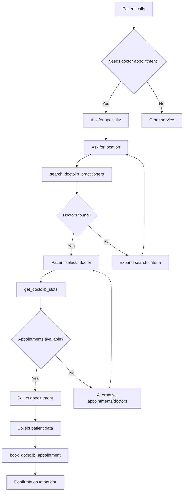

# Doctolib Integration Template

Integrate Germany's leading doctor appointment platform Doctolib directly into your Mid-call Actions. Enable your customers to find doctors, check available appointments, and even book appointments – all while on the phone.

## Overview & Features

<CardGroup cols={2}>
  <Card title="Doctor Search Automation" icon="magnifying-glass">
    - Search for specialists based on location and specialty
    - Filter by insurance type (public/private)
    - Availability within defined timeframes
    - Radius-based search for optimal accessibility
  </Card>
  <Card title="Appointment Management" icon="calendar">
    - Real-time availability of doctor appointments
    - Automatic appointment booking during the call
    - Support for video consultations
    - Full patient data integration
  </Card>
</CardGroup>

## Setting Up Doctolib API Access

### 1. Doctolib Developer Account

<Steps>
  <Step title="Developer Registration">
    - Visit the [Doctolib Developer Portal](https://developers.doctolib.com)
    - Register as a healthcare integration partner
    - Submit your business license and data protection documentation
  </Step>
  
  <Step title="Obtain API Credentials">
    ```yaml
    After approval, you will receive:
      - Client ID
      - Client Secret  
      - API environment (Sandbox/Production)
      - Rate limits and usage guidelines
    ```
  </Step>
  
  <Step title="OAuth 2.0 Setup">
    ```yaml
    OAuth Configuration:
      Authorization URL: https://api.doctolib.de/oauth/authorize
      Token URL: https://api.doctolib.de/oauth/token
      Scopes: 
        - "read:practitioners"
        - "read:appointments" 
        - "write:appointments"
    ```
  </Step>
</Steps>

## Tool 1: Doctor Search Tool

### Configuration in Famulor Interface

<Tabs>
  <Tab title="Tool Details">
    | Field | Value |
    |-------|-------|
    | **Name*** | `Doctolib Arztsuche` |
    | **Description** | "Searches for available doctors and specialists based on location and specialty" |
    | **Function Name*** | `search_doctolib_practitioners` |
    | **Function Description*** | "Searches for doctors by specialty and location. Use this function when the patient is looking for a doctor nearby." |
    | **HTTP Method** | `GET` |
    | **Timeout (ms)** | `5000` |
    | **Endpoint*** | `https://api.doctolib.de/practitioners/search` |
  </Tab>
  
  <Tab title="Header Configuration">
    ```json
    {
      "Authorization": "Bearer {{DOCTOLIB_API_KEY}}",
      "Content-Type": "application/json",
      "User-Agent": "Famulor-MidCall-Actions/1.0"
    }
    ```
  </Tab>
  
  <Tab title="Query Parameters">
    ```json
    {
      "speciality": "{speciality}",
      "location": "{location}",
      "insurance_type": "{insurance_type}",
      "available_in_days": "{availability_days}",
      "radius_km": "{radius}"
    }
    ```
  </Tab>
</Tabs>

### Parameter Schema

```json
{
  "type": "object",
  "properties": {
    "speciality": {
      "type": "string",
      "description": "Medical specialty (e.g. 'General Medicine', 'Dentist', 'Orthopedics', 'Dermatology')",
      "examples": ["General Medicine", "Dentist", "Orthopedics", "Dermatology", "Gynecology"]
    },
    "location": {
      "type": "string", 
      "description": "Postal code or city for the doctor search"
    },
    "insurance_type": {
      "type": "string",
      "enum": ["public", "private", "both"],
      "description": "Insurance type: 'public' (statutory insured), 'private' (private insured), 'both' (both)"
    },
    "availability_days": {
      "type": "integer",
      "description": "Availability within the next X days",
      "minimum": 1,
      "maximum": 90,
      "default": 14
    },
    "radius": {
      "type": "integer",
      "description": "Search radius in kilometers",
      "minimum": 1,
      "maximum": 100,
      "default": 25
    }
  },
  "required": ["speciality", "location"]
}
```

### Response Mapping

```json
{
  "practitioners": "data.practitioners",
  "total": "data.total_count",
  "searchRadius": "data.search_radius_km"
}
```

### Natural Language Integration

<AccordionGroup>
  <Accordion title="Agent Message Before API Call">
    **Template**: `"I'm searching for {{speciality}} in {{location}} for you..."`
    
    **Examples**:
    - "I'm searching for dentists in Munich for you..."
    - "I'll look for general practitioners in 10115 Berlin..."
    - "I’m finding orthopedists in Hamburg who accept public insurance..."
  </Accordion>
  
  <Accordion title="Custom Prompt for Summary">
    ```
    I found {{total}} doctors. Dr. {{practitioners[0].name}} practices at {{practitioners[0].address}} and has the next available appointment on {{practitioners[0].next_availability}}. {{#if practitioners[1]}}Other options include Dr. {{practitioners[1].name}} at {{practitioners[1].address}}.{{/if}}
    ```
  </Accordion>
</AccordionGroup>

## Tool 2: Appointment Slots Inquiry

### Configuration in Famulor Interface

<Tabs>
  <Tab title="Tool Details">
    | Field | Value |
    |-------|-------|
    | **Name*** | `Doctolib Terminslots` |
    | **Description** | "Displays available appointments for a specific doctor" |
    | **Function Name*** | `get_doctolib_slots` |
    | **Function Description*** | "Retrieves available appointment slots. Use this function after a doctor has been selected to show concrete appointment options." |
    | **HTTP Method** | `GET` |
    | **Timeout (ms)** | `5000` |
    | **Endpoint*** | `https://api.doctolib.de/practitioners/{practitioner_id}/availabilities` |
  </Tab>
  
  <Tab title="Query Parameters">
    ```json
    {
      "start_date": "{start_date}",
      "end_date": "{end_date}",
      "visit_motive_id": "{motive_id}",
      "telehealth": "{telehealth}"
    }
    ```
  </Tab>
</Tabs>

### Parameter Schema for Appointment Inquiry

```json
{
  "type": "object",
  "properties": {
    "practitioner_id": {
      "type": "string",
      "description": "Unique Doctolib ID of the doctor (from previous search)"
    },
    "start_date": {
      "type": "string",
      "format": "date",
      "description": "Start date for appointment search (YYYY-MM-DD)"
    },
    "end_date": {
      "type": "string",
      "format": "date", 
      "description": "End date for appointment search (YYYY-MM-DD)"
    },
    "motive_id": {
      "type": "string",
      "description": "ID of the treatment reason (optional, for specific appointment types)"
    },
    "telehealth": {
      "type": "boolean",
      "description": "Show only video consultations? (true/false)",
      "default": false
    }
  },
  "required": ["practitioner_id", "start_date"]
}
```

### Response Handling

```json
{
  "slots": "data.availabilities",
  "nextSlot": "data.availabilities[0]",
  "practitioner": "data.practitioner_info"
}
```

## Tool 3: Appointment Booking

### Configuration for Booking Tool

<Tabs>
  <Tab title="Tool Details">
    | Field | Value |
    |-------|-------|
    | **Name*** | `Doctolib Termin buchen` |
    | **Description** | "Books a doctor appointment via Doctolib" |
    | **Function Name*** | `book_doctolib_appointment` |
    | **Function Description*** | "Books a specific appointment with a doctor. Use this function only after all patient data is fully collected." |
    | **HTTP Method** | `POST` |
    | **Timeout (ms)** | `10000` |
    | **Endpoint*** | `https://api.doctolib.de/appointments` |
  </Tab>
  
  <Tab title="Request Body Template">
    ```json
    {
      "practitioner_id": "{practitioner_id}",
      "start_time": "{start_time}",
      "visit_motive_id": "{motive_id}",
      "patient": {
        "first_name": "{first_name}",
        "last_name": "{last_name}",
        "birthdate": "{birthdate}",
        "phone": "{phone}",
        "email": "{email}"
      },
      "insurance_info": {
        "insurance_type": "{insurance_type}",
        "insurance_number": "{insurance_number}"
      },
      "comments": "{comments}"
    }
    ```
  </Tab>
</Tabs>

### Complete Parameter Schema for Booking

```json
{
  "type": "object",
  "properties": {
    "practitioner_id": {
      "type": "string",
      "description": "Doctor ID from the previous search"
    },
    "start_time": {
      "type": "string",
      "format": "date-time",
      "description": "Selected appointment time (ISO 8601 format)"
    },
    "motive_id": {
      "type": "string",
      "description": "Treatment reason ID"
    },
    "first_name": {
      "type": "string",
      "description": "Patient's first name"
    },
    "last_name": {
      "type": "string", 
      "description": "Patient's last name"
    },
    "birthdate": {
      "type": "string",
      "format": "date",
      "description": "Patient's date of birth (YYYY-MM-DD)"
    },
    "phone": {
      "type": "string",
      "description": "Patient's phone number"
    },
    "email": {
      "type": "string",
      "format": "email",
      "description": "Patient's email address"
    },
    "insurance_type": {
      "type": "string",
      "enum": ["public", "private"],
      "description": "Insurance type: 'public' (statutory) or 'private' (private)"
    },
    "insurance_number": {
      "type": "string",
      "description": "Insurance number (for statutory insurance)"
    },
    "comments": {
      "type": "string",
      "description": "Additional notes or complaints"
    }
  },
  "required": ["practitioner_id", "start_time", "first_name", "last_name", "phone"]
}
```

## Complete Workflow

### Step-by-Step Integration


```mermaid
flowchart TD
    A[Patient calls] --> B{Needs doctor appointment?}
    B -->|Yes| C[Ask for specialty]
    B -->|No| Z[Other service]
    C --> D[Ask for location]
    D --> E[search_doctolib_practitioners]
    E --> F{Doctors found?}
    F -->|Yes| G[Patient selects doctor]
    F -->|No| H[Expand search criteria]
    G --> I[get_doctolib_slots]
    I --> J{Appointments available?}
    J -->|Yes| K[Select appointment]
    J -->|No| L[Alternative appointments/doctors]
    K --> M[Collect patient data]
    M --> N[book_doctolib_appointment]
    N --> O[Confirmation to patient]
    H --> D
    L --> G
```

### Practical Conversation Example

<AccordionGroup>
  <Accordion title="Scenario: Dentist Appointment Booking">
    **Patient**: "I need a dentist appointment in Munich."
    
    **AI Assistant**: "I'd be glad to help. Are you insured publicly or privately?"
    
    **Patient**: "Publicly insured."
    
    **AI**: "Perfect. I’m searching for dentists in Munich for you..."
    
    *→ Tool: `search_doctolib_practitioners`*
    ```json
    {
      "speciality": "Dentist",
      "location": "Munich", 
      "insurance_type": "public",
      "availability_days": 14,
      "radius": 25
    }
    ```
    
    **AI**: "I found 8 dentists. Dr. Schmidt on Maximilianstraße has an appointment available the day after tomorrow. Dr. Müller in Schwabing is available next week as well. Which practice would be more convenient for you?"
    
    **Patient**: "Dr. Schmidt sounds good."
    
    **AI**: "I’m checking available appointments for Dr. Schmidt..."
    
    *→ Tool: `get_doctolib_slots`*
    ```json
    {
      "practitioner_id": "dr_schmidt_12345",
      "start_date": "2024-01-17",
      "end_date": "2024-01-31"
    }
    ```
    
    **AI**: "Dr. Schmidt has the following appointments available: Wednesday 14:30, Thursday 09:15, or Friday 16:00. What works best for you?"
    
    **Patient**: "Thursday 09:15 would be perfect."
    
    **AI**: "Excellent! Now I need your details to complete the booking. What is your full name and birthdate?"
    
    *→ Data collection → Tool: `book_doctolib_appointment`*
    
    **AI**: "Appointment booked! You have an appointment with Dr. Schmidt on Thursday, January 18 at 09:15. You will receive a confirmation via SMS and email."
  </Accordion>
  
  <Accordion title="Advanced Scenarios">
    **Emergency Appointments**:
    ```yaml
    If patient says: "It’s an emergency"
    → availability_days: 1
    → Search for emergency hours
    → Prioritize availability today
    ```
    
    **Video Consultations**:
    ```yaml
    If patient says: "Is this possible as a video consultation?"
    → telehealth: true
    → Extended appointment options
    → Online consultation possibilities
    ```
    
    **Multiple Specialties**:
    ```yaml
    If patient says: "I also need an orthopedist"
    → Parallel search for multiple specialties
    → Appointment coordination
    → Optimized routing suggestions
    ```
  </Accordion>
</AccordionGroup>

## Response Handling & Error Management

### Typical API Responses

<Tabs>
  <Tab title="Doctor Search Response">
    ```json
    {
      "data": {
        "practitioners": [
          {
            "id": "dr_schmidt_12345",
            "name": "Dr. med. Schmidt",
            "speciality": "Dentist",
            "address": "Maximilianstraße 15, 80539 Munich",
            "phone": "+49 89 12345678",
            "rating": 4.8,
            "review_count": 127,
            "insurance_types": ["public", "private"],
            "next_availability": "2024-01-18T09:15:00Z",
            "distance_km": 2.3
          }
        ],
        "total_count": 8,
        "search_radius_km": 25
      }
    }
    ```
  </Tab>
  
  <Tab title="Appointment Slots Response">
    ```json
    {
      "data": {
        "availabilities": [
          {
            "start_time": "2024-01-18T09:15:00Z",
            "end_time": "2024-01-18T09:45:00Z",
            "visit_motive_id": "routine_checkup",
            "slot_type": "standard"
          },
          {
            "start_time": "2024-01-18T14:30:00Z", 
            "end_time": "2024-01-18T15:00:00Z",
            "visit_motive_id": "routine_checkup",
            "slot_type": "standard"
          }
        ],
        "practitioner_info": {
          "name": "Dr. med. Schmidt",
          "address": "Maximilianstraße 15, 80539 Munich"
        }
      }
    }
    ```
  </Tab>
  
  <Tab title="Booking Response">
    ```json
    {
      "data": {
        "id": "appointment_67890",
        "confirmation_code": "DOC-2024-001",
        "status": "confirmed",
        "start_time": "2024-01-18T09:15:00Z",
        "practitioner": {
          "name": "Dr. med. Schmidt",
          "address": "Maximilianstraße 15, 80539 Munich"
        },
        "patient": {
          "name": "Max Mustermann"
        },
        "notifications": {
          "sms_sent": true,
          "email_sent": true
        }
      }
    }
    ```
  </Tab>
</Tabs>

### Error Handling

<AccordionGroup>
  <Accordion title="Common Error Scenarios">
    **No doctors found (404)**:
    ```yaml
    Fallback: "Unfortunately, I couldn’t find any available doctors in your area. 
              Would you like me to expand the search radius or try another city?"
    
    Next-Action: 
      - Increase search radius
      - Suggest alternative cities
      - Offer other specialties
    ```
  </Accordion>
  
  <Accordion title="Appointment Booking Failed">
    ```yaml
    Possible_Causes:
      - Appointment already taken
      - Incomplete patient data
      - Insurance not accepted
    
    Graceful_Handling:
      "I’m sorry, this appointment is no longer available. 
       I can offer you another available slot..."
    
    Fallback_Actions:
      - Retrieve alternative appointment slots
      - Offer a waiting list
      - Suggest a different doctor
    ```
  </Accordion>
  
  <Accordion title="API Rate Limiting">
    ```yaml
    Rate_Limit_Exceeded (429):
      Fallback: "The doctor search is currently highly loaded. 
                May I try again in a few seconds?"
      
    Retry_Logic:
      - Exponential backoff: 2s, 4s, 8s
      - Max 3 retry attempts
      - After 3 failures, offer manual alternative
    ```
  </Accordion>
</AccordionGroup>

## Advanced Features

### Integration with CRM Systems

<Tabs>
  <Tab title="Patient Data Sync">
    ```yaml
    CRM_Integration_Workflow:
      1. After successful booking:
         → Transfer patient data to CRM
         → Categorize appointment as "Healthcare Appointment"
         → Create a follow-up task for appointment reminder
      
      2. Existing patient recognition:
         → CRM lookup before creating new record
         → Pre-fill existing data
         → Preference-based doctor selection
    ```
  </Tab>
  
  <Tab title="Healthcare Analytics">
    ```yaml
    Tracking_Metrics:
      - Appointment booking rate
      - Preferred specialties
      - Regional distribution
      - Insurance type distribution
      
    Business_Intelligence:
      - Peak times for appointment inquiries
      - Success rates of different doctors
      - Patient satisfaction scores
      - Conversion from inquiry to booking
    ```
  </Tab>
</Tabs>

### Compliance & Data Protection

<AccordionGroup>
  <Accordion title="GDPR Compliance">
    ```yaml
    Privacy_by_Design:
      - Minimal data collection (only what is needed for booking)
      - Explicit consent before booking
      - Automatic data deletion after appointment date
      - Audit trail for all data processing
    
    Patient_Rights:
      - Right to data portability
      - Right to deletion
      - Right to correction
      - Transparency about data use
    ```
  </Accordion>
  
  <Accordion title="Healthcare Security">
    ```yaml
    Security_Measures:
      - End-to-end encryption for patient data
      - Secure API communication (TLS 1.3)
      - Access logging and monitoring
      - Regular security audits
    
    Compliance_Standards:
      - BDSG compliance
      - TMG compliance
      - eHealth standards (DiGA-V compliant)
    ```
  </Accordion>
</AccordionGroup>

## Performance & Monitoring

### KPIs and Metrics

| Metric                         | Target Value | Critical Value  |
|-------------------------------|--------------|-----------------|
| **Doctor Search Response Time** | <2 seconds   | >5 seconds      |
| **Booking Success Rate**         | >90%         | <75%            |
| **Patient Satisfaction**         | >4.5/5       | <4.0/5          |
| **API Availability**             | >99.5%       | <97%            |

### Monitoring Dashboard

<Steps>
  <Step title="Real-time Metrics">
    - API response times for all three tools
    - Success / failure ratio
    - Current booking rate
    - Geographic heat map of requests
  </Step>
  
  <Step title="Business Intelligence">
    - Most-requested specialties
    - Peak hours for appointment inquiries
    - Regional demand analysis
    - Patient demographics
  </Step>
  
  <Step title="Alerting System">
    - High API error rate (>5%)
    - Unusual booking patterns (spam detection)
    - Low success rate (<80%)
    - Doctor API outages
  </Step>
</Steps>

---

<Card title="Healthcare Integration Patterns" icon="heart">
Expand your healthcare automation:

- [Webhook Integration](/automation-platform/mid-call-actions/integration-templates/webhook-automation) for complex workflows
- [Salesforce Integration](/automation-platform/mid-call-actions/integration-templates/salesforce-integration) for CRM synchronization
- [Google Sheets Integration](/automation-platform/mid-call-actions/integration-templates/google-sheets-integration) for simple data management
</Card>

<Warning>
**Medical-Legal Notice**: The Doctolib integration is subject to strict healthcare compliance requirements. Ensure all data protection regulations are observed and that the integration complies with applicable telemedicine laws.
</Warning>

<Info>
**Pro Tip**: Start with the doctor search functionality and gradually expand to appointment booking. Most patients already appreciate the fast doctor search, even if they book the appointment themselves.
</Info>