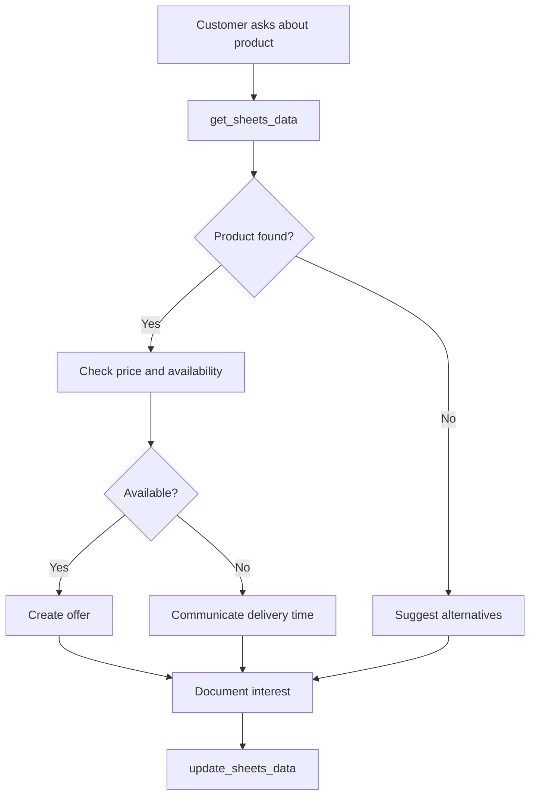

# Google Sheets Integration Template

Use Google Sheets as a simple yet powerful data source for your Mid-call Actions. Ideal for smaller teams or specialized use cases where complex CRM systems would be overkill.

## Overview & Use Cases

<CardGroup cols={2}>
  <Card title="Simple Data Management" icon="table">
    - Customer lists without complex CRM
    - Product catalogs and price lists
    - Appointment calendars and availability
    - Inventory tracking for small businesses
  </Card>
  <Card title="Collaborative Workflows" icon="users">
    - Multiple teams working on the same data set
    - Real-time updates for all stakeholders
    - Easy permission management
    - No-code approach for non-technical staff
  </Card>
</CardGroup>

## Preparation Steps

### 1. Google Cloud Console Setup

<Steps>
  <Step title="Create Project">
    - Go to the [Google Cloud Console](https://console.cloud.google.com/)
    - Create a new project or select an existing one
    - Note down the project ID
  </Step>
  
  <Step title="Enable Google Sheets API">
    - Navigate to "APIs & Services" → "Library"
    - Search for "Google Sheets API"
    - Click "Enable"
  </Step>
  
  <Step title="Create Service Account">
```yaml
Steps:
  1. "APIs & Services" → "Credentials"
  2. "+ CREATE CREDENTIALS" → "Service account"
  3. Name: "Famulor-Mid-call Actions"
  4. Role: "Editor" or "Viewer" (as needed)
  5. Download JSON key and store securely
```
  </Step>
  
  <Step title="Set Sheet Permissions">
    - Open your Google Sheet
    - Click "Share"
    - Add the service account email address
    - Set permissions to "Editor" or "Viewer"
  </Step>
</Steps>

### 2. Prepare Sheet Structure

<Tabs>
  <Tab title="Customer Data Sheet">
    ```
    | A: Email         | B: Name        | C: Phone     | D: Company    | E: Status    | F: Last Update          |
    |------------------|----------------|--------------|---------------|--------------|-------------------------|
    | max@example.com  | Max Mustermann | +49123456789 | Example GmbH  | Active       | 2024-01-15 10:30        |
    | anna@test.com    | Anna Schmidt   | +49987654321 | Test AG       | Lead         | 2024-01-14 15:22        |
    ```
  </Tab>
  
  <Tab title="Product Catalog">
    ```
    | A: Product ID | B: Name              | C: Price | D: Available | E: Category | F: Description           |
    |---------------|----------------------|----------|--------------|-------------|--------------------------|
    | PROD001       | Basic Package        | 99.00    | Yes          | Software    | Standard Features        |
    | PROD002       | Professional Package | 199.00   | Yes          | Software    | Advanced Features        |
    ```
  </Tab>
  
  <Tab title="Appointment Calendar">
    ```
    | A: Date      | B: Time  | C: Available | D: Booked By     | E: Type    | F: Notes  |
    |-------------|----------|--------------|------------------|------------|-----------|
    | 2024-01-16  | 10:00    | No           | max@example.com  | Demo       | Website   |
    | 2024-01-16  | 14:00    | Yes          |                  |            |           |
    ```
  </Tab>
</Tabs>

## Configure Data Retrieval Tool

### 1. Basic Tool Configuration

<Tabs>
  <Tab title="Tool Setup">
    | Parameter          | Value                                              |
    |--------------------|----------------------------------------------------|
    | **Function Name**   | `get_sheets_data`                                   |
    | **Description**    | "Retrieves data from Google Sheets. Use this for customer data, product info, or other structured details." |
    | **HTTP Method**     | `GET`                                              |
    | **URL**            | `https://sheets.googleapis.com/v4/spreadsheets/{sheet_id}/values/{range}` |
    | **Timeout**         | `8000ms`                                           |
  </Tab>
  
  <Tab title="Authentication">
```yaml
Authentication Type: "OAuth 2.0" or "Service Account"

Service Account (recommended):
  Headers:
    Authorization: "Bearer {access_token}"
    Content-Type: "application/json"

OAuth 2.0 (for user context):
  Headers:
    Authorization: "Bearer {user_access_token}"
    Content-Type: "application/json"
```
  </Tab>
</Tabs>

### 2. Parameter Schema for Data Query

```json
{
  "type": "object",
  "properties": {
    "sheet_id": {
      "type": "string",
      "description": "Google Sheets ID (extracted from URL)"
    },
    "range": {
      "type": "string",
      "description": "Cell range in A1 notation (e.g., 'Sheet1!A:F' or 'Customers!A2:F100')",
      "examples": ["Sheet1!A:F", "Customers!A2:F100", "Products!A1:D"]
    },
    "search_column": {
      "type": "string", 
      "description": "Column for search criterion (e.g., 'A' for email)"
    },
    "search_value": {
      "type": "string",
      "description": "Search value (e.g., customer's email address)"
    },
    "major_dimension": {
      "type": "string",
      "enum": ["ROWS", "COLUMNS"],
      "default": "ROWS",
      "description": "Data orientation in response"
    },
    "value_render_option": {
      "type": "string",
      "enum": ["FORMATTED_VALUE", "UNFORMATTED_VALUE", "FORMULA"],
      "default": "FORMATTED_VALUE",
      "description": "How values should be returned"
    }
  },
  "required": ["sheet_id", "range"]
}
```

### 3. Advanced Search Function

<AccordionGroup>
  <Accordion title="Row-Specific Search">
    **URL for filtered search**:
    ```
    https://sheets.googleapis.com/v4/spreadsheets/{sheet_id}/values/{range}
    ```
    
    **Post-processing in AI**:
    ```yaml
    Logic:
      1. Fetch all data from the range
      2. Use first row as headers
      3. Filter by email or other criteria
      4. Return matched row as structured data
    ```
  </Accordion>
  
  <Accordion title="Batch Queries">
    **URL for multiple ranges**:
    ```
    https://sheets.googleapis.com/v4/spreadsheets/{sheet_id}/values:batchGet?ranges={range1}&ranges={range2}
    ```
    
    **Usage**:
    ```yaml
    Example:
      ranges: ["Customers!A:F", "Products!A:D", "Appointments!A:F"]
      Purpose: Retrieve all relevant data in one API call
      Performance: Reduces latency for multi-table lookups
    ```
  </Accordion>
</AccordionGroup>

## Data Update Tool

### 1. Tool Configuration for Updates

<Tabs>
  <Tab title="Update Tool Setup">
    | Parameter          | Value                                            |
    |--------------------|--------------------------------------------------|
    | **Function Name**   | `update_sheets_data`                              |
    | **Description**    | "Updates data in Google Sheets based on conversation info." |
    | **HTTP Method**     | `PUT`                                            |
    | **URL**            | `https://sheets.googleapis.com/v4/spreadsheets/{sheet_id}/values/{range}` |
  </Tab>
  
  <Tab title="Request Body">
    ```json
    {
      "range": "{range}",
      "majorDimension": "ROWS",
      "values": [
        ["{value1}", "{value2}", "{value3}", "{timestamp}"]
      ],
      "valueInputOption": "USER_ENTERED"
    }
    ```
  </Tab>
</Tabs>

### 2. Parameter Schema for Updates

```json
{
  "type": "object",
  "properties": {
    "sheet_id": {
      "type": "string",
      "description": "Google Sheets ID"
    },
    "range": {
      "type": "string",
      "description": "Specific cell range for update (e.g., 'Sheet1!A2:F2')"
    },
    "values": {
      "type": "array",
      "items": {
        "type": "array",
        "items": {"type": "string"}
      },
      "description": "2D array with new values"
    },
    "value_input_option": {
      "type": "string",
      "enum": ["RAW", "USER_ENTERED"],
      "default": "USER_ENTERED",
      "description": "How input values are interpreted"
    }
  },
  "required": ["sheet_id", "range", "values"]
}
```

## Practical Implementation

### Scenario 1: Customer Service with Sheets Database

<Steps>
  <Step title="Customer Identification">
    ```yaml
    Customer: "My email is max@example.com"
    
    Tool Call:
      get_sheets_data(
        sheet_id: "1BxiMVs0XRA5nFMdKvBdBZjgmUUqptlbs74OgvE2upms",
        range: "Customers!A:F",
        search_column: "A",
        search_value: "max@example.com"
      )
    ```
  </Step>
  
  <Step title="Data Processing">
    ```yaml
    Response Processing:
      - Row with email found
      - Name: "Max Mustermann"
      - Status: "Active"
      - Last Update: "2024-01-15"
      
    AI Integration:
      "Hello Mr. Mustermann! I see you have been registered with us since January 15th."
    ```
  </Step>
  
  <Step title="Status Update">
    ```yaml
    After Conversation:
      update_sheets_data(
        range: "Customers!E2:F2",
        values: [["Contacted", "2024-01-16 14:30"]]
      )
    ```
  </Step>
</Steps>

### Scenario 2: Product Consultation with Sheets Catalog



### Response Processing

#### Typical API Response

```json
{
  "range": "Customers!A1:F3",
  "majorDimension": "ROWS",
  "values": [
    ["Email", "Name", "Phone", "Company", "Status", "Last Update"],
    ["max@example.com", "Max Mustermann", "+49123456789", "Example GmbH", "Active", "2024-01-15 10:30"],
    ["anna@test.com", "Anna Schmidt", "+49987654321", "Test AG", "Lead", "2024-01-14 15:22"]
  ]
}
```

#### AI Integration

<AccordionGroup>
  <Accordion title="Structured Data Processing">
    ```yaml
    Data Processing Logic:
      1. Use first row as header mapping
      2. Find relevant row(s) based on search criteria
      3. Create key-value pairs for natural language use
      
    Example:
      Input: ["max@example.com", "Max Mustermann", "+49123456789", "Example GmbH", "Active", "2024-01-15 10:30"]
      Output: {
        "email": "max@example.com",
        "name": "Max Mustermann", 
        "phone": "+49123456789",
        "company": "Example GmbH",
        "status": "Active",
        "last_updated": "2024-01-15 10:30"
      }
    ```
  </Accordion>
  
  <Accordion title="Natural Language Usage">
    ```yaml
    Contextualized Responses:
      Status "Active":
        "I see you are already registered with us and your account is active."
      
      Status "Lead":
        "I see you have already shown interest. How can I assist you further?"
      
      No_Data:
        "I can't find you in our system yet. I can gladly create a new entry."
      
      Outdated_Data:
        "Your last information is from {date}. Let me update that."
    ```
  </Accordion>
</AccordionGroup>

## Advanced Features

### Formulas and Calculations

<Tabs>
  <Tab title="Automatic Calculations">
    ```yaml
    Sheet formulas for Mid-call Actions:
      
      Lead Score Calculation:
        Column G: =IF(E2="Hot",100,IF(E2="Warm",60,IF(E2="Cold",20,0)))
      
      Days Since Last Contact:
        Column H: =TODAY()-F2
      
      Next Follow-up Reminder:
        Column I: =F2+7
      
    Usage in Tool:
      - Calculated values available automatically
      - No separate logic needed in Mid-call Action
      - Sheets handles business logic
    ```
  </Tab>
  
  <Tab title="Conditional Formatting">
    ```yaml
    Visual Indicators:
      High-Value Customers: Green background for deal value >10k
      Overdue Follow-ups: Red background for date < today
      New Leads: Blue background for status = "New"
    
    Tool Integration:
      - Formatting not directly available via API
      - But conditional values can be queried through formulas
      - Example: Status column with computed priority indicators
    ```
  </Tab>
</Tabs>

### Multi-Sheet Workflows

<AccordionGroup>
  <Accordion title="Referential Integrity">
    ```yaml
    Sheet Structure:
      1. Customers Sheet (Master Data):
         - Customer ID, Name, Email, Company
      
      2. Interactions Sheet (Transaction Log):
         - Date, Customer ID, Type, Details, Agent
      
      3. Products Sheet (Catalog):
         - Product ID, Name, Price, Category
      
      4. Opportunities Sheet:
         - Opportunity ID, Customer ID, Product ID, Status, Value
    
    Cross-Sheet Lookups:
      =VLOOKUP(A2,Customers!A:C,2,FALSE) // Name based on Customer ID
      =SUMIF(Opportunities!B:B,A2,Opportunities!F:F) // Total value per customer
    ```
  </Accordion>
  
  <Accordion title="Workflow Orchestration">
    ```yaml
    Complex Mid-Call Workflow:
      1. Fetch customer data from Customers Sheet
      2. Load interaction history from Interactions Sheet
      3. Display available products from Products Sheet
      4. If interested: create new opportunity in Opportunities Sheet
      5. Log interaction in Interactions Sheet
    
    Tool Chain:
      get_customer_data → get_interaction_history → get_available_products
      → create_opportunity → log_interaction
    ```
  </Accordion>
</AccordionGroup>

## Performance & Optimization

### Caching Strategies

<CardGroup cols={2}>
  <Card title="Read-Heavy Optimization" icon="download">
    **For frequently queried data**:
    - Cache for 5-10 minutes
    - Especially for product catalogs
    - Reduces API quota consumption
  </Card>
  <Card title="Write-Through Cache" icon="upload">
    **For updates**:
    - Immediate cache update
    - Asynchronous sheet updating
    - Implement consistency checks
  </Card>
</CardGroup>

### Google Sheets API Limits

| Limit Type               | Value     | Best Practice                |
|--------------------------|-----------|------------------------------|
| **Requests per 100 seconds** | 300       | Use batch operations           |
| **Requests per day**         | 50,000    | Implement caching               |
| **Concurrent requests**      | 10        | Use request pooling             |
| **Cells updated per request**| 10,000,000| Specify ranges efficiently      |

## Error Handling

### Common Error Scenarios

<Tabs>
  <Tab title="Authentication (401/403)">
    ```yaml
    Causes:
      - Service account key expired
      - Insufficient permissions on sheet
      - Sheets API not enabled
    
    Fallback:
      "Sorry, I currently cannot access our database. Could you please provide your information again?"
    
    Resolution:
      - Check service account permissions
      - Verify sheet sharing settings
      - Check API quota status
    ```
  </Tab>
  
  <Tab title="Sheet Not Found (404)">
    ```yaml
    Causes:
      - Incorrect sheet ID in configuration
      - Sheet deleted or moved
      - Range does not exist (invalid range)
    
    Graceful Fallback:
      "There seems to be an issue with our database. Let me still try to assist you."
      
    Prevention:
      - Validate sheet ID before deployment
      - Health checks for critical sheets
      - Backup sheets for emergencies
    ```
  </Tab>
  
  <Tab title="Rate Limiting (429)">
    ```yaml
    Handling:
      - Exponential backoff: 1s, 2s, 4s
      - Implement request queuing
      - Use batch updates where possible
    
    User Communication:
      "Please hold on a moment while I load your data..."
      
    Prevention:
      - Smart caching
      - Request deduplication
      - Off-peak batch processing
    ```
  </Tab>
</Tabs>

## Security & Compliance

### Data Privacy Considerations

<AccordionGroup>
  <Accordion title="GDPR Compliance">
    ```yaml
    Privacy-by-Design:
      - Minimal data collection (only necessary columns)
      - Pseudonymization where possible
      - Automatic deletion after retention period
      
    User Rights:
      - Right to Access: export functions
      - Right to Rectification: update workflows
      - Right to Erasure: delete workflows
      - Right to Portability: standard export formats
    
    Audit Trail:
      - Separate "Audit" column with change timestamps
      - Change log sheet for critical changes
      - Access logging via Google Workspace
    ```
  </Accordion>
  
  <Accordion title="Access Control">
    ```yaml
    Sheet-Level Security:
      - Service account with minimum rights
      - Sheet-specific permissions
      - Regular access reviews
    
    Data-Level Security:
      - Sensitive data in separate sheets
      - Range protection for critical areas
      - Cell-level permissions where necessary
    
    Network Security:
      - HTTPS-only for all API calls
      - IP restrictions for service accounts
      - VPN requirements for admin access
    ```
  </Accordion>
</AccordionGroup>

## Migration & Scaling

### Migrating from Sheets to CRM

<Steps>
  <Step title="Hybrid Approach">
    - Operate Sheets in parallel with CRM
    - Stepwise data migration
    - Tool configuration for both systems
  </Step>
  
  <Step title="Implement Data Sync">
    - Bidirectional sync between Sheets and CRM
    - Conflict resolution strategies
    - Data quality checks
  </Step>
  
  <Step title="Gradual Tool Migration">
    - Switch read operations to CRM first
    - Continue write operations via Sheets
    - Final switch after validation phase
  </Step>
</Steps>

---

<Card title="Advanced Integrations" icon="link">
Combine Google Sheets with other tools:

- [Webhook Automation](/en/automation-platform/mid-call-tools/integration-templates/webhook-automation) for more complex workflows
- [Zapier Integration](/en/automation-platform/integrations/zapier) for no-code automation
- [HubSpot Integration](/en/automation-platform/mid-call-tools/integration-templates/hubspot-kontakt-abruf) for CRM upgrade
</Card>

<Info>
**Performance Tip**: For teams with more than 50 daily Mid-call Action users, consider a dedicated CRM system. Google Sheets is ideal for smaller teams or specific use cases.
</Info>

<Warning>
**Backup Strategy**: Google Sheets offers automatic versioning, but implement additional backup mechanisms for business-critical data.
</Warning>