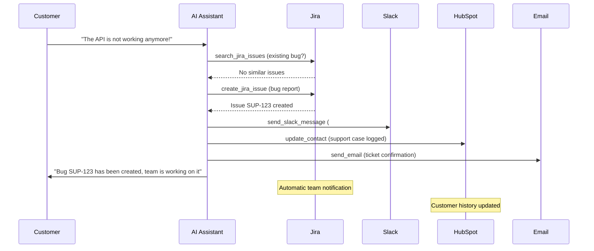

# Jira Integration Template

Integrate Jira issue tracking into your Mid-call Actions with three powerful functions: searching, updating, and creating issues. Ideal for DevOps teams, support organizations, and agile development processes.

## Overview & Features

<CardGroup cols={3}>
  <Card title="Search Issues" icon="magnifying-glass">
    - JQL-based issue search
    - Real-time status queries
    - Assignee and priority filtering
    - Custom field queries
  </Card>
  <Card title="Update Issues" icon="edit">
    - Manage status transitions
    - Comments and time tracking
    - Resolution updates
    - Field modifications
  </Card>
  <Card title="Create Issues" icon="plus">
    - Bug reports from customer reports
    - Document feature requests
    - Create support tickets
    - Incident management
  </Card>
</CardGroup>

## Jira Cloud API Setup

### 1. Setting up Jira API Access

<Steps>
  <Step title="Prepare Jira Cloud Instance">
    - Ensure you have admin rights
    - Note your Jira instance URL: `https://yourcompany.atlassian.net`
    - Instance name for API calls: `yourcompany` (without .atlassian.net)
  </Step>
  
  <Step title="Create API Token">
    ```yaml
    Token Generation:
      1. Account Settings → "Security" → "API tokens"
      2. Click "Create API token"
      3. Label: "Famulor Mid-Call Integration"
      4. Copy token (shown only once!)
      5. Store securely for configuration
    ```
  </Step>
  
  <Step title="Create Basic Auth String">
    ```yaml
    Authentication Setup:
      Format: "email:api_token"
      Example: "admin@company.com:ATATT3xFfGF0T5..."
      
    Base64 Encoding:
      echo -n "admin@company.com:ATATT3xFfGF0T5..." | base64
      
    Result: "YWRtaW5AY29tcGFueS5jb206QVRBVFQzeEZmR0YwVDUuLi4="
    ```
  </Step>
  
  <Step title="Identify Project Keys">
    - Navigate to your Jira projects
    - Note project keys (e.g., "PROJ", "SUP", "DEV")
    - Document issue types per project
    - Analyze custom fields and workflows
  </Step>
</Steps>

## Tool 1: Search Issues

### Configuration in Famulor Interface

<Tabs>
  <Tab title="Tool Details">
    | Field | Value |
    |------|------|
    | **Name*** | `Jira Issues suchen` |
    | **Description** | "Searches issues using JQL (Jira Query Language) for status updates and tracking" |
    | **Function Name*** | `search_jira_issues` |
    | **Function Description*** | "Searches Jira with JQL. Use this to check the status of bug reports, feature requests, or support tickets." |
    | **HTTP Method** | `GET` |
    | **Timeout (ms)** | `5000` |
    | **Endpoint*** | `https://{{JIRA_INSTANCE}}.atlassian.net/rest/api/3/search` |
  </Tab>
  
  <Tab title="Header Configuration">
    ```json
    {
      "Authorization": "Basic {{JIRA_AUTH}}",
      "Content-Type": "application/json",
      "User-Agent": "Famulor-MidCall-Jira/1.0"
    }
    ```
  </Tab>
  
  <Tab title="Query Parameters">
    ```json
    {
      "jql": "{jql_query}",
      "maxResults": "{max_results}",
      "fields": "summary,status,assignee,priority,created,updated,resolution,description"
    }
    ```
  </Tab>
</Tabs>

### Parameter Schema for Issue Search

```json
{
  "type": "object",
  "properties": {
    "jql_query": {
      "type": "string",
      "description": "JQL query for issue search",
      "examples": [
        "assignee = currentUser() AND status != Done",
        "project = SUP AND status = 'In Progress'",
        "summary ~ 'API' AND created >= -7d",
        "reporter = 'customer@example.com'"
      ]
    },
    "max_results": {
      "type": "integer",
      "description": "Maximum number of returned issues",
      "default": 10,
      "minimum": 1,
      "maximum": 100
    }
  },
  "required": ["jql_query"]
}
```

### Response Mapping

```json
{
  "issues": "issues",
  "total": "total"
}
```

## Tool 2: Update Issue

### Configuration in Famulor Interface

<Tabs>
  <Tab title="Tool Details">
    | Field | Value |
    |------|------|
    | **Name*** | `Jira Issue aktualisieren` |
    | **Description** | "Updates status or details of an existing Jira issue" |
    | **Function Name*** | `update_jira_issue` |
    | **Function Description*** | "Updates a Jira issue. Use this to change status, add comments, or update issue details." |
    | **HTTP Method** | `PUT` |
    | **Timeout (ms)** | `5000` |
    | **Endpoint*** | `https://{{JIRA_INSTANCE}}.atlassian.net/rest/api/3/issue/{issue_key}` |
  </Tab>
  
  <Tab title="Request Body Template">
    ```json
    {
      "fields": {
        "status": {
          "name": "{status}"
        },
        "resolution": {
          "name": "{resolution}"
        },
        "assignee": {
          "accountId": "{assignee_id}"
        },
        "priority": {
          "name": "{priority}"
        },
        "timetracking": {
          "originalEstimate": "{estimate}",
          "remainingEstimate": "{remaining}"
        }
      },
      "update": {
        "comment": [
          {
            "add": {
              "body": {
                "type": "doc",
                "version": 1,
                "content": [
                  {
                    "type": "paragraph",
                    "content": [
                      {
                        "type": "text",
                        "text": "{comment}"
                      }
                    ]
                  }
                ]
              }
            }
          }
        ]
      }
    }
    ```
  </Tab>
</Tabs>

### Parameter Schema for Issue Updates

```json
{
  "type": "object", 
  "properties": {
    "issue_key": {
      "type": "string",
      "description": "Jira issue key (e.g., 'PROJ-123', 'SUP-456')",
      "pattern": "^[A-Z]+-[0-9]+$"
    },
    "status": {
      "type": "string",
      "enum": ["To Do", "In Progress", "Code Review", "Testing", "Done", "Closed"],
      "description": "New issue status"
    },
    "resolution": {
      "type": "string",
      "enum": ["Fixed", "Won't Fix", "Duplicate", "Cannot Reproduce", "Won't Do"],
      "description": "Resolution status (optional)"
    },
    "comment": {
      "type": "string",
      "description": "Comment on the update (e.g., conversation context, solution details)"
    },
    "priority": {
      "type": "string",
      "enum": ["Highest", "High", "Medium", "Low", "Lowest"],
      "description": "New priority (optional)"
    },
    "assignee_id": {
      "type": "string",
      "description": "Jira account ID of the new assignee (optional)"
    },
    "estimate": {
      "type": "string",
      "description": "Time estimate (e.g., '2h', '1d', '3w')",
      "examples": ["30m", "2h", "1d", "2w"]
    },
    "remaining": {
      "type": "string",
      "description": "Remaining time (e.g., '1h', '30m')"
    }
  },
  "required": ["issue_key"]
}
```

## Tool 3: Create Issue

### Configuration in Famulor Interface

<Tabs>
  <Tab title="Tool Details">
    | Field | Value |
    |------|------|
    | **Name*** | `Jira Issue erstellen` |
    | **Description** | "Creates a new issue (bug, task, story) in Jira based on customer input" |
    | **Function Name*** | `create_jira_issue` |
    | **Function Description*** | "Creates a new Jira issue. Use this for bug reports from customer messages, feature requests, or support tickets." |
    | **HTTP Method** | `POST` |
    | **Timeout (ms)** | `5000` |
    | **Endpoint*** | `https://{{JIRA_INSTANCE}}.atlassian.net/rest/api/3/issue` |
  </Tab>
  
  <Tab title="Request Body Template">
    ```json
    {
      "fields": {
        "project": {
          "key": "{project_key}"
        },
        "issuetype": {
          "name": "{issue_type}"
        },
        "summary": "{summary}",
        "description": {
          "type": "doc",
          "version": 1,
          "content": [
            {
              "type": "paragraph",
              "content": [
                {
                  "type": "text",
                  "text": "{description}"
                }
              ]
            }
          ]
        },
        "priority": {
          "name": "{priority}"
        },
        "assignee": {
          "accountId": "{assignee_id}"
        },
        "labels": "{labels}",
        "components": [
          {
            "name": "{component}"
          }
        ],
        "customfield_10001": "{customer_name}",
        "customfield_10002": "{phone_number}"
      }
    }
    ```
  </Tab>
</Tabs>

### Parameter Schema for Issue Creation

```json
{
  "type": "object",
  "properties": {
    "project_key": {
      "type": "string",
      "description": "Jira project key (e.g., 'SUP' for Support, 'DEV' for Development)",
      "examples": ["SUP", "DEV", "PROJ", "BUG"]
    },
    "issue_type": {
      "type": "string",
      "enum": ["Bug", "Task", "Story", "Epic", "Incident", "Support Request"],
      "description": "Type of the issue to create"
    },
    "summary": {
      "type": "string",
      "description": "Short, concise summary of the issue",
      "examples": ["API Gateway error on login", "Feature Request: Excel Export", "Customer Report: performance issue"]
    },
    "description": {
      "type": "string",
      "description": "Detailed description with context from the conversation"
    },
    "priority": {
      "type": "string", 
      "enum": ["Highest", "High", "Medium", "Low", "Lowest"],
      "description": "Priority based on customer impact",
      "default": "Medium"
    },
    "assignee_id": {
      "type": "string",
      "description": "Jira account ID of the responsible person (optional)"
    },
    "labels": {
      "type": "array",
      "items": {"type": "string"},
      "description": "Labels for categorization",
      "examples": [["customer-reported", "mid-call"], ["feature-request", "high-priority"], ["bug", "production"]]
    },
    "component": {
      "type": "string",
      "description": "Jira component (e.g., 'API', 'Frontend', 'Backend')",
      "examples": ["API", "Frontend", "Backend", "Database", "Security"]
    },
    "customer_name": {
      "type": "string",
      "description": "Name of reporting customer (Custom Field)"
    },
    "phone_number": {
      "type": "string", 
      "description": "Phone number for follow-up (Custom Field)"
    }
  },
  "required": ["project_key", "issue_type", "summary", "description"]
}
```

## Practical Use Cases

### Scenario 1: Bug Report from Customer Call

<Steps>
  <Step title="Problem Identification">
    ```yaml
    Customer reports problem:
      "Since this morning, I can't log in anymore.
       The page just keeps loading."
      
    AI Analysis:
      - Issue: login failure
      - Time frame: since this morning  
      - Impact: customer cannot use the system
      - Urgency: high (business-critical)
    ```
  </Step>
  
  <Step title="Automatic Bug Creation">
    ```yaml
    create_jira_issue parameters:
      project_key: "BUG"
      issue_type: "Bug"
      summary: "Login error: page does not load - Customer Max Mustermann"
      description: "## Problem
                   Customer cannot log in since this morning.
                   
                   ## Symptoms
                   - Login page does not fully load
                   - Error message: none specific
                   - Browsers: tested across various browsers
                   
                   ## Customer Details
                   - Name: Max Mustermann
                   - Company: Beispiel AG
                   - Phone: +49 123 456789
                   - Reported time: 15.01.2024 09:00
                   
                   ## Business Impact
                   - Production system unavailable
                   - Revenue impact: high
                   - Customer tier: enterprise
                   
                   ## Next Steps
                   1. Immediate technical analysis
                   2. Customer update within 1 hour
                   3. Provide workaround"
      priority: "High"
      labels: ["customer-reported", "login-issue", "production"]
      component: "Authentication"
      customer_name: "Max Mustermann (Beispiel AG)"
    ```
  </Step>
</Steps>

### Scenario 2: Feature Request Management

<AccordionGroup>
  <Accordion title="Customer Feature Request">
    ```yaml
    Feature request workflow:
      
    Customer: "Could you add an integration to Salesforce?"
    
    AI: "That's a great idea! Documenting this as a feature request..."
    
    create_jira_issue:
      project_key: "FEAT"
      issue_type: "Story"
      summary: "Feature Request: Salesforce Integration"
      description: "## Customer Request
                   Integration with Salesforce CRM for bidirectional data sync.
                   
                   ## Business Case
                   - Customer: Beispiel AG (enterprise client)
                   - Current Pain: manual data transfer
                   - Expected Benefit: 40h/month time savings
                   - Revenue impact: critical for customer retention
                   
                   ## Technical Requirements
                   - Bidirectional sync (contacts, deals, activities)
                   - Real-time or batch updates  
                   - Field mapping configuration
                   - Error handling and conflict resolution
                   
                   ## Acceptance Criteria
                   - [ ] Salesforce OAuth integration
                   - [ ] Contact sync implemented
                   - [ ] Deal sync implemented
                   - [ ] Admin UI for field mapping"
      priority: "High"
      labels: ["feature-request", "integration", "customer-driven"]
      assignee_id: "product-manager-account-id"
    ```
  </Accordion>
  
  <Accordion title="Competitive Feature Tracking">
    ```yaml
    Competitive intelligence:
      
    Customer: "Competitor XY has feature Z – do you have it as well?"
    
    Issue creation:
      issue_type: "Epic"
      summary: "Competitive Analysis: Feature Z Implementation"
      labels: ["competitive", "feature-gap", "market-research"]
      
    Linked issues:
      - Research task: competitive analysis
      - Technical task: feasibility study  
      - Business task: ROI calculation
      - Product task: roadmap integration
    ```
  </Accordion>
</AccordionGroup>

## JQL Templates for Common Queries

### Predefined JQL Queries

<AccordionGroup>
  <Accordion title="Customer-related Queries">
    ```yaml
    Customer issue lookup:
      "customfield_10001 ~ '{customer_name}' ORDER BY created DESC"
      
    Open issues for customer:
      "customfield_10001 ~ '{customer_name}' AND status != Done"
      
    Recent customer issues:
      "customfield_10001 ~ '{customer_name}' AND created >= -30d"
      
    Critical customer issues:
      "customfield_10001 ~ '{customer_name}' AND priority = Highest"
    ```
  </Accordion>
  
  <Accordion title="Team Management Queries">
    ```yaml
    Team workload queries:
      
    Overdue issues:
      "assignee = currentUser() AND due <= now() AND status != Done"
      
    To do today:
      "assignee = currentUser() AND due <= endOfDay() AND status != Done"
      
    High priority backlog:
      "project = DEV AND priority >= High AND status = 'To Do'"
      
    Review required:
      "status = 'Code Review' AND assignee = currentUser()"
    ```
  </Accordion>
  
  <Accordion title="Monitoring & Analytics">
    ```yaml
    Performance tracking queries:
      
    Bug rate last week:
      "issuetype = Bug AND created >= -7d"
      
    Feature completion rate:
      "issuetype = Story AND resolved >= -30d"
      
    Customer satisfaction issues:
      "labels = customer-escalation AND created >= -7d"
      
    SLA violations:
      "priority = Highest AND created <= -4h AND status != Done"
    ```
  </Accordion>
</AccordionGroup>

## Response Handling & Integration

### Issue Search Response

```json
{
  "total": 3,
  "maxResults": 10,
  "issues": [
    {
      "key": "SUP-123",
      "fields": {
        "summary": "API Gateway timeout issues",
        "status": {
          "name": "In Progress",
          "statusColor": "blue"
        },
        "assignee": {
          "displayName": "Tech Support Team",
          "accountId": "abc123def456"
        },
        "priority": {
          "name": "High",
          "iconUrl": "https://..."
        },
        "created": "2024-01-15T08:30:00.000+0000",
        "updated": "2024-01-15T10:15:00.000+0000"
      }
    }
  ]
}
```

### Natural Language Integration

<Tabs>
  <Tab title="Issue Search Integration">
    **Agent messages**:
    ```yaml
    Before search: "Searching Jira..."
    
    Successful search:
      "{{total}} issues found. Top results: 
       {{#each issues}}{{this.key}}: {{this.fields.summary}} ({{this.fields.status.name}}){{/each}}"
    
    Example:
      "3 issues found. Top results:
       SUP-123: API Gateway timeout issues (In Progress)
       SUP-124: Login issues frontend (To Do)
       SUP-125: Performance optimization (Code Review)"
    ```
  </Tab>
  
  <Tab title="Issue Update Integration">
    **Update confirmations**:
    ```yaml
    Template: "Issue {{issue_key}} has been updated{{#if status}} - status: {{status}}{{/if}}"
    
    Examples:
      "Issue SUP-123 has been updated - status: Done"
      "Bug PROJ-456 has been set to high priority"
      "Feature DEV-789 has been assigned to the frontend team"
    ```
  </Tab>
  
  <Tab title="Issue Creation Integration">
    ```yaml
    Pre-action: "Creating {{issue_type}} in Jira..."
    
    Success: "Issue {{issueKey}} created: {{summary}}"
    
    With follow-up:
      "Bug report SUP-567 has been created.
       The support team will address the issue within 4 hours."
    
    With customer context:
      "Your issue has been recorded as SUP-567.
       You will receive updates on its progress."
    ```
  </Tab>
</Tabs>

## Integration with Other Mid-call Actions

### Multi-System Workflow



## Performance & Monitoring

### Jira Integration KPIs

| Metric | Description | Target |
|--------|-------------|--------|
| **Issue Creation Success Rate** | % of successfully created issues | &gt;99% |
| **Search Query Performance** | Average JQL response time | &lt;2 seconds |
| **Update Success Rate** | % of successful issue updates | &gt;98% |
| **Customer Issue Resolution** | Average resolution time for customer issues | &lt;4 hours |

### Business Impact Analytics

<Steps>
  <Step title="Customer Satisfaction Tracking">
    ```yaml
    Customer issue metrics:
      - Time-to-issue-creation (call → Jira)
      - Time-to-first-response (issue → dev action)
      - Time-to-resolution (issue → closed)
      - Customer communication frequency
    ```
  </Step>
  
  <Step title="Development Efficiency">
    ```yaml
    Development KPIs:
      - Customer-reported vs. internally found bugs ratio
      - Feature request to implementation conversion
      - Bug fix rate improvement through better documentation
      - Developer productivity impact
    ```
  </Step>
</Steps>

## Error Handling

### Common Jira API Issues

<AccordionGroup>
  <Accordion title="Authentication Error (401)">
    ```yaml
    Cause: API token invalid or Basic auth incorrect
    
    Jira response:
      "errorMessages": ["You do not have the permission to see the specified issue."]
    
    Fallback:
      "Cannot access Jira. Documenting the issue for manual handling by tech team."
    
    Resolution:
      - Regenerate API token
      - Validate Basic auth string
      - Check user permissions
    ```
  </Accordion>
  
  <Accordion title="Project Not Found (404)">
    ```yaml
    Cause: project key does not exist or no access
    
    Graceful handling:
      "The specified project is not available.
       Creating the issue in the default support project."
    
    Fallback logic:
      - Use default project
      - Change issue type to "Task"
      - Admin notification for config error
    ```
  </Accordion>
  
  <Accordion title="Invalid JQL (400)">
    ```yaml
    Cause: JQL syntax error or invalid field names
    
    Common JQL errors:
      - Typos in field names
      - Invalid operators
      - Incorrect string escaping
      - Non-existent values
    
    Error recovery:
      - Fallback to simpler JQL query
      - Text-based search as alternative
      - User-friendly error message
    ```
  </Accordion>
</AccordionGroup>

## Advanced Features

### Custom Fields & Workflows

<AccordionGroup>
  <Accordion title="Customer-specific Custom Fields">
    ```yaml
    Custom field configuration:
      
    Customer information:
      customfield_10001: "Customer Name" (text)
      customfield_10002: "Customer Phone" (text)
      customfield_10003: "Customer Email" (text)
      customfield_10004: "Customer Tier" (select: Basic/Pro/Enterprise)
      
    Business context:
      customfield_10005: "Revenue Impact" (select: Low/Medium/High)
      customfield_10006: "Urgency Level" (select: 1-5)
      customfield_10007: "Call Source" (text: "Mid-call Action")
      customfield_10008: "Resolution Deadline" (date/time)
    ```
  </Accordion>
  
  <Accordion title="Workflow Automation">
    ```yaml
    Jira workflow rules:
      
    Customer issue workflow:
      If Customer Tier = "Enterprise":
        → status automatically set to "High Priority"
        → assignee: Senior Support Engineer
        → SLA: 2 hours first response
      
    Mid-call issue workflow:
      If labels contain "mid-call":
        → priority at least "High"
        → immediate assignee notification
        → customer update within 1 hour
      
    Escalation rules:
      If priority = "Highest" AND open for 4h:
        → auto-assign to manager
        → customer notification
        → executive escalation
    ```
  </Accordion>
</AccordionGroup>

### Advanced JQL Patterns

<Tabs>
  <Tab title="Complex Customer Queries">
    ```sql
    -- Issues for specific customer with status filter
    customfield_10001 ~ "Beispiel AG" AND status IN ("To Do", "In Progress") ORDER BY priority DESC
    
    -- Overdue customer issues
    customfield_10001 IS NOT EMPTY AND due <= now() AND status != Done
    
    -- High impact customer issues
    customfield_10005 = "High" AND customfield_10001 IS NOT EMPTY
    
    -- Issues from recent mid-call sessions
    labels = "mid-call" AND created >= -24h
    ```
  </Tab>
  
  <Tab title="Team Performance Queries">
    ```sql
    -- Team workload balance
    assignee IN (team-member-1, team-member-2) AND status != Done
    
    -- Sprint planning queries
    project = DEV AND fixVersion = "Sprint 23" AND status IN ("To Do", "In Progress")
    
    -- Bug vs. feature ratio  
    project = DEV AND created >= startOfMonth() AND issuetype IN (Bug, Story)
    
    -- Customer escalation tracking
    priority = Highest AND labels IN ("customer-escalation", "mid-call")
    ```
  </Tab>
</Tabs>

---

<Warning>
**Jira Permissions**: Make sure the API user has permissions for all relevant projects and can read/write custom fields. Regularly review workflow permissions.
</Warning>

<Info>
**JQL Performance Tip**: Use specific project keys and date ranges in JQL queries to optimize performance. Avoid very broad searches without filters.
</Info>
