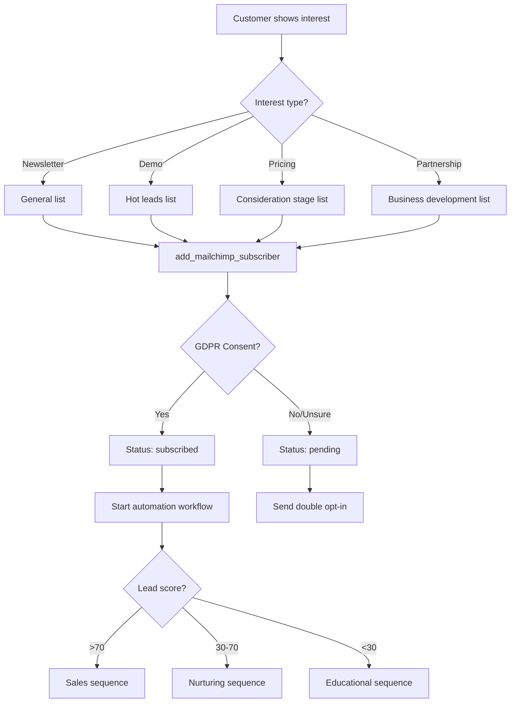
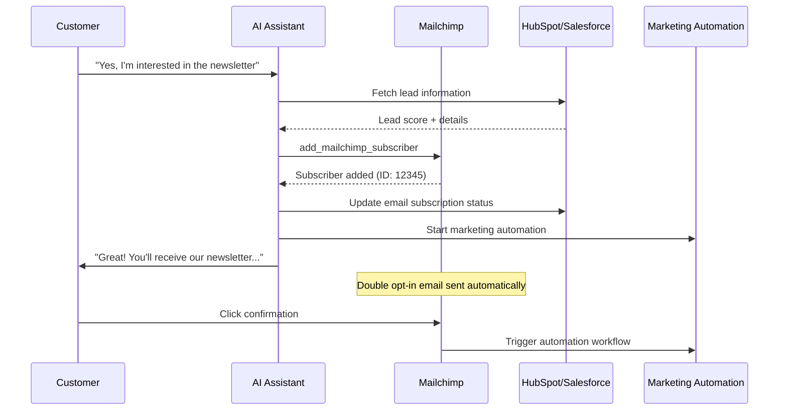

# Mailchimp Integration Template

Integrate Mailchimp subscriber management into your mid-call actions and enable your AI assistant to automatically add interested leads to marketing lists and trigger marketing automation workflows during client conversations.

## Overview & Features

<CardGroup cols={2}>
  <Card title="Automatic List Building" icon="users">
    - Instantly add prospects to Mailchimp lists  
    - Intelligent list segmentation based on conversations  
    - Tag-based categorization for targeted marketing  
    - Double opt-in compliance and GDPR adherence  
  </Card>
  <Card title="Marketing Automation Triggers" icon="magic">
    - Automatic triggering of email sequences  
    - Behavior-based marketing workflows  
    - Lead scoring integration  
    - Multi-channel marketing orchestration  
  </Card>
</CardGroup>

## Mailchimp API & Audience Setup

### 1. Set Up Mailchimp API Access

<Steps>
  <Step title="Prepare Mailchimp Account">
    - Log in to Mailchimp or create an account  
    - Navigate to "Account" → "Extras" → "API keys"  
    - Note your datacenter (e.g., "us6", "eu1") from the login URL  
  </Step>
  
  <Step title="Generate API Key">
    ```yaml
    API Key Creation:
      1. Click "Create A Key"
      2. Key Name: "Famulor Mid-Call Integration"
      3. Copy the API key (format: abc123def456-us6)
      4. Note the datacenter code (last part after the hyphen)
    ```
  </Step>
  
  <Step title="Prepare Audience (List)">
    ```yaml
    List Setup:
      1. Go to "Audience" → "All contacts"
      2. "Settings" → "Audience name and defaults"
      3. Copy the List ID (needed for API calls)
      4. Configure Merge Fields:
         - FNAME (First Name)
         - LNAME (Last Name)
         - COMPANY (Company Name)
         - PHONE (Phone Number)
    ```
  </Step>
  
  <Step title="Define Tags and Segments">
    - Tags for various lead sources: "mid-call-lead", "phone-inquiry"  
    - Segments for automation: "Hot Leads", "Demo Requests"  
    - Custom fields for call metadata  
  </Step>
</Steps>

## Configure Mid-call Action

### Configuration in Famulor Interface

<Tabs>
  <Tab title="Tool Details">
    | Field | Value |
    |-------|-------|
    | **Name*** | `Mailchimp Subscriber hinzufügen` |
    | **Description** | "Automatically adds new subscribers to Mailchimp lists for marketing automation and lead nurturing" |
    | **Function Name*** | `add_mailchimp_subscriber` |
    | **Function Description*** | "Adds a subscriber to a Mailchimp list. Use this when a client shows interest in updates, newsletters, or further information." |
    | **HTTP Method** | `POST` |
    | **Timeout (ms)** | `5000` |
    | **Endpoint*** | `https://{{MAILCHIMP_DC}}.api.mailchimp.com/3.0/lists/{list_id}/members` |
  </Tab>
  
  <Tab title="Header Configuration">
    ```json
    {
      "Authorization": "Bearer {{MAILCHIMP_API_KEY}}",
      "Content-Type": "application/json",
      "User-Agent": "Famulor-MidCall-Mailchimp/1.0"
    }
    ```
    
    <Info>**Datacenter variable**: `{{MAILCHIMP_DC}}` should be replaced with your datacenter (e.g., "us6", "eu1")</Info>
  </Tab>
  
  <Tab title="Request Body Template">
    ```json
    {
      "email_address": "{email}",
      "status": "{status}",
      "merge_fields": {
        "FNAME": "{first_name}",
        "LNAME": "{last_name}",
        "COMPANY": "{company_name}",
        "PHONE": "{phone_number}"
      },
      "interests": {
        "{interest_id_1}": true,
        "{interest_id_2}": false
      },
      "tags": "{tags}",
      "location": {
        "latitude": "{latitude}",
        "longitude": "{longitude}"
      },
      "marketing_permissions": [
        {
          "marketing_permission_id": "{permission_id}",
          "enabled": true
        }
      ]
    }
    ```
  </Tab>
</Tabs>

### Parameter Schema

```json
{
  "type": "object",
  "properties": {
    "list_id": {
      "type": "string",
      "description": "Mailchimp Audience/List ID (e.g., 'abc123def4')"
    },
    "email": {
      "type": "string",
      "format": "email",
      "description": "Subscriber's email address"
    },
    "status": {
      "type": "string",
      "enum": ["subscribed", "unsubscribed", "pending"],
      "description": "Subscription status",
      "default": "pending"
    },
    "first_name": {
      "type": "string",
      "description": "Subscriber's first name"
    },
    "last_name": {
      "type": "string", 
      "description": "Subscriber's last name"
    },
    "company_name": {
      "type": "string",
      "description": "Company name (optional for B2B marketing)"
    },
    "phone_number": {
      "type": "string",
      "description": "Phone number (optional)"
    },
    "tags": {
      "type": "array",
      "items": {"type": "string"},
      "description": "Tags for segmentation and automation",
      "examples": [["mid-call-lead", "demo-interest"], ["hot-prospect", "enterprise"]]
    },
    "interest_groups": {
      "type": "array",
      "items": {"type": "string"},
      "description": "Interest group IDs for precise targeting"
    },
    "opt_in_confirmed": {
      "type": "boolean",
      "description": "Has the customer explicitly consented?",
      "default": true
    }
  },
  "required": ["list_id", "email", "status"]
}
```

## Practical Use Cases

### Scenario 1: Newsletter Signup During Call

<Steps>
  <Step title="Interest Detection">
    ```yaml
    Customer expresses interest:
      "Can you keep me informed about new features?"
      "Is there a newsletter?"
      "Please send me updates about..."
      
    AI response:
      "Sure! I'll add you to our newsletter. 
       You'll then receive regular updates about..."
    ```
  </Step>
  
  <Step title="GDPR-compliant Consent">
    ```yaml
    Consent dialog:
      "Is it okay if I add you to our newsletter? 
       You will receive updates about new features about once a week 
       and can unsubscribe at any time."
    
    Only with explicit consent:
      → add_mailchimp_subscriber(status: "subscribed")
    
    If unsure:
      → add_mailchimp_subscriber(status: "pending")
      → Double opt-in email is sent automatically
    ```
  </Step>
</Steps>

### Scenario 2: Lead Segmentation

<AccordionGroup>
  <Accordion title="Automatic Tag Generation">
    ```yaml
    Conversation-based tag logic:
      
    Company size:
      "Startup" → Tags: ["small-business", "growth-stage"]
      "SME" → Tags: ["smb", "established"]  
      "Enterprise" → Tags: ["enterprise", "large-scale"]
      
    Interest level:
      Demo requested → Tags: ["demo-interest", "hot-lead"]
      Asked about pricing → Tags: ["pricing-interest", "consideration-stage"]
      Mentioned competitor → Tags: ["competitive-situation", "decision-stage"]
      
    Industry:
      "E-Commerce" → Tags: ["ecommerce", "online-retail"]
      "Healthcare" → Tags: ["healthcare", "medical"]
      "Finance" → Tags: ["fintech", "financial-services"]
    ```
  </Accordion>
  
  <Accordion title="Interest Groups Assignment">
    ```yaml
    Mailchimp interest groups:
      
    Product categories:
      - Basic Features: For small businesses
      - Advanced Features: For growing companies
      - Enterprise Features: For large organizations
      
    Content preferences:
      - Technical Updates: Developers and IT teams
      - Business Updates: Management and decision makers
      - Industry News: Sector-specific insights
      
    Automatic assignment:
      If job title == "CTO" → Technical Updates
      If job title == "CEO" → Business Updates
      If industry == "Healthcare" → Industry News: Healthcare
    ```
  </Accordion>
</AccordionGroup>

### Scenario 3: Marketing Automation Trigger



## Response Handling

### Successful Subscriber Addition

```json
{
  "id": "abc123def456ghi789",
  "email_address": "max@beispiel.de",
  "unique_email_id": "abc123def456",
  "web_id": 123456,
  "email_type": "html",
  "status": "pending",
  "merge_fields": {
    "FNAME": "Max",
    "LNAME": "Mustermann", 
    "COMPANY": "Beispiel GmbH",
    "PHONE": "+49123456789"
  },
  "interests": {
    "abc123": true,
    "def456": false
  },
  "stats": {
    "avg_open_rate": 0,
    "avg_click_rate": 0
  },
  "ip_signup": "192.168.1.1",
  "timestamp_signup": "2024-01-15T10:30:00+00:00",
  "list_id": "abc123def4",
  "tags": [
    {"id": 123, "name": "mid-call-lead"},
    {"id": 456, "name": "demo-interest"}
  ]
}
```

### Natural Language Integration

<AccordionGroup>
  <Accordion title="Agent Messages Before API Call">
    **Template**: `"I'm adding {{email}} to the Mailchimp list..."`
    
    **Contextual examples**:
    ```yaml
    Newsletter signup:
      "Great! I'll add you to our newsletter..."
    
    Demo interest:
      "I'll add you to our demo list so you don't miss any updates..."
    
    Product updates:
      "You'll now receive all new feature announcements..."
    ```
  </Accordion>
  
  <Accordion title="Success Confirmations">
    **Standard template**: `"Subscriber was added successfully."`
    
    **Status-specific confirmations**:
    ```yaml
    Status "subscribed":
      "You're now subscribed to our newsletter and will receive the next issue automatically."
    
    Status "pending":
      "You will shortly receive a confirmation email. 
       Please click the confirmation link."
    
    With automation trigger:
      "Welcome! You'll receive a welcome email with initial information within the next few minutes."
    ```
  </Accordion>
</AccordionGroup>

## Advanced Marketing Features

### Segment-based List Assignment

<AccordionGroup>
  <Accordion title="Intelligent List Selection">
    ```yaml
    List routing based on conversation context:
      
    Lead score > 80:
      List: "Hot Prospects" 
      Tags: ["hot-lead", "high-priority"]
      Automation: Sales-ready sequence
      
    Demo requested:
      List: "Demo Requests"
      Tags: ["demo-interest", "product-evaluation"] 
      Automation: Demo preparation sequence
      
    Asked about pricing:
      List: "Pricing Interested"
      Tags: ["pricing-stage", "consideration"]
      Automation: ROI calculator sequence
      
    Newsletter interest:
      List: "General Newsletter"
      Tags: ["newsletter", "general-interest"]
      Automation: Welcome series
    ```
  </Accordion>
  
  <Accordion title="Custom Merge Fields">
    ```yaml
    Advanced personalization:
      LEADSCORE: Calculated lead score (0-100)
      CALLDATE: Date of conversation
      CALLTYPE: Type of conversation (Sales/Support/Info)
      PAINPOINTS: Identified challenges
      BUDGET: Mentioned budget range
      TIMELINE: Purchase timeline
      INDUSTRY: Industry classification
      COMPANYSIZE: Company size
      
    Usage in emails:
      "Hello {{FNAME}}, based on our conversation on {{CALLDATE}} 
       about {{PAINPOINTS}} we have some solutions for {{COMPANY}}..."
    ```
  </Accordion>
</AccordionGroup>

### Marketing Automation Integration

<Tabs>
  <Tab title="Automation Workflows">
    ```yaml
    Lead nurturing automation:
      Trigger: Tag "mid-call-lead" added
      
      Email 1 (immediately): Welcome + call summary
      Email 2 (+2 hours): Relevant case studies
      Email 3 (+24 hours): Personalized product demo
      Email 4 (+3 days): Social proof + testimonials
      Email 5 (+1 week): Special offer or consultation appointment
    
    Conditions:
      - Stop on opening sales email
      - Stop on website demo request
      - Escalate on high engagement score
    ```
  </Tab>
  
  <Tab title="Behavioral Triggers">
    ```yaml
    Mailchimp e-commerce integration:
      
    Website activity tracking:
      - Pricing page visits → Tag: "pricing-interested"
      - Feature page views → Tag: "feature-research"
      - Competitor comparisons → Tag: "decision-stage"
      
    Email engagement:
      - High open rate → Upgrade to "Engaged" list
      - Click-through → "Active Interest" tag
      - Forward rate → "Influencer" tag
    ```
  </Tab>
</Tabs>

## Integration with Other Tools

### CRM Synchronization



## Error Handling & Compliance

### Common API Errors

<AccordionGroup>
  <Accordion title="Member Already Exists (400)">
    ```yaml
    Mailchimp response:
      "title": "Member Exists"
      "detail": "max@beispiel.de is already a list member"
    
    Smart handling:
      1. Check member status
      2. If "unsubscribed" → update to "pending"
      3. If "subscribed" → update tags/interests
      4. If "pending" → resend confirmation email
    
    Inform customer:
      "You are already in our system. I am updating your preferences 
       based on our conversation."
    ```
  </Accordion>
  
  <Accordion title="Invalid Email (400)">
    ```yaml
    Causes:
      - Invalid email format
      - Disposable/temporary email address
      - Domain on blacklist
    
    Fallback strategy:
      "The email address seems invalid. 
       Could you provide an alternative email address?"
    
    Validation:
      - Check email format before API call
      - Detect disposable emails
      - Check domain reputation
    ```
  </Accordion>
  
  <Accordion title="API Quota Exceeded (429)">
    ```yaml
    Mailchimp rate limits:
      - 10 simultaneous connections
      - Max 10,000 requests per hour
      - Burst limits for short spikes
    
    Retry logic:
      - Exponential backoff
      - Max 3 retries
      - Fallback to manual list
    
    Graceful degradation:
      "Newsletter signup is being processed. 
       You will receive confirmation within the next few minutes."
    ```
  </Accordion>
</AccordionGroup>

### GDPR & Data Protection

<Steps>
  <Step title="Document Consent">
    ```yaml
    Consent tracking:
      - Timestamp of consent
      - Document conversation context  
      - IP address for audit trail
      - Opt-in method ("phone-call-consent")
    ```
  </Step>
  
  <Step title="Data Minimization">
    ```yaml
    Collect only necessary data:
      - Email (required)
      - Name (for personalization)
      - Interest area (for relevance)
      
    Avoid:
      - Sensitive personal data
      - Unnecessary demographic info
      - Business data without relevance
    ```
  </Step>
  
  <Step title="Retention Management">
    ```yaml
    Automatic cleansing:
      - Inactive subscribers after 2 years
      - Bounced emails after 6 months
      - Unengaged contacts after 1 year
      
    Right to deletion:
      - API endpoint for deletion requests
      - Compliance dashboard for requests
      - Audit log of all deletions
    ```
  </Step>
</Steps>

## Performance & Analytics

### Marketing KPIs

| Metric | Description | Target |
|--------|-------------|--------|
| **Subscription Success Rate** | % of successful signups | &gt;95% |
| **Double Opt-In Conversion** | % confirmations for pending status | &gt;60% |
| **List Growth Rate** | Monthly list growth | &gt;15% |
| **Engagement Rate** | Average open/click rates | &gt;25%/5% |
| **Churn Rate** | Monthly unsubscribe rate | &lt;2% |

### ROI Tracking

<Steps>
  <Step title="Attribution Modeling">
    ```yaml
    Revenue attribution:
      Mid-call subscription → Email engagement → Demo request → Deal
      
    Tracking chain:
      1. UTM parameters in emails
      2. Landing page conversion tracking
      3. CRM lead attribution
      4. Closed deal revenue attribution
    ```
  </Step>
  
  <Step title="Campaign Performance">
    ```yaml
    A/B testing metrics:
      - Subject line performance
      - Template conversion rates  
      - Send time optimization
      - Audience segment effectiveness
    ```
  </Step>
</Steps>

---

<Warning>
**GDPR Compliance**: Ensure all Mailchimp signups have explicit consent. Implement double opt-in for legally compliant marketing communications.
</Warning>

<Info>
**Marketing Tip**: Use different Mailchimp lists for varying lead quality levels and interest areas. This enables targeted marketing campaigns with higher conversion rates.
</Info>