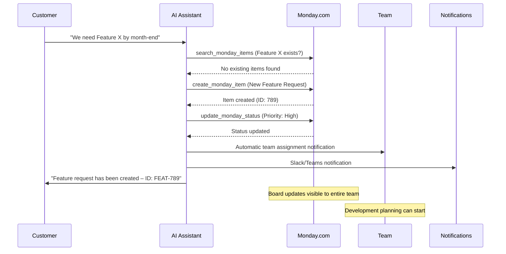

# Monday.com Integration Template

Integrate Monday.com Work OS into your Mid-call Actions with three powerful features: searching items, updating status, and creating new items. Perfect for team coordination, project tracking, and agile workflows.

## Overview & Features

<CardGroup cols={3}>
  <Card title="Search Items" icon="magnifying-glass">
    - GraphQL-based board search  
    - Multi-board queries enabled  
    - Column value filtering  
    - Customer-specific item lookups  
  </Card>
  <Card title="Update Status" icon="chart-line">
    - Real-time status updates  
    - Column value modifications  
    - Priority and assignment changes  
    - Progress tracking integration  
  </Card>
  <Card title="Create Items" icon="plus-circle">
    - Automatic task creation from conversation  
    - Group-based organization  
    - Set custom column values  
    - Team assignment and deadline setting  
  </Card>
</CardGroup>

## Monday.com API & Workspace Setup

### 1. Set up Monday.com API Access

<Steps>
  <Step title="Monday.com Account & Permissions">
    - Ensure you have admin rights in your Monday.com account  
    - Navigate to "Profile" → "Admin" → "API"  
    - Review available boards and their IDs  
  </Step>
  
  <Step title="Generate API Token">
    ```yaml
    API Token Creation:
      1. "Profile" → "Admin" → "API"
      2. "API v2 Token" → "Generate"
      3. Token Name: "Famulor Mid-Call Integration"
      4. Copy the token and store it securely
      5. Permissions: Read and write for relevant boards
    ```
  </Step>
  
  <Step title="Analyze Board IDs and Structure">
    ```yaml
    Collect Board Information:
      1. Identify relevant boards:
         - Sales Pipeline Board (ID: 1234567890)
         - Support Tickets Board (ID: 2345678901)
         - Feature Requests Board (ID: 3456789012)
      
      2. Document column IDs:
         - Status Column: "status"
         - Priority Column: "priority"
         - Assignee Column: "person"
         - Date Column: "date4"
      
      3. Group IDs for organization:
         - "new_group" for new items
         - "topics" for standard tasks
    ```
  </Step>
  
  <Step title="Understand GraphQL Schema">
    - Monday.com uses GraphQL for all API operations  
    - Queries for fetching data (`search_monday_items`)  
    - Mutations for changes (`update_monday_status`, `create_monday_item`)  
    - Structured response handling required  
  </Step>
</Steps>

## Tool 1: Search Items

### Configuration in the Famulor Interface

<Tabs>
  <Tab title="Tool Details">
    | Field | Value |
    |-------|-------|
    | **Name*** | `Monday.com Items suchen` |
    | **Description** | "Searches items by various criteria in Monday.com boards for status updates and follow-ups" |
    | **Function Name*** | `search_monday_items` |
    | **Function Description*** | "Searches Monday.com boards. Use this to find existing tasks, check status, or locate customer-related items." |
    | **HTTP Method** | `POST` |
    | **Timeout (ms)** | `5000` |
    | **Endpoint*** | `https://api.monday.com/v2` |
  </Tab>
  
  <Tab title="Request Body Template">
    ```json
    {
      "query": "query { boards (ids: {board_ids}) { items (limit: 50) { id name column_values { id text value } created_at updated_at } } }"
    }
    ```
  </Tab>
</Tabs>

### Parameter Schema for Item Search

```json
{
  "type": "object",
  "properties": {
    "board_ids": {
      "type": "array",
      "items": {"type": "integer"},
      "description": "Monday.com board IDs to search",
      "examples": [[1234567890], [1234567890, 2345678901]]
    },
    "search_term": {
      "type": "string",
      "description": "Search term for item names or column values (integrated into GraphQL filter)"
    },
    "status_filter": {
      "type": "string",
      "enum": ["", "Working on it", "Done", "Stuck", "Not Started"],
      "description": "Filter items by status column"
    },
    "limit": {
      "type": "integer",
      "description": "Maximum number of items to return",
      "default": 20,
      "minimum": 1,
      "maximum": 100
    }
  },
  "required": ["board_ids"]
}
```

### Response Mapping

```json
{
  "items": "data.boards[0].items",
  "totalCount": "data.boards[0].items.length"
}
```

## Tool 2: Update Status

### Configuration in the Famulor Interface

<Tabs>
  <Tab title="Tool Details">
    | Field | Value |
    |-------|-------|
    | **Name*** | `Monday.com Status Update` |
    | **Description** | "Updates the status or other column values of a Monday.com item" |
    | **Function Name*** | `update_monday_status` |
    | **Function Description*** | "Updates a Monday.com item. Use this to change task status, update assignees, or modify deadlines." |
    | **HTTP Method** | `POST` |
    | **Timeout (ms)** | `5000` |
    | **Endpoint*** | `https://api.monday.com/v2` |
  </Tab>
  
  <Tab title="GraphQL Mutation">
    ```json
    {
      "query": "mutation { change_column_value (board_id: {board_id}, item_id: {item_id}, column_id: \"{column_id}\", value: \"{value}\") { id name column_values { id text value } } }"
    }
    ```
  </Tab>
</Tabs>

### Parameter Schema for Updates

```json
{
  "type": "object",
  "properties": {
    "board_id": {
      "type": "integer",
      "description": "Monday.com board ID of the item to update"
    },
    "item_id": {
      "type": "integer", 
      "description": "Item ID (from previous search or known)"
    },
    "column_id": {
      "type": "string",
      "description": "Column ID to update (e.g., 'status', 'priority', 'person')",
      "examples": ["status", "priority", "person", "date4", "text"]
    },
    "value": {
      "type": "string",
      "description": "New value for the column (JSON string for complex columns)"
    },
    "update_reason": {
      "type": "string",
      "description": "Reason for the update (for audit trail)",
      "examples": ["Customer Call Update", "Status Change", "Priority Escalation"]
    }
  },
  "required": ["board_id", "item_id", "column_id", "value"]
}
```

### Response Mapping

```json
{
  "itemId": "data.change_column_value.id",
  "itemName": "data.change_column_value.name"
}
```

## Tool 3: Create Item

### Configuration in the Famulor Interface

<Tabs>
  <Tab title="Tool Details">
    | Field | Value |
    |-------|-------|
    | **Name*** | `Monday.com Item erstellen` |
    | **Description** | "Creates a new item (task) in a Monday.com board based on conversation content" |
    | **Function Name*** | `create_monday_item` |
    | **Function Description*** | "Creates a new item in Monday.com. Use this for action items, follow-up tasks, or customer requests resulting from the call." |
    | **HTTP Method** | `POST` |
    | **Timeout (ms)** | `5000` |
    | **Endpoint*** | `https://api.monday.com/v2` |
  </Tab>
  
  <Tab title="GraphQL Mutation">
    ```json
    {
      "query": "mutation { create_item (board_id: {board_id}, group_id: \"{group_id}\", item_name: \"{item_name}\", column_values: \"{column_values}\") { id name created_at column_values { id text value } } }"
    }
    ```
  </Tab>
</Tabs>

### Parameter Schema for Item Creation

```json
{
  "type": "object",
  "properties": {
    "board_id": {
      "type": "integer",
      "description": "Monday.com board ID where the item should be created"
    },
    "group_id": {
      "type": "string",
      "description": "Group/section ID within the board (e.g., 'new_group', 'topics')",
      "examples": ["new_group", "topics", "this_week", "next_week"]
    },
    "item_name": {
      "type": "string", 
      "description": "Name of the new item/task"
    },
    "column_values": {
      "type": "string",
      "description": "JSON string with column values for initialization",
      "examples": [
        "{\"status\": {\"label\": \"Working on it\"}, \"priority\": {\"label\": \"High\"}}",
        "{\"person\": {\"personsAndTeams\": [{\"id\": 12345}]}, \"date4\": {\"date\": \"2024-01-20\"}}"
      ]
    },
    "customer_name": {
      "type": "string",
      "description": "Customer name for item categorization (inserted into a text column)"
    },
    "phone_number": {
      "type": "string",
      "description": "Customer contact for follow-ups (inserted into a text column)"
    },
    "priority": {
      "type": "string",
      "enum": ["Critical", "High", "Medium", "Low"],
      "description": "Priority level based on conversation context",
      "default": "Medium"
    },
    "due_date": {
      "type": "string",
      "format": "date",
      "description": "Deadline for the task (YYYY-MM-DD)"
    },
    "estimated_hours": {
      "type": "number",
      "description": "Estimated working hours",
      "minimum": 0.5,
      "maximum": 100
    }
  },
  "required": ["board_id", "item_name"]
}
```

## Practical Use Cases

### Scenario 1: Customer Support Workflow

<Steps>
  <Step title="Problem Assessment & Item Lookup">
    ```yaml
    Customer: "My ticket SUP-123 – any updates?"
    
    AI: "Checking your ticket..."
    
    search_monday_items:
      board_ids: [2345678901]  # Support Board
      search_term: "SUP-123"
    
    GraphQL Query:
      query { 
        boards (ids: [2345678901]) { 
          items (limit: 50) { 
            id name 
            column_values { 
              id text value 
            } 
          } 
        } 
      }
    ```
  </Step>
  
  <Step title="Status Update Based on Conversation">
    ```yaml
    If problem resolved:
      AI: "Marking your ticket as completed..."
      
    update_monday_status:
      board_id: 2345678901
      item_id: 987654321  # From search result
      column_id: "status"
      value: "{\"label\": \"Done\"}"
    
    GraphQL Mutation:
      mutation { 
        change_column_value (
          board_id: 2345678901, 
          item_id: 987654321, 
          column_id: "status", 
          value: "{\"label\": \"Done\"}"
        ) { 
          id name 
        } 
      }
    ```
  </Step>
</Steps>

### Scenario 2: Sales Pipeline Management

<AccordionGroup>
  <Accordion title="Lead-to-Item Creation">
    **Sales Call Workflow**:
    ```yaml
    Customer shows interest in demo:
      
    create_monday_item:
      board_id: 1234567890  # Sales Board
      group_id: "new_leads"
      item_name: "Demo Request - Example Inc."
      column_values: "{
        \"status\": {\"label\": \"Working on it\"},
        \"priority\": {\"label\": \"High\"},
        \"person\": {\"personsAndTeams\": [{\"id\": 12345}]},
        \"date4\": {\"date\": \"2024-01-20\"},
        \"text\": \"Customer: Max Mustermann, Phone: +49123456789\"
      }"
    
    Outcome:
      - Item created in Sales board  
      - Automatic assignment to sales rep  
      - Deadline set for demo preparation  
      - Customer contact data stored  
    ```
  </Accordion>
  
  <Accordion title="Deal Status Tracking">
    **Pipeline updates during conversation**:
    ```yaml
    Deal progress update:
      
    Customer: "We've approved the budget!"
    
    AI: "Great! Updating deal status..."
    
    update_monday_status (Status):
      column_id: "status"
      value: "{\"label\": \"Contract Negotiation\"}"
    
    update_monday_status (Budget):
      column_id: "budget_approved"  
      value: "{\"checked\": \"true\"}"
    
    update_monday_status (Notes):
      column_id: "text"
      value: "Budget approved in call on {date} – ready for contract phase"
    ```
  </Accordion>
</AccordionGroup>

### Scenario 3: Project Coordination



## GraphQL Queries & Mutations in Detail

### Advanced Search Queries

<AccordionGroup>
  <Accordion title="Multi-Board Search with Filtering">
    ```graphql
    query SearchCustomerItems($boards: [Int!], $customerName: String!) {
      boards(ids: $boards) {
        id
        name
        items(limit: 50) {
          id
          name
          column_values {
            id
            text
            value
          }
          created_at
          updated_at
        }
      }
    }
    ```
    
    **Use for Customer Lookup**:
    - Search customer name in text columns  
    - Apply status filter  
    - Cross-board search supported  
  </Accordion>
  
  <Accordion title="Status-Based Filtering">
    ```graphql
    query GetOpenTasks($boardId: Int!, $statusLabel: String!) {
      boards(ids: [$boardId]) {
        items {
          id
          name
          column_values(ids: ["status"]) {
            ... on StatusValue {
              text
              label
              color
            }
          }
        }
      }
    }
    ```
  </Accordion>
</AccordionGroup>

### Complex Column Value Updates

<Tabs>
  <Tab title="Status Column Updates">
    ```json
    {
      "Status": "{\"label\": \"Working on it\"}",
      "Priority": "{\"label\": \"High\"}",
      "Checkbox": "{\"checked\": \"true\"}"
    }
    ```
  </Tab>
  
  <Tab title="People & Date Columns">
    ```json
    {
      "Person Assignment": "{\"personsAndTeams\": [{\"id\": 12345, \"kind\": \"person\"}]}",
      "Date Column": "{\"date\": \"2024-01-20\"}",
      "Timeline": "{\"from\": \"2024-01-20\", \"to\": \"2024-01-25\"}"
    }
    ```
  </Tab>
  
  <Tab title="Complex Text & Numbers">
    ```json
    {
      "Long Text": "Detailed description from customer call...",
      "Numbers": "{\"number\": 50000}",
      "Email": "{\"email\": \"customer@example.com\", \"text\": \"Max Mustermann\"}"
    }
    ```
  </Tab>
</Tabs>

## Response Processing

### Item Search Response

```json
{
  "data": {
    "boards": [
      {
        "items": [
          {
            "id": "987654321",
            "name": "Demo Request - Example Inc.",
            "column_values": [
              {
                "id": "status",
                "text": "Working on it",
                "value": "{\"label\": \"Working on it\", \"color\": \"#fdab3d\"}"
              },
              {
                "id": "person",
                "text": "Sales Team",
                "value": "{\"personsAndTeams\": [{\"id\": 12345, \"kind\": \"person\"}]}"
              }
            ],
            "created_at": "2024-01-15T10:30:00Z",
            "updated_at": "2024-01-15T14:20:00Z"
          }
        ]
      }
    ]
  }
}
```

### Natural Language Integration

<AccordionGroup>
  <Accordion title="Search Results Communication">
    **Template**: `"{{totalCount}} items found. Top results: {{items[0].name}}, {{items[1].name}}"`

    **Advanced Interpretations**:
    ```yaml
    When items found:
      "I found 3 relevant tasks. Your demo request with Example Inc. is currently in progress and being handled by our sales team."
    
    When no items:
      "I couldn't find any matching tasks. Should I create a new one?"
    
    With status context:
      "Your support ticket has been in progress since yesterday. The team is actively working on a solution."
    ```
  </Accordion>
  
  <Accordion title="Update & Creation Confirmations">
    **Status Update Template**: `"Status updated for: {{itemName}}"`

    **Creation Template**: `"Task created: {{itemName}} (ID: {{itemId}})"`

    **Business Context Integration**:
    ```yaml
    With team assignment:
      "The task was created and assigned to the development team."
    
    With deadline:
      "Feature request scheduled with a due date at the end of January."
    
    With priority escalation:
      "Support ticket marked as high priority and is being addressed urgently."
    ```
  </Accordion>
</AccordionGroup>

## Advanced Monday.com Features

### Automation & Workflows

<AccordionGroup>
  <Accordion title="Monday.com Automation Rules">
    ```yaml
    Board Automation Integration:
      
    When mid-call item is created:
      → Automatic email notification to assignee
      → Slack notification in team channel
      → Due date reminder 24 hours prior
      
    When status = "Done":
      → Customer notification via email
      → Move item to "Completed" group
      → Archive after 30 days
      
    When priority = "Critical":
      → Immediate manager notification
      → Auto-assign to senior team member
      → SLA timer activation
    ```
  </Accordion>
  
  <Accordion title="Cross-Board Integration">
    ```yaml
    Multi-board workflows:
      
    Sales-Support Bridge:
      Sales item → Create linked support item
      Support resolution → Update sales status
      
    Development Planning:
      Feature request → Create epic in dev board
      Epic progress → Update customer communication board
      
    Customer Success Tracking:
      Support issue → Create customer success follow-up item
      Project milestone → Create customer check-in
    ```
  </Accordion>
</AccordionGroup>

### Advanced Column Types

<Tabs>
  <Tab title="Customer Management Columns">
    ```yaml
    Customer Database Integration:
      
    Customer Info Columns:
      - "Customer Name": Text field
      - "Contact Email": Email field  
      - "Phone Number": Phone field
      - "Company Size": Dropdown (Small/Medium/Large)
      - "Industry": Dropdown (Tech/Healthcare/Finance/...)
      
    Business Context:
      - "Deal Size": Numbers (€)
      - "Urgency": Rating (1-5 stars)
      - "Last Contact": Date
      - "Next Follow-up": Date
    ```
  </Tab>
  
  <Tab title="Project Tracking Columns">
    ```yaml
    Project Management Columns:
      
    Progress Tracking:
      - "Completion %": Progress bar
      - "Time Spent": Time tracking
      - "Budget Used": Numbers with currency
      
    Dependencies:
      - "Blocked By": Connect boards (Dependencies)
      - "Related Items": Connect boards (Same board)
      - "Parent Epic": Connect boards (Cross-reference)
      
    Quality Assurance:
      - "Review Status": Dropdown
      - "Testing Notes": Long text
      - "Acceptance Criteria": Checklist
    ```
  </Tab>
</Tabs>

## Performance & Analytics

### Monday.com Integration KPIs

| Metric | Description | Target Value |
|--------|-------------|--------------|
| **Item Creation Success Rate** | % of successfully created items | &gt;99% |
| **GraphQL Query Performance** | Average response time | &lt;1.5 seconds |
| **Update Success Rate** | % of successful column updates | &gt;98% |
| **Team Adoption Rate** | % of mid-call originated items processed | &gt;85% |

### Business Impact Tracking

<Steps>
  <Step title="Workflow Efficiency">
    ```yaml
    Productivity Metrics:
      - Reduced time from conversation to task assignment
      - Higher follow-up rate through automatic item creation
      - Improved team coordination through structured data
      - Fewer "forgotten action items"
    ```
  </Step>
  
  <Step title="Customer Experience Impact">
    ```yaml
    Customer Satisfaction:
      - Faster problem resolution via immediate ticket creation
      - Greater transparency through item status sharing
      - Proactive updates via automation rules
      - Reduced "lost in system" experiences
    ```
  </Step>
</Steps>

## Error Handling

### Monday.com GraphQL Errors

<AccordionGroup>
  <Accordion title="Authentication Error">
    ```yaml
    Error: "Invalid authentication credentials"
    
    Cause: API token invalid or expired
    
    Fallback:
      "Monday.com synchronization is currently unavailable. 
       I’m logging the task for manual creation."
    
    Resolution:
      - Check and renew API token
      - Validate account permissions
      - Verify board access rights
    ```
  </Accordion>
  
  <Accordion title="Board/Item Not Found">
    ```yaml
    Error: "Resource not found"
    
    Possible causes:
      - Incorrect or deleted board ID
      - Item ID does not exist
      - Insufficient permissions
    
    Intelligent fallback:
      - Try alternative board IDs
      - Use default board for new items
      - Notify admin of configuration issue
    ```
  </Accordion>
  
  <Accordion title="GraphQL Syntax Errors">
    ```yaml
    Error: "Query error: Syntax error"
    
    Handling:
      - Fallback to simpler query
      - Parameter validation before API call
      - Dynamic query building with error checking
    
    Recovery strategy:
      "There was a technical issue with the Monday.com integration. 
       Using an alternative method."
    ```
  </Accordion>
</AccordionGroup>

---

<Warning>
**GraphQL Complexity**: Monday.com uses GraphQL which requires more complex query structures. Test all queries thoroughly in the Monday.com API Playground before using in production.
</Warning>

<Info>
**Productivity Tip**: Use Monday.com automation rules combined with Mid-call Actions to achieve full workflow automation. This maximizes the ROI of your integration.
</Info>

<Tip>
Related pages: [Introduction](/en/automation-platform/introduction) and [Building Flows](/en/automation-platform/building-flows), and [Debugging Runs](/en/automation-platform/debugging-runs).
</Tip>
