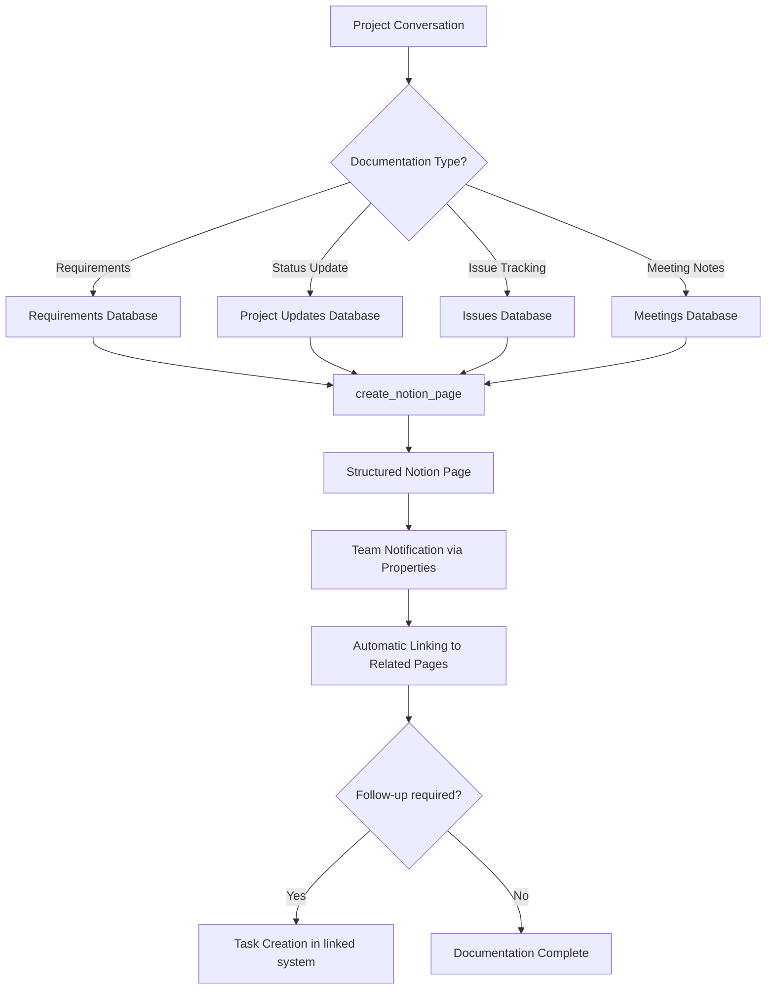

# Notion Integration Template

Integrate Notion page creation into your Mid-call Actions and enable your AI assistant to automatically generate structured documentation, meeting notes, and knowledge base entries in your Notion workspaces during customer conversations.

## Overview & Features

<CardGroup cols={2}>
  <Card title="Structured Documentation" icon="file-text">
    - Automatic meeting notes and conversation transcripts  
    - Intelligent database assignment based on context  
    - Rich-text formatting using Notion blocks  
    - Linking with existing Notion pages and templates  
  </Card>
  <Card title="Knowledge Management" icon="brain">
    - Building a customer knowledge base  
    - Automated FAQ documentation  
    - Project documentation and status updates  
    - Team wiki enhancement from live conversations  
  </Card>
</CardGroup>

## Notion API & Integration Setup

### 1. Create Notion Integration

<Steps>
  <Step title="Register Notion Integration">
    - Go to [notion.so/my-integrations](https://www.notion.so/my-integrations)  
    - Click "Create new integration"  
    - Name: "Famulor Mid-call Actions"  
    - Select the associated workspace  
  </Step>
  
  <Step title="Generate Integration Token">
    ```yaml
    Token Setup:
      1. Fill in integration details  
      2. Click "Submit"  
      3. Copy the Internal Integration Token  
      4. Store the token securely (starts with "secret_")  
    ```
  </Step>
  
  <Step title="Set Database Permissions">
    ```yaml
    For each relevant Notion database:  
      1. Open the database  
      2. Click "..." → "Add connections"  
      3. Select the "Famulor Mid-call Actions" integration  
      4. Click "Confirm"  
      
    Repeat for:  
      - Customer Database  
      - Meeting Notes Database  
      - Support Tickets Database  
      - Project Documentation Database  
    ```
  </Step>
  
  <Step title="Collect Database IDs">
    - Copy the database URLs: `notion.so/workspace/database_id?v=view_id`  
    - Extract the database ID (32-character code)  
    - Document the IDs for tool configuration  
  </Step>
</Steps>

## Configure Mid-call Action

### Configuration in Famulor Interface

<Tabs>
  <Tab title="Tool Details">
    | Field | Value |
    |------|-------|
    | **Name*** | `Notion Seite erstellen` |
    | **Description** | "Automatically creates structured documentation and meeting notes in Notion databases" |
    | **Function Name*** | `create_notion_page` |
    | **Function Description*** | "Creates a new page in a Notion database. Use this for meeting minutes, customer documentation, or project updates based on conversation content." |
    | **HTTP Method** | `POST` |
    | **Timeout (ms)** | `5000` |
    | **Endpoint*** | `https://api.notion.com/v1/pages` |
  </Tab>
  
  <Tab title="Header Configuration">
    ```json
    {
      "Authorization": "Bearer {{NOTION_TOKEN}}",
      "Content-Type": "application/json", 
      "Notion-Version": "2022-06-28",
      "User-Agent": "Famulor-MidCall-Notion/1.0"
    }
    ```
  </Tab>
  
  <Tab title="Request Body Template">
    ```json
    {
      "parent": {
        "database_id": "{database_id}"
      },
      "properties": {
        "Name": {
          "title": [
            {
              "text": {
                "content": "{title}"
              }
            }
          ]
        },
        "Status": {
          "select": {
            "name": "{status}"
          }
        },
        "Date": {
          "date": {
            "start": "{date}"
          }
        },
        "Customer": {
          "rich_text": [
            {
              "text": {
                "content": "{customer_name}"
              }
            }
          ]
        },
        "Priority": {
          "select": {
            "name": "{priority}"
          }
        }
      },
      "children": [
        {
          "object": "block",
          "type": "heading_2",
          "heading_2": {
            "rich_text": [
              {
                "type": "text",
                "text": {
                  "content": "Conversation Transcript"
                }
              }
            ]
          }
        },
        {
          "object": "block",
          "type": "paragraph", 
          "paragraph": {
            "rich_text": [
              {
                "type": "text",
                "text": {
                  "content": "{content}"
                }
              }
            ]
          }
        }
      ]
    }
    ```
  </Tab>
</Tabs>

### Parameter Schema

```json
{
  "type": "object",
  "properties": {
    "database_id": {
      "type": "string",
      "description": "Notion database ID (32-character code from the database URL)",
      "pattern": "^[a-f0-9]{32}$"
    },
    "title": {
      "type": "string",
      "description": "Title of the Notion page",
      "examples": ["Meeting with Example Corp - 2024-01-15", "Support Case: API Integration Issue", "Partnership Meeting: Tech Alliance"]
    },
    "status": {
      "type": "string",
      "enum": ["New", "In Progress", "Review", "Completed", "Archived"],
      "description": "Status of the page/entry",
      "default": "New"
    },
    "date": {
      "type": "string",
      "format": "date",
      "description": "Date of the conversation or creation (YYYY-MM-DD)"
    },
    "content": {
      "type": "string",
      "description": "Main content of the page - conversation transcript, details, action items"
    },
    "customer_name": {
      "type": "string",
      "description": "Name of the customer/company for categorization"
    },
    "priority": {
      "type": "string",
      "enum": ["Low", "Normal", "High", "Critical"],
      "description": "Priority level based on conversation content",
      "default": "Normal"
    },
    "tags": {
      "type": "array",
      "items": {"type": "string"},
      "description": "Tags for better categorization and search"
    },
    "assignee": {
      "type": "string",
      "description": "Responsible person (added as rich text)"
    }
  },
  "required": ["database_id", "title", "content"]
}
```

## Practical Use Cases

### Scenario 1: Meeting Minutes Automation

<Steps>
  <Step title="Live Meeting Documentation">
    ```yaml
    During sales call with customer:
      
    AI gathers information:
      - Participants and roles  
      - Discussed topics  
      - Decisions made  
      - Action items with responsibilities  
      - Next steps and timelines  
    ```
  </Step>
  
  <Step title="Structured Page Creation">
    ```yaml
    Notion page template:
      
    Title: "Sales Meeting: Example Corp - CRM Evaluation (2024-01-15)"
    
    Content:
    "## Participants  
    **Customer:** Max Mustermann (CEO, Example Corp)  
    **Our Team:** Anna Sales (Account Manager)  
    
    ## Agenda & Discussion  
    - CRM requirements: 500 users, GDPR compliant  
    - Budget discussion: €50k approved for Q1  
    - Integration needs: Existing ERP system (SAP)  
    
    ## Decisions  
    ✅ Demo scheduled for next Thursday at 14:00  
    ✅ Technical deep-dive with IT team required  
    ⏳ Proposal deadline: end of week  
    
    ## Action Items  
    - [ ] Anna: Compile technical specs (by Wed)  
    - [ ] Max: Coordinate IT team for demo  
    - [ ] Anna: Prepare SAP integration proposal  
    
    ## Next Steps  
    1. Demo date: 2024-01-18 14:00  
    2. Proposal submission: by 2024-01-19  
    3. Decision expected: end of January"
    ```
  </Step>
</Steps>

### Scenario 2: Customer Knowledge Base

<AccordionGroup>
  <Accordion title="Automated Customer Documentation">
    **Customer Database Entry**:  
    ```yaml
    Database: "Customer Knowledge Base"
    
    Properties:  
      Company: "Example Corp"  
      Industry: "Manufacturing"  
      Size: "500+ Employees"  
      Tech Stack: "SAP ERP, Custom CRM"  
      Decision Maker: "Max Mustermann (CEO)"  
      Budget Range: "€50-100k"  
      Timeline: "Q1 2024"  
      
    Content:  
    "## Company Overview  
    Example Corp is an established mid-sized manufacturing company with 500+ employees.  
    
    ## Tech Environment  
    - ERP: SAP (5 years)  
    - CRM: Legacy custom solution (performance issues)  
    - Integration needs: API-based, real-time sync  
    
    ## Decision Process  
    - Primary decision maker: Max Mustermann (CEO)  
    - Technical stakeholder: IT manager (to be identified)  
    - Timeline: Q1 2024 implementation  
    
    ## Conversation History  
    2024-01-15: Initial conversation, demo scheduled  
    [Automatically expanded on further conversations]"
    ```
  </Accordion>
  
  <Accordion title="Support Case Documentation">
    **Support Tickets Database**:  
    ```yaml
    Automatic case creation:
      
    Title: "API Gateway Outage - Example Corp"  
    Status: "Critical"  
    Customer: "Example Corp"  
    Reported by: "Max Mustermann"  
    Priority: "High"  
    
    Structured Content:
    "## Problem Description  
    API gateway unreachable since 14:00 today.  
    
    ## Impact Assessment  
    - Affected systems: Production API  
    - Business impact: Complete service outage  
    - Estimated revenue loss: €5k/hour  
    
    ## Technical Details  
    - Error messages: 503 Service Unavailable  
    - Affected endpoints: /api/v1/*  
    - Last working: 13:45  
    
    ## Resolution Steps  
    1. [ ] Notify infrastructure team  
    2. [ ] Check load balancer status  
    3. [ ] Activate backup systems  
    4. [ ] Provide customer communication update"
    ```
  </Accordion>
</AccordionGroup>

### Scenario 3: Project Documentation



## Response Handling

### Successful Page Creation

```json
{
  "object": "page",
  "id": "abc123def456-ghi789-jkl012",
  "created_time": "2024-01-15T10:30:00.000Z",
  "last_edited_time": "2024-01-15T10:30:00.000Z",
  "created_by": {
    "object": "user",
    "id": "integration-user-id"
  },
  "parent": {
    "type": "database_id",
    "database_id": "database-abc123def456"
  },
  "archived": false,
  "properties": {
    "Name": {
      "id": "title",
      "type": "title",
      "title": [
        {
          "type": "text",
          "text": {
            "content": "Meeting with Example Corp - 2024-01-15"
          }
        }
      ]
    },
    "Status": {
      "id": "status-id",
      "type": "select", 
      "select": {
        "id": "status-new-id",
        "name": "New",
        "color": "blue"
      }
    }
  },
  "url": "https://www.notion.so/Meeting-with-Example-Corp-abc123def456"
}
```

### Natural Language Integration

<AccordionGroup>
  <Accordion title="Agent Messages Before API Call">
    **Template**: `"Creating a new page '{{title}}' in Notion..."`
    
    **Contextual examples**:  
    ```yaml
    Meeting Notes:
      "Documenting our conversation in Notion..."
    
    Customer Profile:
      "Creating customer documentation in our knowledge base..."
    
    Project Update:
      "Generating a project update in Notion for the team..."
    ```
  </Accordion>
  
  <Accordion title="Success Confirmations">
    **Standard template**: `"Notion page was created successfully."`
    
    **Enhanced confirmations**:  
    ```yaml
    With team context:
      "Documentation created and the team has access."  
    
    With linking:
      "Meeting notes are available in Notion – your team has been notified."  
    
    With follow-up:
      "Customer profile was created in our knowledge base.  
       The account team can reference it for future calls."
    ```
  </Accordion>
</AccordionGroup>

## Advanced Notion Features

### Database Templates & Properties

<AccordionGroup>
  <Accordion title="Customer Database Schema">
    ```yaml
    Properties configuration:
      
    Name: Title field (auto-created)  
    Company Size: Select (Startup/SMB/Enterprise)  
    Industry: Multi-select (Tech/Healthcare/Finance/…)  
    Status: Select (Lead/Prospect/Customer/Churned)  
    Last Contact: Date  
    Revenue Potential: Number (€)  
    Assigned To: Person  
    Tags: Multi-select  
    Notes: Rich text  
    
    Custom views:
      - Hot Prospects (Status=Prospect, Revenue>50k)  
      - Needs Follow-up (Last Contact >7 days ago)  
      - Enterprise Accounts (Company Size=Enterprise)  
    ```
  </Accordion>
  
  <Accordion title="Project Documentation Schema">
    ```yaml
    Properties for project tracking:
      
    Project Name: Title  
    Client: Relation (to Customer Database)  
    Project Phase: Select (Planning/Development/Testing/Delivery)  
    Start Date: Date  
    Due Date: Date  
    Budget: Number  
    Team Lead: Person  
    Status: Select (On Track/At Risk/Blocked/Complete)  
    Risk Level: Select (Low/Medium/High)  
    
    Block content template:
      ## Project Objectives  
      {project_objectives}  
      
      ## Current Phase  
      {current_phase_details}  
      
      ## Next Steps  
      {action_items}  
      
      ## Risks & Challenges  
      {identified_risks}
    ```
  </Accordion>
</AccordionGroup>

### Rich Text Block Management

<Tabs>
  <Tab title="Conversation Transcript Structure">
    ```json
    {
      "children": [
        {
          "object": "block",
          "type": "heading_1",
          "heading_1": {
            "rich_text": [{"type": "text", "text": {"content": "Conversation with {customer_name}"}}]
          }
        },
        {
          "object": "block",
          "type": "callout",
          "callout": {
            "rich_text": [{"type": "text", "text": {"content": "📞 Live call - {date} {time}"}}],
            "icon": {"emoji": "📞"},
            "color": "blue_background"
          }
        },
        {
          "object": "block", 
          "type": "heading_2",
          "heading_2": {
            "rich_text": [{"type": "text", "text": {"content": "Key Discussion Points"}}]
          }
        },
        {
          "object": "block",
          "type": "bulleted_list_item",
          "bulleted_list_item": {
            "rich_text": [{"type": "text", "text": {"content": "{discussion_point_1}"}}]
          }
        }
      ]
    }
    ```
  </Tab>
  
  <Tab title="Action Items Template">
    ```json
    {
      "object": "block",
      "type": "heading_2", 
      "heading_2": {
        "rich_text": [{"type": "text", "text": {"content": "Action Items"}}]
      }
    },
    {
      "object": "block",
      "type": "to_do",
      "to_do": {
        "rich_text": [
          {
            "type": "text",
            "text": {"content": "{action_item}"}
          }
        ],
        "checked": false
      }
    }
    ```
  </Tab>
</Tabs>

## Integration with Other Systems

### CRM Documentation Sync

<AccordionGroup>
  <Accordion title="HubSpot-Notion Workflow">
    ```yaml
    Bidirectional sync pattern:
      
    1. Mid-call Action creates Notion page  
    2. Notion page URL is added as a note on the HubSpot contact  
    3. HubSpot updates trigger Notion page updates  
    4. Notion comments are logged as HubSpot activities  
    
    Implementation:  
      - Notion database with HubSpot contact ID property  
      - Webhook integration for bidirectional updates  
      - Conflict resolution for simultaneous changes  
    ```
  </Accordion>
  
  <Accordion title="Asana-Notion Integration">
    ```yaml
    Task documentation workflow:
      
    1. create_asana_task for action items  
    2. create_notion_page for detailed documentation  
    3. Asana task links to Notion page  
    4. Notion page references Asana task ID  
    
    Cross-platform benefits:  
      - Asana: task tracking and deadlines  
      - Notion: rich documentation and context  
      - Team: full transparency and traceability  
    ```
  </Accordion>
</AccordionGroup>

## Performance & Monitoring

### Notion-specific Metrics

| Metric | Description | Target |
|--------|-------------|--------|
| **Page Creation Success Rate** | % of successfully created Notion pages | >98% |
| **Content Quality Score** | Completeness and structure of documentation | >85% |
| **Team Engagement Rate** | % of pages with team interactions | >70% |
| **Documentation Findability** | % of pages found via search | >90% |

### Knowledge Management Analytics

<Steps>
  <Step title="Content Utilization Tracking">
    ```yaml
    Metrics:
      - Page views after creation  
      - Comment activity by team members  
      - Internal link clicks between pages  
      - Search query performance  
    ```
  </Step>
  
  <Step title="Business Impact Measurement">
    ```yaml
    Knowledge base ROI:
      - Reduced meeting prep time  
      - Fewer "information not available" situations  
      - Improved customer onboarding efficiency  
      - Higher team alignment scores  
    ```
  </Step>
</Steps>

## Error Handling

### Common Notion API Issues

<AccordionGroup>
  <Accordion title="Database Not Found (404)">
    ```yaml
    Cause: Incorrect database ID or integration lacks permission
    
    Notion error:
      "object": "error",
      "status": 404,
      "code": "object_not_found",
      "message": "Could not find database"
    
    Fallback:
      "Documentation could not be created in the specified database.  
       Creating alternative documentation instead."
    
    Resolution:
      - Validate database ID  
      - Check integration permissions  
      - Fallback to default database  
    ```
  </Accordion>
  
  <Accordion title="Invalid Properties (400)">
    ```yaml
    Common property errors:
      - Select value not in database options  
      - Invalid date format  
      - Missing required properties  
      - Property type mismatch
    
    Graceful handling:
      - Use property defaults  
      - Store invalid values as rich text  
      - Still create page (with warnings)
      
    Error recovery:
      "Documentation was created with default values.  
       Team can manually adjust details."
    ```
  </Accordion>
  
  <Accordion title="Rate Limiting (429)">
    ```yaml
    Notion limits:
      - 3 requests per second  
      - Burst capacity: 10 requests  
      - Content limits: 100 blocks per request
    
    Retry strategy:
      - Jitter-based backoff  
      - Content splitting for large pages  
      - Priority queue for critical documentation
    
    User experience:
      "Documentation is being created – extensive content may take a moment."
    ```
  </Accordion>
</AccordionGroup>

## Advanced Use Cases

### Template-based Page Creation

<Tabs>
  <Tab title="Meeting Types Templates">
    ```yaml
    Sales Meeting Template:
      Blocks: [Participants, Agenda, Budget, Timeline, Next Steps]
      Properties: [Company, Deal Size, Close Date, Assigned Sales Rep]
      
    Support Case Template:
      Blocks: [Problem, Impact, Technical Details, Resolution]
      Properties: [Severity, Customer Tier, SLA, Assigned Engineer]
      
    Partnership Meeting Template:
      Blocks: [Partnership Type, Mutual Benefits, Timeline, Legal]
      Properties: [Partner Category, Revenue Potential, Contract Type]
    ```
  </Tab>
  
  <Tab title="Content AI Enhancement">
    ```yaml
    AI-driven content enhancement:
      
    1. Base conversation transcription  
    2. AI extracts structural elements:  
       - Key decisions  
       - Action items  
       - Risks & challenges  
       - Success criteria  
    3. Automatic Notion block generation  
    4. Template-based formatting  
    5. Cross-reference to existing pages  
    ```
  </Tab>
</Tabs>

---

<Warning>
**Database Schema**: Ensure your Notion database properties match the parameter schema definitions. Changes to the database schema require updates to the tool configuration.
</Warning>

<Info>
**Collaboration Tip**: Use Notion comments and @-mentions in automatically created pages to encourage team discussions and coordinate follow-up actions.
</Info>

<Tip>
Related pages: [Introduction](/en/automation-platform/introduction) and [Building Flows](/en/automation-platform/building-flows), and [Debugging Runs](/en/automation-platform/debugging-runs).
</Tip>
