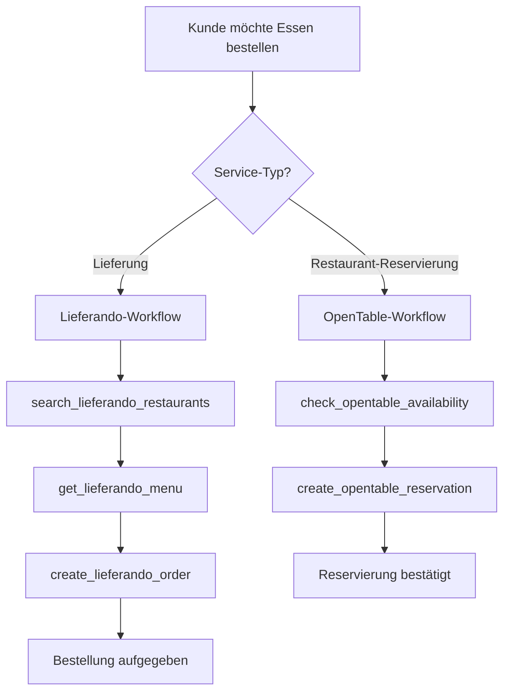

# OpenTable Integration Template

Integrieren Sie OpenTable-Reservierungssystem in Ihre Mid-call Actions mit zwei mächtigen Funktionen: Verfügbarkeit prüfen und Tischreservierungen erstellen - perfekt für Concierge-Services und Restaurant-Empfehlungen.

## Überblick & Funktionen

<CardGroup cols={2}>
  <Card title="Verfügbarkeit prüfen" icon="search">
    - Echtzeit-Tischverfügbarkeit abfragen
    - Flexible Zeitfenster-Suche (±2 Stunden)
    - Gruppengröße und Sonderwünsche berücksichtigen
    - Premium-Restaurant-Netzwerk-Zugang
  </Card>
  <Card title="Reservierung erstellen" icon="calendar-plus">
    - Sofortige Tischbuchung während des Gesprächs
    - Automatische Bestätigungs-E-Mails
    - Sonderwünsche und Anlass-Dokumentation
    - Integration mit Kalender- und CRM-Systemen
  </Card>
</CardGroup>

## Tool 1: Verfügbarkeit prüfen

### Konfiguration im Famulor Interface

<Tabs>
  <Tab title="Werkzeugdetails">
    | Feld | Wert |
    |------|------|
    | **Name*** | `OpenTable Verfügbarkeit prüfen` |
    | **Beschreibung** | "Prüft verfügbare Tischzeiten in Restaurants für Reservierungsanfragen" |
    | **Funktionsname*** | `check_opentable_availability` |
    | **Funktionsbeschreibung*** | "Sucht verfügbare Reservierungszeiten. Verwenden Sie dies, wenn ein Kunde nach freien Tischen oder Reservierungsmöglichkeiten fragt." |
    | **HTTP-Methode** | `GET` |
    | **Timeout (ms)** | `3000` |
    | **Endpoint*** | `https://platform.opentable.com/api/v2/availability` |
  </Tab>
  
  <Tab title="Query-Parameter">
    ```json
    {
      "restaurant_id": "{restaurant_id}",
      "party_size": "{party_size}",
      "date": "{date}",
      "time": "{time}",
      "forward_minutes": "120",
      "backward_minutes": "120"
    }
    ```
  </Tab>
</Tabs>

### Parameter-Schema für Verfügbarkeit

```json
{
  "type": "object",
  "properties": {
    "restaurant_id": {
      "type": "string",
      "description": "OpenTable Restaurant-ID"
    },
    "party_size": {
      "type": "integer",
      "description": "Anzahl Personen",
      "minimum": 1,
      "maximum": 20
    },
    "date": {
      "type": "string",
      "format": "date",
      "description": "Gewünschtes Datum (YYYY-MM-DD)"
    },
    "time": {
      "type": "string",
      "description": "Gewünschte Uhrzeit (HH:MM)",
      "pattern": "^([0-1]?[0-9]|2[0-3]):[0-5][0-9]$"
    }
  },
  "required": ["restaurant_id", "party_size", "date", "time"]
}
```

**Agent-Message**: `"Ich prüfe die Verfügbarkeit für {{party_size}} Personen am {{date}}..."`

**Success-Template**: `"Verfügbare Zeiten im {{restaurantName}}: {{availableSlots[0].time}}, {{availableSlots[1].time}} und {{availableSlots[2].time}}"`

## Tool 2: Reservierung erstellen

### Konfiguration im Famulor Interface

<Tabs>
  <Tab title="Werkzeugdetails">
    | **Name*** | `OpenTable Reservierung erstellen` |
    | **Funktionsname*** | `create_opentable_reservation` |
    | **HTTP-Methode** | `POST` |
    | **Endpoint*** | `https://platform.opentable.com/api/v2/reservations` |
    | **Timeout (ms)** | `5000` |
  </Tab>
  
  <Tab title="Request Body">
    ```json
    {
      "restaurant_id": "{restaurant_id}",
      "availability_token": "{availability_token}",
      "party_size": "{party_size}",
      "date_time": "{date_time}",
      "guest": {
        "first_name": "{first_name}",
        "last_name": "{last_name}",
        "email": "{email}",
        "phone": "{phone}"
      },
      "special_requests": "{special_requests}",
      "occasion": "{occasion}"
    }
    ```
  </Tab>
</Tabs>

### Parameter-Schema für Reservierung

```json
{
  "type": "object",
  "properties": {
    "restaurant_id": {
      "type": "string",
      "description": "Restaurant-ID von OpenTable"
    },
    "availability_token": {
      "type": "string", 
      "description": "Token von der Verfügbarkeitsprüfung"
    },
    "party_size": {
      "type": "integer",
      "description": "Anzahl Personen"
    },
    "date_time": {
      "type": "string",
      "description": "Datum und Zeit der Reservierung"
    },
    "first_name": {
      "type": "string",
      "description": "Vorname des Gastes"
    },
    "last_name": {
      "type": "string",
      "description": "Nachname des Gastes"
    },
    "email": {
      "type": "string",
      "format": "email",
      "description": "E-Mail-Adresse für Bestätigung"
    },
    "phone": {
      "type": "string",
      "description": "Telefonnummer für Restaurant-Kontakt"
    },
    "special_requests": {
      "type": "string",
      "description": "Sonderwünsche (Allergie, Terrasse, etc.)"
    },
    "occasion": {
      "type": "string",
      "enum": ["birthday", "anniversary", "business", "date_night"],
      "description": "Anlass der Reservierung"
    }
  },
  "required": ["restaurant_id", "availability_token", "party_size", "date_time", "first_name", "last_name", "phone"]
}
```

**Success-Template**: `"Reservierung bestätigt! Bestätigungsnummer: {{confirmationNumber}}. Sie erhalten eine Bestätigung per E-Mail."`

## Kompletter Workflow-Beispiel



### Praktisches Gesprächsbeispiel

<AccordionGroup>
  <Accordion title="Lieferando-Bestellung komplett">
    **Kunde**: "Ich hätte gerne Pizza geliefert nach München 80331"
    
    **KI**: "Ich suche Pizza-Restaurants in 80331..."
    
    *→ `search_lieferando_restaurants`*
    
    **KI**: "Ich habe 8 Pizza-Restaurants gefunden. Mario's Pizzeria hat 4.7 Sterne und 25 Minuten Lieferzeit. Soll ich die Speisekarte zeigen?"
    
    **Kunde**: "Ja, gerne!"
    
    *→ `get_lieferando_menu`*
    
    **KI**: "Mario's hat 12 Pizza-Kategorien. Die Margherita kostet 9,50€, Pizza Salami 11,90€. Was darf es sein?"
    
    **Kunde**: "Eine Pizza Salami bitte, Lieferung an Musterstraße 15"
    
    *→ `create_lieferando_order`*
    
    **KI**: "Bestellung erfolgreich! Bestellnummer: LI-2024-456. Lieferzeit: 30 Minuten. Gesamtbetrag: 13,40€ inkl. Lieferkosten."
  </Accordion>
  
  <Accordion title="OpenTable-Reservierung">
    **Kunde**: "Können Sie mir einen Tisch im Ritz für heute Abend reservieren?"
    
    **KI**: "Ich prüfe die Verfügbarkeit für heute Abend im Ritz..."
    
    *→ `check_opentable_availability`*
    
    **KI**: "Verfügbare Zeiten im Hotel Ritz Restaurant: 19:00, 19:30 und 21:15. Für wie viele Personen?"
    
    **Kunde**: "2 Personen um 19:30 wäre perfekt"
    
    *→ `create_opentable_reservation`*
    
    **KI**: "Reservierung bestätigt! Bestätigungsnummer: OT-789123. Sie haben einen Tisch für 2 Personen heute um 19:30 im Ritz."
  </Accordion>
</AccordionGroup>

---
