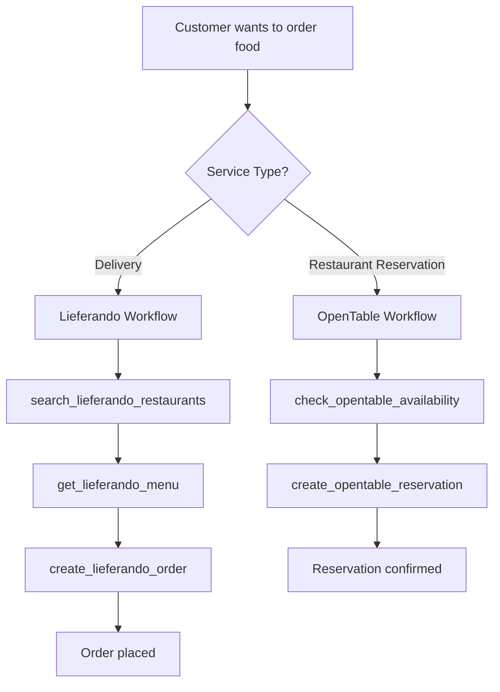

# OpenTable Integration Template

Integrate the OpenTable reservation system into your Mid-call Actions with two powerful features: Check Availability and Create Reservations – perfect for concierge services and restaurant recommendations.

## Overview & Features

<CardGroup cols={2}>
  <Card title="Check Availability" icon="search">
    - Query real-time table availability  
    - Flexible time window search (±2 hours)  
    - Consider party size and special requests  
    - Access to a premium restaurant network  
  </Card>
  <Card title="Create Reservation" icon="calendar-plus">
    - Instant table booking during the call  
    - Automatic confirmation emails  
    - Documentation of special requests and occasion  
    - Integration with calendar and CRM systems  
  </Card>
</CardGroup>

## Tool 1: Check Availability

### Configuration in the Famulor Interface

<Tabs>
  <Tab title="Tool Details">
    | Field | Value |
    |-------|-------|
    | **Name*** | `OpenTable Verfügbarkeit prüfen` |
    | **Description** | "Checks available table times in restaurants for reservation requests" |
    | **Function Name*** | `check_opentable_availability` |
    | **Function Description*** | "Searches for available reservation times. Use this when a customer asks about free tables or reservation options." |
    | **HTTP Method** | `GET` |
    | **Timeout (ms)** | `3000` |
    | **Endpoint*** | `https://platform.opentable.com/api/v2/availability` |
  </Tab>
  
  <Tab title="Query Parameters">
    ```json
    {
      "restaurant_id": "{restaurant_id}",
      "party_size": "{party_size}",
      "date": "{date}",
      "time": "{time}",
      "forward_minutes": "120",
      "backward_minutes": "120"
    }
    ```
  </Tab>
</Tabs>

### Parameter Schema for Availability

```json
{
  "type": "object",
  "properties": {
    "restaurant_id": {
      "type": "string",
      "description": "OpenTable restaurant ID"
    },
    "party_size": {
      "type": "integer",
      "description": "Number of guests",
      "minimum": 1,
      "maximum": 20
    },
    "date": {
      "type": "string",
      "format": "date",
      "description": "Desired date (YYYY-MM-DD)"
    },
    "time": {
      "type": "string",
      "description": "Desired time (HH:MM)",
      "pattern": "^([0-1]?[0-9]|2[0-3]):[0-5][0-9]$"
    }
  },
  "required": ["restaurant_id", "party_size", "date", "time"]
}
```

**Agent Message**: `"Checking availability for {{party_size}} guests on {{date}}..."`

**Success Template**: `"Available times at {{restaurantName}}: {{availableSlots[0].time}}, {{availableSlots[1].time}}, and {{availableSlots[2].time}}"`

## Tool 2: Create Reservation

### Configuration in the Famulor Interface

<Tabs>
  <Tab title="Tool Details">
    | **Name*** | `OpenTable Reservierung erstellen` |
    | **Function Name*** | `create_opentable_reservation` |
    | **HTTP Method** | `POST` |
    | **Endpoint*** | `https://platform.opentable.com/api/v2/reservations` |
    | **Timeout (ms)** | `5000` |
  </Tab>
  
  <Tab title="Request Body">
    ```json
    {
      "restaurant_id": "{restaurant_id}",
      "availability_token": "{availability_token}",
      "party_size": "{party_size}",
      "date_time": "{date_time}",
      "guest": {
        "first_name": "{first_name}",
        "last_name": "{last_name}",
        "email": "{email}",
        "phone": "{phone}"
      },
      "special_requests": "{special_requests}",
      "occasion": "{occasion}"
    }
    ```
  </Tab>
</Tabs>

### Parameter Schema for Reservation

```json
{
  "type": "object",
  "properties": {
    "restaurant_id": {
      "type": "string",
      "description": "OpenTable restaurant ID"
    },
    "availability_token": {
      "type": "string",
      "description": "Token from the availability check"
    },
    "party_size": {
      "type": "integer",
      "description": "Number of guests"
    },
    "date_time": {
      "type": "string",
      "description": "Date and time of the reservation"
    },
    "first_name": {
      "type": "string",
      "description": "Guest's first name"
    },
    "last_name": {
      "type": "string",
      "description": "Guest's last name"
    },
    "email": {
      "type": "string",
      "format": "email",
      "description": "Email address for confirmation"
    },
    "phone": {
      "type": "string",
      "description": "Phone number for restaurant contact"
    },
    "special_requests": {
      "type": "string",
      "description": "Special requests (allergies, terrace, etc.)"
    },
    "occasion": {
      "type": "string",
      "enum": ["birthday", "anniversary", "business", "date_night"],
      "description": "Occasion for the reservation"
    }
  },
  "required": ["restaurant_id", "availability_token", "party_size", "date_time", "first_name", "last_name", "phone"]
}
```

**Success Template**: `"Reservation confirmed! Confirmation number: {{confirmationNumber}}. You will receive a confirmation via email."`

## Complete Workflow Example


```mermaid
flowchart TD
    A[Customer wants to order food] --> B{Service Type?}
    B -->|Restaurant Reservation| C[OpenTable Workflow]
    B -->|Delivery| D[Lieferando Workflow]
    
    C --> E[check_opentable_availability]
    E --> F[create_opentable_reservation]
    
    D --> G[search_lieferando_restaurants]
    G --> H[get_lieferando_menu]
    H --> I[create_lieferando_order]
    
    F --> J[Reservation confirmed]
    I --> K[Order placed]
```

### Practical Conversation Example

<AccordionGroup>
  <Accordion title="Complete Lieferando Order">
    **Customer**: "I would like to have pizza delivered to Munich 80331"
    
    **AI**: "Searching for pizza restaurants in 80331..."
    
    *→ `search_lieferando_restaurants`*
    
    **AI**: "I found 8 pizza restaurants. Mario’s Pizzeria has 4.7 stars and a 25-minute delivery time. Should I show the menu?"
    
    **Customer**: "Yes, please!"
    
    *→ `get_lieferando_menu`*
    
    **AI**: "Mario’s has 12 pizza categories. The Margherita costs €9.50, Pizza Salami €11.90. What would you like?"
    
    **Customer**: "One Pizza Salami, please, delivered to Musterstraße 15"
    
    *→ `create_lieferando_order`*
    
    **AI**: "Order successful! Order number: LI-2024-456. Delivery time: 30 minutes. Total amount: €13.40 including delivery."
  </Accordion>
  
  <Accordion title="OpenTable Reservation">
    **Customer**: "Can you book me a table at the Ritz for tonight?"
    
    **AI**: "Checking availability for tonight at the Ritz..."
    
    *→ `check_opentable_availability`*
    
    **AI**: "Available times at the Hotel Ritz restaurant: 19:00, 19:30, and 21:15. For how many guests?"
    
    **Customer**: "2 people at 19:30 would be perfect"
    
    *→ `create_opentable_reservation`*
    
    **AI**: "Reservation confirmed! Confirmation number: OT-789123. You have a table for 2 guests tonight at 19:30 at the Ritz."
  </Accordion>
</AccordionGroup>

---