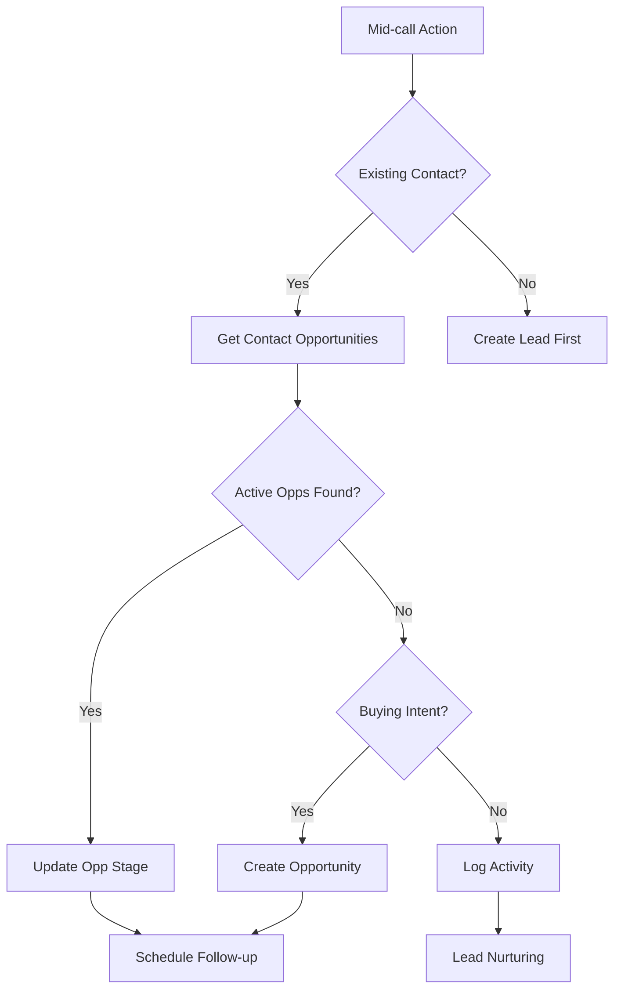
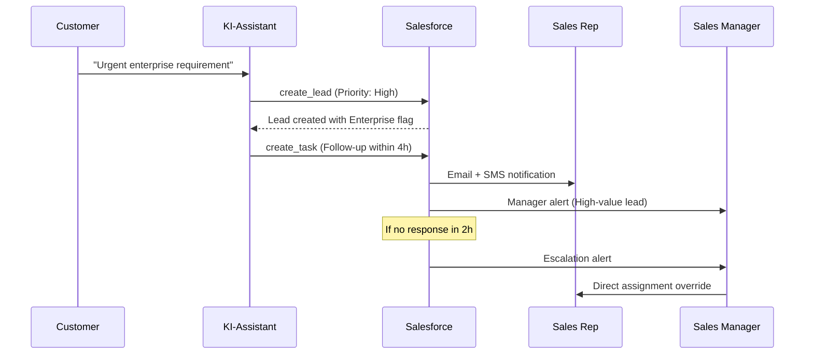

# Salesforce Integration Template

Integrieren Sie Ihre Mid-call Actions mit Salesforce, dem weltweit führenden CRM-System. Diese Integration bietet umfangreiche Möglichkeiten für Enterprise-Workflows, komplexe Sales-Prozesse und skalierbare Customer-Relationship-Management.

## Überblick & Enterprise-Features

<CardGroup cols={2}>
  <Card title="Enterprise-CRM-Integration" icon="building">
    - Vollständige Salesforce-Object-Unterstützung (Leads, Contacts, Accounts, Opportunities)
    - Custom Objects und Fields
    - Salesforce-Workflows und Triggers
    - Multi-Org-Support für große Unternehmen
  </Card>
  <Card title="Advanced Sales Features" icon="chart-line">
    - Territory Management Integration
    - Sales Process und Stage-Management  
    - Einstein AI Lead Scoring
    - Revenue Cloud Integration
  </Card>
</CardGroup>

## Salesforce API-Setup

### 1. Connected App erstellen

<Steps>
  <Step title="Setup-Navigation">
    - Melden Sie sich bei Salesforce als Admin an
    - Gehen Sie zu "Setup" (Zahnrad-Symbol)
    - Navigieren Sie zu "Apps" → "App Manager"
  </Step>
  
  <Step title="Connected App konfigurieren">
```yaml
App-Details:
  Connected App Name: "Famulor Mid-call Actions"
  API Name: "Famulor_Mid_Call_Tools"
  Contact Email: ihr-admin@firma.de
  
OAuth Settings:
  Enable OAuth Settings: ✓
  Callback URL: https://app.famulor.de/oauth/callback
  Selected OAuth Scopes:
    - "Access and manage your data (api)"
    - "Perform requests on your behalf at any time (refresh_token, offline_access)"
    - "Access your basic information (id, profile, email, address, phone)"
```
  </Step>
  
  <Step title="API-Credentials sichern">
    Nach der Erstellung:
    - Consumer Key (Client ID) notieren
    - Consumer Secret (Client Secret) notieren
    - Diese werden für die Tool-Authentication benötigt
  </Step>
  
  <Step title="User-Permissions setzen">
```yaml
Profile-Permissions (für Service User):
  - "API Enabled" 
  - "View All Data" (oder spezifische Object-Permissions)
  - "Modify All Data" (nur für Write-Operationen)
  
Optional - IP-Restrictions:
  - Vertrauenswürdige IP-Ranges definieren
  - VPN-basierte Zugriffe konfigurieren
```
  </Step>
</Steps>

### 2. Authentication-Flow

<Tabs>
  <Tab title="OAuth 2.0 Flow">
    ```yaml
    Authentication-Type: "OAuth 2.0"
    Grant Type: "Client Credentials" oder "Authorization Code"
    
    Token-Endpoint:
      URL: https://login.salesforce.com/services/oauth2/token
      Method: POST
      
    Headers:
      Content-Type: "application/x-www-form-urlencoded"
      
    Body:
      grant_type: "client_credentials"
      client_id: "{consumer_key}"
      client_secret: "{consumer_secret}"
      username: "{sf_username}"  # für Username-Password-Flow
      password: "{sf_password}{security_token}"
    ```
  </Tab>
  
  <Tab title="Session-Based Auth">
    ```yaml
    Alternative für Legacy-Setups:
      Endpoint: https://login.salesforce.com/services/Soap/c/60.0
      Method: POST (SOAP)
      
    Session-ID aus Login-Response:
      Verwende Session-ID in "Authorization: Bearer {session_id}"
      
    Vorteil: Einfacher Setup
    Nachteil: Session-Expiry-Handling
    ```
  </Tab>
</Tabs>

## Lead-Management-Tool

### 1. Lead-Lookup-Tool

<AccordionGroup>
  <Accordion title="Tool-Konfiguration">
    | Parameter | Wert |
    |-----------|------|
    | **Funktionsname** | `get_salesforce_lead` |
    | **Beschreibung** | "Ruft Lead-Informationen aus Salesforce ab basierend auf E-Mail oder Telefonnummer." |
    | **HTTP-Methode** | `GET` |
    | **URL** | `https://{instance}.salesforce.com/services/data/v60.0/query` |
    | **Timeout** | `8000ms` |
  </Accordion>
  
  <Accordion title="Query-Parameter">
    ```yaml
    SOQL-Query-Beispiele:
      
      Email-basierte Suche:
        q: "SELECT Id, FirstName, LastName, Company, Email, Phone, Status, 
            Rating, LeadSource, CreatedDate, LastModifiedDate 
            FROM Lead 
            WHERE Email = '{email}' AND IsConverted = false"
      
      Telefon-basierte Suche:
        q: "SELECT Id, FirstName, LastName, Company, Email, Phone, Status,
            Rating, Industry, AnnualRevenue 
            FROM Lead 
            WHERE Phone = '{phone}' OR MobilePhone = '{phone}'"
      
      Erweiterte Suche mit Custom Fields:
        q: "SELECT Id, Name, Email, Lead_Score__c, Next_Follow_Up__c,
            Competitor_Mentioned__c, Budget_Range__c
            FROM Lead 
            WHERE Email = '{email}'"
    ```
  </Accordion>
</AccordionGroup>

### 2. Lead-Creation-Tool

<Tabs>
  <Tab title="Basic Lead Creation">
    ```yaml
    Funktionsname: create_salesforce_lead
    HTTP-Methode: POST
    URL: https://{instance}.salesforce.com/services/data/v60.0/sobjects/Lead
    
    Headers:
      Authorization: "Bearer {access_token}"
      Content-Type: "application/json"
    ```
  </Tab>
  
  <Tab title="Request Body">
    ```json
    {
      "FirstName": "{first_name}",
      "LastName": "{last_name}",
      "Company": "{company_name}",
      "Email": "{email_address}",
      "Phone": "{phone_number}",
      "Status": "Open - Not Contacted",
      "LeadSource": "Phone Inquiry",
      "Rating": "{calculated_rating}",
      "Description": "{conversation_summary}",
      "Industry": "{identified_industry}",
      "AnnualRevenue": "{estimated_revenue}",
      "NumberOfEmployees": "{company_size}",
      "Lead_Score__c": "{calculated_score}",
      "Pain_Points__c": "{identified_challenges}",
      "Budget_Range__c": "{mentioned_budget}",
      "Timeline__c": "{buying_timeline}",
      "Competitor_Mentioned__c": "{competitors}",
      "Call_Notes__c": "{detailed_notes}",
      "Next_Follow_Up__c": "{calculated_follow_up_date}"
    }
    ```
  </Tab>
</Tabs>

### 3. Lead-Update & Qualification

```json
{
  "type": "object",
  "properties": {
    "lead_id": {
      "type": "string",
      "description": "Salesforce Lead-ID für Update"
    },
    "status": {
      "type": "string",
      "enum": ["Open - Not Contacted", "Working - Contacted", "Closed - Converted", "Closed - Not Converted"],
      "description": "Neuer Lead-Status"
    },
    "rating": {
      "type": "string", 
      "enum": ["Hot", "Warm", "Cold"],
      "description": "Lead-Rating basierend auf Gespräch"
    },
    "qualification_notes": {
      "type": "string",
      "description": "BANT-Qualifikation und Gesprächsnotizen"
    },
    "next_action": {
      "type": "string",
      "description": "Empfohlene nächste Schritte"
    },
    "assigned_owner": {
      "type": "string",
      "description": "Salesforce User-ID für Zuweisung"
    }
  },
  "required": ["lead_id"]
}
```

## Contact & Account Management

### 1. Contact-Lookup mit Account-Informationen

<AccordionGroup>
  <Accordion title="Umfassende Contact-Abfrage">
    ```sql
    -- SOQL für Contact mit Account-Daten
    SELECT Id, FirstName, LastName, Email, Phone, Title,
           Account.Id, Account.Name, Account.Industry, Account.AnnualRevenue,
           Account.NumberOfEmployees, Account.Type,
           LastActivityDate, CreatedDate,
           Custom_Field__c, Lifecycle_Stage__c
    FROM Contact 
    WHERE Email = '{email}'
    ```
  </Accordion>
  
  <Accordion title="Multi-Relationship-Queries">
    ```sql
    -- Contact mit Opportunities und Cases
    SELECT Id, Name, Email, Phone,
           (SELECT Id, Name, StageName, Amount, CloseDate FROM Opportunities),
           (SELECT Id, Subject, Status, Priority FROM Cases WHERE IsClosed = false),
           Account.Name, Account.Industry
    FROM Contact 
    WHERE Email = '{email}' OR Phone = '{phone}'
    ```
  </Accordion>
</AccordionGroup>

### 2. Account-Enrichment

<Tabs>
  <Tab title="Account-Lookup">
    ```yaml
    Tool: get_salesforce_account
    SOQL: "SELECT Id, Name, Industry, AnnualRevenue, NumberOfEmployees,
                  BillingAddress, Website, Phone, Type, 
                  Parent.Name, Owner.Name,
                  Last_Activity__c, Health_Score__c
           FROM Account 
           WHERE Name LIKE '%{company_name}%' OR Website LIKE '%{domain}%'"
    
    Use Case: Firmendaten während Gespräch anreichern
    ```
  </Tab>
  
  <Tab title="Account-Hierarchy">
    ```sql
    -- Parent-Child-Account-Beziehungen
    SELECT Id, Name, Type,
           Parent.Name, Parent.Id,
           (SELECT Name, Type FROM ChildAccounts)
    FROM Account 
    WHERE Name = '{company_name}' OR Parent.Name = '{company_name}'
    ```
  </Tab>
</Tabs>

## Opportunity-Management

### 1. Opportunity-Tracking



### 2. Opportunity-Creation-Tool

<AccordionGroup>
  <Accordion title="Tool-Configuration">
    ```yaml
    Funktionsname: create_salesforce_opportunity
    Method: POST
    URL: /services/data/v60.0/sobjects/Opportunity
    
    Beschreibung: "Erstellt eine neue Opportunity in Salesforce basierend auf 
                   qualifiziertem Lead-Gespräch"
    ```
  </Accordion>
  
  <Accordion title="Opportunity-Fields">
    ```json
    {
      "Name": "{opportunity_name}",
      "AccountId": "{account_id}",
      "ContactId": "{primary_contact_id}",
      "StageName": "Prospecting",
      "CloseDate": "{estimated_close_date}",
      "Amount": "{estimated_amount}",
      "Probability": "{calculated_probability}",
      "LeadSource": "Phone Call",
      "Type": "New Customer",
      "Description": "{opportunity_description}",
      "NextStep": "{next_action_item}",
      "Pricebook2Id": "{standard_pricebook_id}",
      "Budget_Confirmed__c": "{budget_status}",
      "Decision_Maker__c": "{decision_maker_identified}",
      "Timeline_Confirmed__c": "{timeline_status}",
      "Competitor__c": "{mentioned_competitors}",
      "Pain_Points__c": "{customer_challenges}"
    }
    ```
  </Accordion>
</AccordionGroup>

### 3. Sales Process Integration

<Tabs>
  <Tab title="Stage-Management">
    ```yaml
    Salesforce-Stage-Mapping:
      "Prospect Reached" → StageName: "Prospecting"
      "Needs Identified" → StageName: "Qualification" 
      "Budget Confirmed" → StageName: "Needs Analysis"
      "Demo Scheduled" → StageName: "Value Proposition"
      "Proposal Requested" → StageName: "Id. Decision Makers"
      "Negotiation Started" → StageName: "Proposal/Price Quote"
      "Contract Sent" → StageName: "Negotiation/Review"
      "Deal Closed" → StageName: "Closed Won"
    
    Automatic-Stage-Progression:
      - Basierend auf Gesprächsinhalten
      - Trigger für Workflow-Rules
      - Integration mit Sales-Process-Builder
    ```
  </Tab>
  
  <Tab title="Einstein-AI-Integration">
    ```yaml
    Einstein-Lead-Scoring:
      API-Endpoint: /services/data/v60.0/einstein/platform/v1/models
      
      Verwendung:
        - Automatische Score-Updates basierend auf Gespräch
        - Predictive Analytics für Close-Probability
        - Next-Best-Action-Empfehlungen
      
    Einstein-Activity-Capture:
      - Automatische E-Mail/Call-Logging
      - Sentiment-Analysis-Integration
      - Conversation-Intelligence-Features
    ```
  </Tab>
</Tabs>

## Activity & Task Management

### Automatische Activity-Protokollierung

<AccordionGroup>
  <Accordion title="Task-Creation">
    ```json
    {
      "sobjectType": "Task",
      "WhoId": "{contact_id}",
      "WhatId": "{account_or_opportunity_id}", 
      "Subject": "Follow-up Call - {customer_name}",
      "Status": "Not Started",
      "Priority": "High",
      "ActivityDate": "{follow_up_date}",
      "Description": "{call_summary}",
      "Type": "Call",
      "TaskSubtype": "Call",
      "Call_Outcome__c": "{call_result}",
      "Next_Steps__c": "{action_items}",
      "OwnerId": "{assigned_user_id}"
    }
    ```
  </Accordion>
  
  <Accordion title="Event-Logging">
    ```yaml
    Event-Types für Mid-Call-Protokollierung:
      
      Inbound-Call-Event:
        Subject: "Inbound Call - {topic}"
        Type: "Call"
        DurationInMinutes: {call_length}
        
      Demo-Request-Event:
        Subject: "Demo Scheduled"
        Type: "Meeting"
        StartDateTime: {demo_date}
        
      Follow-up-Task:
        Subject: "Send Proposal"
        ActivityDate: {due_date}
        Priority: "High"
    ```
  </Accordion>
</AccordionGroup>

## Territory & Team Management

### 1. Lead-Routing basierend auf Territory

<Tabs>
  <Tab title="Territory-Based-Assignment">
    ```sql
    -- Territory-Lookup für automatische Zuweisung
    SELECT Id, Name, 
           (SELECT User.Id, User.Name FROM UserTerritories WHERE RoleInTerritory = 'Sales Rep')
    FROM Territory2
    WHERE State__c = '{customer_state}' 
       OR Industry__c = '{customer_industry}'
       OR Company_Size__c = '{company_size_category}'
    ```
  </Tab>
  
  <Tab title="Queue-Based-Distribution">
    ```yaml
    Lead-Assignment-Logic:
      
      Enterprise-Accounts (&gt;1000 Employees):
        → Enterprise Sales Team Queue
        → Immediate SMS-Notification
        → 4-Hour Response SLA
      
      SMB-Accounts (10-1000 Employees):
        → Standard Sales Team
        → E-Mail-Notification
        → 24-Hour Response SLA
      
      Small-Business (&lt;10 Employees):
        → Inside Sales Team
        → Queue-based Distribution
        → 48-Hour Response SLA
    ```
  </Tab>
</Tabs>

### 2. Escalation-Management



## Custom Objects & Industry Solutions

### 1. Industry-Specific Objects

<AccordionGroup>
  <Accordion title="Financial Services">
    ```yaml
    Custom-Objects:
      - Investment_Profile__c
      - Risk_Assessment__c  
      - Compliance_Record__c
      - Portfolio_Summary__c
      
    Mid-Call-Integration:
      - Risk-Profile-Abfrage während Beratungsgespräch
      - Portfolio-Performance-Updates
      - Compliance-Status-Checks
      - Product-Suitability-Assessment
    ```
  </Accordion>
  
  <Accordion title="Healthcare">
    ```yaml
    Custom-Objects:
      - Patient_Record__c (HIPAA-compliant)
      - Treatment_Plan__c
      - Insurance_Verification__c
      - Appointment_History__c
      
    Special-Considerations:
      - PHI-Handling mit Field-Level-Security
      - Audit-Trail für alle Datenzugriffe
      - Consent-Management-Integration
    ```
  </Accordion>
  
  <Accordion title="Real Estate">
    ```yaml
    Custom-Objects:
      - Property_Listing__c
      - Showing_Request__c
      - Market_Analysis__c
      - Financing_Pre_Approval__c
      
    Workflow:
      - Property-Interest-Capture
      - Automatic-Showing-Scheduling
      - Financing-Qualification
      - Market-Update-Delivery
    ```
  </Accordion>
</AccordionGroup>

## Advanced Features

### 1. Flow & Process Builder Integration

<Tabs>
  <Tab title="Triggered Flows">
    ```yaml
    Flow-Trigger-Beispiele:
      
      Lead-Created-Flow:
        Trigger: Lead Creation via API
        Actions:
          - Duplicate-Check ausführen
          - Enrichment via Data.com
          - Auto-Assignment Rules
          - Welcome-E-Mail senden
          - Task für First-Contact erstellen
      
      Opportunity-Stage-Change:
        Trigger: Stage-Update via Mid-call Action
        Actions:
          - Approval-Process für große Deals
          - Quote-Generation für Proposal-Stage
          - Contract-Template-Creation
          - Revenue-Forecast-Update
    ```
  </Tab>
  
  <Tab title="Process Builder">
    ```yaml
    Process-Definitions:
      
      High-Value-Lead-Process:
        Criteria: Lead_Score__c > 80 AND Annual_Revenue > 1000000
        Actions:
          - Field-Update: Priority = "Hot"
          - E-Mail-Alert an VP Sales
          - Chatter-Post an Account-Team
          - Task-Assignment an Sr. Account Executive
      
      Competitor-Mentioned-Process:
        Criteria: Competitor_Mentioned__c != null
        Actions:
          - Battle-Card-E-Mail an Sales Rep
          - Competitive-Intelligence-Report anhängen
          - Manager-Benachrichtigung
    ```
  </Tab>
</Tabs>

### 2. Einstein Analytics Integration

<AccordionGroup>
  <Accordion title="Real-time Dashboards">
    ```yaml
    Dashboard-Integration für Mid-Call-Analytics:
      
      Call-Volume-Metrics:
        - Calls per Hour/Day
        - Conversion-Rates by Source
        - Average-Call-Duration
        - Lead-Quality-Scores
      
      Performance-KPIs:
        - Response-Times nach Lead-Creation
        - Lead-to-Opportunity-Conversion
        - Opportunity-Stage-Progression
        - Win-Rate-Trends
    ```
  </Accordion>
  
  <Accordion title="Predictive Analytics">
    ```yaml
    Einstein-Predictions:
      
      Lead-Scoring-Model:
        Input: Company-Size, Industry, Budget, Timeline
        Output: Conversion-Probability-Score
        
      Opportunity-Scoring:
        Input: Stage-History, Contact-Engagement, Deal-Size
        Output: Close-Probability + Timeline
        
      Churn-Risk-Assessment:
        Input: Activity-History, Support-Cases, Usage-Metrics
        Output: Churn-Risk-Score + Intervention-Recommendations
    ```
  </Accordion>
</AccordionGroup>

## Performance & Monitoring

### API-Limits & Governance

| Limit-Typ | Standard | Enterprise | Best Practice |
|-----------|----------|------------|---------------|
| **Daily API Requests** | 15,000 | 100,000+ | Request-Pooling |
| **Concurrent Requests** | 25 | 100 | Queue-Management |
| **Data Storage** | 1GB | Unlimited | Archive-Strategy |
| **SOQL Queries per Transaction** | 100 | 100 | Bulk-Operations |

### Monitoring & Alerting

<Steps>
  <Step title="API-Usage-Monitoring">
    ```yaml
    Metrics zu überwachen:
      - API-Request-Volume
      - Response-Times
      - Error-Rates by Endpoint
      - Quota-Utilization
    ```
  </Step>
  
  <Step title="Business-Impact-Tracking">
    ```yaml
    KPIs:
      - Lead-Creation-Rate via Mid-call Actions
      - Conversion-Rate-Improvement  
      - Sales-Cycle-Reduction
      - Revenue-Attribution
    ```
  </Step>
</Steps>

---

<Card title="Enterprise-Integration-Patterns" icon="enterprise">
Erweitern Sie Ihre Salesforce-Integration:

- [HubSpot Integration](/automation-platform/mid-call-actions/integration-templates/hubspot-kontakt-abruf) für CRM-Vergleiche
- [Webhook-Integration](/automation-platform/mid-call-actions/integration-templates/webhook-automation) für Multi-System-Workflows
- [Slack Integration](/automation-platform/mid-call-actions/integration-templates/slack-integration) für Team-Benachrichtigungen
</Card>

<Warning>
**Compliance-Hinweis**: Bei Enterprise-Salesforce-Integrationen müssen Sie ggf. spezielle Compliance-Anforderungen (SOX, HIPAA, etc.) beachten. Konsultieren Sie Ihr Compliance-Team vor der Implementierung.
</Warning>

<Info>
**Skalierungs-Tipp**: Beginnen Sie mit Standard-Objects (Lead, Contact, Opportunity) und erweitern Sie schrittweise um Custom-Objects und Advanced-Features. Salesforce bietet umfangreiche Sandbox-Umgebungen für sicheres Testing.
</Info>
