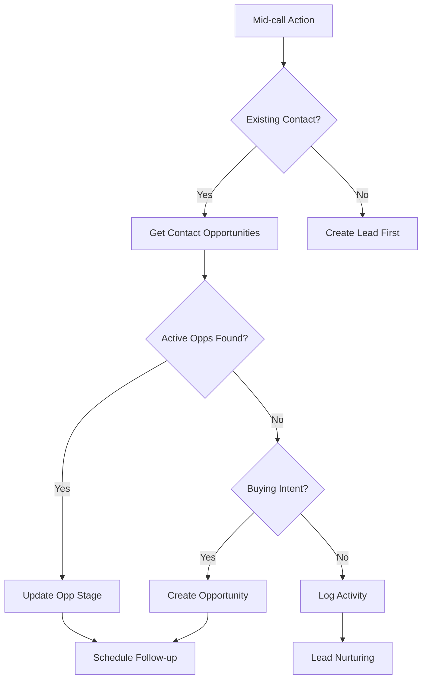
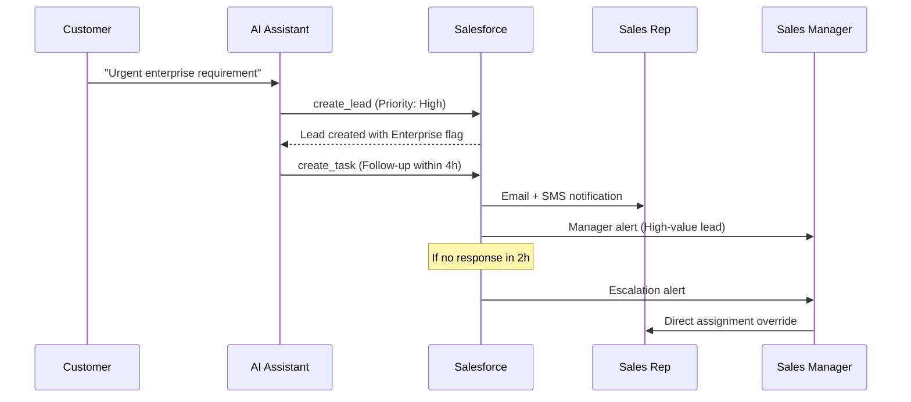

# Salesforce Integration Template

Integrate your mid-call actions with Salesforce, the world’s leading CRM system. This integration offers extensive capabilities for enterprise workflows, complex sales processes, and scalable customer relationship management.

## Overview & Enterprise Features

<CardGroup cols={2}>
  <Card title="Enterprise CRM Integration" icon="building">
    - Full Salesforce object support (Leads, Contacts, Accounts, Opportunities)  
    - Custom objects and fields  
    - Salesforce workflows and triggers  
    - Multi-org support for large enterprises  
  </Card>
  <Card title="Advanced Sales Features" icon="chart-line">
    - Territory management integration  
    - Sales process and stage management  
    - Einstein AI lead scoring  
    - Revenue Cloud integration  
  </Card>
</CardGroup>

## Salesforce API Setup

### 1. Create Connected App

<Steps>
  <Step title="Setup Navigation">
    - Log in to Salesforce as an admin  
    - Go to "Setup" (gear icon)  
    - Navigate to "Apps" → "App Manager"  
  </Step>
  
  <Step title="Configure Connected App">
```yaml
App-Details:
  Connected App Name: "Famulor Mid-call Actions"
  API Name: "Famulor_Mid_Call_Tools"
  Contact Email: your-admin@company.com
  
OAuth Settings:
  Enable OAuth Settings: ✓
  Callback URL: https://app.famulor.de/oauth/callback
  Selected OAuth Scopes:
    - "Access and manage your data (api)"
    - "Perform requests on your behalf at any time (refresh_token, offline_access)"
    - "Access your basic information (id, profile, email, address, phone)"
```
  </Step>
  
  <Step title="Secure API Credentials">
    After creation:  
    - Note Consumer Key (Client ID)  
    - Note Consumer Secret (Client Secret)  
    - These credentials are required for tool authentication  
  </Step>
  
  <Step title="Set User Permissions">
```yaml
Profile Permissions (for Service User):
  - "API Enabled" 
  - "View All Data" (or specific object permissions)
  - "Modify All Data" (only for write operations)
  
Optional - IP Restrictions:
  - Define trusted IP ranges
  - Configure VPN-based access
```
  </Step>
</Steps>

### 2. Authentication Flow

<Tabs>
  <Tab title="OAuth 2.0 Flow">
    ```yaml
    Authentication-Type: "OAuth 2.0"
    Grant Type: "Client Credentials" or "Authorization Code"
    
    Token Endpoint:
      URL: https://login.salesforce.com/services/oauth2/token
      Method: POST
      
    Headers:
      Content-Type: "application/x-www-form-urlencoded"
      
    Body:
      grant_type: "client_credentials"
      client_id: "{consumer_key}"
      client_secret: "{consumer_secret}"
      username: "{sf_username}"  # for Username-Password flow
      password: "{sf_password}{security_token}"
    ```
  </Tab>
  
  <Tab title="Session-Based Auth">
    ```yaml
    Alternative for legacy setups:
      Endpoint: https://login.salesforce.com/services/Soap/c/60.0
      Method: POST (SOAP)
      
    Session ID from login response:
      Use Session ID in "Authorization: Bearer {session_id}"
      
    Pros: Easier setup  
    Cons: Session expiry handling required
    ```
  </Tab>
</Tabs>

## Lead Management Tool

### 1. Lead Lookup Tool

<AccordionGroup>
  <Accordion title="Tool Configuration">
    | Parameter | Value |
    |-----------|-------|
    | **Function Name** | `get_salesforce_lead` |
    | **Description** | "Retrieves lead information from Salesforce based on email or phone number." |
    | **HTTP Method** | `GET` |
    | **URL** | `https://{instance}.salesforce.com/services/data/v60.0/query` |
    | **Timeout** | `8000ms` |
  </Accordion>
  
  <Accordion title="Query Parameters">
    ```yaml
    SOQL Query Examples:
      
      Email-based Search:
        q: "SELECT Id, FirstName, LastName, Company, Email, Phone, Status, 
            Rating, LeadSource, CreatedDate, LastModifiedDate 
            FROM Lead 
            WHERE Email = '{email}' AND IsConverted = false"
      
      Phone-based Search:
        q: "SELECT Id, FirstName, LastName, Company, Email, Phone, Status,
            Rating, Industry, AnnualRevenue 
            FROM Lead 
            WHERE Phone = '{phone}' OR MobilePhone = '{phone}'"
      
      Extended Search with Custom Fields:
        q: "SELECT Id, Name, Email, Lead_Score__c, Next_Follow_Up__c,
            Competitor_Mentioned__c, Budget_Range__c
            FROM Lead 
            WHERE Email = '{email}'"
    ```
  </Accordion>
</AccordionGroup>

### 2. Lead Creation Tool

<Tabs>
  <Tab title="Basic Lead Creation">
    ```yaml
    Function Name: create_salesforce_lead
    HTTP Method: POST
    URL: https://{instance}.salesforce.com/services/data/v60.0/sobjects/Lead
    
    Headers:
      Authorization: "Bearer {access_token}"
      Content-Type: "application/json"
    ```
  </Tab>
  
  <Tab title="Request Body">
    ```json
    {
      "FirstName": "{first_name}",
      "LastName": "{last_name}",
      "Company": "{company_name}",
      "Email": "{email_address}",
      "Phone": "{phone_number}",
      "Status": "Open - Not Contacted",
      "LeadSource": "Phone Inquiry",
      "Rating": "{calculated_rating}",
      "Description": "{conversation_summary}",
      "Industry": "{identified_industry}",
      "AnnualRevenue": "{estimated_revenue}",
      "NumberOfEmployees": "{company_size}",
      "Lead_Score__c": "{calculated_score}",
      "Pain_Points__c": "{identified_challenges}",
      "Budget_Range__c": "{mentioned_budget}",
      "Timeline__c": "{buying_timeline}",
      "Competitor_Mentioned__c": "{competitors}",
      "Call_Notes__c": "{detailed_notes}",
      "Next_Follow_Up__c": "{calculated_follow_up_date}"
    }
    ```
  </Tab>
</Tabs>

### 3. Lead Update & Qualification

```json
{
  "type": "object",
  "properties": {
    "lead_id": {
      "type": "string",
      "description": "Salesforce lead ID for update"
    },
    "status": {
      "type": "string",
      "enum": ["Open - Not Contacted", "Working - Contacted", "Closed - Converted", "Closed - Not Converted"],
      "description": "New lead status"
    },
    "rating": {
      "type": "string", 
      "enum": ["Hot", "Warm", "Cold"],
      "description": "Lead rating based on the conversation"
    },
    "qualification_notes": {
      "type": "string",
      "description": "BANT qualification and conversation notes"
    },
    "next_action": {
      "type": "string",
      "description": "Recommended next steps"
    },
    "assigned_owner": {
      "type": "string",
      "description": "Salesforce user ID for assignment"
    }
  },
  "required": ["lead_id"]
}
```

## Contact & Account Management

### 1. Contact Lookup with Account Information

<AccordionGroup>
  <Accordion title="Comprehensive Contact Query">
    ```sql
    -- SOQL for Contact with Account data
    SELECT Id, FirstName, LastName, Email, Phone, Title,
           Account.Id, Account.Name, Account.Industry, Account.AnnualRevenue,
           Account.NumberOfEmployees, Account.Type,
           LastActivityDate, CreatedDate,
           Custom_Field__c, Lifecycle_Stage__c
    FROM Contact 
    WHERE Email = '{email}'
    ```
  </Accordion>
  
  <Accordion title="Multi-Relationship Queries">
    ```sql
    -- Contact with Opportunities and Cases
    SELECT Id, Name, Email, Phone,
           (SELECT Id, Name, StageName, Amount, CloseDate FROM Opportunities),
           (SELECT Id, Subject, Status, Priority FROM Cases WHERE IsClosed = false),
           Account.Name, Account.Industry
    FROM Contact 
    WHERE Email = '{email}' OR Phone = '{phone}'
    ```
  </Accordion>
</AccordionGroup>

### 2. Account Enrichment

<Tabs>
  <Tab title="Account Lookup">
    ```yaml
    Tool: get_salesforce_account
    SOQL: "SELECT Id, Name, Industry, AnnualRevenue, NumberOfEmployees,
                  BillingAddress, Website, Phone, Type, 
                  Parent.Name, Owner.Name,
                  Last_Activity__c, Health_Score__c
           FROM Account 
           WHERE Name LIKE '%{company_name}%' OR Website LIKE '%{domain}%'"
    
    Use Case: Enrich company data during calls
    ```
  </Tab>
  
  <Tab title="Account Hierarchy">
    ```sql
    -- Parent-child account relationships
    SELECT Id, Name, Type,
           Parent.Name, Parent.Id,
           (SELECT Name, Type FROM ChildAccounts)
    FROM Account 
    WHERE Name = '{company_name}' OR Parent.Name = '{company_name}'
    ```
  </Tab>
</Tabs>

## Opportunity Management

### 1. Opportunity Tracking


```mermaid
flowchart TD
    A[Mid-call Action] --> B{Existing Contact?}
    B -->|Yes| C[Get Contact Opportunities]
    B -->|No| D[Create Lead First]
    C --> E{Active Opps Found?}
    E -->|Yes| F[Update Opp Stage]
    E -->|No| G{Buying Intent?}
    G -->|Yes| H[Create Opportunity]
    G -->|No| I[Log Activity]
    F --> J[Schedule Follow-up]
    H --> J
    I --> K[Lead Nurturing]
```

### 2. Opportunity Creation Tool

<AccordionGroup>
  <Accordion title="Tool Configuration">
    ```yaml
    Function Name: create_salesforce_opportunity
    Method: POST
    URL: /services/data/v60.0/sobjects/Opportunity
    
    Description: "Creates a new opportunity in Salesforce based on qualified lead conversation"
    ```
  </Accordion>
  
  <Accordion title="Opportunity Fields">
    ```json
    {
      "Name": "{opportunity_name}",
      "AccountId": "{account_id}",
      "ContactId": "{primary_contact_id}",
      "StageName": "Prospecting",
      "CloseDate": "{estimated_close_date}",
      "Amount": "{estimated_amount}",
      "Probability": "{calculated_probability}",
      "LeadSource": "Phone Call",
      "Type": "New Customer",
      "Description": "{opportunity_description}",
      "NextStep": "{next_action_item}",
      "Pricebook2Id": "{standard_pricebook_id}",
      "Budget_Confirmed__c": "{budget_status}",
      "Decision_Maker__c": "{decision_maker_identified}",
      "Timeline_Confirmed__c": "{timeline_status}",
      "Competitor__c": "{mentioned_competitors}",
      "Pain_Points__c": "{customer_challenges}"
    }
    ```
  </Accordion>
</AccordionGroup>

### 3. Sales Process Integration

<Tabs>
  <Tab title="Stage Management">
    ```yaml
    Salesforce Stage Mapping:
      "Prospect Reached" → StageName: "Prospecting"
      "Needs Identified" → StageName: "Qualification"
      "Budget Confirmed" → StageName: "Needs Analysis"
      "Demo Scheduled" → StageName: "Value Proposition"
      "Proposal Requested" → StageName: "Id. Decision Makers"
      "Negotiation Started" → StageName: "Proposal/Price Quote"
      "Contract Sent" → StageName: "Negotiation/Review"
      "Deal Closed" → StageName: "Closed Won"
    
    Automatic Stage Progression:
      - Based on conversation content
      - Triggers for workflow rules
      - Integration with Sales Process Builder
    ```
  </Tab>
  
  <Tab title="Einstein AI Integration">
    ```yaml
    Einstein Lead Scoring:
      API Endpoint: /services/data/v60.0/einstein/platform/v1/models
      
      Usage:
        - Automatic score updates based on conversation
        - Predictive analytics for close probability
        - Next-best-action recommendations
      
    Einstein Activity Capture:
      - Automated email/call logging
      - Sentiment analysis integration
      - Conversation intelligence features
    ```
  </Tab>
</Tabs>

## Activity & Task Management

### Automatic Activity Logging

<AccordionGroup>
  <Accordion title="Task Creation">
    ```json
    {
      "sobjectType": "Task",
      "WhoId": "{contact_id}",
      "WhatId": "{account_or_opportunity_id}", 
      "Subject": "Follow-up Call - {customer_name}",
      "Status": "Not Started",
      "Priority": "High",
      "ActivityDate": "{follow_up_date}",
      "Description": "{call_summary}",
      "Type": "Call",
      "TaskSubtype": "Call",
      "Call_Outcome__c": "{call_result}",
      "Next_Steps__c": "{action_items}",
      "OwnerId": "{assigned_user_id}"
    }
    ```
  </Accordion>
  
  <Accordion title="Event Logging">
    ```yaml
    Event Types for Mid-Call Logging:
      
      Inbound Call Event:
        Subject: "Inbound Call - {topic}"
        Type: "Call"
        DurationInMinutes: {call_length}
        
      Demo Request Event:
        Subject: "Demo Scheduled"
        Type: "Meeting"
        StartDateTime: {demo_date}
        
      Follow-up Task:
        Subject: "Send Proposal"
        ActivityDate: {due_date}
        Priority: "High"
    ```
  </Accordion>
</AccordionGroup>

## Territory & Team Management

### 1. Lead Routing Based on Territory

<Tabs>
  <Tab title="Territory-Based Assignment">
    ```sql
    -- Territory lookup for automatic assignment
    SELECT Id, Name, 
           (SELECT User.Id, User.Name FROM UserTerritories WHERE RoleInTerritory = 'Sales Rep')
    FROM Territory2
    WHERE State__c = '{customer_state}' 
       OR Industry__c = '{customer_industry}'
       OR Company_Size__c = '{company_size_category}'
    ```
  </Tab>
  
  <Tab title="Queue-Based Distribution">
    ```yaml
    Lead Assignment Logic:
      
      Enterprise Accounts (>1000 Employees):
        → Enterprise Sales Team Queue
        → Immediate SMS Notification
        → 4-hour response SLA
      
      SMB Accounts (10-1000 Employees):
        → Standard Sales Team
        → Email Notification
        → 24-hour response SLA
      
      Small Business (<10 Employees):
        → Inside Sales Team
        → Queue-based distribution
        → 48-hour response SLA
    ```
  </Tab>
</Tabs>

### 2. Escalation Management


```mermaid
sequenceDiagram
    participant C as Customer
    participant AI as AI Assistant
    participant SF as Salesforce
    participant SR as Sales Rep
    participant SM as Sales Manager
    
    C->>AI: "Urgent enterprise requirement"
    AI->>SF: create_lead (Priority: High)
    SF-->>AI: Lead created with Enterprise flag
    AI->>SF: create_task (Follow-up within 4h)
    SF->>SR: Email + SMS notification
    SF->>SM: Manager alert (High-value lead)
    
    Note over SF: If no response in 2h
    SF->>SM: Escalation alert
    SM->>SR: Direct assignment override
```

## Custom Objects & Industry Solutions

### 1. Industry-Specific Objects

<AccordionGroup>
  <Accordion title="Financial Services">
    ```yaml
    Custom Objects:
      - Investment_Profile__c
      - Risk_Assessment__c  
      - Compliance_Record__c
      - Portfolio_Summary__c
      
    Mid-Call Integration:
      - Risk profile queries during advisory calls
      - Portfolio performance updates
      - Compliance status checks
      - Product suitability assessments
    ```
  </Accordion>
  
  <Accordion title="Healthcare">
    ```yaml
    Custom Objects:
      - Patient_Record__c (HIPAA-compliant)
      - Treatment_Plan__c
      - Insurance_Verification__c
      - Appointment_History__c
      
    Special Considerations:
      - PHI handling with field-level security
      - Audit trail for all data accesses
      - Consent management integration
    ```
  </Accordion>
  
  <Accordion title="Real Estate">
    ```yaml
    Custom Objects:
      - Property_Listing__c
      - Showing_Request__c
      - Market_Analysis__c
      - Financing_Pre_Approval__c
      
    Workflow:
      - Property interest capture
      - Automatic showing scheduling
      - Financing qualification
      - Market update delivery
    ```
  </Accordion>
</AccordionGroup>

## Advanced Features

### 1. Flow & Process Builder Integration

<Tabs>
  <Tab title="Triggered Flows">
    ```yaml
    Flow Trigger Examples:
      
      Lead Created Flow:
        Trigger: Lead creation via API
        Actions:
          - Perform duplicate check
          - Enrichment via Data.com
          - Auto-assignment rules
          - Send welcome email
          - Create task for first contact
      
      Opportunity Stage Change:
        Trigger: Stage update via mid-call action
        Actions:
          - Approval process for large deals
          - Quote generation for proposal stage
          - Contract template creation
          - Revenue forecast updates
    ```
  </Tab>
  
  <Tab title="Process Builder">
    ```yaml
    Process Definitions:
      
      High Value Lead Process:
        Criteria: Lead_Score__c > 80 AND Annual_Revenue > 1000000
        Actions:
          - Field update: Priority = "Hot"
          - Email alert to VP Sales
          - Chatter post to account team
          - Task assignment to senior account executive
      
      Competitor Mentioned Process:
        Criteria: Competitor_Mentioned__c != null
        Actions:
          - Send battle card email to sales rep
          - Attach competitive intelligence report
          - Notify manager
    ```
  </Tab>
</Tabs>

### 2. Einstein Analytics Integration

<AccordionGroup>
  <Accordion title="Real-time Dashboards">
    ```yaml
    Dashboard integration for mid-call analytics:
      
      Call Volume Metrics:
        - Calls per hour/day
        - Conversion rates by source
        - Average call duration
        - Lead quality scores
      
      Performance KPIs:
        - Response times after lead creation
        - Lead-to-opportunity conversion
        - Opportunity stage progression
        - Win rate trends
    ```
  </Accordion>
  
  <Accordion title="Predictive Analytics">
    ```yaml
    Einstein Predictions:
      
      Lead Scoring Model:
        Input: Company size, Industry, Budget, Timeline
        Output: Conversion probability score
        
      Opportunity Scoring:
        Input: Stage history, Contact engagement, Deal size
        Output: Close probability + timeline
        
      Churn Risk Assessment:
        Input: Activity history, Support cases, Usage metrics
        Output: Churn risk score + intervention recommendations
    ```
  </Accordion>
</AccordionGroup>

## Performance & Monitoring

### API Limits & Governance

| Limit Type              | Standard | Enterprise | Best Practice     |
|------------------------|----------|------------|-------------------|
| **Daily API Requests**  | 15,000   | 100,000+   | Request pooling   |
| **Concurrent Requests** | 25       | 100        | Queue management  |
| **Data Storage**        | 1GB      | Unlimited  | Archive strategy  |
| **SOQL Queries per Transaction** | 100 | 100    | Bulk operations   |

### Monitoring & Alerting

<Steps>
  <Step title="API Usage Monitoring">
    ```yaml
    Metrics to monitor:
      - API request volume
      - Response times
      - Error rates by endpoint
      - Quota utilization
    ```
  </Step>
  
  <Step title="Business Impact Tracking">
    ```yaml
    KPIs:
      - Lead creation rate via mid-call actions
      - Conversion rate improvement
      - Sales cycle reduction
      - Revenue attribution
    ```
  </Step>
</Steps>

---

<Card title="Enterprise Integration Patterns" icon="building">
Expand your Salesforce integration:

- [HubSpot Integration](/en/automation-platform/mid-call-tools/integration-templates/hubspot-kontakt-abruf) for CRM comparisons  
- [Webhook Integration](/en/automation-platform/mid-call-tools/integration-templates/webhook-automation) for multi-system workflows  
- [Slack Integration](/en/automation-platform/mid-call-tools/integration-templates/slack-integration) for team notifications  
</Card>

<Warning>
**Compliance Notice**: For enterprise Salesforce integrations, you may need to observe specific compliance requirements (SOX, HIPAA, etc.). Please consult your compliance team before implementation.
</Warning>

<Info>
**Scaling Tip**: Start with standard objects (Lead, Contact, Opportunity) and gradually expand to custom objects and advanced features. Salesforce provides extensive sandbox environments for safe testing.
</Info>