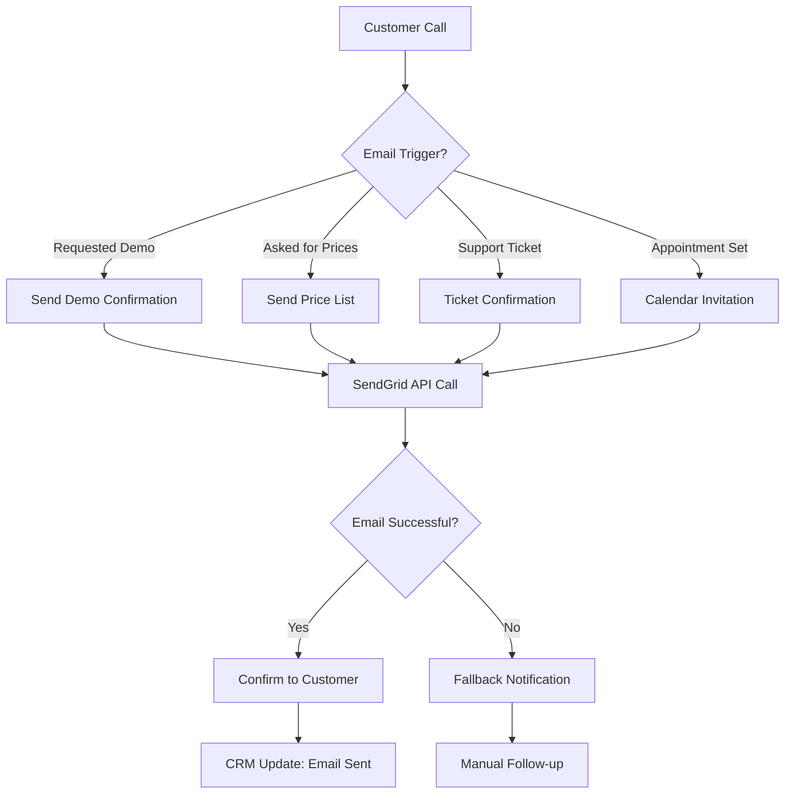
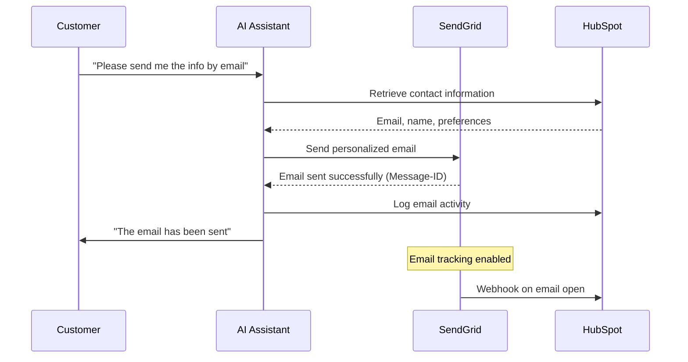

# SendGrid Integration Template

Integrate SendGrid email sending into your Mid-call Actions and enable your AI assistant to automatically send personalized emails during customer calls—ideal for follow-ups, confirmations, and marketing communication.

## Overview & Features

<CardGroup cols={2}>
  <Card title="Professional Email Sending" icon="paper-plane">
    - Instant email sending during the call  
    - Personalized templates and content  
    - Deliverability optimization via SendGrid  
    - GDPR-compliant email communication  
  </Card>
  <Card title="Marketing Automation" icon="chart-line">
    - Automatic follow-up emails  
    - Lead nurturing sequences  
    - Event-based trigger emails  
    - A/B testing and analytics integration  
  </Card>
</CardGroup>

## SendGrid Account & API Setup

### 1. Prepare SendGrid Account

<Steps>
  <Step title="Create SendGrid Account">
    - Sign up at [SendGrid](https://sendgrid.com)  
    - Choose an appropriate plan (Free Plan for up to 100 emails/day)  
    - Verify your email address and account  
  </Step>
  
  <Step title="Sender Authentication">
    ```yaml
    Domain Authentication (recommended):
      1. "Settings" → "Sender Authentication"
      2. Click "Authenticate Your Domain"
      3. Add DNS records at your domain provider
      4. Wait for verification (can take up to 24h)
      
    Single Sender Verification (quick):
      1. "Settings" → "Sender Authentication"
      2. Select "Verify a Single Sender"
      3. Enter sender email and details
      4. Confirm verification email
    ```
  </Step>
  
  <Step title="Generate API Key">
    ```yaml
    API Key Creation:
      1. "Settings" → "API Keys"
      2. Click "Create API Key"
      3. Name: "Famulor Mid-Call Integration"
      4. Permissions: "Full Access" or "Restricted Access"
      
    Restricted Access (recommended):
      - Mail Send: Full Access
      - Stats: Read Access (optional for analytics)
      - Suppressions: Read Access (optional)
    ```
  </Step>
  
  <Step title="Secure the API Key">
    - Copy the API key (starts with "SG.")  
    - Store it securely - this will be used as {{SENDGRID_API_KEY}}  
    - Send a test email via the API for validation  
  </Step>
</Steps>

## Configure Mid-call Action

### Configuration in the Famulor Interface

<Tabs>
  <Tab title="Tool Details">
    | Field | Value |
    |-------|-------|
    | **Name*** | `SendGrid E-Mail versenden` |
    | **Description** | "Sends professional emails via SendGrid for follow-ups, confirmations, and marketing communication" |
    | **Function Name*** | `send_sendgrid_email` |
    | **Function Description*** | "Sends an email via SendGrid. Use this for immediate confirmations, follow-up emails, or important information delivery after the call." |
    | **HTTP Method** | `POST` |
    | **Timeout (ms)** | `10000` |
    | **Endpoint*** | `https://api.sendgrid.com/v3/mail/send` |
  </Tab>
  
  <Tab title="Header Configuration">
    ```json
    {
      "Authorization": "Bearer {{SENDGRID_API_KEY}}",
      "Content-Type": "application/json",
      "User-Agent": "Famulor-MidCall-SendGrid/1.0"
    }
    ```
  </Tab>
  
  <Tab title="Request Body Template">
    ```json
    {
      "personalizations": [
        {
          "to": [
            {
              "email": "{to_email}",
              "name": "{to_name}"
            }
          ],
          "subject": "{subject}",
          "dynamic_template_data": {
            "customer_name": "{to_name}",
            "company_name": "{company_name}",
            "call_summary": "{call_summary}"
          }
        }
      ],
      "from": {
        "email": "{from_email}",
        "name": "{from_name}"
      },
      "content": [
        {
          "type": "text/html",
          "value": "{content}"
        }
      ],
      "categories": ["mid-call-action", "customer-communication"],
      "tracking_settings": {
        "click_tracking": {"enable": true},
        "open_tracking": {"enable": true}
      }
    }
    ```
  </Tab>
</Tabs>

### Parameter Schema

```json
{
  "type": "object",
  "properties": {
    "to_email": {
      "type": "string",
      "format": "email",
      "description": "Recipient's email address"
    },
    "to_name": {
      "type": "string",
      "description": "Recipient's name (used for personalization)"
    },
    "subject": {
      "type": "string",
      "description": "Email subject",
      "examples": ["Thank you for your call", "Your requested information", "Follow-up on our appointment"]
    },
    "content": {
      "type": "string",
      "description": "Email content (HTML and plain text possible)"
    },
    "from_email": {
      "type": "string",
      "format": "email",
      "description": "Sender email (must be authenticated)"
    },
    "from_name": {
      "type": "string",
      "description": "Sender’s name",
      "default": "Your Famulor Team"
    },
    "template_id": {
      "type": "string",
      "description": "SendGrid dynamic template ID (optional for pre-built templates)"
    },
    "company_name": {
      "type": "string",
      "description": "Company name for template personalization (optional)"
    },
    "call_summary": {
      "type": "string",
      "description": "Call summary for email content (optional)"
    }
  },
  "required": ["to_email", "subject", "content", "from_email"]
}
```

## Practical Use Cases

### Scenario 1: Instant Follow-up Email

<Steps>
  <Step title="Capture Call Context">
    ```yaml
    During the call:
      Customer: "Can you send me the price list by email?"

    AI assistant: "Sure! I will send you our current price list immediately."

    → Automatic email sending with price list as attachment
    ```
  </Step>
  
  <Step title="Personalized Email Generation">
    ```yaml
    Email Template:
      Subject: "Your requested price list - {company_name}"

      Content:
      "Hello {to_name},

      Thank you for the informative conversation earlier.
      As discussed, here is our current price list.

      If you have any further questions, please feel free to contact me.

      Best regards,
      {from_name}"
    ```
  </Step>
</Steps>

### Scenario 2: Lead Nurturing Automation

<AccordionGroup>
  <Accordion title="Qualified Leads">
    **Automated nurturing sequence**:
    ```yaml
    Lead score > 70:
      Email 1: Immediate confirmation + company brochure
      Email 2: Case studies of relevant customers (after 2 hours)
      Email 3: Personal offer (after 24 hours)

    Template personalization:
      - Industry-specific content
      - Mentioned pain points from the call
      - Dedicated contact person
    ```
  </Accordion>
  
  <Accordion title="Interested Prospects">
    **Informative follow-up series**:
    ```yaml
    Lead score 40-70:
      Email 1: Call summary + next steps
      Email 2: Relevant blog articles (after 3 days)
      Email 3: Webinar invite (after 1 week)

    Content strategy:
      - Educational content before sales pitch
      - Build trust through expertise
      - Gentle lead qualification
    ```
  </Accordion>
</AccordionGroup>

### Scenario 3: Transactional Emails



## Response Handling

### Successful Email Sending

```json
{
  "message_id": "WyJ1c2VyXzEyMyIsICJtZXNzYWdlXzQ1NiJd",
  "status": "queued",
  "timestamp": 1640995200
}
```

### Natural Language Integration

<AccordionGroup>
  <Accordion title="Agent Messages Before Sending">
    **Template**: `"I am sending the email to {{to_email}}..."`

    **Contextual Examples**:
    ```yaml
    Price List:
      "I am sending the price list to max@example.com right now..."

    Demo Confirmation:
      "I am emailing you the demo details..."

    Follow-up:
      "You will receive a summary of our conversation shortly..."
    ```
  </Accordion>
  
  <Accordion title="Success Confirmations">
    **Standard template**: `"The email has been sent successfully."`

    **Enhanced confirmations**:
    ```yaml
    With tracking:
      "Email sent. You will be notified when the email is opened."

    With next steps:
      "Email is on its way. I recommend a follow-up in 2-3 days if no response is received."

    With template info:
      "Personalized price list has been sent to {to_name}."
    ```
  </Accordion>
</AccordionGroup>

## Advanced SendGrid Features

### Dynamic Templates

<Tabs>
  <Tab title="Template Creation">
    ```yaml
    SendGrid Template Setup:
      1. "Email API" → "Dynamic Templates"
      2. "Create a Dynamic Template"
      3. Template name: "Mid-Call Follow-up"
      4. Template design with variables:
         - {{customer_name}}
         - {{company_name}} 
         - {{call_summary}}
         - {{next_steps}}
    ```
  </Tab>
  
  <Tab title="Template Integration">
    ```json
    {
      "template_id": "d-abc123def456ghi789",
      "personalizations": [
        {
          "to": [{"email": "{to_email}", "name": "{to_name}"}],
          "dynamic_template_data": {
            "customer_name": "{to_name}",
            "company_name": "{company_name}",
            "call_summary": "{call_summary}",
            "next_steps": "{next_steps}",
            "meeting_link": "{meeting_link}",
            "contact_person": "{from_name}"
          }
        }
      ],
      "from": {"email": "{from_email}", "name": "{from_name}"}
    }
    ```
  </Tab>
</Tabs>

### Email Analytics Integration

<AccordionGroup>
  <Accordion title="Tracking & Metrics">
    ```yaml
    SendGrid Analytics:
      Opens: When and how often the email was opened
      Clicks: Link clicks and engagement
      Bounces: Undeliverable emails
      Spam Reports: Spam complaints
      Unsubscribes: Unsubscriptions
      
    CRM Integration:
      - Email open → +5 lead score
      - Link click → +10 lead score  
      - Bounce → Update email status
      - Spam → Remove contact from lists
    ```
  </Accordion>
  
  <Accordion title="Webhook Events">
    ```json
    {
      "sg_event_id": "abc123",
      "sg_message_id": "message_id_from_response",
      "event": "open",
      "email": "max@example.com",
      "timestamp": 1640995800,
      "useragent": "Mozilla/5.0...",
      "ip": "192.168.1.1"
    }
    ```

    **Webhook URL**: `https://your-api.com/sendgrid-webhook`  
    **Events**: delivered, open, click, bounce, dropped, spamreport  
  </Accordion>
</AccordionGroup>

## Compliance & Data Protection

### GDPR Compliance

<CardGroup cols={2}>
  <Card title="Consent Management" icon="shield-halved">
    **Check before sending emails**:
    - Explicit consent declaration  
    - Validate opt-in status  
    - Observe purpose limitation  
    - Inform about right of withdrawal  
  </Card>
  <Card title="Data Minimization" icon="lock">
    **Best practices**:
    - Only necessary personalization  
    - No sensitive data in emails  
    - Automatic deletion after retention period  
    - Pseudonymization where possible  
  </Card>
</CardGroup>

### Suppression Management

```yaml
Bounce Handling:
  Hard bounces: Automatically added to suppression list
  Soft bounces: Suppress after 3 attempts
  Invalid emails: Immediate suppression

Unsubscribe Management:
  Global unsubscribes: Block all emails
  Group unsubscribes: Block specific categories only
  Resubscribe handling: Double opt-in required
```

## Error Handling

### Common API Errors

<AccordionGroup>
  <Accordion title="Authentication Error (401)">
    ```yaml
    Cause: Invalid or expired API key

    SendGrid Response:
      "errors": [{
        "message": "The provided authorization grant is invalid",
        "field": null,
        "help": null
      }]

    Fallback: "The email could not be sent. Logging the request for manual follow-up."

    Solution: Check and renew API key
    ```
  </Accordion>
  
  <Accordion title="Invalid From Address (400)">
    ```yaml
    Cause: Sender email not authenticated

    SendGrid Response:
      "errors": [{
        "message": "The from address does not match a verified Sender Identity",
        "field": "from.email",
        "help": "https://sendgrid.com/docs/User_Guide/Settings/Sender_authentication.html"
      }]

    Graceful Handling:
      "Email configuration is being checked. The information will be sent to you alternatively."
    ```
  </Accordion>
  
  <Accordion title="Rate Limiting (429)">
    ```yaml
    SendGrid Limits:
      Free Plan: 100 emails/day
      Essentials: 40,000 emails/month
      Pro: 1.5 million emails/month

    Retry Strategy:
      - Exponential backoff: 1s, 2s, 4s, 8s
      - Max 3 retry attempts
      - Queue system for peak times

    Business Continuity:
      "Email sending is temporarily overloaded. The email will be resent within the next few minutes."
    ```
  </Accordion>
</AccordionGroup>

## Performance & Monitoring

### Email Delivery Metrics

| Metric                  | Target Value | Critical Value |
|-------------------------|--------------|----------------|
| **Delivery Rate**       | &gt;98%       | &lt;95%        |
| **Open Rate**           | &gt;25%       | &lt;15%        |
| **Click-through Rate**  | &gt;5%        | &lt;2%         |
| **Bounce Rate**         | &lt;2%        | &gt;5%         |
| **Spam Rate**           | &lt;0.1%      | &gt;0.5%       |

### Business Impact Analytics

<Steps>
  <Step title="Engagement Tracking">
    ```yaml
    Key Metrics:
      - Email-to-meeting conversion
      - Follow-up response rate  
      - Lead scoring impact
      - Customer journey progression
    ```
  </Step>
  
  <Step title="ROI Measurement">
    ```yaml
    Revenue Attribution:
      - Mid-call email → demo booking
      - Follow-up → deal closing
      - Nurturing → lead qualification
      - Template performance comparison
    ```
  </Step>
</Steps>

## Integration with CRM Systems

### HubSpot Integration



## Best Practices

### Email Content Optimization

<CardGroup cols={2}>
  <Card title="Subject Line Optimization" icon="bullseye">
    **Effective Patterns**:
    - Personalization: "[Company] - Your request"
    - Urgency: "Limited time offer: ..."
    - Benefit: "Save 30% with..."
    - Question: "Do you have 5 minutes for...?"
  </Card>
  <Card title="Content Structure" icon="list">
    **Template layout**:
    - Personal greeting  
    - Reference to the conversation  
    - Main information / call to action  
    - Next steps  
    - Contact information  
  </Card>
</CardGroup>

### Automation Strategies

<AccordionGroup>
  <Accordion title="Trigger-based Emails">
    ```yaml
    Lead status changes:
      "Cold" → "Warm": Start welcome series
      "Warm" → "Hot": Notify sales team
      "Hot" → "Qualified": Send demo scheduling email

    Behavioral triggers:
      Price inquiry → Send pricing guide
      Demo interest → Send calendar link
      Competitor mention → Send battle-card email
    ```
  </Accordion>
  
  <Accordion title="Time-based Sequences">
    ```yaml
    Follow-up schedule:
      Immediately: Confirmation email
      +2 hours: Additional resources
      +24 hours: Personal offer
      +3 days: Check-in email
      +1 week: Case study
      +2 weeks: Final follow-up with incentive
    ```
  </Accordion>
</AccordionGroup>

---

<Warning>
**GDPR Compliance**: Ensure you have legally valid consent for all email sends and comply with all data protection regulations.
</Warning>

<Info>
**Performance Tip**: Use SendGrid Dynamic Templates for consistent formatting and better personalization. Test different subject lines to optimize open rates.
</Info>

<Tip>
Related pages: [Introduction](/en/automation-platform/introduction) and [Building Flows](/en/automation-platform/building-flows), and [Debugging Runs](/en/automation-platform/debugging-runs).
</Tip>
