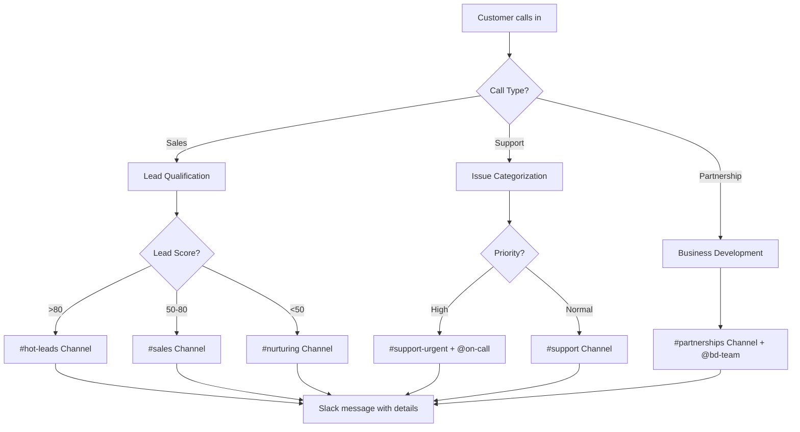
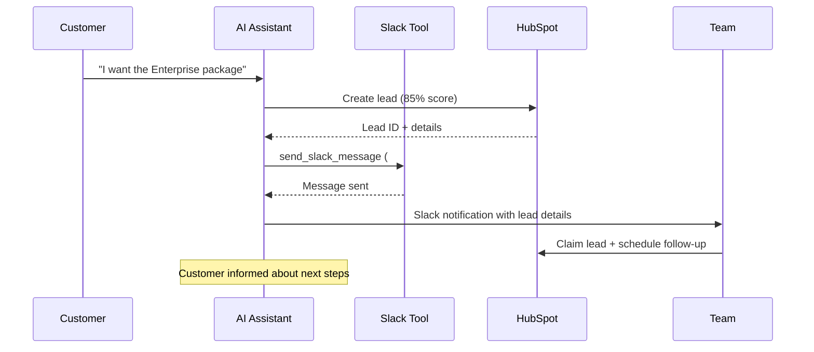

# Slack Integration Template

Integrate Slack messaging into your mid-call actions and enable your AI assistant to automatically send messages, notifications, and updates to the relevant team channels during customer conversations.

## Overview & Features

<CardGroup cols={2}>
  <Card title="Real-time Team Notifications" icon="bell">
    - Instant alerts for important customer inquiries  
    - Automatic lead notifications to the sales team  
    - Support tickets sent directly to the appropriate channels  
    - Escalation messages for critical issues  
  </Card>
  <Card title="Smart Channel Routing" icon="route">
    - Automatic channel selection based on call type  
    - Rich text formatting with Slack Blocks  
    - Mentioning specific team members  
    - Integration with Slack workflows and bots  
  </Card>
</CardGroup>

## Slack App & Bot Setup

### 1. Create Slack App

<Steps>
  <Step title="Workspace Admin Access">
    - Log in to Slack as a workspace admin  
    - Navigate to [api.slack.com/apps](https://api.slack.com/apps)  
    - Click on "Create New App"  
  </Step>
  
  <Step title="App Configuration">
    ```yaml
    App Details:
      App Name: "Famulor Mid-Call Integration"
      Development Workspace: [Your Workspace]
      App Icon: Famulor Logo (optional)
      
    OAuth & Permissions:
      Required Bot Token Scopes:
        - "chat:write"
        - "chat:write.public"
        - "channels:read"
        - "users:read"
    ```
  </Step>
  
  <Step title="Generate Bot Token">
    ```yaml
    Installation:
      1. Click "Install to Workspace"
      2. Confirm permissions
      3. Copy the Bot User OAuth Token
      4. Store the token securely (starts with "xoxb-")
    ```
  </Step>
  
  <Step title="Invite Bot to Channels">
    - Invite the bot to desired channels: `/invite @Famulor`  
    - Note channel IDs for configuration  
    - Send a test message for validation  
  </Step>
</Steps>

## Configure Mid-call Action

### Configuration in Famulor Interface

<Tabs>
  <Tab title="Tool Details">
    | Field | Value |
    |-------|-------|
    | **Name*** | `Send Slack Message` |
    | **Description** | "Automatically sends messages to Slack channels for team coordination and notifications" |
    | **Function Name*** | `send_slack_message` |
    | **Function Description*** | "Sends a message to a Slack channel. Use this for team notifications, lead alerts, or important updates during the call." |
    | **HTTP Method** | `POST` |
    | **Timeout (ms)** | `5000` |
    | **Endpoint*** | `https://slack.com/api/chat.postMessage` |
  </Tab>
  
  <Tab title="Header Configuration">
    ```json
    {
      "Authorization": "Bearer {{SLACK_BOT_TOKEN}}",
      "Content-Type": "application/json",
      "User-Agent": "Famulor-MidCall-Slack/1.0"
    }
    ```
  </Tab>
  
  <Tab title="Request Body Template">
    ```json
    {
      "channel": "{channel}",
      "text": "{text}",
      "blocks": "{blocks}",
      "username": "Famulor Assistant",
      "icon_emoji": ":telephone_receiver:",
      "unfurl_links": false,
      "unfurl_media": false
    }
    ```
  </Tab>
</Tabs>

### Parameter Schema

```json
{
  "type": "object",
  "properties": {
    "channel": {
      "type": "string",
      "description": "Channel ID or name (e.g. '#general', '#sales', or 'C1234567890')",
      "examples": ["#general", "#sales", "C1234567890"]
    },
    "text": {
      "type": "string",
      "description": "The message to send (plain text or markdown-formatted)"
    },
    "blocks": {
      "type": "array",
      "description": "Rich-text blocks for advanced formatting (optional)",
      "items": {
        "type": "object"
      }
    },
    "thread_ts": {
      "type": "string",
      "description": "Timestamp of a message to reply in a thread (optional)"
    },
    "reply_broadcast": {
      "type": "boolean",
      "description": "Also display thread reply in channel (optional)",
      "default": false
    }
  },
  "required": ["channel", "text"]
}
```

## Practical Use Cases

### Scenario 1: Lead Notification

<Steps>
  <Step title="Lead Detection">
    ```yaml
    Trigger: AI detects a qualified lead in the conversation
    
    Message Template:
      "🎯 New qualified lead!
       
       👤 Name: Max Mustermann
       🏢 Company: Beispiel GmbH
       📧 Email: max@beispiel.de
       📊 Score: 85/100
       💰 Budget: ~50k€
       
       @sales-team"
    ```
  </Step>
  
  <Step title="Smart Channel Routing">
    ```yaml
    Routing Logic:
      If Lead Score > 80:
        → Channel: "#hot-leads"
        → Mention: "@sales-manager"
      
      If Lead Score 50-80:
        → Channel: "#sales"
        → Mention: "@sales-team"
      
      If Budget > 100k:
        → Channel: "#enterprise"
        → Mention: "@enterprise-team"
    ```
  </Step>
</Steps>

### Scenario 2: Support Escalation

<AccordionGroup>
  <Accordion title="Critical Bug Report">
    **Automatic Support Message**:
    ```json
    {
      "channel": "#support-critical",
      "text": "🚨 Critical issue reported!",
      "blocks": [
        {
          "type": "section",
          "text": {
            "type": "mrkdwn",
            "text": "*Customer:* Max Mustermann (Beispiel GmbH)\n*Issue:* System outage for 2 hours\n*Priority:* 🔴 HIGH"
          }
        },
        {
          "type": "actions",
          "elements": [
            {
              "type": "button",
              "text": {"type": "plain_text", "text": "Open Ticket"},
              "value": "create_ticket",
              "style": "danger"
            }
          ]
        }
      ]
    }
    ```
  </Accordion>
  
  <Accordion title="Appointment Cancellation Notification">
    **Business Impact Alert**:
    ```yaml
    Context: Customer cancels important appointment
    
    Message:
      "⚠️ Appointment cancellation – action required
      
      📅 Appointment: Demo for Enterprise Deal (50k€)
      👤 Customer: Beispiel GmbH - Max Mustermann  
      📞 Reason: Budget frozen in Q1
      ⏰ Next action: Follow-up in Q2
      
      @account-manager – please check alternative dates"
    ```
  </Accordion>
</AccordionGroup>

### Scenario 3: Team Coordination



## Response Handling

### Successful Message

```json
{
  "ok": true,
  "channel": "C1234567890",
  "ts": "1640995200.000100",
  "message": {
    "type": "message",
    "subtype": "bot_message",
    "text": "New lead: Max Mustermann - Beispiel GmbH",
    "ts": "1640995200.000100",
    "username": "Famulor Assistant",
    "bot_id": "B12345"
  }
}
```

### Natural Language Integration

<Tabs>
  <Tab title="Agent Messages">
    **Before API Call**: `"I’m sending this information to the {{team}} team..."`
    
    **Examples**:
    - "I’m informing our sales team about the new lead..."
    - "I’m escalating the issue to support..."
    - "I’m notifying the development team about the bug..."
  </Tab>
  
  <Tab title="Success Confirmations">
    **Template**: `"Message was sent to {{channel}}."`
    
    **Dynamic Responses**:
    ```yaml
    For #sales channel:
      "The sales team has been informed about the lead."
    
    For #support channel:
      "A support ticket has been created and the team notified."
    
    For thread replies:
      "Reply has been added to the existing thread."
    ```
  </Tab>
</Tabs>

## Advanced Features

### Rich Text Formatting with Blocks

<AccordionGroup>
  <Accordion title="Lead Notification with Buttons">
    ```json
    {
      "blocks": [
        {
          "type": "section",
          "text": {
            "type": "mrkdwn",
            "text": "*New qualified lead!*\n\n:bust_in_silhouette: *Name:* Max Mustermann\n:office: *Company:* Beispiel GmbH\n:chart_with_upwards_trend: *Score:* 85/100"
          }
        },
        {
          "type": "actions",
          "elements": [
            {
              "type": "button",
              "text": {"type": "plain_text", "text": "Claim Lead"},
              "value": "claim_lead",
              "style": "primary"
            },
            {
              "type": "button", 
              "text": {"type": "plain_text", "text": "Schedule Follow-up"},
              "value": "schedule_followup"
            }
          ]
        }
      ]
    }
    ```
  </Accordion>
  
  <Accordion title="Support Ticket with Priority">
    ```json
    {
      "blocks": [
        {
          "type": "header",
          "text": {
            "type": "plain_text",
            "text": "🚨 New Support Ticket"
          }
        },
        {
          "type": "section",
          "fields": [
            {"type": "mrkdwn", "text": "*Customer:*\nMax Mustermann"},
            {"type": "mrkdwn", "text": "*Priority:*\n🔴 High"},
            {"type": "mrkdwn", "text": "*Issue:*\nAPI outage"},
            {"type": "mrkdwn", "text": "*Estimated downtime:*\n2 hours"}
          ]
        },
        {
          "type": "divider"
        },
        {
          "type": "context",
          "elements": [
            {"type": "mrkdwn", "text": "📞 Call active | 🕒 " + new Date().toLocaleString()}
          ]
        }
      ]
    }
    ```
  </Accordion>
</AccordionGroup>

### Multi-Channel Broadcasting

<Tabs>
  <Tab title="Parallel Notifications">
    ```yaml
    Workflow for Critical Issues:
      1. Primary message: "#support-critical"
      2. Management info: "#management"  
      3. Developer alert: "#dev-team"
      4. Customer Success: "#customer-success"
      
    Implementation:
      - Multiple send_slack_message calls  
      - Customized messages per channel  
      - Different @mentions  
    ```
  </Tab>
  
  <Tab title="Thread-Based Updates">
    ```yaml
    Follow-up messages:
      Initial message → save thread ID  
      Updates → use thread_ts parameter
      
    Example flow:
      1. "Lead created" → main message  
      2. "Demo scheduled" → thread reply  
      3. "Deal closed" → thread reply with broadcast
    ```
  </Tab>
</Tabs>

## Error Handling

### Common Issues

<AccordionGroup>
  <Accordion title="Channel Not Found (channel_not_found)">
    ```yaml
    Cause: Bot not invited to the channel or wrong channel name
    
    Fallback: "Team notification could not be sent. 
              I’m documenting the information for manual forwarding."
    
    Solution:
      - Invite bot to the channel: /invite @Famulor
      - Use channel ID instead of name
      - Check permissions
    ```
  </Accordion>
  
  <Accordion title="Invalid Token (invalid_auth)">
    ```yaml
    Cause: Bot token expired or invalid
    
    Graceful handling:
      "Slack integration is currently unavailable. 
       I’m noting the important information for the team."
    
    Action: Notify admin about token issue
    ```
  </Accordion>
  
  <Accordion title="Rate Limiting (rate_limited)">
    ```yaml
    Slack limits:
      - Tier 1: 1+ message per second
      - Tier 2: 20+ messages per minute
      - Tier 3: 50+ messages per minute
    
    Handling:
      - Exponential backoff  
      - Implement message queuing  
      - Priority-based delays  
    ```
  </Accordion>
</AccordionGroup>

## Performance & Best Practices

### Message Optimization

<CardGroup cols={2}>
  <Card title="Relevant Information" icon="filter">
    **Do's**:
    - Only business-critical messages  
    - Clear, actionable content  
    - Provide context for decisions
    
    **Don'ts**:
    - Spam-like notifications  
    - Redundant information  
    - Pure statistics updates  
  </Card>
  <Card title="Timing & Frequency" icon="clock">
    **Smart Delays**:
    - Avoid during meetings  
    - Batch updates instead of single messages  
    - Consider time zones
    
    **Escalation Rules**:
    - Immediate: critical issues  
    - 5 min delay: important leads  
    - 15 min delay: standard updates  
  </Card>
</CardGroup>

## Integration with Other Tools

### CRM Sync Workflows



## Analytics & Monitoring

### KPIs for Slack Integration

| Metric | Description | Target |
|--------|-------------|--------|
| **Message Success Rate** | % of successfully sent messages | &gt;99% |
| **Response Time** | Time until team reacts to Slack alert | &lt;5 minutes |
| **Conversion Rate** | Slack leads → closed deals | &gt;15% |
| **Team Engagement** | Interaction with bot messages | &gt;80% |

### Reporting Dashboard

<Steps>
  <Step title="Message Analytics">
    - Number of messages per channel/day  
    - Most successful message types  
    - Peak notification hours  
  </Step>
  
  <Step title="Business Impact">
    - Lead conversion rate via Slack  
    - Support response times  
    - Team productivity metrics  
  </Step>
  
  <Step title="Optimization Insights">
    - Most common error types  
    - Identify unused channels  
    - Message template performance  
  </Step>
</Steps>

---

<Warning>
**Privacy Notice**: Ensure that sensitive customer data is only shared in private channels and that your Slack workspace complies with your company’s compliance policies.
</Warning>

<Info>
**Pro Tip**: Start with a dedicated test channel for the Slack integration before deploying it in production channels. This helps fine-tune message templates and frequency.
</Info>

<Tip>
Related pages: [Introduction](/en/automation-platform/introduction) and [Building Flows](/en/automation-platform/building-flows), and [Debugging Runs](/en/automation-platform/debugging-runs).
</Tip>
