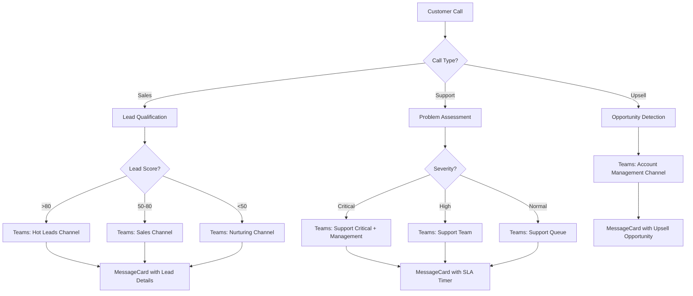

# Microsoft Teams Integration Template

Integrate Microsoft Teams messaging into your Mid-call Actions and enable your AI assistant to automatically send messages and updates to Teams channels during customer calls – perfect for enterprise environments.

## Overview & Features

<CardGroup cols={2}>
  <Card title="Enterprise Team Communication" icon="building">
    - Automatic notifications to Teams channels  
    - Rich card formatting for professional presentation  
    - Integration into existing Microsoft 365 workflows  
    - Compliance-compliant corporate communication
  </Card>
  <Card title="Adaptive Cards & Webhooks" icon="link">
    - Webhook-based integration (no app installation required)  
    - Adaptive Cards for interactive messages  
    - Color coding for priorities and categories  
    - Links to SharePoint, Power BI, and other MS tools
  </Card>
</CardGroup>

## Teams Webhook Setup

### 1. Create Incoming Webhook

<Steps>
  <Step title="Prepare Teams Channel">
    - Open Microsoft Teams  
    - Navigate to the desired channel (e.g., "Sales", "Support")  
    - Click "..." (More Options) next to the channel name
  </Step>
  
  <Step title="Configure Webhook">
    ```yaml
    Webhook Setup:
      1. Select "Connectors" → "Configure"  
      2. Search for "Incoming Webhook"  
      3. Click "Add" → "Configure"  
      4. Enter webhook details:  
         - Name: "Famulor Mid-Call Integration"  
         - Image: Famulor logo (optional)  
         - Description: "Automated notifications from customer calls"
    ```
  </Step>
  
  <Step title="Secure Webhook URL">
    ```yaml
    After configuration:  
      1. Copy the webhook URL (very long, starts with https://...)  
      2. Store URL securely – this will be used as {{TEAMS_WEBHOOK_URL}}  
      3. Send a test message to validate  

    Format: https://outlook.office.com/webhook/abc.../IncomingWebhook/def.../ghi...
    ```
  </Step>
  
  <Step title="Validate Permissions">
    - Webhook works for all channel members  
    - No additional app permissions required  
    - Messages appear as "Famulor Mid-Call Integration"
  </Step>
</Steps>

## Configure Mid-call Action

### Configuration in Famulor Interface

<Tabs>
  <Tab title="Tool Details">
    | Field | Value |
    |-------|-------|
    | **Name*** | `Microsoft Teams Message` |
    | **Description** | "Automatically sends formatted messages to Microsoft Teams channels for enterprise team coordination" |
    | **Function Name*** | `send_teams_message` |
    | **Function Description*** | "Sends a message to a Teams channel via webhook. Use this for important business updates, lead notifications, or support escalations." |
    | **HTTP Method** | `POST` |
    | **Timeout (ms)** | `5000` |
    | **Endpoint*** | `{{TEAMS_WEBHOOK_URL}}` |
  </Tab>
  
  <Tab title="Header Configuration">
    ```json
    {
      "Content-Type": "application/json",
      "User-Agent": "Famulor-MidCall-Teams/1.0"
    }
    ```
    
    <Info>**Note**: Teams webhooks do not require an Authorization header — the URL itself serves as authentication.</Info>
  </Tab>
  
  <Tab title="Request Body Template">
    ```json
    {
      "@type": "MessageCard",
      "@context": "https://schema.org/extensions",
      "title": "{title}",
      "summary": "{title}",
      "text": "{message}",
      "themeColor": "{color}",
      "sections": [
        {
          "activityTitle": "Famulor Mid-Call Assistant",
          "activitySubtitle": "Live Call Update",
          "facts": [
            {
              "name": "Time:",
              "value": "{timestamp}"
            },
            {
              "name": "Type:",
              "value": "{call_type}"
            }
          ]
        }
      ]
    }
    ```
  </Tab>
</Tabs>

### Parameter Schema

```json
{
  "type": "object",
  "properties": {
    "title": {
      "type": "string",
      "description": "Message title (displayed prominently)",
      "examples": ["New Qualified Lead", "Support Escalation", "Deal Update"]
    },
    "message": {
      "type": "string",
      "description": "Main content of the message (supports Markdown formatting)"
    },
    "color": {
      "type": "string",
      "description": "Theme color as hex code for visual categorization",
      "default": "0078D4",
      "examples": ["0078D4", "28A745", "DC3545", "FFC107"]
    },
    "call_type": {
      "type": "string",
      "enum": ["Sales", "Support", "Partnership", "General"],
      "description": "Type of call for categorization",
      "default": "General"
    },
    "priority": {
      "type": "string",
      "enum": ["Low", "Normal", "High", "Critical"],
      "description": "Priority level for color coding",
      "default": "Normal"
    },
    "timestamp": {
      "type": "string",
      "description": "Timestamp of the call (automatically generated)",
      "format": "date-time"
    }
  },
  "required": ["title", "message"]
}
```

## Practical Use Cases

### Scenario 1: Sales Lead Notification

<AccordionGroup>
  <Accordion title="Enterprise Lead Alert">
    **MessageCard template for high-value lead**:
    ```json
    {
      "@type": "MessageCard",
      "@context": "https://schema.org/extensions",
      "title": "🎯 New Enterprise Lead",
      "summary": "Qualified lead with high potential",
      "text": "A new qualified lead was identified during the live call.",
      "themeColor": "28A745",
      "sections": [
        {
          "activityTitle": "Lead Details",
          "activitySubtitle": "Immediate follow-up recommended",
          "facts": [
            {"name": "Contact:", "value": "Max Mustermann"},
            {"name": "Company:", "value": "Example AG"},
            {"name": "Email:", "value": "max@example.com"},
            {"name": "Lead Score:", "value": "92/100"},
            {"name": "Estimated Volume:", "value": "€150,000"},
            {"name": "Timeframe:", "value": "Q1 2024"}
          ]
        }
      ],
      "potentialAction": [
        {
          "@type": "OpenUri",
          "name": "Open CRM",
          "targets": [{"os": "default", "uri": "https://your-crm.com/leads/12345"}]
        },
        {
          "@type": "HttpPOST",
          "name": "Claim Lead",
          "target": "https://your-api.com/leads/claim/12345"
        }
      ]
    }
    ```
  </Accordion>
  
  <Accordion title="Priority-based Color Coding">
    ```yaml
    Color scheme for different priorities:
      
      Critical:
        Color: "DC3545" (Red)
        Example: System outage, major customer complaint
        
      High:
        Color: "FF6B00" (Orange) 
        Example: Hot lead >100k€, escalation to manager
        
      Normal:
        Color: "0078D4" (Microsoft Blue)
        Example: Standard leads, info updates
        
      Success:
        Color: "28A745" (Green)
        Example: Deal closed, problem resolved
    ```
  </Accordion>
</AccordionGroup>

### Scenario 2: Support Ticket Escalation

<Tabs>
  <Tab title="Critical Support Case">
    ```json
    {
      "@type": "MessageCard",
      "@context": "https://schema.org/extensions", 
      "title": "🚨 Critical Support Ticket",
      "summary": "Immediate attention required",
      "text": "A critical issue was reported during the customer call and requires immediate resolution.",
      "themeColor": "DC3545",
      "sections": [
        {
          "activityTitle": "Problem Details",
          "activitySubtitle": "SLA: 1 hour response time",
          "facts": [
            {"name": "Customer:", "value": "Example AG"},
            {"name": "Contact:", "value": "Max Mustermann"},
            {"name": "Issue:", "value": "API Gateway unreachable"},
            {"name": "Affected Services:", "value": "Production environment"},
            {"name": "Estimated Downtime:", "value": "30 minutes"},
            {"name": "Business Impact:", "value": "High - revenue critical"}
          ]
        },
        {
          "activityTitle": "Next Steps",
          "facts": [
            {"name": "Assigned to:", "value": "@DevOps-Team"},
            {"name": "Ticket ID:", "value": "#SUP-2024-0123"},
            {"name": "Priority:", "value": "P1 - Critical"}
          ]
        }
      ],
      "potentialAction": [
        {
          "@type": "OpenUri",
          "name": "Open Ticket", 
          "targets": [{"os": "default", "uri": "https://support.company.com/tickets/SUP-2024-0123"}]
        }
      ]
    }
    ```
  </Tab>
  
  <Tab title="Automatic Team Mentions">
    ```yaml
    Teams mention integration:
      
    In MessageCard text:
      "text": "<at>DevOps Team</at> - Immediate attention required!"
      
    Advanced mentions:
      - User: "<at>Max Mustermann</at>"
      - Teams: "<at>Support Team</at>" 
      - Channel: "<at>Channel Name</at>"
      
    Note: Teams webhooks have limited support for @mentions in MessageCards
    ```
  </Tab>
</Tabs>

### Scenario 3: Business Intelligence Updates



## Response Handling & Success

### Successful Message

```
Status: 200 OK  
Body: "1" (Teams only responds with "1" on success)
```

### Natural Language Integration

<AccordionGroup>
  <Accordion title="Agent Messages before API Call">
    **Template**: `"I am sending the information to Microsoft Teams..."`
    
    **Contextual Examples**:
    ```yaml
    For Sales Lead:
      "I am informing the sales team about this qualified lead..."
    
    For Support Issue:
      "I am escalating the issue to the support team in Microsoft Teams..."
    
    For Partnership Inquiry:
      "I am forwarding the partnership inquiry to the business development team..."
    ```
  </Accordion>
  
  <Accordion title="Success Confirmations">
    **Template**: `"Message has been sent to Teams."`
    
    **Extended confirmations**:
    ```yaml
    With Priority:
      "Critical notification has been sent to the team."
    
    With Follow-up:
      "The team has been notified and will respond within [SLA time]."
    
    With Action Items:
      "Teams notification sent – the team can respond directly from the chat."
    ```
  </Accordion>
</AccordionGroup>

## Advanced MessageCard Features

### Interactive Elements

<AccordionGroup>
  <Accordion title="Action Buttons">
    ```json
    {
      "potentialAction": [
        {
          "@type": "OpenUri",
          "name": "Open CRM",
          "targets": [
            {"os": "default", "uri": "https://crm.company.com/lead/12345"}
          ]
        },
        {
          "@type": "HttpPOST", 
          "name": "Claim Lead",
          "target": "https://api.company.com/leads/claim",
          "body": "{\"lead_id\": \"12345\", \"user\": \"{{user}}\"}"
        },
        {
          "@type": "ActionCard",
          "name": "Add Note",
          "inputs": [
            {
              "@type": "TextInput",
              "id": "note",
              "title": "Your note",
              "isMultiline": true
            }
          ],
          "actions": [
            {
              "@type": "HttpPOST",
              "name": "Save",
              "target": "https://api.company.com/leads/note"
            }
          ]
        }
      ]
    }
    ```
  </Accordion>
  
  <Accordion title="Multi-Section Layout">
    ```json
    {
      "sections": [
        {
          "activityTitle": "Lead Information",
          "activitySubtitle": "Primary contact details",
          "activityImage": "https://company.com/images/lead-icon.png",
          "facts": [
            {"name": "Name:", "value": "Max Mustermann"},
            {"name": "Company:", "value": "Example AG"}
          ]
        },
        {
          "activityTitle": "Qualification",
          "activitySubtitle": "BANT assessment",
          "facts": [
            {"name": "Budget:", "value": "€100k+ confirmed"},
            {"name": "Authority:", "value": "Decision maker"},
            {"name": "Need:", "value": "Immediate"},
            {"name": "Timeline:", "value": "Q1 2024"}
          ]
        }
      ]
    }
    ```
  </Accordion>
</AccordionGroup>

## Microsoft 365 Integration

### SharePoint & Power BI Links

<Tabs>
  <Tab title="SharePoint Documents">
    ```json
    {
      "potentialAction": [
        {
          "@type": "OpenUri",
          "name": "Open Sales Documents",
          "targets": [
            {
              "os": "default", 
              "uri": "https://company.sharepoint.com/sites/sales/Documents/Proposals/"
            }
          ]
        },
        {
          "@type": "OpenUri", 
          "name": "Customer History",
          "targets": [
            {
              "os": "default",
              "uri": "https://company.sharepoint.com/sites/crm/Lists/Customers/"
            }
          ]
        }
      ]
    }
    ```
  </Tab>
  
  <Tab title="Power BI Dashboards">
    ```yaml
    Dashboard Integration:
      Sales Performance: "https://app.powerbi.com/groups/.../reports/sales-dashboard"
      Support Metrics: "https://app.powerbi.com/groups/.../reports/support-metrics"
      Customer Analytics: "https://app.powerbi.com/groups/.../reports/customer-insights"
    
    Dynamic links based on call_type:
      Sales → Sales Dashboard
      Support → Support Metrics
      Partnership → Business Development Dashboard
    ```
  </Tab>
</Tabs>

## Error Handling & Troubleshooting

### Common Issues

<AccordionGroup>
  <Accordion title="Invalid Webhook URL (400 Bad Request)">
    ```yaml
    Causes:
      - Webhook disabled or deleted  
      - Incorrect URL formatting  
      - Expired webhook configuration
    
    Troubleshooting:
      1. Verify Teams channel  
      2. Reconfigure webhook  
      3. Update URL in tool configuration
      
    Fallback message:
      "Teams notification could not be delivered.  
       The team will be informed manually."
    ```
  </Accordion>
  
  <Accordion title="MessageCard Format Errors">
    ```yaml
    Common format issues:
      - Invalid JSON  
      - Missing @type or @context  
      - Title/text fields too long  
      - Invalid action definitions
    
    Debugging:
      - Use MessageCard validator  
      - Check payload size (max 28KB)  
      - Escape special characters
    
    Fallback:
      Plain text message without advanced features
    ```
  </Accordion>
</AccordionGroup>

## Performance & Monitoring

### Teams-Specific Metrics

| Metric                  | Description                            | Target Value |
|-------------------------|------------------------------------|--------------|
| **Webhook Success Rate** | % of successfully delivered messages | &gt;99.5%       |
| **Message Delivery Time**| Time until message appears in Teams | &lt;2 seconds   |
| **Action Button Usage**  | % of messages with button interaction| &gt;60%         |
| **Webhook Uptime**       | Availability of webhook endpoints    | &gt;99.9%       |

### Business Impact Tracking

<Steps>
  <Step title="Measure Response Times">
    ```yaml
    KPIs:
      - Time to first team reaction on alert  
      - Average problem resolution time  
      - Lead response time after Teams notification
    ```
  </Step>
  
  <Step title="Engagement Analysis">
    ```yaml
    Metrics:
      - Number of button clicks per MessageCard type  
      - Most common action types  
      - Team member participation rate
    ```
  </Step>
</Steps>

## Enterprise Compliance

### Security Considerations

<AccordionGroup>
  <Accordion title="Data Classification">
    ```yaml
    Sensitivity labels for Teams messages:
      Public: General notifications  
      Internal: Team-specific updates  
      Confidential: Customer data with lead information  
      Highly Confidential: Critical business intelligence
    
    Implementation:
      - Separate webhook URLs per sensitivity level  
      - Different Teams channels for different classifications  
      - Automated data loss prevention checks
    ```
  </Accordion>
  
  <Accordion title="Audit & Compliance">
    ```yaml
    Microsoft 365 compliance features:
      - Message retention policies  
      - eDiscovery for Teams messages  
      - Communication compliance monitoring  
      - Data loss prevention (DLP)
    
    Logging:
      - All webhook calls in audit log  
      - Message content classification  
      - User interaction tracking
    ```
  </Accordion>
</AccordionGroup>

---

<Warning>
**Enterprise Notice**: Ensure your Teams webhooks comply with your company’s IT security policies and are regularly checked for vulnerabilities.
</Warning>

<Info>
**Integration Tip**: Use different webhook URLs for different channel types (Sales, Support, etc.) to gain better control over message routing and formatting.
</Info>

<Tip>
Related pages: [Introduction](/en/automation-platform/introduction) and [Building Flows](/en/automation-platform/building-flows), and [Debugging Runs](/en/automation-platform/debugging-runs).
</Tip>
