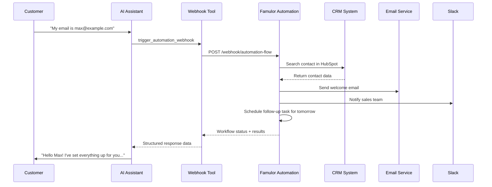
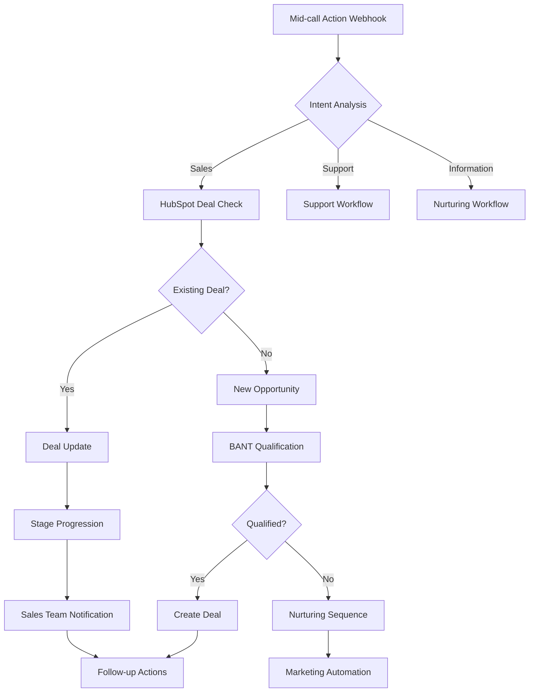

# Webhook Integration with Famulor Automation

Mid-call actions can not only execute direct API calls but can also be connected via webhooks to the Famulor Automation Platform. This enables complex, multi-step workflows and the use of all available integrations on the no-code platform.

## Overview of the Webhook Integration

<CardGroup cols={2}>
  <Card title="Direct API vs. Webhook" icon="code-branch">
    **Direct API Call**: Simple 1:1 data query or transmission
    
    **Webhook Integration**: Complex workflows involving multiple systems, data processing, and business logic
  </Card>
  <Card title="Advanced Capabilities" icon="magic">
    - Multi-system integrations within one workflow
    - Conditional logic and decision trees
    - Data preparation and transformation
    - Time-delayed actions and follow-ups
  </Card>
</CardGroup>

## How It Works



## Configuring the Webhook Tool

### 1. Basic Configuration

<Tabs>
  <Tab title="Tool Setup">
    | Parameter | Value |
    |-----------|-------|
    | **Function name** | `trigger_famulor_automation` |
    | **Description** | "Starts a Famulor Automation workflow using call data as input. Use this for complex multi-system operations." |
    | **HTTP Method** | `POST` |
    | **URL** | `https://app.famulor.de/api/webhook/automation/{flow_id}` |
    | **Timeout** | `15000ms` |
  </Tab>
  
  <Tab title="Headers">
    ```yaml
    Authorization: "Bearer FAMULOR_API_KEY"
    Content-Type: "application/json"
    X-Webhook-Source: "mid-call-action"
    X-Conversation-ID: "{conversation_id}"
    ```
  </Tab>
</Tabs>

### 2. Request Body Template

```json
{
  "trigger_source": "mid_call_tool",
  "conversation_context": {
    "customer_email": "{email}",
    "customer_phone": "{phone}",
    "customer_name": "{full_name}",
    "company_name": "{company}",
    "conversation_summary": "{summary}",
    "detected_intent": "{intent}",
    "urgency_level": "{urgency}",
    "timestamp": "{current_timestamp}"
  },
  "workflow_parameters": {
    "lead_source": "phone_call",
    "follow_up_required": true,
    "priority": "{calculated_priority}",
    "assigned_team": "{team_assignment}"
  },
  "custom_data": {
    "budget_mentioned": "{budget_info}",
    "timeline_mentioned": "{timeline}",
    "pain_points": "{pain_points}",
    "competitor_mentioned": "{competitors}"
  }
}
```

### 3. Parameter Schema

```json
{
  "type": "object",
  "properties": {
    "flow_id": {
      "type": "string",
      "description": "ID of the Famulor Automation workflow to execute"
    },
    "email": {
      "type": "string",
      "format": "email",
      "description": "Customer's email address"
    },
    "phone": {
      "type": "string",
      "description": "Customer's phone number"
    },
    "full_name": {
      "type": "string",
      "description": "Customer's full name"
    },
    "company": {
      "type": "string",
      "description": "Customer's company name"
    },
    "summary": {
      "type": "string",
      "description": "Summary of key conversation points"
    },
    "intent": {
      "type": "string",
      "enum": ["support", "sales", "information", "complaint", "partnership"],
      "description": "Detected conversation intent"
    },
    "urgency": {
      "type": "string",
      "enum": ["low", "medium", "high", "critical"],
      "description": "Urgency level based on conversation content"
    },
    "calculated_priority": {
      "type": "string",
      "enum": ["low", "medium", "high"],
      "description": "Calculated priority for follow-up actions"
    },
    "team_assignment": {
      "type": "string",
      "enum": ["sales", "support", "success", "technical"],
      "description": "Recommended team for follow-up"
    },
    "budget_info": {
      "type": "string",
      "description": "Mentioned budget information"
    },
    "timeline": {
      "type": "string",
      "description": "Mentioned timeframe or deadline"
    },
    "pain_points": {
      "type": "array",
      "items": {"type": "string"},
      "description": "Array of identified pain points"
    },
    "competitors": {
      "type": "array",
      "items": {"type": "string"},
      "description": "Mentioned competitors or alternative solutions"
    }
  },
  "required": ["flow_id", "email", "summary", "intent"]
}
```

## Practical Examples of Webhook Workflows

### 1. Lead Qualification & Routing

<AccordionGroup>
  <Accordion title="Workflow Logic">
```yaml
Workflow Name: "Smart Lead Processing"
Trigger: Webhook from Mid-call Action

Steps:
  1. Duplicate check in HubSpot
  2. If new → create lead
  3. If known → retrieve contact history
  4. Lead scoring based on:
     - Company size (Clearbit/LinkedIn)
     - Budget info from conversation
     - Urgency level
     - Previous interactions
  5. Team assignment based on score:
     - >80: Enterprise Sales Team
     - 50-80: Standard Sales Team  
     - <50: Inside Sales/Nurturing
  6. Start follow-up sequence:
     - Confirmation email to customer
     - Slack notification to team
     - Task creation in CRM
     - Calendar invite for follow-up call
```
  </Accordion>
  
  <Accordion title="Conditional Branching">
```yaml
Workflow_Conditions:
  If urgency == "critical":
    → Immediate SMS to sales manager
    → Set priority flag in CRM
    → Schedule meeting within 4 hours
  
  If competitor_mentioned:
    → Trigger competitive intelligence tool
    → Send battle card to sales rep
    → Alert pricing strategy team
  
  If budget > 100k:
    → Assign to enterprise team
    → Set C-level executive as contact owner
    → Provide custom demo environment
```
  </Accordion>
</AccordionGroup>

### 2. Customer Success Automation

<Tabs>
  <Tab title="Support Ticket Workflow">
    ```yaml
    Trigger: intent == "support"
    
    Workflow Steps:
      1. Create HubSpot ticket
      2. Search similar tickets (knowledge base)
      3. If FAQ solution exists:
         → Automated response email
         → Mark ticket as "self-service"
      4. If complex:
         → Assign technical team
         → Start SLA timer
         → Notify customer about response time
      5. Integrations with:
         → Jira (for bug tracking)
         → Confluence (knowledge base updates)
         → Slack (team communication)
    ```
  </Tab>
  
  <Tab title="Onboarding Automation">
    ```yaml
    Trigger: intent == "onboarding"
    
    Multi-System Integration:
      1. Customer Success Platform:
         → Create onboarding plan
         → Assign success manager
      2. Email Marketing:
         → Start welcome series
         → Send resource emails
      3. Learning Management:
         → Create training account
         → Assign courses
      4. Calendar:
         → Book kickoff meeting
         → Schedule check-in appointments
      5. CRM Updates:
         → Update customer journey stage
         → Initialize health score
    ```
  </Tab>
</Tabs>

### 3. Sales Opportunity Management



## Advanced Webhook Configurations

### Multi-Workflow Orchestration

<AccordionGroup>
  <Accordion title="Parallel Workflows">
    ```yaml
    Main Workflow: "Customer Intake Processing"
    
    Parallel Executed Sub-Workflows:
      1. CRM Processing:
         - Lead/contact creation
         - Deal management
         - Activity logging
      
      2. Communication Automation:
         - Email sequences
         - SMS notifications
         - Slack updates
      
      3. Data Enrichment:
         - Company information (Clearbit)
         - Social media profiles
         - Technographic data
      
      4. Compliance Processing:
         - GDPR consent management
         - Data retention policies  
         - Audit trail creation
    ```
  </Accordion>
  
  <Accordion title="Sequential Workflows with Approval">
    ```yaml
    Workflow: "High-Value Lead Processing"
    
    Sequence:
      1. Initial Processing:
         - Create lead
         - Basic enrichment
         - Calculate score
      
      2. Approval Gate:
         If lead score > 90:
           → Manager approval required
           → Hold until approval
         Else:
           → Direct processing
      
      3. Post Approval:
         - Assign enterprise team
         - Initiate premium onboarding
         - Define executive sponsor
      
      4. Follow-up:
         - 24h check-in
         - Weekly status updates
         - Plan quarterly business reviews
    ```
  </Accordion>
</AccordionGroup>

### Error Handling & Retry Logic

<Tabs>
  <Tab title="Retry Mechanisms">
    ```yaml
    Retry Configuration:
      Max retries: 3
      Backoff strategy: exponential
      Initial delay: 2s
      Max delay: 30s
      
    Retry Conditions:
      - HTTP 429 (rate limiting)
      - HTTP 502/503 (service unavailable)
      - Timeout errors
      - Network connection issues
    
    Fallback on final failure:
      - Error notification to admin
      - Fallback to simple direct API call
      - Manual processing queue
    ```
  </Tab>
  
  <Tab title="Partial Failure Handling">
    ```yaml
    Workflow with error handling:
      Step 1 CRM update:
        Success: Continue to step 2
        Failure: Log error, continue with fallback
      
      Step 2 Email send:
        Success: Continue to step 3
        Failure: Retry 2x, then skip
      
      Step 3 Slack notification:
        Success: Workflow complete
        Failure: Log warning, complete anyway
    
    Compensation actions:
      If critical steps fail:
        → Alternative notification methods
        → Manual task creation
        → Admin escalation
    ```
  </Tab>
</Tabs>

## Response Processing

### Webhook Response Format

```json
{
  "workflow_id": "wf_12345",
  "execution_id": "exec_67890", 
  "status": "completed",
  "execution_time_ms": 3450,
  "results": {
    "lead_created": {
      "hubspot_contact_id": "12345",
      "lead_score": 85,
      "assigned_owner": "sales@example.com"
    },
    "notifications_sent": {
      "email_confirmation": "sent",
      "slack_notification": "sent",
      "sms_alert": "skipped"
    },
    "follow_up_scheduled": {
      "task_id": "task_98765",
      "due_date": "2024-01-16T10:00:00Z",
      "assigned_to": "max.sales@example.com"
    }
  },
  "errors": [],
  "warnings": [
    "SMS service temporarily unavailable"
  ]
}
```

### AI Integration of Webhook Results

```yaml
Natural_Language_Processing:
  Success_Response:
    "Perfect! I have processed your request and scheduled a follow-up 
     for tomorrow at 10 am. My colleague Max will get in touch with you."
  
  Partial_Success:
    "Everything is set up. There was a minor technical note regarding the SMS service, 
     but you have received the email confirmation."
  
  Warning_Handling:
    "Your request was processed successfully. If you do not receive confirmation 
     within the next hour, please feel free to contact us."
```

## Performance & Monitoring

### Webhook Performance Metrics

| Metric                  | Target Value | Critical Value |
|-------------------------|--------------|----------------|
| **Execution Time**       | < 5 seconds  | > 15 seconds   |
| **Success Rate**         | > 95%        | < 85%          |
| **Retry Rate**           | < 10%        | > 25%          |
| **Partial Success Rate** | > 98%        | < 90%          |

### Monitoring & Alerting

<Steps>
  <Step title="Real-time Monitoring">
    ```yaml
    Dashboard Metrics:
      - Webhook success rate
      - Average execution time
      - Error rate by workflow type
      - Queue size under high load
    ```
  </Step>
  
  <Step title="Alerting Rules">
    ```yaml
    Critical Alerts:
      - Success rate < 90% over 5 minutes
      - Execution time > 10s for > 10 requests
      - Error rate > 20% over 2 minutes
    
    Warning Alerts:
      - Queue size > 50 pending
      - Retry rate > 15%
      - Individual workflow failures
    ```
  </Step>
</Steps>

## Best Practices

### Workflow Design

<CardGroup cols={2}>
  <Card title="Ensure Idempotency" icon="shield">
    - Workflows can be executed multiple times
    - Implement duplicate checks
    - State management for retry scenarios
    - Use transactional operations
  </Card>
  <Card title="Performance Optimization" icon="rocket">
    - Identify steps that can be executed in parallel
    - Set appropriate timeout values
    - Avoid unnecessary API calls
    - Use caching for frequent queries
  </Card>
</CardGroup>

### Security Considerations

<AccordionGroup>
  <Accordion title="Webhook Security">
    ```yaml
    Authentication:
      - Bearer token for Famulor API
      - Webhook signature verification
      - IP whitelisting for webhook endpoints
      - Rate limiting for webhook calls
    
    Data Protection:
      - Avoid sensitive data in URL parameters
      - Use HTTPS for all webhook calls
      - Payload encryption if needed
      - Automatic PII redaction in logs
    ```
  </Accordion>
  
  <Accordion title="Compliance & Auditability">
    ```yaml
    Audit Trail:
      - Log all webhook executions
      - Data processing evidence
      - User consent tracking
      - Retention policy compliance
    
    GDPR Considerations:
      - Support right to deletion
      - Follow data minimization principles
      - Observe purpose limitation
      - Control cross-border data transfers
    ```
  </Accordion>
</AccordionGroup>

---

<Card title="Integration Examples" icon="code">
Discover practical webhook workflow examples:

- [HubSpot Integration](/en/automation-platform/mid-call-tools/integration-templates/hubspot-kontakt-abruf) for CRM automation  
- [Slack Integration](/en/automation-platform/mid-call-tools/integration-templates/slack-integration) for team notifications  
- [SendGrid Integration](/en/automation-platform/mid-call-tools/integration-templates/sendgrid-integration) for email automation  
</Card>

<Info>
**Tip**: Start with simple webhook workflows and expand gradually. The Famulor Automation Platform offers comprehensive debugging tools to track and optimize workflow executions.
</Info>

<Warning>
**Important Notice**: Webhook workflows can automate complex business processes. Thoroughly test all workflows in a staging environment before deploying them in production.
</Warning>