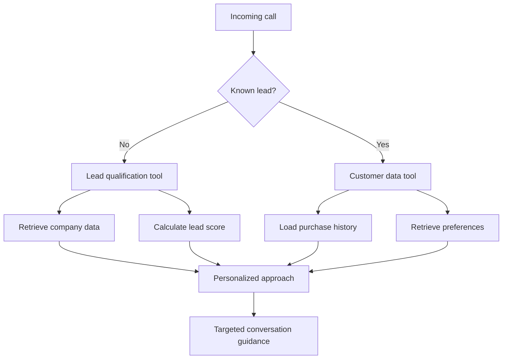
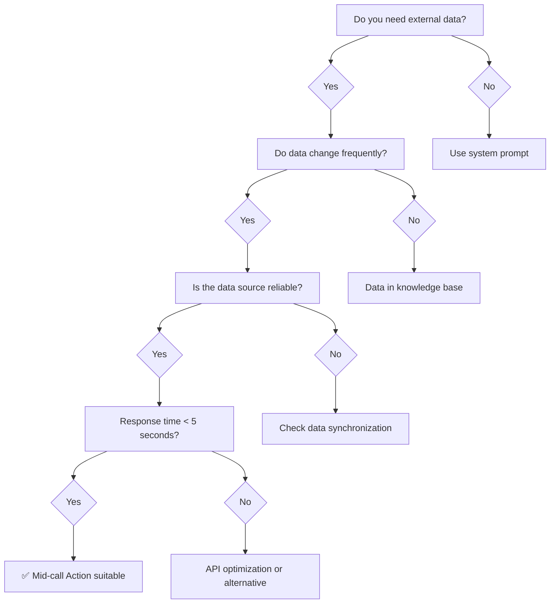

# When Should You Use Mid-call Actions?

Mid-call Actions offer the greatest benefit when your AI assistants need to access external data during conversations. This page helps you identify when their use is sensible and which scenarios are best suited.

## Ideal Suitable Scenarios

### Customer Service and Support

<CardGroup cols={2}>
  <Card title="Account Verification" icon="user-check">
    **When to use**: For any customer inquiry requiring identity verification
    
    **Typical process**:
    - Customer provides email or customer number
    - Automatic matching with CRM system
    - Immediate confirmation and personalization
    
    **ROI**: High - reduces handling time by 60-80%
  </Card>
  
  <Card title="Order Status Queries" icon="box">
    **When to use**: For e-commerce or shipping providers
    
    **Typical process**:
    - Customer asks about delivery status
    - Real-time query to logistics system
    - Accurate information without wait time
    
    **ROI**: Medium-High - eliminates 40-60% of support tickets
  </Card>
</CardGroup>

<AccordionGroup>
  <Accordion title="Technical Support">
    **Optimal use**:
    - Retrieve device/software configuration
    - Access known issues and solutions
    - Automatic ticket creation with system data
    
    **Measurable benefits**:
    - 70% fewer follow-up questions about system configuration
    - 45% faster problem diagnosis
    - 25% increase in first-call resolution
  </Accordion>
  
  <Accordion title="Billing & Accounting">
    **Perfectly suited for**:
    - Retrieve invoice details and history
    - Check payment status in real time
    - Automatic processing of reminders
    
    **Business benefits**:
    - Immediate clarification of payment questions
    - Reduced processing time by 50-70%
    - Automated payment agreements
  </Accordion>
</AccordionGroup>

### Sales and Lead Management



<Tabs>
  <Tab title="Lead Qualification">
    **Ideal scenarios**:
    - B2B sales with complex decision processes
    - High-value products/services with longer sales cycles
    - Multi-stakeholder decisions
    
    **Tool usage**:
    ```yaml
    Company database query:
      - Company size and structure
      - Industry and market position
      - Technology stack
      - Budget range
    
    Lead scoring:
      - Automated BANT score
      - Buying intent analysis
      - Stakeholder mapping
    ```
  </Tab>
  
  <Tab title="Account-Based Sales">
    **When particularly valuable**:
    - Existing customer relationships
    - Cross-selling/up-selling opportunities
    - Enterprise accounts
    
    **Data integration**:
    ```yaml
    CRM integration:
      - Contact history and preferences
      - Past purchases and contracts
      - Open opportunities
      - Support tickets and satisfaction
    
    Personalization:
      - Individualized approach
      - Relevant product suggestions
      - Appointment coordination with account team
    ```
  </Tab>
  
  <Tab title="Appointment Booking">
    **Optimal use cases**:
    - Consulting services
    - Medical practices
    - Service appointments
    
    **Workflow integration**:
    ```yaml
    Calendar tools:
      - Real-time availability check
      - Automatic appointment suggestions
      - Immediate booking confirmation
      - Email/SMS notifications
    
    CRM synchronization:
      - Lead status update
      - Follow-up tasks
      - Team notifications
    ```
  </Tab>
</Tabs>

### E-Commerce and Retail

<CardGroup cols={3}>
  <Card title="Product Consultation" icon="shopping-cart">
    **Use case**: Customer is looking for a specific product or advice
    
    **Tool functions**:
    - Inventory query
    - Product specifications
    - Price comparisons
    - Availability and delivery times
  </Card>
  
  <Card title="Order Processing" icon="credit-card">
    **Use case**: Phone orders or modifications
    
    **Tool functions**:
    - Shopping cart integration
    - Payment processing
    - Shipping options
    - Order confirmation
  </Card>
  
  <Card title="After-Sales Service" icon="headset">
    **Use case**: Support after purchase
    
    **Tool functions**:
    - Warranty inquiry
    - Repair status
    - Spare part availability
    - Return management
  </Card>
</CardGroup>

## Situations Where Mid-call Actions Are NOT Suitable

### Avoid use in:

<Warning>
**Simple information queries**: If the required information is static and rarely changes (e.g., opening hours, general company info), a Mid-call Action is overkill.
</Warning>

<AccordionGroup>
  <Accordion title="Pure information delivery">
    **Unsuitable scenarios**:
    - FAQ-like requests
    - Standardized product information
    - General company data
    
    **Better alternative**: Embed this information directly into the system prompt
  </Accordion>
  
  <Accordion title="Highly complex data processing">
    **Problematic situations**:
    - Calculations taking more than 5 seconds
    - Multi-system queries with complex logic
    - Data analysis with large data volumes
    
    **Why problematic**: Interrupts conversation flow and causes awkward pauses
  </Accordion>
  
  <Accordion title="Unstable or slow APIs">
    **Risk factors**:
    - APIs with more than 30% failure rate
    - Average response times longer than 8 seconds
    - Systems without SLA guarantees
    
    **Consequences**: Poor customer experience and frustration
  </Accordion>
</AccordionGroup>

## Decision Aid: Tool vs. Alternative

### Decision tree for Mid-call Action use



### Evaluation matrix for tool suitability

| Criterion               | Highly suitable   | Moderately suitable | Not suitable   |
|------------------------|------------------|---------------------|---------------|
| **Data freshness**      | Seconds/minutes  | Hours/daily         | Weeks/months  |
| **API response time**   | &lt;3 seconds      | 3-7 seconds          | &gt;7 seconds    |
| **API reliability**    | &gt;99% uptime     | 95-99% uptime        | &lt;95% uptime   |
| **Data volume**         | &lt;1MB            | 1-5MB                | &gt;5MB          |
| **Usage frequency**     | Daily           | Weekly               | Monthly       |
| **Business criticality**| High            | Medium               | Low           |

## Implementation Roadmap

### Phase 1: Foundation (Weeks 1-2)
<Steps>
  <Step title="Use Case Identification">
    - Analyze most frequent customer inquiries
    - Identify data sources
    - Assess automation potential
  </Step>
  
  <Step title="System Assessment">
    - Review API documentation
    - Conduct performance tests
    - Evaluate security requirements
  </Step>
</Steps>

### Phase 2: Pilot Implementation (Weeks 3-4)
<Steps>
  <Step title="Simple Use Case">
    - Start with read-only operation
    - Example: Contact data query
    - Monitoring and performance measurement
  </Step>
  
  <Step title="Feedback Collection">
    - Evaluate customer reactions
    - Analyze technical metrics
    - Identify optimization needs
  </Step>
</Steps>

### Phase 3: Scale & Optimize (Weeks 5-8)
<Steps>
  <Step title="Advanced Use Cases">
    - Introduce write operations
    - Multi-system integrations
    - Implement complex workflows
  </Step>
  
  <Step title="Continuous Improvement">
    - A/B testing of different approaches
    - Performance optimization
    - Evaluate new integrations
  </Step>
</Steps>

## Cost-Benefit Analysis

### Investment calculation

<Tabs>
  <Tab title="One-time costs">
    ```yaml
    Development & setup:
      - API integration: €2,000 - €8,000
      - Testing & QA: €1,000 - €3,000
      - Documentation: €500 - €1,500
      - Training: €500 - €2,000
    
    Total: €4,000 - €14,500
    ```
  </Tab>
  
  <Tab title="Ongoing costs">
    ```yaml
    Operation & maintenance:
      - API fees: €50 - €500/month
      - Monitoring: €30 - €200/month
      - Support: €100 - €800/month
      - Updates: €200 - €1,000/quarter
    
    Monthly: €180 - €1,500
    ```
  </Tab>
  
  <Tab title="Savings">
    ```yaml
    Direct savings:
      - Personnel costs: €2,000 - €10,000/month
      - Processing time: 40-70% reduction
      - Error costs: 50-80% reduction
      - Customer satisfaction: +15-30%
    
    ROI: 3-12 months
    ```
  </Tab>
</Tabs>

## Next Steps

<CardGroup cols={2}>
  <Card title="Explore Template Library" icon="clone" href="/en/automation-platform/mid-call-tools/integration-templates/hubspot-kontakt-abruf">
    Start with proven integration templates for popular CRM systems
  </Card>
  <Card title="Plan Custom Integration" icon="code" href="/en/automation-platform/mid-call-tools/custom-api-integration">
    Develop tailored solutions for your specific requirements
  </Card>
</CardGroup>

---

<Tip>
**Best practice**: Always start with a simple, low-risk use case and gradually expand. Continuously measure performance and impacts on the customer experience.
</Tip>
