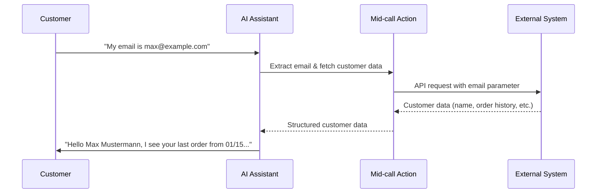
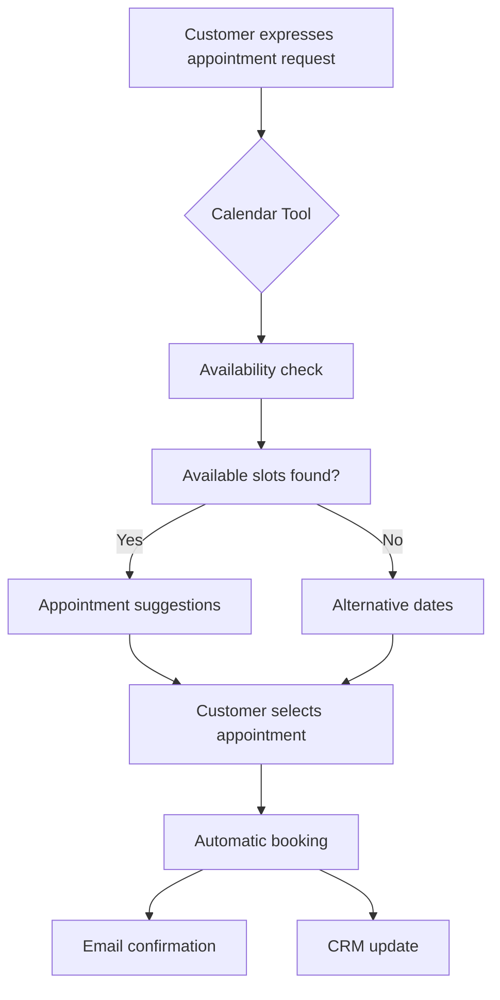

# What Are Mid-call Actions?

Mid-call Actions are specialized functions executed during active phone calls that enable your AI assistant to access external systems and data sources in real time. These tools transform static conversation management into dynamic, data-driven interactions.

## Definition and Core Features

<CardGroup cols={2}>
  <Card title="Real-Time Data Integration" icon="database">
    Access to customer and company data during the ongoing conversation
  </Card>
  <Card title="API-Based Connectivity" icon="plug">
    Seamless integration with CRM systems, databases, and external services
  </Card>
  <Card title="Context-Sensitive Processing" icon="brain">
    Automatic extraction and processing of conversation parameters
  </Card>
  <Card title="Dynamic Conversation Adjustment" icon="comments">
    Personalization of responses based on retrieved data
  </Card>
</CardGroup>

## How It Works in Detail



## Benefits and Added Value

### For the Customer Experience

<AccordionGroup>
  <Accordion title="Personalized Interactions">
    - **Instant Customer Recognition**: "I see you are Max Mustermann from Beispiel GmbH..."
    - **Contextual Responses**: Considering customer history and preferences  
    - **Proactive Problem Solving**: Access to support tickets and known issues
  </Accordion>
  
  <Accordion title="Reduced Waiting Times">
    - **Elimination of Follow-Up Questions**: Automatic access to relevant information
    - **Shorter Call Duration**: Efficient data retrieval without manual searching
    - **First-Call Resolution**: Resolving inquiries in the first call
  </Accordion>
  
  <Accordion title="Consistent Service Quality">
    - **Standardized Data Access**: Always up-to-date and complete information
    - **24/7 Availability**: Round-the-clock access to all customer data
    - **Error Reduction**: Minimization of manual input errors
  </Accordion>
</AccordionGroup>

### For Your Company

<CardGroup cols={3}>
  <Card title="Increased Efficiency" icon="rocket">
    Automation of recurring data queries and processing
  </Card>
  <Card title="Cost Reduction" icon="coins">
    Reduced personnel effort through automated information retrieval
  </Card>
  <Card title="Data Quality" icon="shield-halved">
    Always current data directly from source systems
  </Card>
</CardGroup>

## Typical Use Cases

### Customer Service & Support

| Scenario           | Mid-call Action              | Customer Benefit                        |
|--------------------|-----------------------------|---------------------------------------|
| **Account Inquiry** | Retrieve account data via customer ID | Immediate availability of account balance |
| **Order Status**    | Check order history and delivery status | Real-time updates without wait time    |
| **Ticket Tracking** | Access support ticket system | Current status and next steps          |
| **Product Availability** | Query inventory stock     | Instant information about availability |

### Sales & Lead Qualification

<Tabs>
  <Tab title="Lead Scoring">
    ```yaml
    Process:
      1. Automatic company data lookup upon company mention
      2. Scoring based on size, industry, budget
      3. Dynamic conversation flow depending on lead score
      4. Automatic CRM update with call notes
    ```
  </Tab>
  
  <Tab title="Appointment Scheduling">
    ```yaml
    Workflow:
      1. Availability check in calendar system
      2. Automatic appointment suggestions based on preferences
      3. Immediate booking confirmation
      4. Email dispatch with appointment details
    ```
  </Tab>
  
  <Tab title="Price Inquiry">
    ```yaml
    Dynamics:
      1. Product configurator integration
      2. Customer segment-specific pricing calculation  
      3. Consideration of discounts and promotions
      4. Instant offer creation
    ```
  </Tab>
</Tabs>

### Appointment Scheduling



## Technical Foundations

### Integration Architectures

Mid-call Actions offer two main integration approaches:

<CardGroup cols={2}>
  <Card title="Direct API Integration" icon="globe">
    - Standard HTTP/REST APIs for simple data queries
    - JSON data format for structured exchange
    - Secure authentication via API keys or OAuth
    - Ideal for 1:1 operations (fetch contact, check status)
  </Card>
  <Card title="Webhook Integration with Famulor Automation" icon="link">
    - Complex multi-system workflows possible
    - Conditional logic and business rules
    - Time-delayed actions and follow-ups
    - Ideal for process automation and data orchestration
  </Card>
</CardGroup>

### Real-Time Processing

<AccordionGroup>
  <Accordion title="Performance Features">
    - Timeout management for quick response times
    - Asynchronous data processing
    - Error handling and fallback mechanisms
    - Caching for optimized performance
  </Accordion>
  
  <Accordion title="Webhook Benefits">
    - **Multi-System Integration**: One workflow can orchestrate multiple APIs and services
    - **Business Logic**: Implementation of complex decision trees
    - **Scalability**: Automatic load balancing and retry mechanisms
    - **No-Code Configuration**: Create workflows via visual interface
  </Accordion>
</AccordionGroup>

### Supported Integrations

<AccordionGroup>
  <Accordion title="CRM Systems">
    - **HubSpot**: Contacts, deals, companies, tickets
    - **Salesforce**: Leads, opportunities, accounts, cases  
    - **Pipedrive**: People, organizations, deals, activities
    - **Customizable**: Any system with REST API
  </Accordion>
  
  <Accordion title="Business Applications">
    - **Google Sheets**: Data retrieval and updates
    - **Microsoft Excel**: Online spreadsheets and reports
    - **Notion**: Databases and document management
    - **Airtable**: Structured databases
  </Accordion>
  
  <Accordion title="Communication Tools">
    - **Slack**: Messages and notifications
    - **Microsoft Teams**: Chat and file exchange
    - **WhatsApp Business**: Messaging integration
    - **Email Services**: Automated email sending
  </Accordion>
  
  <Accordion title="Specialized Services">
    - **Calendar Systems**: Appointment booking and management
    - **Payment Systems**: Transaction status and history
    - **Inventory Management**: Stock levels and availability
    - **Custom APIs**: Tailored business logic
  </Accordion>
</AccordionGroup>

## Security and Data Protection

<Warning>
**Important Note on Data Security**: Mid-call Actions process sensitive customer data in real time. Ensure that all integrated systems comply with applicable data protection regulations (GDPR).
</Warning>

### Best Practices for Secure Implementation

<Steps>
  <Step title="API Authentication">
    - Use secure API keys or OAuth 2.0
    - Regular rotation of credentials
    - Minimal permissions (Principle of Least Privilege)
  </Step>
  
  <Step title="Data Minimization">
    - Retrieve only the information actually needed
    - No permanent storage of sensitive data
    - Automatic data cleanup after call ends
  </Step>
  
  <Step title="Transmission Security">
    - Only encrypted HTTPS connections
    - Validation of SSL certificates
    - Protection against man-in-the-middle attacks
  </Step>
  
  <Step title="Error Handling">
    - Graceful degradation on API failures
    - No exposure of sensitive info in error messages
    - Logging and monitoring for security audits
  </Step>
</Steps>

## Performance and Optimization

### Response Time Optimization

| Parameter           | Recommended Value | Critical Value      |
|---------------------|-------------------|--------------------|
| **API Timeout**      | 5 seconds         | 10 seconds         |
| **Data Transfer**    | < 2 MB            | < 5 MB             |
| **Processing Time**  | < 1 second        | < 3 seconds        |
| **Fallback Time**    | < 500 ms          | < 1 second         |

### Caching Strategies

<Tabs>
  <Tab title="Session Cache">
    ```yaml
    Purpose: Reuse of data within a conversation
    Duration: Until call ends
    Use Case: Customer data, product catalogs
    Benefit: Reduced API calls, improved performance
    ```
  </Tab>
  
  <Tab title="Time-based Cache">  
    ```yaml
    Purpose: Temporary storage of frequently requested data
    Duration: 5-15 minutes
    Use Case: Inventory levels, price lists
    Benefit: Freshness with reduced server load
    ```
  </Tab>
  
  <Tab title="Smart Invalidation">
    ```yaml
    Purpose: Intelligent caching based on data changes
    Trigger: Webhook notifications
    Use Case: CRM updates, order status changes  
    Benefit: Optimal balance between performance and freshness
    ```
  </Tab>
</Tabs>

## Next Steps

<CardGroup cols={3}>
  <Card title="View Integration Templates" icon="clone" href="/en/automation-platform/mid-call-tools/integration-templates/hubspot-kontakt-abruf">
    Explore pre-built templates for popular CRM systems and services
  </Card>
  <Card title="Webhook Automation" icon="link" href="/en/automation-platform/mid-call-tools/integration-templates/webhook-automation">
    Discover complex multi-system workflows through the Famulor Automation Platform
  </Card>
  <Card title="Build Your Own Tools" icon="code" href="/en/automation-platform/mid-call-tools/custom-api-integration">
    Learn how to develop custom Mid-call Actions for your specific needs
  </Card>
</CardGroup>

---

<Info>
**Tip**: Start with simple read-only integrations (e.g., contact data retrieval) before implementing more complex write operations (e.g., lead creation).
</Info>