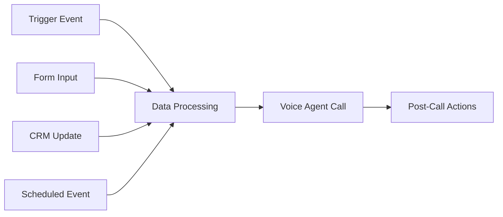

# Famulor Developer Documentation

Welcome to the Famulor Developer Documentation! Here you’ll find everything you need to create and deploy Voice Agents with Famulor.

## Introduction

Famulor provides powerful tools to integrate AI-driven Voice Agents into your applications. With our API and automation platform, you can:

- **Trigger Voice Agents programmatically** – Direct API calls for real-time integration
- **Create automated workflows** – No-code solutions for complex business processes  
- **Integrate calls into existing systems** – Seamless CRM and business tool connections

<CardGroup cols={2}>
  <Card title="API Integration" icon="code" href="/en/api-reference/introduction">
    Direct programmatic access to all Famulor features
  </Card>
  <Card title="No-Code Automation" icon="wand-magic-sparkles" href="/en/automation-platform/introduction">
    Visual workflow creation without coding
  </Card>
</CardGroup>

## Triggering Calls: Two Approaches

### 1. Trigger Calls via API (Programmatically)

For developers needing direct control over call initiation:

```javascript
const response = await fetch('https://app.famulor.de/api/user/make_call', {
  method: 'POST',
  headers: {
    'Authorization': 'Bearer YOUR_API_KEY',
    'Content-Type': 'application/json'
  },
  body: JSON.stringify({
    phone_number: '+4915123456789',
    assistant_id: 123,
    variables: {
      customer_name: 'Max Mustermann',
      email: 'max.mustermann@example.com'
    }
  })
});
```

**Ideal for:**
- Real-time call triggering
- Dynamic parameter injection
- Immediate response handling
- Integration into existing applications

<Card title="API Call Documentation" icon="phone" href="/en/api-reference/calls/make">
  Complete reference for programmatic call triggering
</Card>

### 2. Trigger Calls via Automation (Recommended)

For more complex business workflows involving multiple steps:



**Benefits:**
- **No programming required** – Visual workflow creation
- **Integrated data processing** – Automatic lead enrichment
- **Multi-step workflows** – Pre- and post-call automation
- **Prebuilt integrations** – CRM, email, calendar tools

<Card title="Automation Tutorial" icon="wand-magic-sparkles" href="/en/automation-platform/tutorials/outbound-form-call">
  Step-by-step guide for automated call workflows
</Card>

## Authentication

All API calls require a valid API key:

<Steps>
  <Step title="Obtain API Key">
    Log in to [your Famulor dashboard](https://app.famulor.de) and navigate to the "API Keys" page
  </Step>
  <Step title="Store the Key Securely">
    Copy the API key and save it securely in your environment variables
  </Step>
  <Step title="Use in Requests">
    Include the key in the `Authorization: Bearer YOUR_API_KEY` header
  </Step>
</Steps>

<Warning>
Keep your API key confidential and never commit it to version control systems.
</Warning>

<Card title="Complete Authentication Guide" icon="key" href="/en/api-reference/authentication">
  Detailed information on API authentication
</Card>

## Quick Start: Your First Call

```bash
# 1. Set API key (replace YOUR_API_KEY)
export FAMULOR_API_KEY="your_actual_api_key_here"

# 2. List assistants
curl -X GET "https://app.famulor.de/api/user/assistants" \
  -H "Authorization: Bearer $FAMULOR_API_KEY"

# 3. Make a call
curl -X POST "https://app.famulor.de/api/user/make_call" \
  -H "Authorization: Bearer $FAMULOR_API_KEY" \
  -H "Content-Type: application/json" \
  -d '{
    "phone_number": "+4915123456789",
    "assistant_id": 123,
    "variables": {
      "customer_name": "Test Kunde"
    }
  }'
```

## Voice Agent Deployment Strategies

### Real-Time Integration
- **Web applications**: Instant call triggering via user interaction
- **CRM integration**: Calls directly from customer records
- **Support systems**: Automatic escalation to Voice Agents

### Campaign-Based Deployment
- **Bulk lead processing**: Automatically process large lead volumes
- **Scheduled execution**: Plan calls at optimal times
- **Progress tracking**: Detailed campaign analytics

### Event-Driven Activation
- **Webhook triggers**: Trigger calls from external events
- **Automation platform**: Complex multi-step workflows
- **Conditional logic**: Intelligent call routing decisions

## Developer Resources

<CardGroup cols={2}>
  <Card title="API Reference" icon="book" href="/en/api-reference/introduction">
    Complete API documentation with examples
  </Card>
  <Card title="Automation Platform" icon="diagram-project" href="/en/automation-platform/introduction">
    No-code workflow creation for Voice Agents
  </Card>
  <Card title="Integration Examples" icon="puzzle-piece" href="/en/automation-platform/integrations/overview">
    Prebuilt integrations for popular tools
  </Card>
  <Card title="Webhooks" icon="link" href="/en/api-reference/webhooks/post-call">
    Post-call data processing and automation
  </Card>
</CardGroup>

## Next Steps

1. **[Create an API key](/en/api-reference/authentication)** – Set up authentication  
2. **[Make your first call](/en/api-reference/calls/make)** – Test API integration  
3. **[Explore automation](/en/automation-platform/introduction)** – Build no-code workflows  
4. **[Configure integrations](/en/automation-platform/integrations/overview)** – Connect business tools  

<Tip>
Start with the automation platform if you want to model complex business processes. Use the direct API for simple, programmatic integrations.
</Tip>