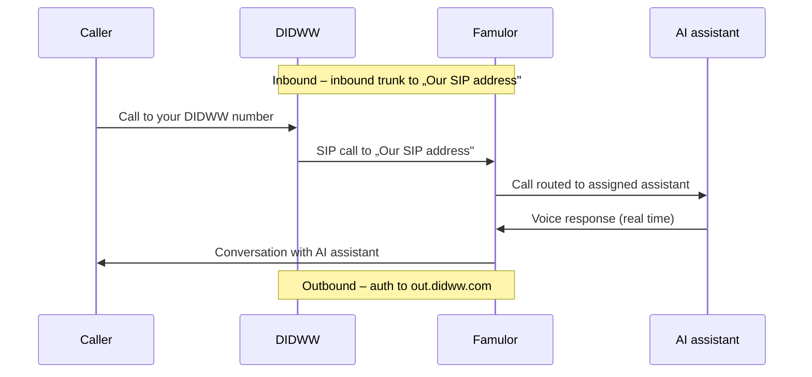

import SipDoneForYou from '/en/snippets/sip-done-for-you-partner-en.mdx';

<SipDoneForYou />

# Connect a DIDWW Number to Famulor

This guide connects a **DIDWW** phone number to Famulor via SIP trunks.

<Note>
  **DIDWW** (with POPs in Frankfurt, Amsterdam, London, Madrid and more) is **not** the same as **DIDLogic** – it is a separate provider. For DIDLogic, see [DIDLogic Integration](/en/provisioning/sip-ai/didlogic-integration).
</Note>

<Note>
  Famulor has **no** dedicated DIDWW import feature. In DIDWW you create **two trunks**:
  - **Inbound trunk** (incoming calls): routes your number to **Famulor's SIP address**.
  - **Outbound trunk** (outgoing calls): provides the credentials Famulor uses to call through `out.didww.com`.
</Note>

## How it works

## Prerequisites

- An active **DIDWW** account with at least one phone number (DID)
- A Famulor account

---

## Step 1: Create an inbound trunk in DIDWW (incoming calls)

1. First, in a second tab, open Famulor at [app.famulor.de/phone-numbers?lang=en](https://app.famulor.de/phone-numbers?lang=en) → **Your phone numbers → + Integrate SIP trunk** and, under **Incoming call settings**, copy the value **Our SIP address** (e.g. `xxxxxx.eu.sip.livekit.cloud`).
2. In the DIDWW portal, go to **Voice → Inbound Trunks** and click **Create New → SIP Trunk**.
3. Enter:
   - **Friendly Name:** e.g. `Famulor`
   - **SIP Endpoint Hostname:** your **Our SIP address** from Famulor
   - **Transport Protocol Type:** TCP/UDP (port 5060) or TLS (port 5061)
4. Click **Create**.

---

## Step 2: Assign the phone number to the inbound trunk

1. Go to **Phone Numbers → My Numbers**.
2. Select the DID number(s).
3. Click **Batch Actions → Update Trunks**.
4. Choose the **Famulor** inbound trunk you just created and confirm with **Confirm**.

---

## Step 3: Create an outbound trunk in DIDWW (outgoing calls)

1. Go to **Voice → Outbound Trunks** and click **Create New**.
2. Enter a **Friendly Name** (e.g. `Famulor`).
3. Keep authentication on **Credentials & IP-based**.
4. Under **Allowed SIP IP addresses**, enter Famulor's **fixed outbound IP** (currently `34.195.177.252/32`).
5. Click **Create**.
6. Then open the **key icon** in the **Credentials** column and note the **Username** and **Password** (reveal the password with the eye icon).

<Note>
  Confirm the **fixed outbound IP** currently shown in the Famulor dialog in case it differs from `34.195.177.252`.
</Note>

---

## Step 4: Set up the SIP trunk in Famulor

1. In Famulor, go to **Your phone numbers** and click **+ Integrate SIP trunk**.
2. Enter the data as follows:

| Field | Value |
| --- | --- |
| **SIP trunk type** | **Phone number (DID)** |
| **Phone number** | Your DIDWW number in E.164 format (e.g. `+12025550123`) |
| **Username** | The **Username** of the DIDWW outbound trunk (Step 3) |
| **Password** | The **Password** of the DIDWW outbound trunk (Step 3) |
| **SIP address** (outbound) | `out.didww.com` (without port) |
| **Outgoing phone number format** | **International (without leading +)** – DIDWW expects E.164 **without** `+` |
| **Fixed outbound IP** | **Enable** („Outbound call will come from a fixed IP address") so calls originate from the IP allowed in DIDWW |
| **Country** | The country of your DIDWW trunk |

3. Under **Incoming call settings**, you'll see **Our SIP address** – the same address you entered as the DIDWW **SIP Endpoint Hostname** in **Step 1**.
4. Click **Add SIP number**.

---

## Step 5: Assign an assistant and test

1. Open **Assistants** in Famulor and edit the assistant you want to use.
2. Select the correct **inbound type** (incoming calls).
3. Choose your connected DIDWW phone number from the list.
4. Click **Save assistant**.
5. Place a **test call** to your DIDWW number and check that the AI assistant answers.

---

## Common issues

<AccordionGroup>
  <Accordion title="Inbound calls do not arrive" icon="phone-slash">
    Check the **inbound trunk** (Step 1): the **SIP Endpoint Hostname** must be the **exact** „Our SIP address" from Famulor. Make sure the **DID is assigned to the inbound trunk** (Step 2).
  </Accordion>

  <Accordion title="Outbound calls fail" icon="arrow-up-right-from-square">
    Check the **SIP address** in Famulor (`out.didww.com`), the outbound trunk **Username** and **Password**. Make sure the **fixed outbound IP** is enabled in Famulor and exactly that IP (`34.195.177.252/32`) is allowed in the DIDWW outbound trunk under **Allowed SIP IP addresses**.
  </Accordion>

  <Accordion title="Outbound calls rejected (number format)" icon="hashtag">
    DIDWW expects outbound numbers in **E.164 without `+`** (e.g. `18489005419`). Set the format in Famulor to **International (without leading +)**.
  </Accordion>

  <Accordion title="Wrong or unknown SIP address" icon="server">
    Always use the **exact** „Our SIP address" from Famulor (Phone numbers → Integrate SIP trunk → Incoming call settings).
  </Accordion>
</AccordionGroup>

---

## Help

<Tip>
  If you need help, contact our support team at [support@famulor.io](mailto:support@famulor.io). For general guidance, see [SIP Integration](/en/provisioning/sip-ai/sip-integration) and [SIP integration issues](/en/troubleshooting/sip-integration-issues).
</Tip>
