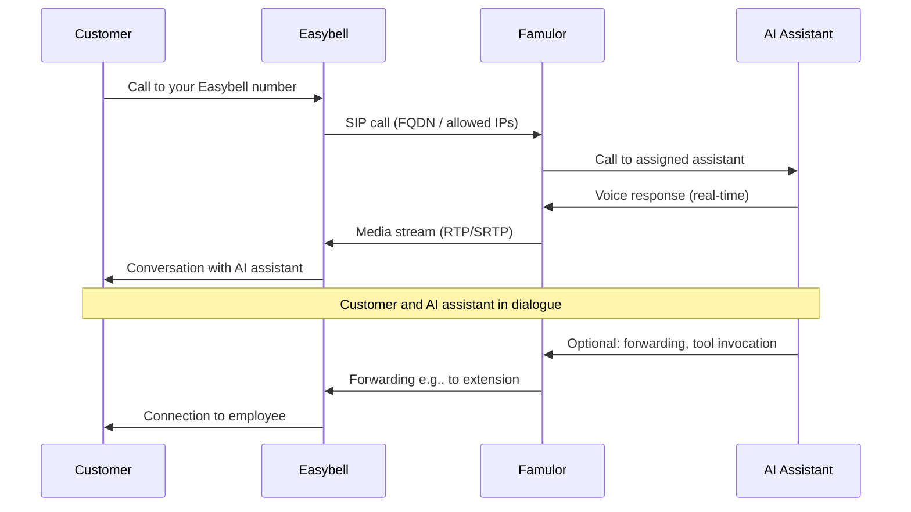

# Easybell Integration

<Note>
  With Famulor, you can connect your **Easybell** telephony to an AI assistant. There are **two ways** – choose your path below and follow the corresponding step-by-step guide.
</Note>

## Which path to choose?

| You have … | Then follow … |
|------------|--------------|
| **Only Easybell SIP Trunk** (without Cloud Phone System) | [Step-by-step: SIP Trunk](#step-by-step-sip-trunk) |
| **Easybell Cloud Phone System Pro** | [Step-by-step: Cloud Phone System](#step-by-step-cloud-phone-system) |

- **SIP Trunk:** The FQDN feature must be requested from Easybell (email to support@easybell.de, approx. €10/month).  
- **Cloud Phone System Pro:** The FQDN is already included, no separate request necessary.

---

## How it works in detail

Calls run from Easybell to Famulor and are assigned to your AI assistant. Flow of an **incoming call**:



---

## Step-by-step: SIP Trunk

Use **only** the Easybell SIP Trunk (without Cloud Phone System). Follow the steps in order.

### Step 1: Request FQDN feature from Easybell

The FQDN feature cannot be booked via the Easybell customer portal. Send an email to **support@easybell.de** with your **Easybell customer number** and request activation of the SIP Trunking FQDN feature for Famulor.

**Example email:**

```text
Dear Easybell team,

Could you please activate the SIP Trunking FQDN feature for use with Famulor?

Thank you very much and best regards
```

<Note>
  **Cost (as of August 2025):** €10 / month. It may take several days to receive confirmation from support.
</Note>

### Step 2: Configure in Famulor

1. Log in at [famulor.de](https://famulor.de).  
2. Select **“Your Phone Numbers”** on the left, then click **“Integrate SIP Trunk”**.


3. Fill in the **SIP Trunk configuration**:  
   - **Authentication:** username and password (from Easybell).  
   - **Outbound Telephony:** SIP address e.g. `voip.easybell.de`, number format (e.g., “International with +”).


4. Set up **Inbound Telephony**:  
   - Enter **allowed IP addresses** (see box below).  
   - Note **“Our SIP address”** – you will need this in Step 3 for Easybell.


**IPs to whitelist at Famulor (SIP Trunk):**

- **TCP/UDP:** 195.52.221.151, 195.185.214.173, 195.52.221.142  
- **TLS:** 212.172.204.95, 212.172.58.207  

5. Confirm the configuration. Then create an **AI assistant** and **assign this phone number** to them.


### Step 3: Enter details in Easybell customer portal

Enter the **Famulor SIP address** as call destination/domain in the Easybell customer portal – **without** the `sip:` prefix.

**Example:** `XXXXX.sip.livekit.cloud` (your address can be found in Famulor under “Our SIP address”).

UDP, TCP, and TLS are supported. For the **number format**, choose E.164 **with** a leading “+”.

#### Authentication via FQDN in “Trunk” mode

If you operate Easybell in **“Trunk”** mode, configure authentication as follows:

- **Authenticate by:** select `fully qualified domain name (FQDN)`.  
- **FQDN:** enter exactly the value shown in Famulor under **“Our SIP address”** (without `sip:`).  
- **Use SRTP:** keep **disabled** (checkbox must **not** be checked).  

The configuration then looks like the example screenshot below:


<Note>
  Details: [Easybell Help SIP Trunk FQDN](https://www.easybell.de/hilfe/fragen/fragen-zum-telefonanschluss/antwort/sip-trunk-authentifizierung-per-fqdn-domain-einrichten/).
</Note>

### Step 4: Test

- Test an incoming call to your Easybell number.  
- Check whether the AI assistant responds and the number format is correct.

---

## Step-by-step: Cloud Phone System

You use the **Easybell Cloud Phone System Pro**. The FQDN is already included – no email to Easybell required. First set up in Famulor (same as for SIP Trunk), then in the Cloud Phone System.

### Step 1: Configure in Famulor (as SIP Trunk)

- As described in [Step 2: Configure in Famulor](#step-2-configure-in-famulor) (login → “Your Phone Numbers” → “Integrate SIP Trunk” → authentication, outbound and inbound telephony).  
- **Important:** For **Inbound Telephony** enter different IPs than for the pure SIP Trunk (see box below).

**IPs to whitelist at Famulor (Cloud Phone System):**

- 62.144.211.104  
- 195.52.221.134  
- 195.52.221.137  

Note “Our SIP address” from Famulor – this is needed in Step 2 at Easybell.

### Step 2: Set up Cloud Phone System at Easybell

1. **Open Cloud Phone System**  
   Log into the [Easybell customer portal](https://www.easybell.de) → **Phone Functions** → **Cloud Phone System**.


2. **Create a new FQDN extension**  
   In **Extensions and Call Groups**, click **+ Add**. Extension type: **FQDN connection**. Under **Incoming Telephony**, assign the number and extension where Famulor should be reachable.


3. **Enter FQDN**  
   Enter the **Famulor SIP URI** (“Our SIP address”) **without** `sip:` – e.g., `your-unique-id.sip.livekit.cloud`.

4. **Allow forwarding (optional)**  
   In the FQDN extension settings enable **“Allow forwarding”** if the AI assistant should forward calls to internal extensions. Only available with **Cloud Phone System Pro**; forwarding only allowed internally.


### Step 3: Forwarding in Famulor (optional)

If calls should be forwarded to employees (extensions):

- Create a **cold** or **warm forwarding** under **Tools** in Famulor and use it in your prompt.  
- Choose type **“SIP”** (not “phone number”).  
- **SIP URL:** internal short number in the format **extension@easybell**, e.g., `200@easybell`. The **“@easybell”** is mandatory.


### Step 4: Test

Test an incoming call and check if the AI assistant answers and forwarding works if configured.

---

## Important notes

- **Number format:** Set E.164 **with** leading “+” in Easybell.  
- **SIP credentials:** Keep username/password secure; password at least 12 characters with numbers, uppercase/lowercase letters, and optionally special characters.  
- **Domain:** Always use the SIP address shown by Famulor (e.g., `… .sip.livekit.cloud`).

## Common issues

<AccordionGroup>
  <Accordion title="FQDN feature not available (SIP Trunk)" icon="envelope">
    The SIP Trunking FQDN feature must be requested from Easybell. Send an email to **support@easybell.de** with your **Easybell customer number** and a request for activation for Famulor. Activation may take several days.
  </Accordion>

  <Accordion title="Calls are not coming through" icon="phone-slash">
    Check the **allowed IP addresses** in Famulor under “Inbound Telephony” (enter SIP Trunk or Cloud IPs according to your setup). Make sure Easybell uses the number format **E.164 with leading “+”**.
  </Accordion>

  <Accordion title="Wrong or unknown domain" icon="server">
    Enter the **exact SIP address** from Famulor (“Our SIP address” under Phone Numbers → Integrate SIP Trunk). **Without** `sip:` prefix, **without** spaces – use only the displayed value (e.g., `… .sip.livekit.cloud`).
  </Accordion>

  <Accordion title="Forwarding to extension not working (Cloud Phone System)" icon="phone-flip">
    Only works with **Cloud Phone System Pro** and only for **internal** extensions. In the FQDN extension, enable the option **“Allow forwarding”**. Use forwarding type **“SIP”** in Famulor and SIP URL format **extension@easybell** (e.g., `200@easybell`).
  </Accordion>
</AccordionGroup>

## Help

<Tip>
  Our support will assist you with setup: [support@famulor.io](mailto:support@famulor.io). For questions about FQDN/products: [support@easybell.de](mailto:support@easybell.de).
</Tip>