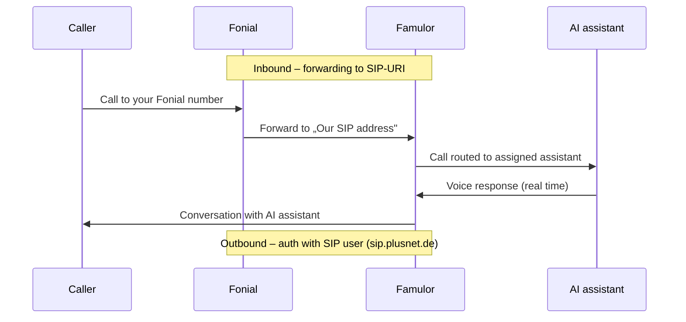

import SipDoneForYou from '/en/snippets/sip-done-for-you-partner-en.mdx';

<SipDoneForYou />


# Connect a Fonial Number to Famulor

This guide walks you through connecting a Fonial phone number to Famulor step by step.

<Note>
  Famulor has **no** dedicated „Fonial import". You connect your Fonial number like any other provider through the **Integrate SIP trunk** feature in Famulor.

  The full setup has two parts that work together:
  - **Outbound calls:** a **SIP user** in Fonial provides the credentials Famulor uses to authenticate to Fonial.
  - **Inbound calls:** a **forwarding to SIP-URI** in Fonial sends calls to Famulor's SIP address.
</Note>

<Warning>
  **fonial PLUS customers only:** The Voice AI integration can only be used by **PLUS customers** of Fonial. If you are currently a **FREE customer**, you need to upgrade your plan to use this feature. Contact Fonial support by phone at **0221 66966966** or by email at [support@fonial.de](mailto:support@fonial.de) and ask whether the feature is included in your package.
</Warning>

## How it works



- **Inbound:** Famulor does **not** register via SIP REGISTER at Fonial. Incoming calls reach Famulor through the **forwarding to SIP-URI** (Step 5).
- **Outbound:** Famulor authenticates per call with the **SIP user credentials** at `sip.plusnet.de`.

<Note>
  The **SIP user stays „Offline" in Fonial** – this is correct and not an error. Famulor does not register, so the status never switches to „Online". Incoming calls run through the forwarding, **not** through registration.
</Note>

## Prerequisites

- An active Fonial account with at least one phone number
- **SIP trunking / SIP user** available in your Fonial plan (see [Fonial help: Trunking setup](https://www.fonial.de/hilfe/trunking/einrichtung-trunking))
- A Famulor account
- Access to the Fonial customer portal at [kundenkonto.fonial.de](https://kundenkonto.fonial.de)

---

## Step 1: Create a SIP user in Fonial

The SIP user provides the credentials for **outbound** calls.

1. Sign in to your [Fonial customer account](https://kundenkonto.fonial.de).
2. In the sidebar, open **SIP-Benutzer** (SIP users).
3. Click **Neuen SIP-Benutzer anlegen** (Create new SIP user) at the top right.


4. Enter a name for the SIP user (e.g. `Famulor`) and click **Speichern** (Save).


5. The new SIP user appears in the list with **status Offline**. It stays Offline even after setup – see the note above.


---

## Step 2: Open the SIP user credentials

1. In the SIP user row, under **Aktionen** (Actions), click the **credentials** icon.


2. Note the displayed **Zugangsdaten SIP-Benutzer** (SIP user credentials):

| Field | Meaning |
| --- | --- |
| **Benutzername** | SIP username (needed in Famulor) |
| **Passwort** | SIP password (needed in Famulor) |
| **Server URL** | `sip.plusnet.de` – the SIP address for Famulor |


<Note>
  Keep the **username** and **password** safe. You need both in **Step 4** for the Famulor SIP trunk setup.
</Note>

---

## Step 3: Assign the phone number to the SIP user

1. In the sidebar, open **Rufnummern** (Phone numbers).
2. Tick the **checkbox** next to the number you want to connect to Famulor.
3. Click **SIP-Benutzer zuordnen** (Assign SIP user) at the bottom.


4. In the **SIP-Benutzer festlegen** dialog, select the SIP user you just created (e.g. `Famulor`) and click **Speichern** (Save).


<Note>
  Note your Fonial number in **E.164 format** with country code, e.g. `+498956546546`. You need it in the next steps.
</Note>

---

## Step 4: Set up the SIP trunk in Famulor

1. Open Famulor at [app.famulor.de/phone-numbers?lang=en](https://app.famulor.de/phone-numbers?lang=en).
2. In the sidebar, go to **Your phone numbers**.
3. Click **+ Integrate SIP trunk** at the top right.
4. Enter the data as follows:

| Field | Value |
| --- | --- |
| **SIP trunk type** | **SIP extension** |
| **Your SIP extension** | Your Fonial number in E.164 format (e.g. `+498956546546`) |
| **Username** | The **username** of the Fonial SIP user (from Step 2) |
| **Password** | The **password** of the Fonial SIP user (from Step 2) |
| **SIP address** (outbound) | `sip.plusnet.de` (the Server URL from Step 2, without port) |
| **Outgoing phone number format** | **International (with leading +)** |
| **Country** | **Germany (DE)** |

5. Under **Incoming call settings**, copy the value **Our SIP address** (e.g. `xxxxxx.eu.sip.livekit.cloud`). You need it in Step 5.
6. Click **Add SIP number**.


<Note>
  With this configuration, **outbound** calls are already covered: Famulor authenticates with username and password at `sip.plusnet.de`. For **inbound** calls, set up the forwarding in Fonial in Step 5.
</Note>

---

## Step 5: Create the forwarding to SIP-URI in Fonial (inbound calls)

To make incoming calls arrive at Famulor, create your AI phone assistant as a **target** in Fonial. Fonial then forwards calls to Famulor's SIP address.

### Build the SIP-URI from „Our SIP address"

Build the SIP-URI from your Fonial number and the **Our SIP address** value you copied in Step 4:

```text
sip:<Fonial number without +>@<Our SIP address>
```

**Example:** `+498956546546` and `xxxxxx.eu.sip.livekit.cloud` become:

```text
sip:498956546546@xxxxxx.eu.sip.livekit.cloud
```

<Note>
  The phone number in the SIP-URI must be entered **without the plus sign (`+`)**.
</Note>

### Create the target in the Fonial customer account

1. In the navigation menu, under **Telefonanlage**, select **Ziele** (Targets).
2. Click **Neues Ziel anlegen** (Create new target).


3. Choose **Weiterleitung (Mobilfunk, Festnetz, Fax oder SIP-URI)** as the target type.
4. Enter a **name** for the forwarding target (e.g. `Famulor`).
5. In the dropdown, select **Weiterleitung auf SIP-URI** (Forward to SIP-URI).
6. Under **SIP-URI**, paste the SIP address you built above.
7. As the **outgoing phone number** (Ausgehende Rufnummer), select the Fonial number you want to connect to Famulor.
8. Finally, click **Speichern** (Save).


---

## Step 6: Assign an assistant and test

To have incoming calls answered by your AI assistant, assign the number to an assistant.

1. Open **Assistants** in Famulor and edit the assistant you want to use.
2. Select the correct **inbound type** (incoming calls).
3. Choose your connected Fonial phone number from the list.
4. Click **Save assistant**.
5. Place a **test call** to your Fonial number and check that the AI assistant answers.

---

## Common issues

<AccordionGroup>
  <Accordion title="SIP user shows „Offline“" icon="circle-info">
    This is **normal and not an error**. Famulor does **not** register via SIP REGISTER at Fonial, so the SIP user stays „Offline". Incoming calls run through the **forwarding to SIP-URI** (Step 5), not through registration.
  </Accordion>

  <Accordion title="Inbound calls do not arrive" icon="phone-slash">
    Check the **forwarding to SIP-URI** in Fonial (Step 5): SIP-URI in the format `sip:<number without +>@<Our SIP address>`, the correct **outgoing phone number**, and the **exact** „Our SIP address" from Famulor (no second `sip:`, no spaces).
  </Accordion>

  <Accordion title="Outbound calls fail" icon="arrow-up-right-from-square">
    Check the **username**, **password** and **SIP address** (`sip.plusnet.de`) from the Fonial credentials (Step 2) in Famulor. Set the **Outgoing phone number format** to **International (with leading +)**.
  </Accordion>

  <Accordion title="Wrong or unknown SIP address" icon="server">
    Use the **exact** „Our SIP address" from Famulor (Phone numbers → Integrate SIP trunk → Incoming call settings). The phone number in the SIP-URI must be entered **without** the plus sign.
  </Accordion>
</AccordionGroup>

---

## Help

<Tip>
  If you need help, contact our support team at [support@famulor.io](mailto:support@famulor.io). You can reach Fonial support by phone at **0221 66966966** or by email at [support@fonial.de](mailto:support@fonial.de) – more info in the [Fonial help center](https://www.fonial.de/hilfe/trunking/einrichtung-trunking).
</Tip>
