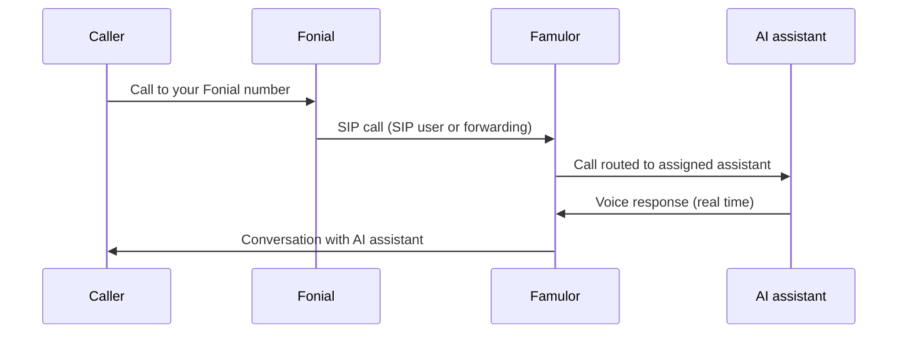

import SipDoneForYou from '/en/snippets/sip-done-for-you-partner-en.mdx';

<SipDoneForYou />


# Connect a Fonial Number to Famulor

This guide walks you through connecting a Fonial phone number to Famulor step by step.

<Note>
  Famulor has **no** dedicated „Fonial import". You connect your Fonial number like any other provider through the **Integrate SIP trunk** feature in Famulor. There are **two ways** to do this – choose your path below and follow the matching step-by-step guide.
</Note>

<Warning>
  **fonial PLUS customers only:** The Voice AI integration can only be used by **PLUS customers** of Fonial. If you are currently a **FREE customer**, you need to upgrade your plan to use this feature. Contact Fonial support by phone at **0221 66966966** or by email at [support@fonial.de](mailto:support@fonial.de) and ask whether the feature is included in your package.
</Warning>

## Which path to choose?

| You want to … | Then follow … |
|---------------|---------------|
| Connect Famulor with **SIP credentials** (SIP user / registration) | [Path 1: SIP extension](#path-1-sip-extension-sip-user) |
| Forward calls to Famulor via **Forward to SIP-URI** (like the official Fonial guide) | [Path 2: Forward to SIP-URI](#path-2-forward-to-sip-uri) |

- **Path 1 (SIP extension):** Famulor registers with username and password at Fonial. Recommended if you create a SIP user in Fonial.
- **Path 2 (Forward to SIP-URI):** Fonial forwards incoming calls to Famulor's SIP address. Matches Fonial's official Voice AI guide.

## Prerequisites

- An active Fonial account with at least one phone number
- **SIP trunking / SIP user** available in your Fonial plan (see [Fonial help: Trunking setup](https://www.fonial.de/hilfe/trunking/einrichtung-trunking))
- A Famulor account
- Access to the Fonial customer portal at [kundenkonto.fonial.de](https://kundenkonto.fonial.de)

## How it works

Incoming calls flow through Fonial to Famulor, where they are routed to your AI assistant.



---

## Path 1: SIP extension (SIP user)

With this path, you create a **SIP user** in Fonial and enter its credentials in Famulor. Famulor registers at Fonial's SIP server (`sip.plusnet.de`).

### Step 1: Create a SIP user in Fonial

1. Sign in to your [Fonial customer account](https://kundenkonto.fonial.de).
2. In the sidebar, open **SIP-Benutzer** (SIP users).
3. Click **Neuen SIP-Benutzer anlegen** (Create new SIP user) at the top right.


4. Enter a name for the SIP user (e.g. `Famulor`) and click **Speichern** (Save).


5. The new SIP user appears in the list. Its **status** is **Offline** at first – this is normal as long as no device is connected yet.


### Step 2: Open the SIP user credentials

1. In the SIP user row, under **Aktionen** (Actions), click the **credentials** icon.


2. Note the displayed **Zugangsdaten SIP-Benutzer** (SIP user credentials):

| Field | Meaning |
| --- | --- |
| **Benutzername** | SIP username (needed in Famulor) |
| **Passwort** | SIP password (needed in Famulor) |
| **Server URL** | `sip.plusnet.de` – the SIP address for Famulor |


<Note>
  Keep the **username** and **password** safe. You need both in **Step 4** for the Famulor SIP trunk setup.
</Note>

### Step 3: Assign the phone number to the SIP user

To route incoming calls through the SIP user, assign your Fonial phone number to it.

1. In the sidebar, open **Rufnummern** (Phone numbers).
2. Tick the **checkbox** next to the number you want to connect to Famulor.
3. Click **SIP-Benutzer zuordnen** (Assign SIP user) at the bottom.


4. In the **SIP-Benutzer festlegen** dialog, select the SIP user you just created (e.g. `Famulor`) and click **Speichern** (Save).


<Note>
  Note your Fonial number in **E.164 format** with country code, e.g. `+498956546546`. You need it in the next step in Famulor.
</Note>

### Step 4: Set up the SIP trunk in Famulor

1. Open Famulor at [app.famulor.de/phone-numbers?lang=en](https://app.famulor.de/phone-numbers?lang=en).
2. In the sidebar, go to **Your phone numbers**.
3. Click **+ Integrate SIP trunk** at the top right.
4. Enter the data as follows:

| Field | Value |
| --- | --- |
| **SIP trunk type** | **SIP extension** |
| **Your SIP extension** | Your Fonial number in E.164 format (e.g. `+498956546546`) |
| **Username** | The **username** of the Fonial SIP user (from Step 2) |
| **Password** | The **password** of the Fonial SIP user (from Step 2) |
| **SIP address** (outbound) | `sip.plusnet.de` (the Server URL from Step 2, without port) |
| **Outgoing phone number format** | **International (with leading +)** |
| **Authentication method** (inbound) | **Username and password** (same credentials as outbound) |
| **Country** | **Germany (DE)** |

5. Click **Add SIP number**.


<Note>
  With the trunk type **SIP extension**, Famulor registers directly with the username and password at Fonial. You do **not** need to set up any forwarding or SIP-URI in Fonial – assigning the number to the SIP user (Step 3) is enough.
</Note>

### Step 5: Verify the connection

In Fonial, under **SIP-Benutzer**, check that the **status** switches to **Online**. This confirms Famulor is connected successfully.


Then continue with [Assign an assistant and test](#assign-an-assistant-and-test).

---

## Path 2: Forward to SIP-URI

With this path, you create your AI phone assistant as a **target** (forwarding) in Fonial. Fonial forwards incoming calls to **Famulor's SIP address**. This matches Fonial's official Voice AI guide – except you use the **SIP address from Famulor** instead of an „Origination URL".

### Step 1: Get your SIP address from Famulor

1. Open Famulor at [app.famulor.de/phone-numbers?lang=en](https://app.famulor.de/phone-numbers?lang=en) and go to **Your phone numbers → + Integrate SIP trunk**.
2. Add your Fonial number as a trunk and, under **Incoming call settings**, copy the value **Our SIP address** (e.g. `xxxxxx.eu.sip.livekit.cloud`).
3. Build the **SIP-URI** for Fonial from it:

```text
sip:<Fonial number without +>@<Our SIP address>
```

**Example:** the number `+498956546546` and the address `xxxxxx.eu.sip.livekit.cloud` become:

```text
sip:498956546546@xxxxxx.eu.sip.livekit.cloud
```

<Note>
  The phone number in the SIP-URI must be entered **without the plus sign (`+`)**.
</Note>

### Step 2: Create a target in the Fonial customer account

Next, create your AI phone assistant as a target in your phone system.

1. In the navigation menu, under **Telefonanlage**, select **Ziele** (Targets).
2. Click **Neues Ziel anlegen** (Create new target).


### Step 3: Configure the forwarding to SIP-URI

1. Choose **Weiterleitung (Mobilfunk, Festnetz, Fax oder SIP-URI)** as the target type.
2. Enter a **name** for the forwarding target (e.g. `Famulor`).
3. In the dropdown, select **Weiterleitung auf SIP-URI** (Forward to SIP-URI).
4. Under **SIP-URI**, paste the SIP address from Famulor you built in Step 1.
5. As the **outgoing phone number** (Ausgehende Rufnummer), select the Fonial number you want to connect to Famulor.
6. Finally, click **Speichern** (Save).


Then continue with [Assign an assistant and test](#assign-an-assistant-and-test).

---

## Assign an assistant and test

To have incoming calls answered by your AI assistant, assign the connected number to an assistant.

1. Open **Assistants** in Famulor and edit the assistant you want to use.
2. Select the correct **inbound type** (incoming calls).
3. Choose your connected Fonial phone number from the list.
4. Click **Save assistant**.
5. Place a **test call** to your Fonial number and check that the AI assistant answers.

---

## Common issues

<AccordionGroup>
  <Accordion title="SIP user stays Offline (Path 1)" icon="plug-circle-xmark">
    As long as no device is connected, **Offline** is normal. Once the Famulor SIP trunk is set up (Path 1, Step 4), the status should switch to **Online**. Otherwise check the **username**, **password** and **SIP address** (`sip.plusnet.de`) in Famulor.
  </Accordion>

  <Accordion title="Calls do not arrive" icon="phone-slash">
    **Path 1:** Make sure the number in Fonial is **assigned to the correct SIP user** and that the correct **SIP extension** (your Fonial number in E.164 format) is entered in Famulor.

    **Path 2:** Check the **SIP-URI** in the Fonial target – format `sip:<number without +>@<Our SIP address>` – and that the correct **outgoing phone number** is selected.
  </Accordion>

  <Accordion title="Wrong or unknown SIP address (Path 2)" icon="server">
    Use the **exact** „Our SIP address" from Famulor (Phone numbers → Integrate SIP trunk → Incoming call settings). The phone number in the SIP-URI must be entered **without** the plus sign.
  </Accordion>

  <Accordion title="Wrong caller ID on outbound calls" icon="id-card">
    In Famulor, set the **Outgoing phone number format** to **International (with leading +)**.
  </Accordion>
</AccordionGroup>

---

## Help

<Tip>
  If you need help, contact our support team: [support@famulor.io](mailto:support@famulor.io). For questions about Fonial, see the [Fonial help center](https://www.fonial.de/hilfe/trunking/einrichtung-trunking).
</Tip>
