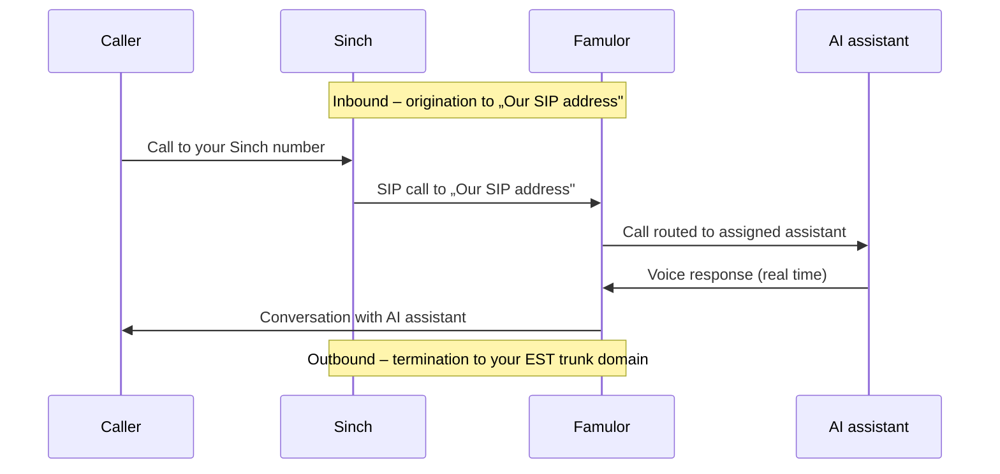

import SipDoneForYou from '/en/snippets/sip-done-for-you-partner-en.mdx';

<SipDoneForYou />


# Connect a Sinch Number to Famulor

This guide connects a **Sinch** phone number to Famulor via **Elastic SIP Trunking (EST)**.

<Note>
  Famulor has **no** dedicated Sinch import feature. You set up an **Elastic SIP Trunk** in Sinch and connect it through **Integrate SIP trunk** in Famulor.

  - **Termination** (outbound calls): Famulor sends calls to your **Sinch EST trunk domain**.
  - **Origination** (inbound calls): Sinch forwards calls to **Famulor's SIP address**.
</Note>

## How it works



- **Inbound:** Famulor does **not** register via SIP REGISTER. Sinch sends calls through the **origination** to „Our SIP address".
- **Outbound:** Famulor sends calls to your Sinch **termination** domain.

## Prerequisites

- An active **Sinch** account with **Elastic SIP Trunking**
- At least one Sinch phone number (DID)
- A Famulor account

---

## Step 1: Create an Elastic SIP Trunk in Sinch

1. In your Sinch dashboard, create an **Elastic SIP Trunk**.
2. Note your trunk's **EST trunk domain (FQDN)** – you need it as the outbound SIP address in Famulor.
3. Assign your **phone number (DID)** to the trunk.

<Note>
  You'll find the exact **EST trunk domain** and its authentication method (IP ACL or digest) in your Sinch dashboard.
</Note>

---

## Step 2: Set up the SIP trunk in Famulor

1. Open Famulor at [app.famulor.de/phone-numbers?lang=en](https://app.famulor.de/phone-numbers?lang=en) → **Your phone numbers** → **+ Integrate SIP trunk**.
2. Enter the data as follows:

| Field | Value |
| --- | --- |
| **SIP trunk type** | **Phone number (DID)** |
| **Phone number** | Your Sinch number in E.164 format (e.g. `+12025550123`) |
| **SIP address** (outbound) | Your **Sinch EST trunk domain** from Step 1 (without port) |
| **Outgoing phone number format** | **International (with leading +)** |
| **Authentication method** | Matching your Sinch trunk – **IP address** or **Username and password** (see Step 3) |
| **Country** | The country of your Sinch trunk |

3. Under **Incoming call settings**, copy the value **Our SIP address** (e.g. `xxxxxx.eu.sip.livekit.cloud`). You need it in Step 3.
4. Click **Add SIP number**.


---

## Step 3: Configure origination and authentication in Sinch

### Origination (inbound calls)

In your Sinch trunk's **inbound settings**, add a **static endpoint** that points to Famulor's SIP address:

```text
<Our SIP address>:5060;transport=udp
```

**Example:** `xxxxxx.eu.sip.livekit.cloud:5060;transport=udp`

### Termination authentication (outbound calls)

Choose one of the two methods – matching Step 2:

- **IP ACL (recommended):** add Famulor's **fixed outbound IP** to your Sinch trunk's termination ACL (currently `34.195.177.252/32`). To use it, enable **„Outbound call will come from a fixed IP address"** in Famulor.
- **Digest (username/password):** if your Sinch trunk uses digest auth, enter the credentials in Famulor under **Authentication**.

<Note>
  Confirm the **fixed outbound IP** currently shown in the Famulor dialog („Integrate SIP trunk" → outbound settings) in case it differs from `34.195.177.252`.
</Note>

---

## Step 4: Assign an assistant and test

1. Open **Assistants** in Famulor and edit the assistant you want to use.
2. Select the correct **inbound type** (incoming calls).
3. Choose your connected Sinch phone number from the list.
4. Click **Save assistant**.
5. Place a **test call** to your Sinch number and check that the AI assistant answers.

---

## Common issues

<AccordionGroup>
  <Accordion title="Inbound calls do not arrive" icon="phone-slash">
    Check the **origination** in Sinch (Step 3): the static endpoint must point to the **exact** „Our SIP address" from Famulor. Make sure the **DID is assigned to the trunk**.
  </Accordion>

  <Accordion title="Outbound calls fail" icon="arrow-up-right-from-square">
    Check the **EST trunk domain** as the SIP address in Famulor and the **authentication**: for **IP ACL**, Famulor's **fixed outbound IP** (`34.195.177.252/32`) must be allowed on the Sinch trunk and the fixed IP enabled in Famulor. Set the number format to **International (with leading +)**.
  </Accordion>

  <Accordion title="Wrong or unknown SIP address" icon="server">
    Always use the **exact** „Our SIP address" from Famulor (Phone numbers → Integrate SIP trunk → Incoming call settings).
  </Accordion>
</AccordionGroup>

---

## Help

<Tip>
  If you need help, contact our support team at [support@famulor.io](mailto:support@famulor.io). For general guidance, see [SIP Integration](/en/provisioning/sip-ai/sip-integration) and [SIP integration issues](/en/troubleshooting/sip-integration-issues).
</Tip>
