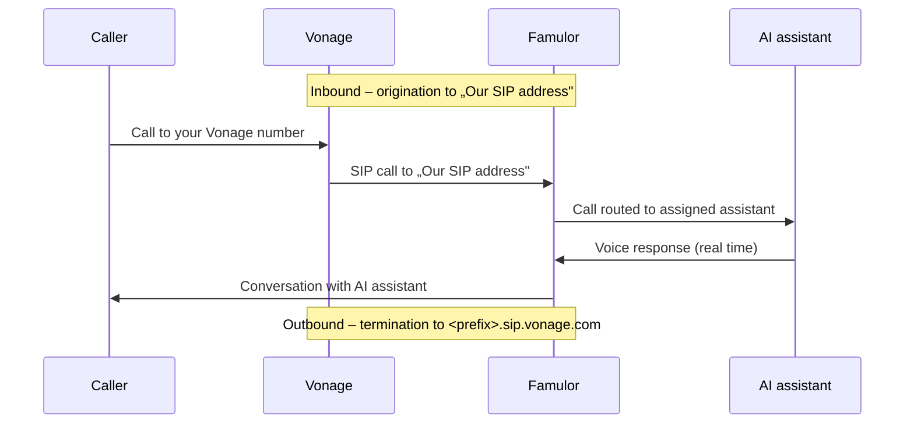

import SipDoneForYou from '/en/snippets/sip-done-for-you-partner-en.mdx';

<SipDoneForYou />

# Connect a Vonage Number to Famulor

This guide connects a **Vonage** phone number to Famulor via **Elastic SIP Trunking**.

<Note>
  Famulor has **no** dedicated Vonage import feature. You set up an **Elastic SIP Trunk** in Vonage and connect it through **Integrate SIP trunk** in Famulor.

  The trunk has two directions:
  - **Termination** (outbound calls): Vonage gives you a SIP domain + credentials that Famulor uses to send outbound calls.
  - **Origination** (inbound calls): Vonage forwards calls to **Famulor's SIP address**.
</Note>

## How it works

- **Inbound:** Famulor does **not** register via SIP REGISTER. Vonage sends calls through the **origination** to „Our SIP address".
- **Outbound:** Famulor sends calls to Vonage's **termination** SIP domain and authenticates with username and password.

## Prerequisites

- An active **Vonage** account with access to **Programmable SIP / Elastic SIP Trunking**
- At least one Vonage phone number (or a new number to purchase)
- A Famulor account

---

## Step 1: Create an Elastic SIP Trunk in Vonage

1. Open the **Vonage dashboard** and navigate to the **SIP** section.

2. Create a new SIP trunk and select **„Something else"** as the provider (i.e. not a preset provider).

---

## Step 2: Set up Termination (outbound calls)

**Termination** provides the SIP domain and credentials Famulor uses to send outbound calls.

1. Follow the **Termination** setup in Vonage.
2. Note the displayed values:

| Field | Example / meaning |
| --- | --- |
| **SIP domain** | `<your-prefix>.sip.vonage.com` (Termination SIP URI) |
| **User name** | Credentials for outbound calls |
| **Password** | Credentials for outbound calls |

<Note>
  Store the **SIP domain**, **username** and **password** safely. You need them in **Step 5** for the Famulor setup.
</Note>

---

## Step 3: Set up Origination (inbound calls)

In **Origination** you define where Vonage forwards incoming calls – to **Famulor's SIP address**.

1. In a second tab, open Famulor at [app.famulor.de/phone-numbers?lang=en](https://app.famulor.de/phone-numbers?lang=en) → **Your phone numbers → + Integrate SIP trunk** and, under **Incoming call settings**, copy the value **Our SIP address** (e.g. `xxxxxx.eu.sip.livekit.cloud`).
2. Paste this address into Vonage under **Origination** as the **SIP-URI**.

<Note>
  Use the **exact** „Our SIP address" from Famulor – no spaces.
</Note>

---

## Step 4: Assign a number to the trunk

Link a phone number to your Elastic SIP Trunk – either an **existing number** or a **newly purchased** one.

<Note>
  Note the Vonage number in **E.164 format** with country code (e.g. `+12025550123`). You need it in Step 5.
</Note>

---

## Step 5: Set up the SIP trunk in Famulor

1. In Famulor, go to **Your phone numbers** and click **+ Integrate SIP trunk**.
2. Enter the data as follows:

| Field | Value |
| --- | --- |
| **SIP trunk type** | **Phone number (DID)** |
| **Phone number** | Your Vonage number in E.164 format (e.g. `+12025550123`) |
| **Username** | The **termination** username from Step 2 |
| **Password** | The **termination** password from Step 2 |
| **SIP address** (outbound) | The Vonage **SIP domain** from Step 2 (e.g. `<your-prefix>.sip.vonage.com`, without port) |
| **Outgoing phone number format** | **International (with leading +)** |
| **Country** | The country of your Vonage trunk |

3. Under **Incoming call settings**, you'll see **Our SIP address** – the same address you entered as the Vonage origination in **Step 3**.
4. Click **Add SIP number**.

---

## Step 6: Assign an assistant and test

1. Open **Assistants** in Famulor and edit the assistant you want to use.
2. Select the correct **inbound type** (incoming calls).
3. Choose your connected Vonage phone number from the list.
4. Click **Save assistant**.
5. Place a **test call** to your Vonage number and check that the AI assistant answers.

---

## Call transfer to a human (cold & warm)

Famulor can hand off an ongoing call to a real person – as a **cold transfer** or a **warm transfer**. For the full setup, see [Assistant call forwarding](/en/platform/assistant-call-forwarding). For **Vonage** there is one important caveat.

<Warning>
  **Vonage does not support SIP REFER.** Famulor performs **cold transfers** via **SIP REFER** – the carrier connects the caller onward directly. Because Vonage SIP trunks do **not** support REFER, **cold transfer over the Vonage trunk does not work reliably**.

  **Recommendation for Vonage:** use the **warm transfer**. Famulor creates a **new SIP INVITE** (a separate outbound call through the Vonage trunk) and **merges the two calls** – this needs **no** REFER and therefore also works with SIP trunks that lack REFER support, such as Vonage.
</Warning>

### Options per transfer target

For each transfer target (cold or warm) you have two choices:

- **Phone number:** the number of the real contact the call is handed off to (e.g. `+49 1512 3456789`).
- **(Advanced) Is custom SIP transfer?** Enable this to specify a **custom SIP request** instead of a phone number (field **Custom SIP transfer**). Useful when your SIP trunk provider requires a specific format – e.g. `tel:1234567890` or a SIP-URI like `sip:200@your-provider`.

<Note>
  **Custom SIP transfer** does **not** remove Vonage's REFER limitation: a custom SIP request is still sent via REFER for a cold transfer. For Vonage, the **warm transfer** remains the reliable way to hand off to a human.
</Note>

---

## Common issues

<AccordionGroup>
  <Accordion title="Inbound calls do not arrive" icon="phone-slash">
    Check the **origination** in Vonage (Step 3): it must contain the **exact** „Our SIP address" from Famulor. Also make sure the **number is assigned to the trunk** (Step 4).
  </Accordion>

  <Accordion title="Outbound calls fail" icon="arrow-up-right-from-square">
    Check the **termination** values from Step 2 in Famulor: **SIP address** (`<your-prefix>.sip.vonage.com`), **username** and **password**. Set the number format to **International (with leading +)**.
  </Accordion>

  <Accordion title="Wrong or unknown SIP address" icon="server">
    Always use the **exact** „Our SIP address" from Famulor (Phone numbers → Integrate SIP trunk → Incoming call settings).
  </Accordion>

  <Accordion title="Cold transfer does not work" icon="phone-arrow-up-right">
    **Vonage does not support SIP REFER**, which Famulor uses for cold transfer. Use the **warm transfer** instead – it creates a new SIP INVITE and merges the calls (no REFER), so it works with Vonage. Details: [Assistant call forwarding](/en/platform/assistant-call-forwarding).
  </Accordion>
</AccordionGroup>

---

## Help

<Tip>
  If you need help, contact our support team at [support@famulor.io](mailto:support@famulor.io). For general guidance, see [SIP Integration](/en/provisioning/sip-ai/sip-integration) and [SIP integration issues](/en/troubleshooting/sip-integration-issues).
</Tip>
