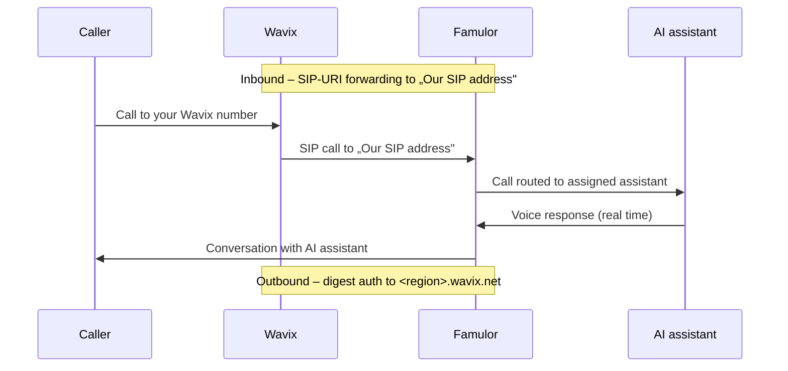

import SipDoneForYou from '/en/snippets/sip-done-for-you-partner-en.mdx';

<SipDoneForYou />


# Connect a Wavix Number to Famulor

This guide connects a **Wavix** phone number to Famulor via a **SIP trunk**.

<Note>
  Famulor has **no** dedicated Wavix import feature. You create a **SIP trunk** in Wavix and connect it through **Integrate SIP trunk** in Famulor.

  - **Outbound calls:** Famulor sends calls to the **Wavix gateway** and authenticates via **Digest** (SIP trunk ID + password).
  - **Inbound calls:** on the Wavix number, you set up a **SIP-URI forwarding** to **Famulor's SIP address**.
</Note>

## How it works



## Prerequisites

- An active **Wavix** account with at least one phone number
- A Famulor account

---

## Step 1: Create a SIP trunk in Wavix

1. In the Wavix portal, open **Numbers & Trunks → Trunks** and click **Create new**.
2. Choose **Digest** as the **Authentication Method** (username/password).
3. Set a **password** and select a **Caller ID** from your Wavix numbers.
4. After saving, note:

| Field | Meaning |
| --- | --- |
| **SIP trunk ID** | The automatically generated **5-digit** ID – your username |
| **Password** | The trunk password you set |
| **Gateway** | Your regional Wavix gateway, e.g. `us.wavix.net` (full list at the bottom of the Wavix trunks page) |

<Note>
  Keep the **SIP trunk ID** and **password** safe. You need both in Step 2.
</Note>

---

## Step 2: Set up the SIP trunk in Famulor

1. Open Famulor at [app.famulor.de/phone-numbers?lang=en](https://app.famulor.de/phone-numbers?lang=en) → **Your phone numbers** → **+ Integrate SIP trunk**.
2. Enter the data as follows:

| Field | Value |
| --- | --- |
| **SIP trunk type** | **Phone number (DID)** |
| **Phone number** | Your Wavix number in E.164 format (e.g. `+12025550123`) |
| **Username** | The **5-digit SIP trunk ID** from Step 1 |
| **Password** | The **trunk password** from Step 1 |
| **SIP address** (outbound) | Your Wavix gateway (e.g. `us.wavix.net`, without port) |
| **Outgoing phone number format** | **International (with leading +)** |
| **Country** | The country of your Wavix trunk |

3. Under **Incoming call settings**, copy the value **Our SIP address** (e.g. `xxxxxx.eu.sip.livekit.cloud`). You need it in Step 3.
4. Click **Add SIP number**.


---

## Step 3: Forward incoming calls in Wavix

To make calls arrive at Famulor, forward the Wavix number via **SIP-URI** to Famulor's SIP address.

1. In the Wavix portal, open **Numbers & Trunks → My numbers**.
2. For the number, click the **(⋮)** menu → **Edit number**.
3. Under **Destination → Configure inbound call routing**, select **SIP URI**.
4. Enter the destination:

```text
[did]@<Our SIP address>;transport=tcp
```

**Example:**

```text
[did]@xxxxxx.eu.sip.livekit.cloud;transport=tcp
```

<Note>
  Wavix automatically replaces the **`[did]`** placeholder with your Wavix number. Use the **exact** „Our SIP address" from Famulor and keep **`;transport=tcp`**.
</Note>

---

## Step 4: Assign an assistant and test

1. Open **Assistants** in Famulor and edit the assistant you want to use.
2. Select the correct **inbound type** (incoming calls).
3. Choose your connected Wavix phone number from the list.
4. Click **Save assistant**.
5. Place a **test call** to your Wavix number and check that the AI assistant answers.

---

## Common issues

<AccordionGroup>
  <Accordion title="Inbound calls do not arrive" icon="phone-slash">
    Check the **SIP-URI forwarding** on the Wavix number (Step 3): format `[did]@<Our SIP address>;transport=tcp`, the **exact** „Our SIP address" from Famulor, and the appended **`;transport=tcp`**.
  </Accordion>

  <Accordion title="Outbound calls fail" icon="arrow-up-right-from-square">
    Check the **SIP address** in Famulor (your Wavix gateway, e.g. `us.wavix.net`), the **SIP trunk ID** as username and the **password**. Make sure authentication in Wavix is set to **Digest**.
  </Accordion>

  <Accordion title="Outbound calls rejected (number format)" icon="hashtag">
    Wavix requires **E.164 format** for outbound calls. Use **International (with leading +)** in Famulor and avoid prefixes like `0`, `00` or `011`.
  </Accordion>

  <Accordion title="Wrong or unknown SIP address" icon="server">
    Always use the **exact** „Our SIP address" from Famulor (Phone numbers → Integrate SIP trunk → Incoming call settings).
  </Accordion>
</AccordionGroup>

---

## Help

<Tip>
  If you need help, contact our support team at [support@famulor.io](mailto:support@famulor.io). For general guidance, see [SIP Integration](/en/provisioning/sip-ai/sip-integration) and [SIP integration issues](/en/troubleshooting/sip-integration-issues).
</Tip>
