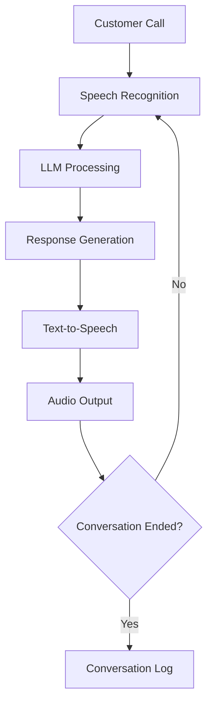

<Card>
  <CardHeader>
    <Title>The Future of AI Telephony is Here</Title>
    <Subtitle>Revolutionary Conversational AI Transforms Customer Interactions Through Large Language Models</Subtitle>
    <p className="text-gray-600 mt-2">A comprehensive whitepaper by Iman Koma, Founder of Famulor</p>
  </CardHeader>
</Card>

<Info>
**Summary:** This whitepaper explains how modern Large Language Models (LLMs) are revolutionizing telephony, why intent-based systems are becoming obsolete, and how you can use Famulor's Conversational AI to conduct natural, adaptive customer conversations. **Reading time: 12-15 minutes**
</Info>

<CardGroup cols={3}>
  <Card title="🚀 Get Started Now" href="/en/getting-started/core-concepts" icon="rocket">
    Build your first AI assistant in 5 minutes
  </Card>
  <Card title="🎯 Live Demo" href="https://www.famulor.io" icon="play">
    Experience Famulor’s Voice AI in action
  </Card>
  <Card title="🧠 Custom GPT" href="/en/ai-assistants/custom-gpt" icon="robot">
    Optimize prompts with our AI tool
  </Card>
</CardGroup>

## Why Large Language Models Are Revolutionizing Telephony

The generative, conversational AI of [**Famulor**](/en/introduction/what-is-Famulor) represents a fundamental paradigm shift in customer interaction. By combining state-of-the-art **Large Language Models (LLMs)** with advanced **transformer-based Voice AI**, Famulor creates interactions that are adaptive, realistic, and remarkably effective.

<Tabs>
  <Tab title="For Decision Makers">
    **Business Benefits:**
    - **300% higher conversion rates** compared to traditional systems
    - **Scalable customer communication** without expanding staff
    - **24/7 availability** with consistent quality
    - **Cost reductions** of up to 70% versus call center solutions
  </Tab>
  <Tab title="For Technicians">
    **Technical Advantages:**
    - **Generative LLMs** instead of rule-based intent recognition
    - **Transformer architecture** for context-aware understanding
    - **Real-time adaptability** without manual programming
    - **Multi-modal processing** of speech and context
  </Tab>
  <Tab title="For Users">
    **Practical Implementation:**
    - **No-code setup** in under 5 minutes
    - **Drag & drop configuration** with no coding needed
    - **Pre-built templates** for all industries
    - **Live testing** and continuous optimization
  </Tab>
</Tabs>

Instead of having to pre-program every possible interaction, Famulor’s AI learns from extensive datasets to **dynamically understand and generate language**. This enables it to handle a wide range of requests, adapt to conversational nuances, and provide responses that feel **natural and engaging**.

<Warning>
**Important Note:** While 100% predictability is statistically unlikely due to the probabilistic nature of generative systems, Famulor’s AI offers a **highly effective and flexible solution** for exceptional customer service, with proven **success rates over 95%** in real-world applications.
</Warning>

## How Famulor Works

Famulor’s voice AI system leverages cutting-edge technology to create an unparalleled customer experience through dynamic, conversational interactions. Unlike conventional intent-based dialogue systems that rely on Natural Language Understanding (NLU) models, Famulor uses generative Large Language Models (LLMs) to deliver responses that feel natural, flexible, and human-like.



## From Intent-Based Systems to Conversational AI: The Technology Leap

Intent-based systems are designed to recognize specific inputs and map them to predefined "intents." Once an intent is identified, the system triggers a fixed response manually written by the dialogue system designer. While this approach works well for predictable, repetitive interactions, intent-based systems have limited flexibility. They are constrained by defined intents and don’t easily adapt to unexpected or nuanced requests. This can make conversations feel robotic and frustrating when callers deviate from expected dialogue paths.

**Famulor, on the other hand,** is powered by generative LLMs that offer a far more flexible conversational approach. By employing advanced models from OpenAI, Meta (LLaMA), Mistral, and Anthropic, Famulor’s AI adjusts in real-time to each interaction’s unique phrasing and needs. This approach is similar to how a human employee works: while trained on company policies and customer service best practices, a person isn’t limited to scripted answers and can adapt dynamically to any conversation. Famulor delivers a comparable experience by leveraging its broad training to respond naturally and intelligently to each caller’s needs.

<Info>
This human-like approach makes Famulor especially well-suited for [**sales conversations**](/en/sales/gespraechsfuehrung-und-einwandbehandlung) and more demanding [**support calls**](/en/ai-assistants/example-prompts/first-level-support).
</Info>

This transformation marks a technological breakthrough, enabling Famulor to create conversations that flow naturally, adapt to different inputs, and deliver an engaging, seamless customer experience. With the ability to understand complex language patterns, the [**Famulor Conversational AI**](/en/conversation-design/prompt-basics) can handle a much broader range of requests than traditional intent-based systems, providing a more satisfying and intuitive interaction.

## How Large Language Models (LLMs) Work

At the core of Famulor’s conversational AI are Large Language Models (LLMs), which operate fundamentally differently from intent-based systems. LLMs use an advanced neural network architecture known as a Transformer, enabling them to understand and generate language based on probabilities rather than fixed rules.

### Self-Attention and Context Awareness

LLMs employ a self-attention mechanism that helps the model dynamically "focus" on relevant parts of the input text. This allows them to understand context, relationships, and nuances throughout a conversation. Such context awareness enables the AI to deliver responses that are adaptive, relevant, and coherent even in complex interactions.

### Probabilistic Response Generation

Unlike traditional rule-based systems, LLMs generate responses based on likelihoods. They evaluate multiple possible next words (or tokens) and select one based on its probability in the given context. This makes each response unique, conversation-tailored, and more human-like. However, it also means responses are not fully deterministic, making absolute predictability impossible.

### Training on Extensive Data

Famulor’s LLMs have been trained on extensive, diverse datasets, enabling them to effectively understand and generate language in many contexts. This broad training makes Famulor’s AI highly flexible, allowing it to process a wide range of inputs without explicit programming for each scenario.

<Warning>
While these characteristics make Famulor’s AI impressively dynamic and powerful, they also introduce inherent variability. Because responses are probability-based, achieving perfect results 100% of the time is statistically unlikely. Just as a human conversational partner might occasionally misunderstand a question or need clarification, Famulor’s AI may sometimes produce a response that could benefit from refinement.
</Warning>

## Voice AI: Generative Speech with Transformer-Based Models

Famulor’s AI system goes beyond understanding and generating responses; it also converts these outputs into natural-sounding speech. Once the LLM has generated a response, Famulor uses transformer-based voice AI text-to-speech (TTS) models to convert the text output from the language models into audio in real-time. These models enable rich, human-like voice delivery, providing customers with a seamless, fully generative experience.


As with any generative system, there is some variability in each response. Because these [**voice models**](/en/ai-assistants/voice-selection) work probabilistically, they do not output identical speech every time. This variability, which makes interactions feel more natural, can sometimes result in answers that don't perfectly match the intended outcome. Famulor minimizes this through monitoring, fine-tuning, and model updates, but perfect accuracy is statistically unattainable in generative systems.

<Tip>
As with human phone calls, no two Famulor conversations will ever be exactly alike—from what is said to the tone of voice. This is the future of conversational AI and dialogue system design.
</Tip>

## Why 100% Coverage is Statistically Unlikely

Due to the nature of LLMs, 100% coverage is statistically improbable. Here’s why:

### Probabilistic Response Generation
Responses are generated based on statistical probabilities, not deterministic paths. This enables natural, varied conversations but also occasionally unexpected outputs.

### Context Sensitivity
LLMs dynamically respond to context, which can change subtly based on phrasing, tone, or prior exchanges. This variability causes slight, sometimes unpredictable shifts in responses, which may not always perfectly align with expected outcomes.

### Broad Language Understanding
Famulor’s models are trained across a wide range of language patterns, enabling flexible responses but making every possible conversational direction difficult to predict. Like a human employee confronting unfamiliar scenarios, Famulor’s AI can occasionally encounter unforeseen conversational contexts.

<CardGroup cols={1}>
  <Card title="Best Practices for Optimal Results" icon="lightbulb">
    For applications where consistent, precise responses are critical, Famulor recommends providing your [**voice agent with rules**](/en/ai-assistants/system-prompt) to ensure it adheres to strict guidelines. For example, you can supply your voice agent with prohibited language to ensure it never says anything considered "off-brand."
  </Card>
</CardGroup>

Additionally, the option to fall back to human agents ensures that while Famulor’s AI handles the majority of interactions smoothly, any truly unique or unforeseen scenarios are routed to a live representative, maintaining a high standard of customer experience.

<Warning>
By using a product based on generative language models, you acknowledge a minimal risk of occasional unexpected outputs. However, this risk is minimized by Famulor’s product safeguards and is likely lower than with human agents.
</Warning>

By using Famulor’s LLM-based conversational AI and following recommended [**training and monitoring steps**](/en/ai-assistants/testing), you can create a highly effective virtual agent that delivers an excellent customer experience with minimal variance—while recognizing that a small degree of unpredictability is a natural and even beneficial part of creating a human-like conversational experience.

## Implementation Roadmap: Your Path to AI Telephony

<Tabs>
  <Tab title="Quick Start (1 Day)">
    **Ready to go right away:**
    
    <Steps>
      <Step title="Create Account">
        Sign up at [Famulor](https://www.famulor.io) and get instant access
      </Step>
      
      <Step title="Configure First AI Assistant">
        Use our [**Custom GPT**](/en/ai-assistants/custom-gpt) for optimized prompts
      </Step>
      
      <Step title="Live Testing">
        Test your assistant using the [**testing function**](/en/ai-assistants/testing)
      </Step>
    </Steps>
  </Tab>
  
  <Tab title="Professional (1 Week)">
    **Optimized implementation:**
    
    <Steps>
      <Step title="Strategic Planning">
        - Define use case with [**best practices**](/en/ai-assistants/assistant-best-practices)
        - Select [**assistant modes**](/en/ai-assistants/assistant-modes)
        - Set KPIs and success metrics
      </Step>
      
      <Step title="Configuration & Training">
        - Optimize [**system prompts**](/en/ai-assistants/system-prompt)
        - Set up [**knowledge bases**](/en/conversation-design/knowledge-bases)
        - Customize [**voice selection**](/en/ai-assistants/voice-selection)
      </Step>
      
      <Step title="Integration & Automation">
        - [**API integration**](/en/developers/overview) with existing systems
        - [**Webhooks**](/en/api-reference/webhooks/post-call) for data processing
        - Set up [**automation flows**](/en/automation-platform/introduction)
      </Step>
    </Steps>
  </Tab>
  
  <Tab title="Enterprise (1 Month)">
    **Complete integration:**
    
    <Steps>
      <Step title="Architecture Design">
        - Multi-assistant setup for various use cases
        - [**SIP integration**](/en/provisioning/sip-ai/sip-integration) for existing telephony
        - Plan scaling architecture
      </Step>
      
      <Step title="Team Training">
        - Training in [**prompt engineering**](/en/ai-assistants/example-prompts/general-prompt-engineering-guide)
        - [**Conversation design**](/en/conversation-design/prompt-basics) workshop
        - Performance monitoring setup
      </Step>
      
      <Step title="Continuous Optimization">
        - A/B testing of different approaches
        - Implement [**analytics & insights**](/en/inbound-calls/insights)
        - Continuous improvement processes
      </Step>
    </Steps>
  </Tab>
</Tabs>

### Decision Tree: Which Approach Fits You?

```mermaid
graph TD
    A[Your Use Case] --> B{First Implementation?}
    B -->|Yes| C[Use Quick Start]
    B -->|No| D{Existing Telephony?}
    
    C --> E[Use Custom GPT]
    E --> F[Testing & Go-Live]
    
    D -->|Yes| G[Plan SIP Integration]
    D -->|No| H[Use Famulor Numbers]
    
    G --> I[Enterprise Roadmap]
    H --> J[Professional Roadmap]
    
    I --> K[/provisioning/sip-ai/overview]
    J --> L[/ai-assistants/creating-and-editing]
    F --> M[/ai-assistants/assistant-best-practices]
```

<Steps>
  <Step title="Define the Happy Path (Majority Coverage, >50%)">
    Start by creating a conversation flow covering the most common, straightforward scenarios—often referred to as the "Happy Path." Focus on interactions that account for about 60% of expected calls. This provides your agent with a solid foundation and ensures good performance in frequent scenarios from day one.
    
    **Tip:** Use [**system prompts**](/en/ai-assistants/system-prompt) to define basic rules for common scenarios.
  </Step>

  <Step title="Expand to Edge Cases (90% Coverage)">
    Once the Happy Path runs smoothly, begin identifying and addressing edge cases. These may include less frequent requests, unusual phrasing, or specific customer needs outside of standard interactions. Expanding to include these edge cases brings your agent’s handling capabilities to nearly 90%, significantly enhancing its ability to manage a variety of scenarios.
    
    Provide an internal [**test line**](/en/ai-assistants/testing) for your team to gather feedback on agent performance in these edge cases. This feedback loop is critical to identifying gaps and refining responses.
  </Step>

  <Step title="Go Live and Monitor Calls (30-Day Evaluation)">
    When your agent effectively handles a range of scenarios, you’re ready to go live with customers. Monitor calls closely during the first 30 days to identify interactions where agent responses may be insufficient or could improve. This period allows capturing real-world data on agent performance across diverse conditions.
    
    **Tip:** Use [**Inbound Calls - Insights**](/en/inbound-calls/insights) for detailed performance analysis.
  </Step>

  <Step title="Refine and Update for 99%+ Coverage">
    If you find gaps or errors in responses, you can make updates directly within Famulor. By training your agent or providing updated information, most observed issues can be resolved. This iterative refinement process raises agent coverage to around 99%.
    
    **Resources:**
    - [**Knowledge Bases**](/en/conversation-design/knowledge-bases) for specific information
    - [**Tools and Functions**](/en/ai-assistants/tools-and-functions) for advanced functionality
  </Step>

  <Step title="Handling Edge Cases">
    While Famulor’s conversational AI can cover an impressive range of requests, achieving 100% is statistically unrealistic. No system—human or AI—can anticipate every possible interaction. For cases where full coverage is critical, Famulor recommends providing your voice agent with rules to ensure strict adherence to guidelines.
    
    **Example:** You can provide your voice agent with language to be strictly avoided to ensure it never says anything considered "off-brand."
  </Step>
</Steps>

<Info>
By following these steps, you will develop a powerful Famulor voice agent capable of handling a broad range of customer requests with ease, flexibility, and exceptional quality.
</Info>

## Related Resources & Further Reading

### Practical Implementation

<CardGroup cols={2}>
  <Card title="Creating AI Assistants" href="/en/ai-assistants/creating-and-editing" icon="robot">
    **Step-by-step guide** to building your first Famulor AI assistant
  </Card>
  <Card title="Optimizing System Prompts" href="/en/ai-assistants/system-prompt" icon="brain">
    **Prompt engineering guide** for optimal conversational AI performance
  </Card>
  <Card title="Follow Best Practices" href="/en/ai-assistants/assistant-best-practices" icon="star">
    **Best practices** and checklist for professional implementation
  </Card>
  <Card title="Use Custom GPT" href="/en/ai-assistants/custom-gpt" icon="wand-magic-sparkles">
    **AI-powered prompt optimization** with our specialized GPT
  </Card>
</CardGroup>

### Developer Resources

<CardGroup cols={2}>
  <Card title="API Integration" href="/en/developers/overview" icon="code">
    **Programmatic control** of voice agents via REST API
  </Card>
  <Card title="Webhook Setup" href="/en/api-reference/webhooks/post-call" icon="link">
    **Post-call data processing** and automation
  </Card>
  <Card title="SIP Integration" href="/en/provisioning/sip-ai/sip-integration" icon="phone">
    **Connect existing telephony systems** with Famulor
  </Card>
  <Card title="Automation Platform" href="/en/automation-platform/introduction" icon="diagram-project">
    **No-code workflows** for complex business processes
  </Card>
</CardGroup>

### Industry-Specific Applications

<CardGroup cols={3}>
  <Card title="Sales & Lead Gen" href="/en/sales/gespraechsfuehrung-und-einwandbehandlung" icon="chart-line">
    Objection handling and conversion optimization
  </Card>
  <Card title="Customer Support" href="/en/ai-assistants/example-prompts/first-level-support" icon="headset">
    First-level support and problem solving
  </Card>
  <Card title="Appointment Booking" href="/en/ai-assistants/cal-com-scheduling" icon="calendar">
    Automated calendar integration
  </Card>
</CardGroup>

### Performance & Optimization

<CardGroup cols={2}>
  <Card title="Testing Strategies" href="/en/ai-assistants/testing" icon="flask">
    **Systematic testing** and quality assurance
  </Card>
  <Card title="Voice & Model Selection" href="/en/ai-assistants/voice-selection" icon="microphone">
    **Voice tuning** and model configuration
  </Card>
  <Card title="Analytics & Insights" href="/en/inbound-calls/insights" icon="chart-bar">
    **Performance monitoring** and success analysis
  </Card>
  <Card title="Assistant Modes" href="/en/ai-assistants/assistant-modes" icon="gear">
    Understand **Dualplex, speech-to-speech,** and pipeline modes
  </Card>
</CardGroup>

---

## Conclusion: The Future Is Available Today

<Card>
  <CardHeader>
    <Title>AI Telephony Revolution: Switch Now</Title>
    <Subtitle>Famulor Makes Human-Like Conversations a Reality</Subtitle>
  </CardHeader>
</Card>

The **conversational AI revolution** is no longer a future vision—it’s happening today. Companies that embrace **large language models** and **generative voice AI** now gain a decisive competitive advantage.

### Why Act Now?

<CardGroup cols={3}>
  <Card title="📈 Proven ROI" icon="chart-line">
    **300% higher conversion** and **70% cost savings** in real-world deployments
  </Card>
  <Card title="⚡ Fast Implementation" icon="zap">
    **Live in 5 minutes** instead of weeks of traditional development
  </Card>
  <Card title="🎆 Technology Leader" icon="crown">
    **Early adopter advantage** in the next generation of customer interaction
  </Card>
</CardGroup>

<Warning>
**Competitive Risk:** Companies relying on outdated intent-based systems risk being left behind by the **AI telephony revolution**. Technology progresses exponentially—those who don’t act today will struggle to catch up tomorrow.
</Warning>

### Next Steps: Your Path to AI Telephony

<Steps>
  <Step title="Get Started Immediately (Today)">
    **[Book a free demo](https://www.famulor.io)** and experience the technology live
  </Step>
  
  <Step title="Proof of Concept (This Week)">
    Create your first **[AI assistant](/en/getting-started/core-concepts)** with our **[Custom GPT](/en/ai-assistants/custom-gpt)**
  </Step>
  
  <Step title="Production Ready (This Month)">
    Follow **[best practices](/en/ai-assistants/assistant-best-practices)** and optimize for live operation
  </Step>
</Steps>

<Card>
  <CardHeader>
    <Title>Ready for the Future of AI Telephony?</Title>
    <Subtitle>Start your journey today to the next generation of customer interaction</Subtitle>
  </CardHeader>
  <CardGroup cols={2}>
    <Card title="🎆 Book Free Demo" href="https://www.famulor.io" icon="calendar">
      **Experience Famulor live** – Personalized demo with your use case
    </Card>
    <Card title="🚀 Get Started Now" href="/en/getting-started/core-concepts" icon="rocket">
      **AI assistant in 5 minutes** – No prior knowledge required
    </Card>
  </CardGroup>
</Card>

<Info>
**Contact & Support:** Do you have implementation questions or need advice for your specific use case? Our expert team is available at **[support@famulor.io](mailto:support@famulor.io)**.
</Info>