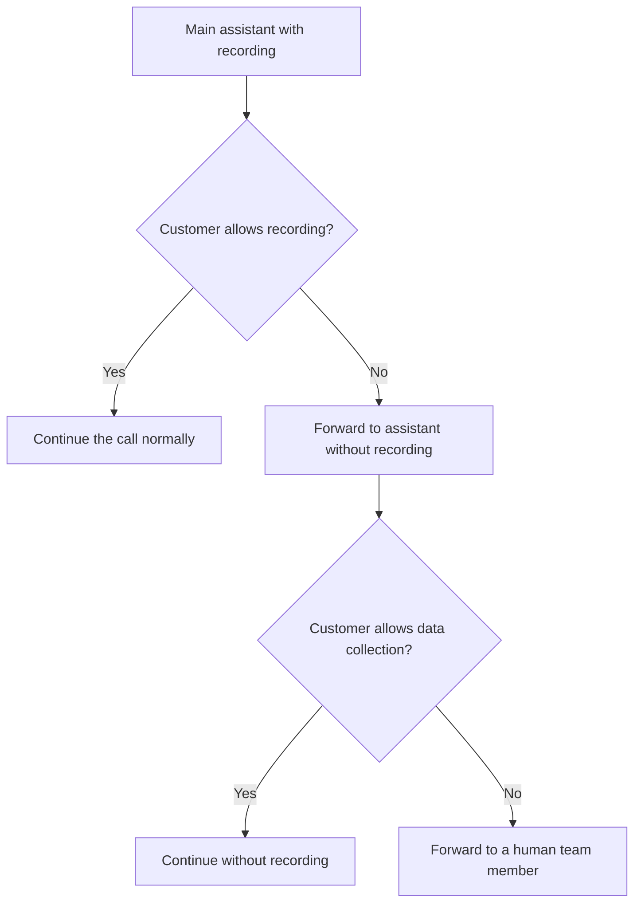

<iframe
  className="w-full aspect-video rounded-xl"
  src="https://www.youtube.com/embed/aYlsDNXrnLk"
  title="GDPR in AI phone assistants: automatic forwarding on rejection"
  frameBorder="0"
  allow="accelerometer; autoplay; clipboard-write; encrypted-media; gyroscope; picture-in-picture"
  allowFullScreen
></iframe>

> Set up GDPR-compliant forwarding when customers do not want call recording or sensitive data collection.

This setup covers two common GDPR scenarios:

1. The customer does **not** want the call to be recorded.
2. The customer does **not** want to share sensitive personal data with an AI assistant.

In both cases, you can automatically route the call to a safer fallback:

- either to a **second assistant without recording**
- or directly to a **human team member**

## When this setup makes sense

Use this when your assistant:

- asks for consent to recording at the beginning of the call
- books appointments or asks for sensitive personal data
- should respond to rejection in a GDPR-compliant way

<Info>
  **Recommended logic:** If the customer rejects call recording, first forward the call to a second assistant **without recording**. If the customer also rejects personal data collection, forward the call directly to a **human agent**.
</Info>

## Requirements

Before you start, you need:

- an existing main assistant
- a **second phone number**
- a destination number for forwarding to a real person
- access to **Prompt & Tools**

## Step-by-step setup

### 1. Duplicate your main assistant

1. Open your existing assistant.
2. Duplicate it.
3. Rename the copy clearly, for example `Heidi no recording`.

This copy becomes your fallback assistant without recording.

### 2. Assign the second phone number

1. Open the duplicated assistant.
2. Assign your **second phone number** to it.
3. Click **Save**.

### 3. Disable recording on the copied assistant

1. Scroll down in the copied assistant to **Record call**.
2. Disable recording.
3. Click **Save** again.

<Warning>
  This second assistant must not have recording enabled. That separation is what keeps the forwarding logic clean and compliant.
</Warning>

### 4. Set up forwarding from the non-recording assistant to a human

1. Open **Prompt & Tools** on the duplicated assistant.
2. Add a **Call Forwarding** tool.
3. Enter the phone number of the employee or manager who should receive the call.
4. Add the prompt rule for cases where the customer rejects sensitive data collection.
5. Save the assistant.

#### Prompt No. 1: Non-recording assistant to human

```txt
If the customer also refuses to let sensitive personal data be collected or stored, or says things like "I don't want to provide any data", "please don't store personal information", or anything similar, forward the call immediately to a human team member.
```

## 5. Copy the phone number of the non-recording assistant

1. Open the copied assistant without recording.
2. Copy its assigned phone number.

You will use this number as the forwarding target in the main assistant.

### 6. Set up forwarding from the main assistant to the non-recording assistant

1. Open your original main assistant again.
2. Go to **Prompt & Tools**.
3. Add a **Call Forwarding** tool.
4. Enter the phone number of the assistant **without recording** as the target.
5. Add the prompt rule for cases where the customer rejects recording.
6. Save the main assistant.

#### Prompt No. 2: Recording assistant to non-recording assistant

```txt
If the customer says they do not want the conversation to be recorded, or says things like "no", "I'd rather not", "I don't want recording", or anything similar, forward the call immediately to the assistant without recording.
```

### 7. Update the system prompt of the main assistant

For the forwarding to work reliably, the main assistant must actively ask for recording consent first.

Add a clear rule to the system prompt that:

- the assistant asks for recording consent at the beginning of the call
- if the customer rejects recording, the call is forwarded to the non-recording assistant

If you use the AI prompt editor, you can enter something like:

```txt
I want to set up GDPR-compliant forwarding with a question at the start of the call asking whether call recording is allowed. If the customer declines, the call should be forwarded immediately to the assistant without recording.
```

## Recommended call flow



## Test the setup

Test the full chain with real calls:

1. Call your main assistant.
2. Reject call recording.
3. Confirm that the call is forwarded to the second assistant without recording.
4. Then reject the collection of personal data as well.
5. Confirm that the call is forwarded to the human team member.

<Check>
  Test both scenarios separately:

  - **rejection of recording**
  - **rejection of sensitive data collection**
</Check>

## Common issues

### Forwarding is not triggered

- Check whether the rule is also included in the **system prompt**
- Check whether the forwarding logic was configured in the correct assistant
- Test with explicit phrases like `I do not want recording`

### The second assistant still records the call

- Check the **Record call** setting on the duplicated assistant
- Save again after changing it

### Forwarding to the human agent does not work

- Check the destination number in the forwarding tool
- Test the number manually
- Make sure the phone number is stored in international format

## Related pages

- [Prompt & Tools](/en/ai-assistants/prompt-and-tools)
- [Testing Your Assistant](/en/ai-assistants/testing)
- [General Setup Issues](/en/troubleshooting/setup-issues)
- [AI Behavior](/en/troubleshooting/ai-behavior)
