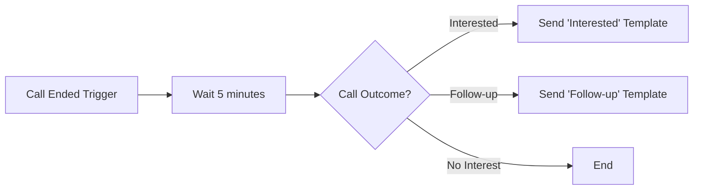
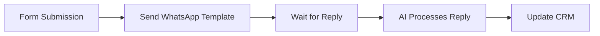
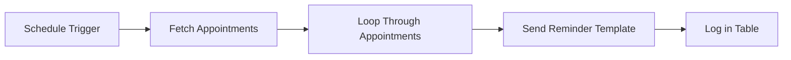

The automation platform integrates with WhatsApp so you can send messages automatically, trigger flows based on WhatsApp events, and programmatically generate AI responses.

## Available Actions

### Send WhatsApp Template Message

Send a pre-approved template message to a customer.

**Use cases:**

* Send order confirmations after a purchase  
* Trigger appointment reminders on schedule  
* Deliver follow-up messages after calls  
* Re-engage customers who haven’t responded  

**Configuration:**

| Field                 | Description                                                  |
| --------------------- | ------------------------------------------------------------ |
| **Sender**            | Select your WhatsApp sender (must be online)                 |
| **Template**          | Select from approved templates                                |
| **Recipient Phone**   | Customer phone number (E.164 format: +491234567890)          |
| **Recipient Name**    | Optional customer name for personalization                    |
| **Variables**         | Dynamic values for template placeholders                      |

<Tip>
  **E.164 Format** — Phone numbers must be in international format with country code. Examples:

  * ✅ `+4915112345678`  
  * ✅ `+436641234567`  
  * ❌ `0151/12345678`  
  * ❌ `+49 (0) 151 12345678`  
</Tip>

### Send WhatsApp Message (Free Text)

Send a free-text message to a customer within the 24-hour messaging window.

<Warning>
  **24-hour window required** — Free-text messages can only be sent to customers who messaged you within the last 24 hours. Use a template message for customers outside this window.
</Warning>

**Use cases:**

* Immediate follow-up to ongoing conversations  
* Delivery of time-sensitive information  
* Automated responses to customer inquiries  

**Configuration:**

| Field                 | Description                                        |
| --------------------- | ------------------------------------------------- |
| **Sender**            | Select your WhatsApp sender                       |
| **Recipient Phone**   | Customer phone number (E.164 format)              |
| **Message**           | Message text (max. 4096 characters)               |

### Generate AI Response

Generate an AI response using your assistant, identified by an external customer identifier.

**Use cases:**

* Build custom chat interfaces  
* Integrate WhatsApp with external CRM systems  
* Create cross-channel AI responses  
* Process messages from external platforms  

**Configuration:**

| Field                    | Description                                                   |
| ------------------------ | ------------------------------------------------------------- |
| **Assistant**            | Select the AI assistant to use                                |
| **Customer Identifier**  | Unique customer ID (e.g., phone number, email, CRM ID)       |
| **Message**              | The message to respond to                                     |
| **Variables**            | Optional context variables for the assistant                 |

**How it works:**

1. The action finds or creates a conversation for the customer identifier  
2. The message is sent to your AI assistant  
3. The AI-generated response is returned  
4. You can then send this response via WhatsApp or other channels  

## Triggers

### WhatsApp Message Received

Trigger a flow when a customer sends a WhatsApp message.

**Available data:**

* Customer phone number  
* Message text  
* Sender ID  
* Timestamp  
* Conversation ID  

**Example use cases:**

* Log messages in a CRM or database  
* Notify your team  
* Trigger follow-up sequences  
* Collect and process customer data  

### WhatsApp Conversation Started

Trigger a flow when a new WhatsApp conversation begins.

**Available data:**

* Customer phone number  
* First message text  
* Sender information  
* Conversation ID  

## Example Workflows

### WhatsApp Follow-up After Call

Send a WhatsApp template message after a call is completed:



**Setup:**

1. Add **Call Ended** trigger  
2. Add **Delay** action (optional)  
3. Add **Branch** based on call outcome  
4. Add **Send WhatsApp Template** action for each branch  
5. Configure template and variables  

### Lead Qualification via WhatsApp

Qualify leads through WhatsApp conversations:



### Appointment Reminder Flow

Send automated appointment reminders:



## Variable Mapping

When sending template messages, map your flow data to the template variables:

**Template:**

```
Hello {{1}}, your appointment with {{2}} on {{3}} is confirmed.

Location: {{4}}
```

**Variable mapping:**

| Template Variable | Flow Data                       |
| ----------------- | ------------------------------- |
| `{{1}}`           | `{{trigger.customer_name}}`     |
| `{{2}}`           | `{{trigger.agent_name}}`        |
| `{{3}}`           | `{{trigger.appointment_date}}`  |
| `{{4}}`           | `{{trigger.location}}`          |

## Error Handling

### Common Errors

| Error                           | Cause                                                | Solution                                            |
| -------------------------------| ----------------------------------------------------| ---------------------------------------------------|
| **Template not found**          | Template ID invalid or not approved                   | Check if template is approved and ID is correct    |
| **Sender offline**              | WhatsApp sender is not online                         | Check sender status, ensure connection is active   |
| **Invalid phone number**        | Phone number not in E.164 format                       | Format as +[country code][number]                   |
| **Outside 24-hour window**     | Trying to send free-text message outside the window   | Use a template message instead                       |
| **Rate limited**                | Too many messages sent                                | Add delays between messages                          |

### Retry Strategy

Implement a retry strategy for failed messages:

1. Wait 1 minute  
2. Retry the action  
3. If it still fails: log the error and notify your team  

## Best Practices

### 1. Always use templates for outbound messaging

When initiating contact with customers, always use approved templates. Free-text messages only work within the 24-hour window.

### 2. Include opt-out options

Add unsubscribe options in marketing messages to comply with regulations and maintain your quality rating.

### 3. Respect rate limits

Do not send too many messages too quickly. Implement appropriate delays for batch sends.

### 4. Handle errors gracefully

Always add error handling in your flows. Log failures and alert your team about issues.

### 5. Test with individual recipients first

Before launching mass campaigns, test your flow with a single recipient to ensure it works correctly.

### 6. Monitor your quality rating

Keep an eye on your sender’s quality rating. Pause campaigns if you notice a drop in quality.

## Next Steps

* Learn more about [message templates](/whatsapp/templates) and how to create them  
* Set up [WhatsApp senders](/whatsapp/senders) for your phone numbers  
* Explore the [automation platform](/automation-platform/introduction) for more workflow options