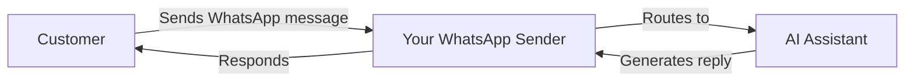

> Connect your AI assistants with WhatsApp Business for automated text-based customer communication

<Note>
  **New: External Numbers** — You can now bring your own mobile number to WhatsApp! Use platform numbers or link your existing mobile number with SMS/voice verification.
</Note>

## What is the WhatsApp Business Integration?

The WhatsApp Business Integration allows you to connect your AI assistants to WhatsApp. This enables automated text-based conversations with customers through the world's most popular messaging platform.

With this integration, you can:

* **Receive customer messages** and automatically respond with AI
* **Send template messages** to start conversations or re-engage customers
* Use **AI-powered replies** for 24/7 customer support
* **Trigger automation flows** based on WhatsApp conversations
* **Track all conversations** in your dashboard

## How it works

1. **Create a WhatsApp sender** with a platform number or your own external number
2. **Connect an AI assistant** to automatically handle incoming messages
3. **Create message templates** for outbound conversations (required by Meta)
4. **Customers message you** and receive instant AI-powered replies

## Core Components

<CardGroup cols={2}>
  <Card title="WhatsApp Senders" icon="phone" href="/en/whatsapp/senders">
    Phone numbers registered for WhatsApp Business Messaging
  </Card>

  <Card title="Message Templates" icon="file-lines" href="/en/whatsapp/templates">
    Pre-approved message formats for business-initiated conversations
  </Card>

  <Card title="AI Conversations" icon="robot" href="/en/whatsapp/conversations">
    AI-powered automated responses to customer messages
  </Card>

  <Card title="Automation" icon="bolt" href="/en/whatsapp/automation">
    Trigger flows and send messages via the automation platform
  </Card>
</CardGroup>

## Understanding WhatsApp Business Rules

WhatsApp has specific rules for business messaging that you need to understand:

### The 24-hour Messaging Window

<Info>
  When a customer sends you a message, a **24-hour window** opens during which you can send freeform messages. After this window closes, you must use an **approved template** to re-engage the customer.
</Info>

* **Within 24 hours**: Send any message directly
* **After 24 hours**: You must use a pre-approved template message

### Template Messages

Template messages are pre-approved message formats required for:

* Starting new conversations with customers
* Re-engaging customers after the 24-hour window expires
* Sending notifications, updates, or marketing messages

Templates must be submitted to Meta for approval (usually takes minutes up to 24 hours).

### Quality Rating & Limits

Meta monitors your messaging quality. New senders start with limited capacity, which increases as you maintain good quality:

| Quality Level  | Daily Message Limit           |
| -------------- | -----------------------------|
| New Sender     | ~250 messages                |
| Low            | 1,000 messages               |
| Medium         | 10,000 messages              |
| High           | 100,000+ messages            |

<Warning>
  High block rates or spam reports lower your quality rating and reduce your messaging limits. Always send relevant, requested content.
</Warning>

## Supported Features

### What is supported

* **Platform Numbers** — Use numbers acquired through our platform with automated AI verification
* **External Numbers** — Bring your own mobile number and verify it via SMS or voice call
* AI-powered automated replies
* Template messages (utility, marketing, authentication)
* Voice Call Request Templates (requesting permission to call via WhatsApp)
* Conversation history and tracking
* Integration with the automation platform

### Coming soon

* Media attachments (images, documents, audio)
* WhatsApp voice calls

## Getting Started

<Steps>
  <Step title="Choose your number type">
    Decide whether to use a **platform number** (purchased from us) or your own **external mobile number**. External numbers must be able to receive SMS or voice calls for verification.
  </Step>

  <Step title="Create a WhatsApp sender">
    Go to **WhatsApp Senders** and follow the setup wizard to connect your number to WhatsApp Business.
  </Step>

  <Step title="Connect AI assistant">
    Link an AI assistant to automatically reply to incoming messages.
  </Step>

  <Step title="Create templates">
    Set up message templates for outbound conversations and await Meta's approval.
  </Step>

  <Step title="Start messaging">
    Your WhatsApp sender is ready! Customers can message you and receive AI-powered replies.
  </Step>
</Steps>

## Next Steps

* Learn how to [create WhatsApp Senders](/en/whatsapp/senders)
* Understand [Message Templates](/en/whatsapp/templates) and the approval process
* Set up [automation triggers](/en/whatsapp/automation) for WhatsApp
