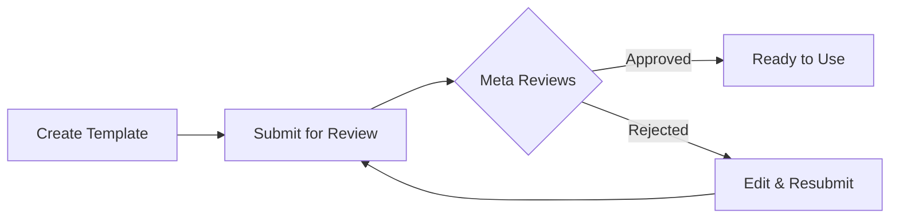

Message templates are pre-approved message formats mandated by Meta for business-initiated conversations on WhatsApp. You must have approved templates before you can send outbound messages to customers.

## What are Message Templates?

Message templates are structured messages that:

* Must be submitted to Meta for approval before use
* Allow you to initiate conversations with customers
* Can include variables for personalization
* Are required for messages sent outside the 24-hour window

<Info>
  **Why Templates?** — WhatsApp requires templates to prevent spam and ensure businesses send valuable, relevant messages to customers. All business-initiated messages must use approved templates.
</Info>

## When Do You Need Templates?

| Scenario                         | Template Required?                         |
| -------------------------------- | ------------------------------------------ |
| Customer messages you first       | No — free reply allowed within 24 hours    |
| Reply within 24 hours             | No — any message can be sent                |
| Starting a new conversation       | **Yes**                                     |
| Contacting after 24 hours         | **Yes**                                     |
| Sending updates/notifications     | **Yes**                                     |
| Marketing messages                | **Yes**                                     |

## Template Categories

Templates are divided into categories which determine their approval requirements and use cases:

### Utility Templates

Transactional and service-related messages.

**Use for:**

* Order confirmations
* Shipping updates
* Appointment reminders
* Account notifications
* Payment receipts

**Approval:** Typically approved within minutes

### Marketing Templates

Promotional and sales-related messages.

**Use for:**

* Promotional offers
* Product announcements
* Newsletters
* Sales campaigns
* Re-engagement messages

**Approval:** May take longer; stricter review

<Warning>
  **No cross-category content** — Do not include promotional content in Utility templates. Meta will reject templates where category and content do not match.
</Warning>

### Authentication Templates

Verification and security messages.

**Use for:**

* One-time passwords (OTP)
* Verification codes
* Login confirmations
* Security alerts

**Approval:** Standard review

### Voice Call Request Templates

Special templates to request permission for WhatsApp voice calls.

**Use for:**

* Requesting permission to call customers via WhatsApp voice
* Must include a button to request voice call permission

**Approval:** Automatic (when using the standard format)

## Creating a Template

### Step 1: Navigate to Templates

1. Go to **WhatsApp Senders** → Select your sender → **Templates** tab  
2. Or go directly to **WhatsApp Templates**  
3. Click **Create Template**

### Step 2: Configure Basic Settings

| Field          | Description                                                                          |
| -------------- | ------------------------------------------------------------------------------------ |
| **Name**       | Unique identifier (lowercase letters and underscores only). Example: `order_confirmation_v1` |
| **Category**   | Choose Utility, Marketing, Authentication, or Voice Call Request                    |
| **Language**   | Language of the template (must match the content)                                   |

<Tip>
  **Naming Best Practices:**

  * Use descriptive names: `appointment_reminder`, `order_shipped`  
  * Add version numbers: `welcome_message_v2`  
  * Avoid generic names: ~~`template1`~~, ~~`test`~~  
</Tip>

### Step 3: Write Template Content

Templates can have multiple components:

#### Header (Optional)

* **Text header:** Short title (up to 60 characters)  
* **Media header:** Image, video, or document (coming soon)  

#### Body (Required)

Main message content. Write your message here.

**Using Variables:**  
Use `{{1}}`, `{{2}}`, etc. for dynamic content:

```
Hello {{1}}, your order {{2}} has shipped!

Expected delivery: {{3}}  
Track your package: {{4}}
```

<Info>
  **Example Values** — When creating templates, you must provide example values for each variable. These help Meta understand your template's purpose and are required for approval.
</Info>

#### Footer (Optional)

A short line at the end (up to 60 characters). Often used for unsubscribe info or disclaimers.

#### Buttons (Optional)

Add interactive buttons to your template:

* **Quick Reply:** Predefined reply buttons (e.g., "Yes", "No", "Learn more")  
* **Call to Action:** Link to a website or phone number  
* **Voice Call Request:** Button to request permission for a voice call  

### Step 4: Submit for Approval

1. Review your template content  
2. Click **Submit for Approval**  
3. Template status changes to "Pending Approval"  
4. Wait for Meta's review (minutes up to 24 hours)  

## Template Approval Process



### Approval Times

| Category          | Typical Time                  |
| ----------------- | ----------------------------- |
| Utility           | Minutes to a few hours        |
| Marketing         | Hours up to 24 hours          |
| Authentication    | Minutes to a few hours        |
| Voice Call Request| Usually immediate             |

### Template Status

| Status                                            | Description                                   |
| ------------------------------------------------- | --------------------------------------------- |
| <span style={{color: '#6b7280'}}>**Draft**</span> | Not submitted yet                            |
| <span style={{color: '#f59e0b'}}>**Pending**</span> | Submitted, awaiting review by Meta           |
| <span style={{color: '#22c55e'}}>**Approved**</span> | Ready for use                               |
| <span style={{color: '#ef4444'}}>**Rejected**</span> | Review failed, see rejection reason          |
| <span style={{color: '#6b7280'}}>**Disabled**</span> | Disabled by Meta due to low quality           |

## Common Rejection Reasons

Avoid these mistakes to improve approval rates:

### ❌ Promotional Content in Utility Templates

**Issue:** Including discounts, offers, or marketing language in Utility templates.

**Solution:** Use the Marketing category for promotional content.

### ❌ Missing or Unclear Example Variables

**Issue:** Variables like `{{1}}` without clear sample values.

**Solution:** Provide realistic example values that clarify the variable’s purpose:

* ✅ `{{1}}` = "Max Mustermann"  
* ✅ `{{2}}` = "#12345"  
* ❌ `{{1}}` = "test"  

### ❌ Aggressive or Threatening Language

**Issue:** Content that might be perceived as harassment, threat, or spam.

**Solution:** Use professional, friendly language focusing on customer value.

### ❌ URL Shorteners

**Issue:** Using bit.ly, tinyurl, or other URL shorteners.

**Solution:** Use full, branded URLs from your domain.

### ❌ Incorrect Category Selection

**Issue:** Choosing the wrong category for your content type.

**Solution:** Strictly match the category to the content purpose.

### ❌ Restricted Content

**Issue:** Templates about alcohol, gambling, adult content, political messages, or illegal activities.

**Solution:** These are prohibited. Review Meta's commerce policies.

## Using Templates

### Sending Template Messages

Once a template is approved, you can send it:

1. **Via the Automation Platform:** Use the “Send WhatsApp Template” action  
2. **Via the API:** Call the send endpoint with template ID and variables  

### Variable Replacement

Replace variables with actual values when sending:

**Template:**

```
Hello {{1}}, your appointment is confirmed for {{2}} at {{3}}.
```

**Sent Message:**

```
Hello Max, your appointment is confirmed for January 15 at 2:00 PM.
```

## Best Practices

### 1. Use Descriptive Names

```
✅ order_confirmation_v1
✅ appointment_reminder
✅ shipping_update_with_tracking
❌ template1
❌ test
❌ message
```

### 2. Keep Messages Concise

WhatsApp users expect fast, clear messages. Get to the point and include a clear call to action.

### 3. Use Interactive Buttons

Add Quick Reply or Call-to-Action buttons to make it easier for customers to respond:

* "Track Order"  
* "Contact Support"  
* "View Details"  
* "Confirm Appointment"  

### 4. Test Before Mass Sending

Always test your template with a single recipient before sending to a large audience. This helps catch formatting errors.

### 5. Create Templates Early

Approval can take up to 24 hours. Create and submit templates before you need them.

### 6. Keep Backup Templates Ready

Create multiple versions of important templates. If one gets rejected or disabled, you have alternatives.

## Editing Templates

<Warning>
  **Limited Editing** — Once a template is approved, it cannot be edited. To make changes, create a new template with a different name.
</Warning>

**Editable:**

* Draft templates (not submitted yet)  
* Rejected templates (fix issues and resubmit)  

**Not Editable:**

* Approved templates  
* Pending templates (waiting for review)  

## Template Limits

Meta enforces limits on template creation:

* Maximum templates per WhatsApp Business Account vary by account tier  
* Template names must be unique per sender  
* Rejected templates count against your limit  

## Next Steps

* Set up [automation triggers](/en/whatsapp/automation) to send templates automatically  
* Learn more about [WhatsApp Senders](/en/whatsapp/senders) and sender management  
* Review the [AI Assistants Configuration](/en/ai-assistants/what-is-ai-assistant) for conversation replies