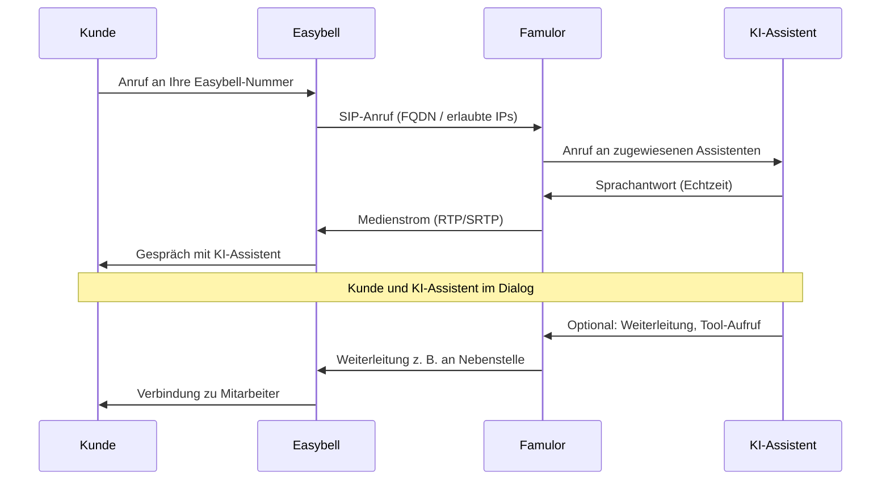

# Easybell-Integration

<Note>
  Schritt-für-Schritt-Anleitung zur Verbindung Ihres Easybell-Telefonsystems mit Famulor: per **SIP-Trunk** oder über die **Easybell Cloud Telefonanlage** (FQDN in Pro enthalten).
</Note>

<CardGroup cols={2}>
  <Card
    title="Was ist Easybell-Integration?"
    icon="phone-volume"
    color="blue">
    Verbinden Sie Ihr Easybell-Telefonsystem mit Famulor über SIP-Trunking für flexible und skalierbare Telefonie-Integration.
  </Card>
  <Card
    title="Vorteile"
    icon="star"
    color="green">
    Nutzen Sie Easybell's zuverlässige Telefonie-Infrastruktur mit unseren KI-Assistenten für erweiterte Funktionen.
  </Card>
</CardGroup>

## Was ist Easybell-Integration?


Die Easybell-Integration ermöglicht es Ihnen, Ihr Easybell-Telefonsystem mit Famulor zu verbinden. Easybell bietet SIP-Trunking-Lösungen, die eine einfache und kostengünstige Integration ermöglichen.


<Steps>
  <Step title="Feature anfordern">
    Das SIP Trunking FQDN Feature über Easybell-Support anfordern.
  </Step>
  <Step title="Nummer verbinden">
    Ihre Easybell-Nummer mit der Famulor-Domain verbinden.
  </Step>
  <Step title="Format konfigurieren">
    Das korrekte Rufnummernformat (E.164) einstellen.
  </Step>
  <Step title="Integration testen">
    Die Verbindung zwischen Easybell und Famulor testen.
  </Step>
  <Step title="Anrufe verwalten">
    Anrufe über Ihr Easybell-Setup mit Famulor verwalten.
  </Step>
</Steps>

## Wie es funktioniert


Wenn Sie Ihr Easybell-System mit Famulor integrieren:


<CardGroup cols={2}>
  <Card
    title="Eingehende Anrufe"
    icon="phone-incoming"
    color="green">
    Anrufe an Ihre Easybell-Nummern werden über SIP-Trunking zu unseren KI-Assistenten weitergeleitet.
  </Card>
  <Card
    title="Ausgehende Anrufe"
    icon="phone-outgoing"
    color="blue">
    Unsere KI-Assistenten können Anrufe tätigen, die von Ihren Easybell-Nummern zu kommen scheinen.
  </Card>
  <Card
    title="Verwaltung"
    icon="settings"
    color="purple">
    Sie verwalten Ihre Nummern weiterhin über das Easybell-Kundenportal.
  </Card>
  <Card
    title="Kosteneffizienz"
    icon="dollar-sign"
    color="orange">
    Nutzen Sie Easybell's wettbewerbsfähige Tarife (10€/Monat für SIP Trunking).
  </Card>
</CardGroup>

## Funktionsweise im Detail

Eingehende und ausgehende Anrufe laufen über Easybell (SIP-Trunk oder Cloud Telefonanlage) und werden von Famulor an Ihren KI-Assistenten angebunden. Das folgende Diagramm zeigt den Ablauf eines **eingehenden Anrufs**:



**Kurz erklärt:** Der Kunde wählt Ihre bei Easybell hinterlegte Nummer. Easybell leitet den Anruf an die bei Famulor konfigurierte SIP-Adresse weiter (nach Prüfung der erlaubten IPs). Famulor schaltet Ihren KI-Assistenten dazu; Sprache wird in Echtzeit verarbeitet. Bei Bedarf kann der Assistent den Anruf an eine interne Nebenstelle (z. B. Cloud Telefonanlage) weiterleiten.

## Freigegebene IPs für eingehende Anrufe

Damit eingehende Anrufe von Easybell zu Famulor funktionieren, müssen die Easybell-IP-Adressen bei Famulor freigegeben werden. Tragen Sie diese in der SIP-Trunk-Konfiguration unter **Eingehende Telefonie** als erlaubte IP-Adressen ein.

**Für TCP und UDP:**

- 195.52.221.151
- 195.185.214.173
- 195.52.221.142

**Für TLS:**

- 212.172.204.95
- 212.172.58.207

<Note>
  Wenn Sie die **Easybell Cloud Telefonanlage** nutzen, gelten andere IP-Adressen – siehe Abschnitt „Famulor mit Easybell Cloud Telefonanlage“.
</Note>

## Einrichtung Ihrer Easybell-Integration

<Steps>
  <Step title="Feature anfordern (nur bei SIP-Trunk)">
    <Card
      title="SIP Trunking FQDN Feature"
      icon="mail"
      color="red">
      **Wichtig:** Bei Nutzung des **SIP-Trunks** muss das FQDN-Feature bei Easybell angefragt werden. Da das Produkt im Easybell-Kundenportal aktuell noch nicht buchbar ist, senden Sie eine E-Mail an support@easybell.de mit Ihrer Easybell-Kundennummer.
      <Note>
        **Aktueller Preis August 2025: 10€ / Monat.** Wenn Sie die **Easybell Cloud Telefonanlage Pro** nutzen, ist die FQDN-Funktion bereits enthalten – siehe Abschnitt „Famulor mit Easybell Cloud Telefonanlage“.
      </Note>
      <CodeGroup>
        <CodeGroupItem title="E-Mail-Vorlage">
        ```text
        Sehr geehrtes Easybell Team,

        Könnten Sie uns bitte das SIP Trunking FQDN Feature für die Nutzung mit Famulor freischalten?

        Vielen Dank und liebe Grüße
        ```
        </CodeGroupItem>
      </CodeGroup>
    </Card>
  </Step>
  <Step title="Einrichtung in Famulor">
    **Famulor (famulor.de):**
    - Melden Sie sich auf [famulor.de](https://famulor.de) an.
    - Gehen Sie im Reiter **„Deine Telefonnummern“** auf **„SIP-Trunk integrieren“**.

    

    - Unter **SIP-Trunk-Konfiguration** tragen Sie **Benutzername**, **Passwort** und die Einstellungen für **ausgehende Telefonie** ein (z. B. SIP-Adresse z. B. voip.easybell.de, Rufnummernformat).

    

    - Unter **Eingehende Telefonie** geben Sie die erlaubten Easybell-IP-Adressen ein (siehe Abschnitt „Freigegebene IPs für eingehende Anrufe“). Die angezeigte **„Unsere SIP-Adresse“** wird später im Easybell-Kundenportal benötigt.

    

    - Bestätigen Sie die Konfiguration. Anschließend können Sie einen **KI-Assistenten** anlegen und der Rufnummer zuordnen.

    
  </Step>
  <Step title="Einrichtung im Easybell-Kundenportal (SIP-Trunk)">
    <Card
      title="Domain eintragen"
      icon="link"
      color="blue">
      Im Easybell-Kundenportal muss die **Famulor-SIP-Adresse** als Domain bzw. Anrufziel hinterlegt werden (ohne <code>sip:</code>). Diese Adresse steht in Famulor unter **Telefonnummern → SIP-Trunk integrieren → Eingehende Telefonie** als „Unsere SIP-Adresse“.
      <CodeGroup>
        <CodeGroupItem title="Beispiel">
        ```bash
        5wed79aeavr.sip.livekit.cloud
        ```
        </CodeGroupItem>
      </CodeGroup>
      UDP, TCP und TLS werden unterstützt.
      <Note>
        Weitere Details: <a href="https://www.easybell.de/hilfe/fragen/fragen-zum-telefonanschluss/antwort/sip-trunk-authentifizierung-per-fqdn-domain-einrichten/" target="_blank">Easybell-Hilfe SIP-Trunk FQDN</a>.
      </Note>
    </Card>
  </Step>
  <Step title="Rufnummernformat konfigurieren">
    <Card
      title="E.164 Format"
      icon="settings"
      color="green">
      **Wichtig:** Im Kundenportal muss für das eingehende Rufnummernformat E.164 mit führendem "+" ausgewählt werden.
      Nur so können wir den Anruf in diesem Format weitergeben, zum Beispiel:
      <CodeGroup>
        <CodeGroupItem title="Beispiel">
        ```bash
        +49301234567@ihre-unique-id.sip.livekit.cloud
        ```
        </CodeGroupItem>
      </CodeGroup>
      <Note>
        Das E.164-Format stellt sicher, dass internationale Rufnummern korrekt übertragen werden.
      </Note>
    </Card>
  </Step>
  <Step title="Integration testen">
    <Card
      title="Verbindung testen"
      icon="check-circle"
      color="purple">
      Nach der Konfiguration:
      
        - Testen Sie einen eingehenden Anruf an Ihre Easybell-Nummer.
        - Überprüfen Sie, dass der Anruf korrekt an Famulor weitergeleitet wird.
        - Verifizieren Sie, dass der KI-Assistent antwortet.
        - Testen Sie das Rufnummernformat (E.164).
      
    </Card>
  </Step>
</Steps>

## Famulor mit Easybell Cloud Telefonanlage

Famulor funktioniert auch mit der **Easybell Cloud Telefonanlage**. Die FQDN-Funktion ist in der **Cloud Telefonanlage Pro** automatisch enthalten – die separate SIP-Trunk-FQDN-Option wird dann nicht mehr benötigt. Die Einrichtung bei Easybell ist weitgehend identisch zur Konfiguration eines SIP-Trunks; bei Nutzung der Cloud Telefonanlage müssen jedoch **andere IP-Adressen** bei Famulor freigegeben werden (siehe unten).

### Einstellungen in der Cloud Telefonanlage

<Steps>
  <Step title="Cloud Telefonanlage aufrufen">
    Melden Sie sich im [Easybell-Kundenportal](https://www.easybell.de) an. Gehen Sie zu **„Telefonfunktionen“** und wählen Sie **„Cloud Telefonanlage“**. Es öffnet sich die Startseite Ihrer Cloud-Telefonanlage.

    
  </Step>
  <Step title="Neue FQDN-Nebenstelle anlegen">
    Klicken Sie bei **„Nebenstellen und Rufgruppen“** auf **„+ Hinzufügen“**. Wählen Sie als **Nebenstellenart** die Option **„FQDN-Anbindung“**. Unter **„Eingehende Telefonie“** richten Sie ein, unter welcher Rufnummer und Durchwahl Ihr Dienst (Famulor) später erreichbar ist.

    
    
  </Step>
  <Step title="FQDN-Anbindung einrichten">
    Geben Sie die **SIP-URI des Dienstes** ein, die Sie in Famulor unter **Telefonnummern → SIP-Integration → Eingehende Anrufe** als „Unsere SIP-Adresse“ finden. Den Teil <code>sip:</code> lassen Sie bitte weg.
    **Beispiel:** <code>ihre-unique-id.sip.livekit.cloud</code>
  </Step>
  <Step title="Interne Weiterleitung über FQDN-Nebenstellen aktivieren">
    In der **Pro-Edition** der Cloud Telefonanlage können Anrufe von einer FQDN-Nebenstelle (z. B. vom Famulor-KI-Assistenten) an interne Nebenstellen weitergeleitet werden.

    **4.1 Option aktivieren:** Öffnen Sie die Einstellungen der FQDN-Nebenstelle und aktivieren Sie die Checkbox **„Weiterleitung zulassen“**.

    

    **4.2 Wichtige Rahmenbedingungen:**
    - Es werden nur **interne** Weiterleitungen innerhalb der Cloud Telefonanlage akzeptiert.
    - Weiterleitungen auf externe Rufnummern (z. B. Mobilfunk, Festnetz außerhalb der Anlage) bleiben blockiert.
    - Die Funktion steht nur in der **Cloud Telefonanlage Pro** zur Verfügung.
  </Step>
</Steps>

### Weiterleitung in Famulor konfigurieren

In Famulor legen Sie unter **Tools** eine **Kalt-** oder **Warm-Weiterleitung** an und verknüpfen sie im Prompt. Weiterleitungen zu anderen Nebenstellen werden als Typ **„SIP“** (nicht „Rufnummer“) angelegt. Als **SIP-URL** verwenden Sie die interne Kurzwahl im Format **Nebenstelle@easybell**, z. B. <code>200@easybell</code>.

- Das **„@easybell“** ist erforderlich.
- Der Teil nach dem @-Zeichen wird technisch ignoriert, erscheint aber im Anruf-Transkript.


### Freigegebene IPs bei Nutzung der Cloud Telefonanlage

Wenn Sie die **Easybell Cloud Telefonanlage** nutzen, müssen in Famulor unter **Eingehende Telefonie** folgende IP-Adressen als erlaubt eingetragen werden:

- 62.144.211.104
- 195.52.221.134
- 195.52.221.137

## Wichtige Hinweise

<CardGroup cols={2}>
  <Card
    title="Feature-Anfrage erforderlich"
    icon="alert-triangle"
    color="red">
    **Wichtig:** Das SIP Trunking FQDN Feature ist nicht automatisch verfügbar und muss über den Support angefordert werden.
  </Card>
  <Card
    title="E.164 Format erforderlich"
    icon="phone"
    color="orange">
    **Rufnummernformat:** Das E.164-Format mit führendem "+" ist zwingend erforderlich für die korrekte Weiterleitung.
  </Card>
  <Card
    title="Kosten"
    icon="dollar-sign"
    color="green">
    **Preis:** Aktuell 10€ / Monat für das SIP Trunking FQDN Feature (Stand: August 2025).
  </Card>
  <Card
    title="Domain-Konfiguration"
    icon="server"
    color="blue">
    **Domain:** Verwenden Sie die korrekte Famulor SIP-Server-Domain: <code>ihre-unique-id.sip.livekit.cloud</code>
  </Card>
</CardGroup>

## Sicherheitsanforderungen

<Card
  title="SIP-Anmeldedaten Sicherheit"
  icon="shield"
  color="red">
  Ihre SIP-Anmeldedaten müssen sicher sein:
  
    - **Benutzername:** Ihre Easybell-Kundennummer oder bereitgestellter Benutzername.
    - 
      **Passwort muss haben:**
      
        - 12 oder mehr Zeichen
        - Zahlen
        - Groß- und Kleinbuchstaben
        - Sonderzeichen empfohlen
      
    
  
</Card>

## Häufige Probleme

<CardGroup cols={2}>
  <Card
    title="Feature nicht verfügbar"
    icon="alert-circle"
    color="red">
    **Das SIP Trunking FQDN Feature ist nicht verfügbar?**
    
      - Stellen Sie sicher, dass Sie eine E-Mail an support@easybell.de gesendet haben.
      - Fügen Sie Ihre Easybell-Kundennummer in der Anfrage hinzu.
      - Warten Sie auf die Bestätigung vom Easybell-Support.
      - Das Feature kann einige Tage zur Aktivierung benötigen.
    
  </Card>
  <Card
    title="Rufnummernformat-Probleme"
    icon="phone-x"
    color="orange">
    **Anrufe werden nicht korrekt weitergeleitet?**
    
      - Überprüfen Sie, ob E.164 mit führendem "+" ausgewählt ist.
      - Stellen Sie sicher, dass die Domain korrekt konfiguriert ist.
      - Testen Sie mit einer einfachen Rufnummer.
    
  </Card>
  <Card
    title="Domain-Konfiguration"
    icon="server"
    color="blue">
    **Verbindungsprobleme mit der Domain?**
    
      - Überprüfen Sie die Schreibweise: <code>ihre-unique-id.sip.livekit.cloud</code>
      - Stellen Sie sicher, dass keine Leerzeichen vorhanden sind.
      - Kontaktieren Sie den Easybell-Support bei Problemen.
    
  </Card>
  <Card
    title="Kostenabrechnung"
    icon="dollar-sign"
    color="purple">
    **Fragen zur Abrechnung?**
    
      - Das Feature kostet 10€ / Monat (Stand: August 2025).
      - Preise können sich ändern - fragen Sie beim Support nach.
      - Die Abrechnung erfolgt über Ihr Easybell-Konto.
    
  </Card>
</CardGroup>

## Hilfe benötigt?

<Tip>
  Unser Support-Team ist darauf spezialisiert, Kunden bei der Integration ihrer Telefonsysteme zu helfen. Wir führen Sie durch den gesamten Prozess und stellen eine reibungslose Einrichtung mit Ihrer spezifischen Easybell-Konfiguration sicher.
</Tip>

<Card
  title="Support kontaktieren"
  icon="headphones"
  color="blue"
  href="mailto:support@famulor.io">
  Benötigen Sie weitere Hilfe? Kontaktieren Sie unser Support-Team für persönliche Unterstützung bei der Easybell-Integration.
</Card>

<Card
  title="Easybell Support"
  icon="mail"
  color="green"
  href="mailto:support@easybell.de">
  Für Fragen zum SIP Trunking FQDN Feature kontaktieren Sie direkt den Easybell-Support: support@easybell.de
</Card>
