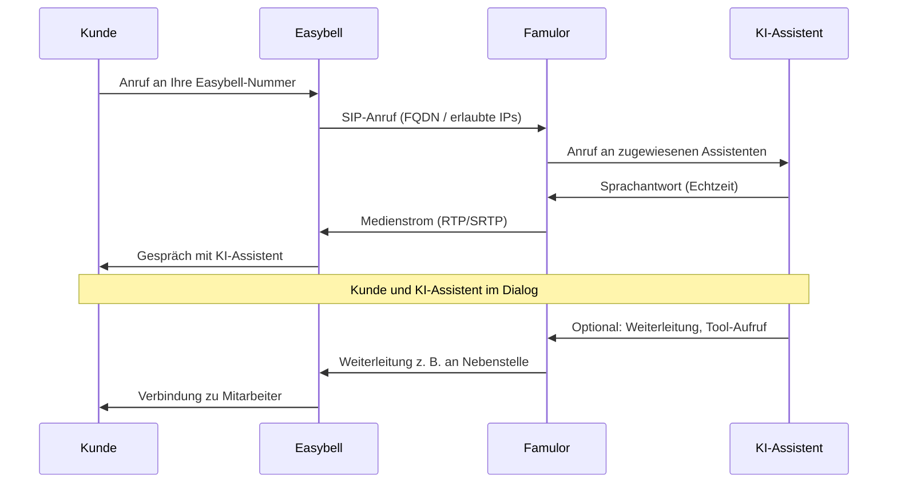

# Easybell-Integration

<Note>
  Mit Famulor können Sie Ihre **Easybell**-Telefonie mit einem KI-Assistenten verbinden. Es gibt **zwei Wege** – wählen Sie unten Ihren Weg und folgen Sie der passenden Schritt-für-Schritt-Anleitung.
</Note>

## Welchen Weg wählen?

| Sie haben … | Dann folgen Sie … |
|-------------|-------------------|
| **Nur Easybell SIP-Trunk** (ohne Cloud Telefonanlage) | [Schritt-für-Schritt: SIP-Trunk](#schritt-für-schritt-sip-trunk) |
| **Easybell Cloud Telefonanlage Pro** | [Schritt-für-Schritt: Cloud Telefonanlage](#schritt-für-schritt-cloud-telefonanlage) |

- **SIP-Trunk:** FQDN-Feature muss bei Easybell angefragt werden (E-Mail an support@easybell.de, ca. 10€/Monat).  
- **Cloud Telefonanlage Pro:** FQDN ist bereits enthalten, keine separate Anfrage nötig.

---

## Funktionsweise im Detail

Anrufe laufen über Easybell zu Famulor und werden dort Ihrem KI-Assistenten zugeordnet. Ablauf eines **eingehenden Anrufs**:



---

## Schritt-für-Schritt: SIP-Trunk

Nutzen Sie **nur** den Easybell SIP-Trunk (ohne Cloud Telefonanlage). Gehen Sie die Schritte der Reihe nach durch.

### Schritt 1: FQDN-Feature bei Easybell anfordern

Das FQDN-Feature ist im Easybell-Kundenportal nicht buchbar. Senden Sie eine E-Mail an **support@easybell.de** mit Ihrer **Easybell-Kundennummer** und bitten Sie um Freischaltung des SIP Trunking FQDN Feature für Famulor.

**Beispiel-E-Mail:**

```text
Sehr geehrtes Easybell Team,

Könnten Sie uns bitte das SIP Trunking FQDN Feature für die Nutzung mit Famulor freischalten?

Vielen Dank und liebe Grüße
```

<Note>
  **Kosten (Stand August 2025):** 10€ / Monat. Auf die Bestätigung vom Support kann es einige Tage dauern.
</Note>

### Schritt 2: In Famulor einrichten

1. Auf [famulor.de](https://famulor.de) einloggen.
2. Links **„Deine Telefonnummern“** wählen, dann **„SIP-Trunk integrieren“** klicken.


3. **SIP-Trunk-Konfiguration** ausfüllen:
   - **Authentifizierung:** Benutzername und Passwort (von Easybell).
   - **Ausgehende Telefonie:** SIP-Adresse z. B. `voip.easybell.de`, Rufnummernformat (z. B. „International mit +“).


4. **Eingehende Telefonie** einstellen:
   - **Erlaubte IP-Adressen** eintragen (siehe Kasten unten).  
   - **„Unsere SIP-Adresse“** notieren – diese brauchen Sie in Schritt 3 für Easybell.


**Freizuschaltende IPs bei Famulor (SIP-Trunk):**

- **TCP/UDP:** 195.52.221.151, 195.185.214.173, 195.52.221.142  
- **TLS:** 212.172.204.95, 212.172.58.207  

5. Konfiguration **bestätigen**. Anschließend einen **KI-Assistenten** anlegen und **dieser Rufnummer zuordnen**.


### Schritt 3: Im Easybell-Kundenportal eintragen

Im Easybell-Kundenportal die **Famulor-SIP-Adresse** als Anrufziel/Domain eintragen – **ohne** `sip:` davor.

**Beispiel:** `XXXXX.sip.livekit.cloud` (Ihre Adresse steht in Famulor unter „Unsere SIP-Adresse“.)

UDP, TCP und TLS werden unterstützt. Für das **Rufnummernformat** E.164 **mit** führendem „+“ wählen.

<Note>
  Details: [Easybell-Hilfe SIP-Trunk FQDN](https://www.easybell.de/hilfe/fragen/fragen-zum-telefonanschluss/antwort/sip-trunk-authentifizierung-per-fqdn-domain-einrichten/).
</Note>

### Schritt 4: Testen

- Eingehenden Anruf an Ihre Easybell-Nummer testen.  
- Prüfen, ob der KI-Assistent antwortet und das Rufnummernformat stimmt.

---

## Schritt-für-Schritt: Cloud Telefonanlage

Sie nutzen die **Easybell Cloud Telefonanlage Pro**. FQDN ist hier bereits enthalten – keine E-Mail an Easybell nötig. Zuerst in Famulor einrichten (wie beim SIP-Trunk), dann in der Cloud Telefonanlage.

### Schritt 1: In Famulor einrichten (wie SIP-Trunk)

- Wie unter [Schritt 2: In Famulor einrichten](#schritt-2-in-famulor-einrichten) (Login → „Deine Telefonnummern“ → „SIP-Trunk integrieren“ → Authentifizierung, ausgehende und eingehende Telefonie).  
- **Wichtig:** Bei **Eingehende Telefonie** andere IPs eintragen als beim reinen SIP-Trunk (siehe Kasten unten).

**Freizuschaltende IPs bei Famulor (Cloud Telefonanlage):**

- 62.144.211.104  
- 195.52.221.134  
- 195.52.221.137  

„Unsere SIP-Adresse“ aus Famulor notieren – wird in Schritt 2 bei Easybell benötigt.

### Schritt 2: Cloud Telefonanlage bei Easybell einrichten

1. **Cloud Telefonanlage öffnen**  
   Im [Easybell-Kundenportal](https://www.easybell.de) einloggen → **Telefonfunktionen** → **Cloud Telefonanlage**.


2. **Neue FQDN-Nebenstelle anlegen**  
   Bei **Nebenstellen und Rufgruppen** auf **+ Hinzufügen** klicken. Nebenstellenart: **FQDN-Anbindung**. Unter **Eingehende Telefonie** Rufnummer und Durchwahl festlegen, unter der Famulor erreichbar sein soll.


3. **FQDN eintragen**  
   Die **SIP-URI von Famulor** eintragen („Unsere SIP-Adresse“), **ohne** `sip:` – z. B. `ihre-unique-id.sip.livekit.cloud`.

4. **Weiterleitung erlauben (optional)**  
   In den Einstellungen der FQDN-Nebenstelle die Option **„Weiterleitung zulassen“** aktivieren, wenn der KI-Assistent Anrufe an interne Nebenstellen weiterleiten soll. Nur **Cloud Telefonanlage Pro**; nur interne Weiterleitungen erlaubt.


### Schritt 3: Weiterleitung in Famulor (optional)

Wenn Anrufe an Mitarbeiter (Nebenstellen) weitergeleitet werden sollen:

- In Famulor unter **Tools** eine **Kalt-** oder **Warm-Weiterleitung** anlegen und im Prompt verwenden.  
- Typ **„SIP“** (nicht „Rufnummer“) wählen.  
- **SIP-URL:** interne Kurzwahl im Format **Nebenstelle@easybell**, z. B. `200@easybell`. Das **„@easybell“** ist erforderlich.


### Schritt 4: Testen

Eingehenden Anruf testen und prüfen, ob der KI-Assistent antwortet und ggf. Weiterleitung funktioniert.

---

## Wichtige Hinweise

- **Rufnummernformat:** E.164 **mit** führendem „+“ in Easybell einstellen.  
- **SIP-Daten:** Benutzername/Passwort sicher verwahren; Passwort mind. 12 Zeichen, mit Zahlen, Groß-/Kleinbuchstaben, ggf. Sonderzeichen.  
- **Domain:** Immer die von Famulor angezeigte SIP-Adresse verwenden (z. B. `… .sip.livekit.cloud`).

## Häufige Probleme

<AccordionGroup>
  <Accordion title="FQDN-Feature nicht verfügbar (SIP-Trunk)" icon="envelope">
    Das SIP Trunking FQDN Feature muss bei Easybell angefragt werden. Senden Sie eine E-Mail an **support@easybell.de** mit Ihrer **Easybell-Kundennummer** und der Bitte um Freischaltung für Famulor. Die Aktivierung kann einige Tage dauern.
  </Accordion>

  <Accordion title="Anrufe kommen nicht an" icon="phone-slash">
    Prüfen Sie: **Erlaubte IP-Adressen** in Famulor unter „Eingehende Telefonie“ (je nach Weg SIP-Trunk- oder Cloud-IPs eintragen). Stellen Sie in Easybell das Rufnummernformat **E.164 mit führendem „+“** ein.
  </Accordion>

  <Accordion title="Falsche oder unbekannte Domain" icon="server">
    Tragen Sie die **genaue SIP-Adresse** aus Famulor ein („Unsere SIP-Adresse“ unter Telefonnummern → SIP-Trunk integrieren). **Ohne** `sip:` davor, **ohne** Leerzeichen – nur den angezeigten Wert übernehmen (z. B. `… .sip.livekit.cloud`).
  </Accordion>

  <Accordion title="Weiterleitung an Nebenstelle funktioniert nicht (Cloud Telefonanlage)" icon="phone-arrow-right">
    Nur in der **Cloud Telefonanlage Pro** und nur für **interne** Nebenstellen. In der FQDN-Nebenstelle die Option **„Weiterleitung zulassen“** aktivieren. In Famulor den Weiterleitungstyp **„SIP“** und die SIP-URL im Format **Nebenstelle@easybell** (z. B. `200@easybell`) verwenden.
  </Accordion>
</AccordionGroup>

## Hilfe

<Tip>
  Unser Support unterstützt Sie bei der Einrichtung: [support@famulor.io](mailto:support@famulor.io). Für Fragen zu FQDN/Produkten: [support@easybell.de](mailto:support@easybell.de).
</Tip>
