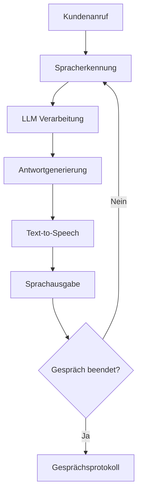

<Card>
  <CardHeader>
    <Title>KI-Telefonie der Zukunft</Title>
    <Subtitle>Wie die Gesprächs-KI von Famulor Kundenanrufe revolutioniert</Subtitle>
    
Von Iman Koma, Gründer von Famulor

  </CardHeader>
</Card>

<CardGroup cols={2}>
  <Card title="Kostenlose Demo anfordern ⚡" href="https://https://www.famulor.io" icon="play">
    Erlebe die Zukunft der KI-Telefonie in einer persönlichen Demo
  </Card>
  <Card title="Agent erstellen" href="/getting-started/core-concepts" icon="robot">
    Starte sofort mit der Erstellung deines ersten AI-Assistenten
  </Card>
</CardGroup>

## Einführung

Die generative, konversationelle KI von [**Famulor**](/introduction/what-is-Famulor) ist ein leistungsstarkes Werkzeug zur Verbesserung des Kundenerlebnisses, das über die Grenzen traditioneller Intent-basierter Systeme hinausgeht. Durch die Kombination modernster LLMs (Large Language Models) mit fortschrittlicher Sprachsynthese dank Transformer-basierter Voice-AI-Modelle schafft Famulor Interaktionen, die adaptiv, realistisch und bemerkenswert effektiv sind. Mit durchdachtem Training und kontinuierlicher Verfeinerung liefert dein [**Famulor AI-Assistent**](/ai-assistants/what-is-ai-assistant) Gespräche in außergewöhnlicher, menschenähnlicher Qualität, die deine Kundeninteraktionen grundlegend verändern.

Anstatt jede mögliche Interaktion vorprogrammieren zu müssen, lernt die KI von Famulor aus umfangreichen Datensätzen, um Sprache dynamisch zu verstehen und zu generieren. Dies ermöglicht es ihr, eine breite Palette von Anfragen zu bearbeiten, sich an Gesprächsnuancen anzupassen und Antworten zu liefern, die sich natürlich und ansprechend anfühlen. Während eine 100%ige Vorhersagbarkeit aufgrund der probabilistischen Natur generativer Systeme statistisch unwahrscheinlich ist, bietet die KI von Famulor eine hocheffektive und flexible Lösung für einen außergewöhnlichen Kundenservice.

## Wie Famulor funktioniert

Das Voice-AI-System von Famulor nutzt modernste Technologie, um durch dynamische, konversationelle Interaktionen ein unvergleichliches Kundenerlebnis zu schaffen. Im Gegensatz zu herkömmlichen Intent-basierten Dialogsystemen, die auf Natural Language Understanding (NLU)-Modellen basieren, setzt Famulor auf generative Large Language Models (LLMs), um Antworten zu liefern, die sich natürlich, flexibel und menschenähnlich anfühlen.

## Von Intent-basierten Systemen zur Conversational AI: Eine neue Ära

Intent-basierte Systeme sind darauf ausgelegt, bestimmte Eingaben zu erkennen und sie vorprogrammierten "Intents" zuzuordnen. Sobald ein Intent identifiziert ist, löst das System eine feste Antwort aus, die manuell vom Designer des Dialogsystems geschrieben wurde. Während dieser Ansatz für die Bewältigung vorhersehbarer, sich wiederholender Interaktionen effektiv ist, haben Intent-basierte Systeme eine begrenzte Flexibilität. Sie sind durch die definierten Intents eingeschränkt und passen sich nicht leicht an unerwartete oder nuancierte Anfragen an. Diese Herangehensweise kann Gespräche roboterhaft wirken lassen und frustrierend sein, wenn Anrufer die erwarteten Dialogpfade verlassen.

**Famulor hingegen** wird von generativen LLMs angetrieben, die einen weitaus flexibleren, konversationellen Ansatz bieten. Durch den Einsatz fortschrittlicher Modelle von OpenAI, Meta (LLaMA), Mistral und Anthropic passt sich die KI von Famulor in Echtzeit an die einzigartige Formulierung und die Bedürfnisse jeder Interaktion an. Dieser Ansatz ähnelt der Einstellung eines menschlichen Mitarbeiters: Während ein Mitarbeiter in Unternehmensrichtlinien und Kundenservice-Best-Practices geschult ist, ist er nicht auf vorgeschriebene Antworten beschränkt und kann sich dynamisch an jedes Gespräch anpassen. Famulor bietet ein ähnliches Erlebnis und nutzt sein umfangreiches Training, um natürlich und intelligent auf die Bedürfnisse jedes Anrufers zu reagieren.

<Info>
Dieser menschenähnliche Ansatz macht Famulor besonders gut geeignet für [**Verkaufsgespräche**](/sales/gespraechsfuehrung-und-einwandbehandlung) und anspruchsvollere [**Support-Anrufe**](/ai-assistants/example-prompts/first-level-support).
</Info>

Dieser Wandel stellt einen technologischen Durchbruch dar, der es Famulor ermöglicht, Gespräche zu führen, die natürlich fließen, sich an verschiedene Eingaben anpassen und ein ansprechendes, reibungsloses Kundenerlebnis schaffen. Mit seiner Fähigkeit, komplexe Sprachmuster zu verstehen, kann die [**Conversational AI von Famulor**](/conversation-design/prompt-basics) ein weitaus breiteres Spektrum an Anfragen bewältigen als herkömmliche, Intent-basierte Systeme und bietet ein zufriedenstellenderes und intuitiveres Interaktionserlebnis.

## Wie Large Language Models (LLMs) funktionieren

Im Kern der Conversational AI von Famulor stehen Large Language Models (LLMs), die grundlegend anders funktionieren als Intent-basierte Systeme. LLMs verwenden eine anspruchsvolle neuronale Netzwerkarchitektur, die als Transformer bekannt ist und es ihnen ermöglicht, Sprache basierend auf Wahrscheinlichkeiten statt auf vorgegebenen Regeln zu verstehen und zu generieren.

### Selbstaufmerksamkeit und Kontextbewusstsein

LLMs verwenden einen Selbstaufmerksamkeitsmechanismus, der dem Modell hilft, dynamisch auf relevante Teile des Eingabetextes zu "fokussieren". Dies ermöglicht es, Kontext, Beziehungen und Nuancen über ein Gespräch hinweg zu verstehen. Dieses Kontextbewusstsein ermöglicht es der KI, Antworten zu liefern, die adaptiv, relevant und kohärent sind, selbst in komplexen Interaktionen.

### Probabilistische Antwortgenerierung

Im Gegensatz zu traditionellen regelbasierten Systemen generieren LLMs Antworten basierend auf Wahrscheinlichkeiten. Sie bewerten mehrere mögliche nächste Wörter (oder Tokens) und wählen eines basierend auf seiner Wahrscheinlichkeit im gegebenen Kontext aus. Dies macht jede Antwort einzigartig, an das Gespräch angepasst und menschenähnlicher. Es bedeutet jedoch auch, dass Antworten nicht vollständig deterministisch sind, was eine absolute Vorhersagbarkeit unmöglich macht.

### Training mit umfangreichen Daten

Die LLMs von Famulor wurden auf umfangreichen, vielfältigen Datensätzen trainiert, die es ihnen ermöglichen, Sprache in vielen Kontexten effektiv zu verstehen und zu generieren. Dieses breite Training macht die KI von Famulor hochflexibel und ermöglicht es ihr, eine Vielzahl von Eingaben zu verarbeiten, ohne dass für jedes Szenario eine explizite Programmierung erforderlich ist.

<Warning>
Während diese Eigenschaften die KI von Famulor beeindruckend dynamisch und leistungsfähig machen, führen sie auch eine inhärente Variabilität ein. Da Antworten auf Wahrscheinlichkeiten basieren, ist es statistisch unwahrscheinlich, 100% der Zeit perfekte Ergebnisse zu erzielen. Genau wie ein menschlicher Gesprächspartner gelegentlich eine Frage missverstehen oder eine Klärung benötigen kann, kann die KI von Famulor manchmal eine Antwort erzeugen, die weiter verfeinert werden könnte.
</Warning>

## Voice AI: Generative Sprache mit Transformer-basierten Modellen

Das KI-System von Famulor geht über das Verstehen und Generieren von Antworten hinaus; es übersetzt diese Ausgaben auch in natürlich klingende Sprache. Sobald das LLM eine Antwort generiert hat, verwendet Famulor Transformer-basierte Voice-AI-Text-to-Speech (TTS)-Modelle, um Text, der von Sprachmodellen ausgegeben wird, in Echtzeit in Audio umzuwandeln. Diese Modelle ermöglichen eine reiche, menschenähnliche Stimmgebung und bieten Kunden ein nahtloses, vollständig generatives Erlebnis.

Wie bei jedem generativen System gibt es jedoch ein gewisses Maß an Variabilität in jeder Antwort. Da diese [**Stimmmodelle**](/ai-assistants/voice-selection) probabilistisch arbeiten, reproduzieren sie nicht jedes Mal identische Ausgaben. Diese Variabilität, die Interaktionen natürlicher wirken lässt, kann manchmal zu Antworten führen, die nicht vollständig mit dem beabsichtigten Ergebnis übereinstimmen. Famulor minimiert diese durch Überwachung, Feinabstimmung und Aktualisierung der Modelle, aber vollkommene Perfektion ist in generativen Systemen statistisch nicht erreichbar.

<Tip>
Wie bei menschlichen Telefonanrufen werden keine zwei Famulor-Gespräche jemals genau gleich sein, von dem, was gesagt wird, bis hin zur Stimmlage. Das ist die Zukunft der Conversational AI und der Dialogsystem-Design.
</Tip>

## Warum 100% Abdeckung statistisch unwahrscheinlich ist

Aufgrund der Funktionsweise von LLMs ist eine 100%ige Abdeckung statistisch unwahrscheinlich. Hier ist der Grund:

### Probabilistische Antwortgenerierung
Antworten werden basierend auf statistischen Wahrscheinlichkeiten generiert, nicht auf deterministischen Pfaden. Dies ermöglicht natürliche, abwechslungsreiche Gespräche, bedeutet aber auch gelegentlich unerwartete Ausgaben.

### Kontextuelle Sensitivität
LLMs reagieren dynamisch auf den Kontext, der sich aufgrund subtiler Variationen in der Formulierung, dem Ton oder früheren Interaktionen ändern kann. Diese Variabilität führt zu geringfügigen, manchmal unvorhersehbaren Verschiebungen in den Antworten, die möglicherweise nicht immer perfekt mit den erwarteten Ergebnissen übereinstimmen.

### Breites Sprachverständnis
Die Modelle von Famulor sind auf eine Vielzahl von Sprachmustern trainiert, was ihnen eine flexible Reaktion ermöglicht, aber auch die Vorhersage jeder möglichen Gesprächsrichtung erschwert. Genau wie ein menschlicher Mitarbeiter auf Szenarien stoßen kann, für die er nicht geschult wurde, wird die KI von Famulor gelegentlich auf unvorhergesehene Gesprächskontexte treffen.

<CardGroup cols={1}>
  <Card title="Best Practices für optimale Ergebnisse" icon="lightbulb">
    Für Anwendungen, bei denen konsistente, präzise Antworten kritisch sind, empfiehlt Famulor, dem [**Voice-Agent Regeln**](/ai-assistants/system-prompt) zur Verfügung zu stellen, um sicherzustellen, dass er sich der strengen Richtlinien bewusst ist, die er befolgen muss. Beispielsweise können Sie Ihrem Voice-Agent eine Sprache zur Verfügung stellen, die komplett vermieden werden sollte, um sicherzustellen, dass er nichts sagt, was als "off-brand" angesehen werden könnte.
  </Card>
</CardGroup>

Darüber hinaus stellt die Möglichkeit des Fallbacks auf menschliche Mitarbeiter sicher, dass, während die KI von Famulor die Mehrheit der Interaktionen reibungslos bewältigt, jedes wirklich einzigartige oder unvorhersehbare Szenario an einen Live-Mitarbeiter weitergeleitet werden kann, wodurch ein hoher Standard an Kundenerfahrung aufrechterhalten wird.

<Warning>
Durch die Verwendung eines Produkts, das generative Sprachmodelle nutzt, erkennen Sie ein minimales Risiko gelegentlicher unerwarteter Ausgaben an. Bei Famulor wird dieses Risiko jedoch durch Produktleitplanken minimiert und ist wahrscheinlich geringer als bei menschlichen Mitarbeitern.
</Warning>

Durch die Nutzung der LLM-basierten Conversational AI von Famulor und die Befolgung der empfohlenen [**Trainings- und Überwachungsschritte**](/ai-assistants/testing) können Sie einen hocheffektiven virtuellen Agenten erstellen, der ein hervorragendes Kundenerlebnis mit minimaler Varianz liefert – und gleichzeitig erkennen, dass ein kleines Maß an Unvorhersehbarkeit ein natürlicher und sogar vorteilhafter Teil der Schaffung eines menschenähnlichen Gesprächserlebnisses ist.

## Wie du deinen Famulor Voice Agent trainierst: Eine Schritt-für-Schritt-Anleitung

Um die Effektivität deines [**Famulor Voice Agents**](/ai-assistants/creating-and-editing) zu maximieren, empfehlen wir einen strategischen Trainingsansatz, der von Kernunterhaltungen zu nuancierteren Interaktionen führt. Befolge diese Schritte, um einen leistungsstarken virtuellen Agenten zu erstellen:

<Steps>
  <Step title="Definiere den Happy Path (Mehrheitsabdeckung, >50%)">
    Beginne mit der Erstellung eines Gesprächsablaufs, der die häufigsten, unkomplizierten Szenarien abdeckt – oft als "Happy Path" bezeichnet. Konzentriere dich auf Interaktionen, die etwa 60% der erwarteten Gespräche ausmachen. Dies bietet deinem Agenten eine solide Grundlage und stellt sicher, dass er von Tag eins an in häufigen Szenarien gut funktioniert.
    
    **Tipp:** Verwende [**System Prompts**](/ai-assistants/system-prompt) um die Grundregeln für häufige Szenarien zu definieren.
  </Step>

  <Step title="Erweitere auf Sonderfälle (90% Abdeckung)">
    Sobald der Happy Path reibungslos funktioniert, beginne damit, Sonderfälle zu identifizieren und anzugehen. Dazu können weniger häufige Anfragen, ungewöhnliche Formulierungen oder spezifische Kundenbedürfnisse gehören, die außerhalb der Standardinteraktionen liegen. Die Erweiterung auf diese Sonderfälle bringt die Bewältigungsfähigkeiten deines Agenten auf nahezu 90% und verbessert erheblich seine Fähigkeit, eine Vielzahl von Szenarien zu bewältigen.
    
    Stelle eine [**Testleitung**](/ai-assistants/testing) für dein Team intern zur Verfügung, um Feedback darüber zu sammeln, wie der Agent in diesen Sonderfällen funktioniert. Diese Feedback-Schleife ist entscheidend für die Identifizierung von Lücken und die Verfeinerung von Antworten.
  </Step>

  <Step title="Gehe live und überwache Anrufe (30-Tage-Auswertung)">
    Wenn dein Agent eine Vielzahl von Szenarien effektiv bewältigt, bist du bereit, mit Kunden live zu gehen. Überwache in den ersten 30 Tagen die Anrufe genau, um Interaktionen zu identifizieren, bei denen die Antwort des Agenten möglicherweise nicht ausreichend war oder verbessert werden könnte. Dieser Zeitraum ermöglicht es dir, Daten aus der realen Welt darüber zu sammeln, wie der Agent unter einer Vielzahl von Umständen funktioniert.
    
    **Tipp:** Nutze [**Eingehende Anrufe - Insights**](/inbound-calls/insights) für detaillierte Analyse der Performance.
  </Step>

  <Step title="Verfeinere und aktualisiere für 99%+ Abdeckung">
    Wenn du Lücken oder Fehler in den Antworten entdeckst, kannst du direkt bei Famulor Aktualisierungen vornehmen. Durch das Training deines Agenten oder die Bereitstellung aktueller Informationen kannst du die meisten beobachteten Probleme beheben. Dieser iterative Verfeinerungsprozess bringt die Abdeckung deines Agenten auf etwa 99%.
    
    **Ressourcen:**
    - [**Knowledge Bases**](/conversation-design/knowledge-bases) für spezifische Informationen
    - [**Tools und Functions**](/ai-assistants/tools-and-functions) für erweiterte Funktionalität
  </Step>

  <Step title="Erkennung von Sonderfällen">
    Während die Conversational AI von Famulor eine beeindruckende Bandbreite an Anfragen abdecken kann, ist das Erreichen von 100% statistisch unwahrscheinlich. Kein System, weder menschlich noch KI, kann jede mögliche Interaktion vorhersehen. Für Fälle, bei denen eine vollständige Abdeckung kritisch ist, empfiehlt Famulor, deinem Voice-Agent Regeln zur Verfügung zu stellen, um sicherzustellen, dass er sich der strengen Richtlinien bewusst ist, die er befolgen muss.
    
    **Beispiel:** Du kannst deinem Voice-Agent Sprache zur Verfügung stellen, die komplett vermieden werden sollte, um sicherzustellen, dass er nichts sagt, was als "off-brand" angesehen werden könnte.
  </Step>
</Steps>

<Info>
Durch Befolgung dieser Schritte wirst du einen leistungsstarken Famulor Voice Agent entwickeln, der in der Lage ist, eine breite Palette von Kundenanfragen mit Leichtigkeit, Flexibilität und außergewöhnlicher Qualität zu bewältigen.
</Info>

## Nächste Schritte

<CardGroup cols={2}>
  <Card title="AI-Assistenten erstellen" href="/ai-assistants/creating-and-editing" icon="robot">
    Praktische Anleitung zur Erstellung Ihres ersten Famulor AI-Assistenten
  </Card>
  <Card title="System Prompts optimieren" href="/ai-assistants/system-prompt" icon="brain">
    Detaillierte Anleitung zur Optimierung von Gesprächs-KI
  </Card>
  <Card title="Best Practices" href="/ai-assistants/assistant-best-practices" icon="star">
    Bewährte Methoden für optimale AI-Assistant Performance
  </Card>
  <Card title="Beispiel-Prompts" href="/ai-assistants/example-prompts/general-prompt-engineering-guide" icon="code">
    Fertige Vorlagen für verschiedene Anwendungsfälle
  </Card>
</CardGroup>

---

<Card>
  <CardHeader>
    <Title>Bereit für die Zukunft der KI-Telefonie?</Title>
  </CardHeader>
  <CardGroup cols={2}>
    <Card title="Kostenlose Demo buchen" href="https://https://www.famulor.io" icon="calendar">
      Erlebe Famulor in Aktion mit einer persönlichen Demonstration
    </Card>
    <Card title="Jetzt starten" href="/getting-started/core-concepts" icon="rocket">
      Erstelle deinen ersten AI-Assistenten in wenigen Minuten
    </Card>
  </CardGroup>
</Card>