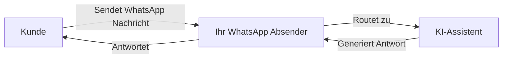

> Verbinden Sie Ihre KI-Assistenten mit WhatsApp Business für automatisierte textbasierte Kundenkommunikation

<Note>
  **Neu: Externe Nummern** — Sie können jetzt Ihre eigene Mobilnummer zu WhatsApp bringen! Nutzen Sie Plattform-Nummern oder verbinden Sie Ihre bestehende Mobilnummer mit SMS/Sprach-Verifizierung.
</Note>

## Was ist die WhatsApp Business Integration?

Die WhatsApp Business Integration ermöglicht es Ihnen, Ihre KI-Assistenten mit WhatsApp zu verbinden. Dies ermöglicht automatisierte textbasierte Gespräche mit Kunden über die weltweit beliebteste Messaging-Plattform.

Mit dieser Integration können Sie:

* **Kunden-Nachrichten empfangen** und automatisch mit KI antworten
* **Template-Nachrichten senden**, um Gespräche zu beginnen oder Kunden erneut anzusprechen
* **KI-gestützte Antworten** für 24/7 Kundensupport nutzen
* **Automatisierungs-Flows auslösen**, basierend auf WhatsApp-Gesprächen
* **Alle Gespräche verfolgen** in Ihrem Dashboard

## Wie es funktioniert

1. **Erstellen Sie einen WhatsApp-Absender** mit einer Plattform-Nummer oder Ihrer eigenen externen Nummer
2. **Verbinden Sie einen KI-Assistenten**, um eingehende Nachrichten automatisch zu bearbeiten
3. **Erstellen Sie Nachrichten-Templates** für Outbound-Gespräche (von Meta erforderlich)
4. **Kunden schreiben Ihnen** und erhalten sofort KI-basierte Antworten

## Kernkomponenten

<CardGroup cols={2}>
  <Card title="WhatsApp-Absender" icon="phone" href="/whatsapp/senders">
    Telefonnummern, die für WhatsApp Business Messaging registriert sind
  </Card>

  <Card title="Nachrichten-Templates" icon="file-lines" href="/whatsapp/templates">
    Vorab genehmigte Nachrichtenformate für geschäftlich initiierte Gespräche
  </Card>

  <Card title="KI-Konversationen" icon="robot" href="/whatsapp/conversations">
    KI-gestützte automatisierte Antworten auf Kunden-Nachrichten
  </Card>

  <Card title="Automatisierung" icon="bolt" href="/whatsapp/automation">
    Flows auslösen und Nachrichten über die Automatisierungs-Plattform senden
  </Card>
</CardGroup>

## WhatsApp Business Regeln verstehen

WhatsApp hat spezifische Regeln für Business-Messaging, die Sie verstehen müssen:

### Das 24-Stunden-Messaging-Fenster

<Info>
  Wenn ein Kunde Ihnen eine Nachricht sendet, öffnet sich ein **24-Stunden-Fenster**, in dem Sie freie Nachrichten senden können. Nachdem dieses Fenster geschlossen ist, müssen Sie ein **genehmigtes Template** verwenden, um den Kunden erneut anzusprechen.
</Info>

* **Innerhalb von 24 Stunden**: Senden Sie jede Nachricht direkt
* **Nach 24 Stunden**: Muss eine vorab genehmigte Template-Nachricht verwendet werden

### Template-Nachrichten

Template-Nachrichten sind vorab genehmigte Nachrichtenformate, die erforderlich sind für:

* Das Starten neuer Gespräche mit Kunden
* Das erneute Ansprechen von Kunden nach Ablauf des 24-Stunden-Fensters
* Das Senden von Benachrichtigungen, Updates oder Marketing-Nachrichten

Templates müssen zur Genehmigung bei Meta eingereicht werden (dauert in der Regel Minuten bis 24 Stunden).

### Qualitätsbewertung & Limits

Meta überwacht Ihre Messaging-Qualität. Neue Absender beginnen mit begrenzter Kapazität, die sich erhöht, wenn Sie eine gute Qualität beibehalten:

| Qualitätsstufe | Tägliches Nachrichten-Limit |
| -------------- | --------------------------- |
| Neuer Absender | \~250 Nachrichten           |
| Niedrig        | 1.000 Nachrichten           |
| Mittel         | 10.000 Nachrichten          |
| Hoch           | 100.000+ Nachrichten        |

<Warning>
  Hohe Blockierraten oder Spam-Meldungen senken Ihre Qualitätsbewertung und reduzieren Ihre Messaging-Limits. Senden Sie immer relevante, angeforderte Inhalte.
</Warning>

## Unterstützte Funktionen

### Was wird unterstützt

* **Plattform-Nummern** — Nutzen Sie über unsere Plattform erworbene Nummern mit automatisierter KI-Verifizierung
* **Externe Nummern** — Bringen Sie Ihre eigene Mobilnummer mit und verifizieren Sie diese per SMS oder Sprachanruf
* KI-gestützte automatisierte Antworten
* Template-Nachrichten (Utility, Marketing, Authentifizierung)
* Voice Call Request Templates (Anforderung der Erlaubnis zum Anruf via WhatsApp)
* Gesprächsverlauf und Tracking
* Integration der Automatisierungs-Plattform

### Demnächst verfügbar

* Medien-Anhänge (Bilder, Dokumente, Audio)
* WhatsApp-Sprachanrufe

## Erste Schritte

<Steps>
  <Step title="Wählen Sie Ihren Nummerntyp">
    Entscheiden Sie, ob Sie eine **Plattform-Nummer** (von uns erworben) oder Ihre eigene **externe Mobilnummer** verwenden möchten. Externe Nummern müssen SMS oder Sprachanrufe zur Verifizierung empfangen können.
  </Step>

  <Step title="WhatsApp-Absender erstellen">
    Navigieren Sie zu **WhatsApp-Absender** und folgen Sie dem Einrichtungs-Assistenten, um Ihre Nummer mit WhatsApp Business zu verbinden.
  </Step>

  <Step title="KI-Assistent verbinden">
    Verknüpfen Sie einen KI-Assistenten, um automatisch auf eingehende Nachrichten zu antworten.
  </Step>

  <Step title="Templates erstellen">
    Richten Sie Nachrichten-Templates für Outbound-Gespräche ein und warten Sie auf die Genehmigung durch Meta.
  </Step>

  <Step title="Messaging starten">
    Ihr WhatsApp-Absender ist bereit! Kunden können Ihnen Nachrichten senden und erhalten KI-gestützte Antworten.
  </Step>
</Steps>

## Nächste Schritte

* Erfahren Sie, wie Sie [WhatsApp-Absender erstellen](/whatsapp/senders)
* [Nachrichten-Templates](/whatsapp/templates) und den Genehmigungsprozess verstehen
* [Automatisierungs-Trigger](/whatsapp/automation) für WhatsApp einrichten
