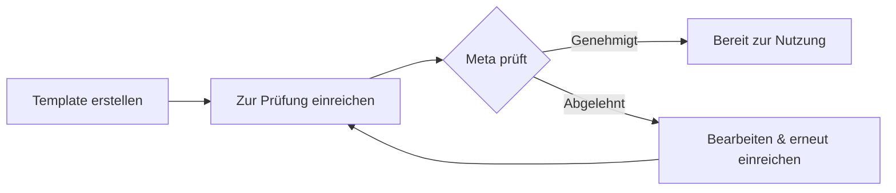

Nachrichtenvorlagen (Templates) sind vorab genehmigte Nachrichtenformate, die von Meta für geschäftlich initiierte Gespräche auf WhatsApp vorgeschrieben sind. Sie müssen über genehmigte Templates verfügen, bevor Sie Outbound-Nachrichten an Kunden senden können.

## Was sind Nachrichtenvorlagen?

Nachrichtenvorlagen sind strukturierte Nachrichten, die:

* Vor der Verwendung zur Genehmigung bei Meta eingereicht werden müssen
* Es Ihnen ermöglichen, Gespräche mit Kunden zu beginnen
* Variablen zur Personalisierung enthalten können
* Für Nachrichten außerhalb des 24-Stunden-Fensters erforderlich sind

<Info>
  **Warum Templates?** — WhatsApp schreibt Templates vor, um Spam zu verhindern und sicherzustellen, dass Unternehmen wertvolle, relevante Nachrichten an Kunden senden. Alle geschäftlich initiierten Nachrichten müssen genehmigte Templates verwenden.
</Info>

## Wann benötigen Sie Templates?

| Szenario                          | Template erforderlich?                      |
| --------------------------------- | ------------------------------------------- |
| Kunde schreibt Ihnen zuerst       | Nein — freie Antwort innerhalb 24 Std. erlaubt |
| Antwort innerhalb von 24 Std.     | Nein — jede Nachricht sendbar               |
| Start eines neuen Gesprächs       | **Ja**                                      |
| Kontaktaufnahme nach 24 Std.      | **Ja**                                      |
| Senden von Updates/Benachrichtigungen | **Ja**                                  |
| Marketing-Nachrichten             | **Ja**                                      |

## Template-Kategorien

Templates sind in Kategorien unterteilt, die ihre Genehmigungsanforderungen und Anwendungsfälle bestimmen:

### Utility-Templates (Nutzen)

Transaktions- und servicebezogene Nachrichten.

**Verwendung für:**

* Bestellbestätigungen
* Versand-Updates
* Terminerinnerungen
* Kontobenachrichtigungen
* Zahlungsbelege

**Genehmigung:** In der Regel innerhalb von Minuten genehmigt

### Marketing-Templates

Werbe- und vertriebsbezogene Nachrichten.

**Verwendung für:**

* Werbeangebote
* Produktankündigungen
* Newsletter
* Verkaufskampagnen
* Re-Engagement-Nachrichten

**Genehmigung:** Kann länger dauern, strengere Prüfung

<Warning>
  **Keine kategorieübergreifenden Inhalte** — Fügen Sie keine Werbeinhalte in Utility-Templates ein. Meta wird Templates ablehnen, bei denen Kategorie und Inhalt nicht übereinstimmen.
</Warning>

### Authentifizierungs-Templates

Verifizierungs- und Sicherheitsnachrichten.

**Verwendung für:**

* Einmalpasswörter (OTP)
* Verifizierungscodes
* Login-Bestätigungen
* Sicherheitswarnungen

**Genehmigung:** Standardprüfung

### Voice Call Request Templates

Spezielle Templates zur Anforderung der Erlaubnis für WhatsApp-Sprachanrufe.

**Verwendung für:**

* Anforderung der Erlaubnis, Kunden über WhatsApp-Sprachfunktion anzurufen
* Muss eine Schaltfläche für die Sprachanrufanforderung enthalten

**Genehmigung:** Automatisch (bei Verwendung des Standardformats)

## Erstellen eines Templates

### Schritt 1: Zu den Templates navigieren

1. Gehen Sie zu **WhatsApp-Absender** → Wählen Sie Ihren Absender → Tab **Templates**
2. Oder gehen Sie direkt zu **WhatsApp-Templates**
3. Klicken Sie auf **Template erstellen**

### Schritt 2: Grundeinstellungen konfigurieren

| Feld           | Beschreibung                                                                           |
| -------------- | -------------------------------------------------------------------------------------- |
| **Name**       | Eindeutige Kennung (nur Kleinbuchstaben, Unterstriche). Beispiel: `order_confirmation_v1` |
| **Kategorie**  | Wählen Sie Utility, Marketing, Authentifizierung oder Voice Call Request               |
| **Sprache**    | Sprache des Templates (muss mit dem Inhalt übereinstimmen)                             |

<Tip>
  **Best Practices für die Benennung:**

  * Verwenden Sie beschreibende Namen: `appointment_reminder`, `order_shipped`
  * Fügen Sie Versionsnummern hinzu: `welcome_message_v2`
  * Vermeiden Sie generische Namen: ~~`template1`~~, ~~`test`~~
</Tip>

### Schritt 3: Template-Inhalte schreiben

Templates können aus mehreren Komponenten bestehen:

#### Header (Optional)

* **Text-Header**: Kurze Überschrift (bis zu 60 Zeichen)
* **Medien-Header**: Bild, Video oder Dokument (demnächst verfügbar)

#### Body (Erforderlich)

Der Hauptinhalt der Nachricht. Hier schreiben Sie Ihre Nachricht.

**Verwendung von Variablen:**
Verwenden Sie `{{1}}`, `{{2}}` usw. für dynamische Inhalte:

```
Hallo {{1}}, Ihre Bestellung {{2}} wurde versandt!

Voraussichtliche Lieferung: {{3}}
Verfolgen Sie Ihr Paket: {{4}}
```

<Info>
  **Beispielwerte** — Beim Erstellen von Templates müssen Sie Beispielwerte für jede Variable angeben. Diese helfen Meta, den Zweck Ihres Templates zu verstehen, und sind für die Genehmigung erforderlich.
</Info>

#### Footer (Optional)

Eine kurze Zeile am Ende (bis zu 60 Zeichen). Wird oft für Abmeldeinformationen oder Haftungsausschlüsse verwendet.

#### Buttons (Optional)

Fügen Sie interaktive Schaltflächen zu Ihrem Template hinzu:

* **Quick Reply**: Vordefinierte Antwortbuttons (z. B. „Ja“, „Nein“, „Mehr erfahren“)
* **Call to Action**: Link zur Website oder Telefonnummer
* **Voice Call Request**: Schaltfläche zum Anfordern der Erlaubnis für einen Sprachanruf

### Schritt 4: Zur Genehmigung einreichen

1. Überprüfen Sie Ihren Template-Inhalt
2. Klicken Sie auf **Zur Genehmigung einreichen**
3. Der Status des Templates ändert sich auf „Wartet auf Genehmigung“ (Pending Approval)
4. Warten Sie auf die Prüfung durch Meta (Minuten bis 24 Stunden)

## Genehmigungsprozess für Templates



### Genehmigungszeiten

| Kategorie          | Typische Zeit                |
| ------------------ | ---------------------------- |
| Utility            | Minuten bis wenige Stunden   |
| Marketing          | Stunden bis 24 Stunden      |
| Authentifizierung  | Minuten bis wenige Stunden   |
| Voice Call Request | In der Regel sofort          |

### Template-Status

| Status                                               | Beschreibung                                     |
| ---------------->>---------------------------------- | ------------------------------------------------ |
| <span style={{color: '#6b7280'}}>**Entwurf**</span>  | Noch nicht eingereicht                           |
| <span style={{color: '#f59e0b'}}>**Pending**</span>  | Eingereicht, wartet auf Prüfung durch Meta       |
| <span style={{color: '#22c55e'}}>**Approved**</span> | Bereit zur Verwendung                            |
| <span style={{color: '#ef4444'}}>**Rejected**</span> | Prüfung fehlgeschlagen, siehe Ablehnungsgrund    |
| <span style={{color: '#6b7280'}}>**Disabled**</span> | Von Meta wegen geringer Qualität deaktiviert     |

## Häufige Ablehnungsgründe

Vermeiden Sie diese Fehler, um Ihre Genehmigungsrate zu verbessern:

### ❌ Werbeinhalte in Utility-Templates

**Problem:** Einbeziehung von Rabatten, Angeboten oder Marketingsprache in Utility-Templates.

**Lösung:** Nutzen Sie die Marketing-Kategorie für werbliche Inhalte.

### ❌ Fehlende oder unklare Beispielvariablen

**Problem:** Variablen wie `{{1}}` ohne klare Beispielwerte.

**Lösung:** Geben Sie realistische Beispielwerte an, die den Zweck der Variable verdeutlichen:

* ✅ `{{1}}` = „Max Mustermann“
* ✅ `{{2}}` = „#12345“
* ❌ `{{1}}` = „test“

### ❌ Aggressive oder drohende Sprache

**Problem:** Inhalte, die als Belästigung, Drohung oder Spam wahrgenommen werden könnten.

**Lösung:** Verwenden Sie professionelle, freundliche Sprache. Konzentrieren Sie sich auf den Mehrwert für den Kunden.

### ❌ URL-Shortener

**Problem:** Verwendung von bit.ly, tinyurl oder anderen URL-Verkürzern.

**Lösung:** Verwenden Sie vollständige, markeneigene URLs Ihrer Domain.

### ❌ Falsche Kategorieauswahl

**Problem:** Wahl der falschen Kategorie für Ihren Inhaltstyp.

**Lösung:** Stimmen Sie die Kategorie strikt auf den Zweck des Inhalts ab.

### ❌ Eingeschränkte Inhalte

**Problem:** Templates über Alkohol, Glücksspiel, Erotikinhalte, politische Botschaften oder illegale Aktivitäten.

**Lösung:** Diese sind nicht erlaubt. Überprüfen Sie die Handelsrichtlinien von Meta.

## Verwendung von Templates

### Template-Nachrichten senden

Sobald ein Template genehmigt wurde, können Sie es senden:

1. **Über die Automatisierungs-Plattform**: Nutzen Sie die Aktion „WhatsApp-Template senden“
2. **Über die API**: Rufen Sie den Sende-Endpunkt mit der Template-ID und den Variablen auf

### Variablen-Ersetzung

Ersetzen Sie beim Senden die Variablen durch tatsächliche Werte:

**Template:**

```
Hallo {{1}}, Ihr Termin ist für den {{2}} um {{3}} bestätigt.
```

**Gesendete Nachricht:**

```
Hallo Max, Ihr Termin ist für den 15. Januar um 14:00 Uhr bestätigt.
```

## Best Practices

### 1. Verwenden Sie beschreibende Namen

```
✅ order_confirmation_v1
✅ appointment_reminder
✅ shipping_update_with_tracking
❌ template1
❌ test
❌ message
```

### 2. Nachrichten kurz halten

WhatsApp-Nutzer erwarten schnelle, klare Nachrichten. Kommen Sie zum Punkt und fügen Sie einen klaren Call-to-Action ein.

### 3. Interaktive Buttons nutzen

Fügen Sie Quick Reply- oder Call-to-Action-Buttons hinzu, um es Kunden zu erleichtern zu antworten:

* „Bestellung verfolgen“
* „Support kontaktieren“
* „Details anzeigen“
* „Termin bestätigen“

### 4. Vor dem Massenversand testen

Testen Sie Ihr Template immer erst mit einem einzelnen Empfänger, bevor Sie es an eine große Zielgruppe senden. Dies hilft, Formatierungsfehler zu finden.

### 5. Templates frühzeitig erstellen

Die Genehmigung kann bis zu 24 Stunden dauern. Erstellen und übermitteln Sie Templates, bevor Sie sie benötigen.

### 6. Backup-Templates bereithalten

Erstellen Sie mehrere Versionen wichtiger Templates. Falls eines abgelehnt oder deaktiviert wird, haben Sie Alternativen bereit.

## Bearbeiten von Templates

<Warning>
  **Eingeschränkte Bearbeitung** — Sobald ein Template genehmigt wurde, können Sie es nicht mehr bearbeiten. Um Änderungen vorzunehmen, müssen Sie ein neues Template mit einem anderen Namen erstellen.
</Warning>

**Kann bearbeitet werden:**

* Entwurfs-Templates (noch nicht eingereicht)
* Abgelehnte Templates (Probleme beheben und erneut einreichen)

**Kann NICHT bearbeitet werden:**

* Genehmigte Templates
* Ausstehende Templates (muss auf Prüfung gewartet werden)

## Template-Limits

Meta setzt Limits für die Erstellung von Templates:

* Maximale Anzahl an Templates pro WhatsApp Business-Konto: Variiert je nach Kontostufe
* Template-Namen müssen pro Absender eindeutig sein
* Abgelehnte Templates zählen zu Ihrem Limit

## Nächste Schritte

* Richten Sie [Automatisierung-Trigger](/whatsapp/automation) ein, um Templates automatisch zu senden
* Erfahren Sie mehr über [WhatsApp-Absender](/whatsapp/senders) und die Absenderverwaltung
* Überprüfen Sie die [KI-Assistenten-Konfiguration](/ai-assistants/what-is-ai-assistant) für Gesprächsantworten
